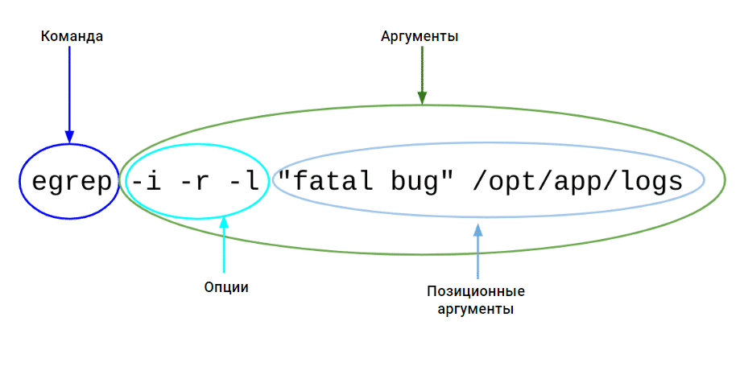

# 06 Команды ОС Linux и файловая система
## Простая команда UNIX с аргументами выглядит следующим образом:
`команда [опции] [позиционные аргументы]`, (Квадратные скобки […] означают, что аргумент необязателен.)



- `команда` предназначена для выполнения одной операции. Например, `egrep` служит для поиска указанных последовательностей символов в файлах и директориях, также указанных с помощью аргументов. Другие команды могут, например, показывать сведения об ОС или содержимое директории
- `опции` указывают, как именно нужно выполнить эту `команду`. В показанном выше примере опция `-i` означает, что поиск должен быть нечувствительным к регистру букв; опция `-r` — поиск в директориях (не только в отдельных файлах); опция `-l` — выводить только названия файлов (без найденных строк файлов).
- `позиционные аргументы` определяют, какие именно объекты будут затронуты, например, подстроки, входные файлы или директории, и т.д.
- `опции` и `позиционные аргументы` вместе именуются **аргументами**, т.е. это все, что следует за названием команды.
- Порядок `опций` неважен. Например, последовательность `-l -a` эквивалентна `-a -l`. Это справедливо и для длинных опций.
- Если используются только короткие опции без значений, такими как `-l` и `-a`, то можете их соединить, упустив пробелы: `-la` или `-al`.
- `команда` --help: выводит встроенную справку для команды; эта опция работает почти для всех команд.
- `man` `команда`: выводит соответствующее команде подробное руководство, если оно установлено в системе.
- Не меняйте местами опции и параметры, указывающие месторасположение.
- Пробелы между названием команды, секцией опций и секцией с дальнейшими аргументами обязательны
- В `UNIX` всё регистрозависимо (названия файлов, команд, опций, имена пользователей)
## Файловая система ОС Linux и объекты
Путь каждого объекта начинается с `/`. Этот элемент называется «корнем» (`root`), а вся файловая система подобна дереву.
### Стандарт FHS
+ `/etc`	-	файлы конфигурации для большинства приложений и некоторых частей ОС
+ `/home`	-	используется для хранения домашних директорий пользователей, например `/home/ваше_имя_пользователя`
+ `/root`	-	домашняя директория пользователя root (это единственный пользователь-администратор во всех UNIX-подобных ОС)
+ `/bin`	-	большинство исполняемых файлов (например, программ) хранится здесь. В современных версиях Linux директория `/bin` часто служит так называемой символьной ссылкой на директорию `/usr/bin`. Любая операция, затрагивающая `/bin/something` будет фактически выполняться на `/usr/bin/something`
+ `/boot`	-	загрузочные файлы (в том числе файлы загрузчика, ядро, `initrd`, `System.map`). Часто выносится на отдельный раздел
+ `/dev`	-	Основные файлы устройств (`/dev/null`, `/dev/sd буква` — жёсткий диск, `/dev/sd буква номер` (раздел диска), `/dev/sr номер` (CD-ROM), `/dev/eth номер` (сетевые интерфейсы Ethernet), `/dev/wlan номер` (сетевые интерфейсы) и др)
+ `/sbin`	-	похож на `/bin`, но хранит специальные исполняемые файлы, служащие для конфигурации системы и обычно запускаемые только пользователем root
+ `/tmp`	-	временные файлы ОС и приложений (аналог C:\Temp в ОС Windows)
+ `/var`	-	предназначена для хранения данных, которые часто изменяются: в `/var/cache` находятся временные файлы, которые используются для ускорения работы системы, файлы баз данных (если сервер БД установлен), в директории `/var/log` хранятся системные журналы и логи приложений, в `/var/spool` хранятся данные, ожидающие обработки, такие как задания на печать или электронная почта
+ `/usr` (`/usr/bin`, `/usr/lib`)	-	в настоящее время это главное место для приложений (исключая настройки, хранящиеся в `/etc`). Например: `/usr/bin` содержит исполняемые файлы, `/usr/lib` — разделяемые библиотеки и т. д.
### Абсолютный и относительный пути
+ Абсолютный путь начинается с '/' и включает все промежуточные директории, в которых расположен объект
+ Относительный путь к объекту строго зависит от текущей рабочей директории. Более того, он начинается не со знака '/', а с вашей текущей рабочей директории

Работу с объектами файловой системы можно ускорить с помощью полезных конструкций: '..', '.' (одна точка означает текущую директорию) и '~' (означает вашу домашнюю директорию).
### Основные команды для работы с файловой системой <a id="mainlinuxfscmd"></a>
+ `uname`	-	Выводит название ОС
  + `uname -a` ИЛИ `/bin/uname -a` (all)- Выводит данные о текущем ядре операционной системы и некоторых других системных характеристиках
  + `uname -r` (release)-  выводит только версию ядра операционной системы
+ `date`	-	используется для:
  + Отображения текущей даты и времени: `date` выводит `Пт 30 авг 18:11:01 EEST 2024`
  + Отображения даты и времени в формате UTC: `date -u` выводит `Пт 30 авг 15:11:01 UTC 2024`
  + Установки системной даты и времени (требуются права суперпользователя): `sudo date -s "2024-08-30 18:11:01"`. Формат даты и времени, который используется в команде `sudo date -s "2024-08-30 18:11:01"`, определяется стандартом `POSIX`: `YYYY-MM-DD HH:MM:SS`
  + Отображения даты и времени в заданном формате: `date +"%Y-%m-%d %H:%M:%S"` выводит `2024-08-30 18:11:01`
+ ```mount``` в Linux используется для подключения файловых систем к определённым точкам монтирования в файловой системе:
  + Монтирование устройства: `sudo mount /dev/sdX1 /mnt` Здесь `/dev/sdX1` — это устройство, которое вы хотите смонтировать, а `/mnt` — точка монтирования
  + Монтирование ISO-образа: `sudo mount -o loop /path/to/image.iso /mnt` опция `-o loop` позволяет монтировать ISO-образ как устройство
  + Монтирование файловой системы с определённым типом: `sudo mount -t ext4 /dev/sdX1 /mnt` опция `-t` указывает тип файловой системы, например, `ext4`. Если не указать параметр `-t ext4`, то система попытается автоматически определить тип файловой системы на указанном разделе. В большинстве случаев это работает корректно. Однако, если автоматическое определение не сработает, команда может завершиться ошибкой, и раздел не будет смонтирован. Это может произойти, если файловая система повреждена или если система не поддерживает автоматическое определение для данного типа файловой системы
  + Монтирование всех файловых систем, указанных в `/etc/fstab`: `sudo mount -a`
    + Файл `/etc/fstab` содержит список файловых систем и их параметры монтирования. Каждая строка в этом файле описывает одну файловую систему, указывая устройство, точку монтирования, тип файловой системы и параметры монтирования (`/dev/sdX1  /mnt  ext4  defaults  0  2`). При выполнении `sudo mount -a` система читает файл `/etc/fstab` и автоматически монтирует все файловые системы, которые в нем указаны и не имеют опции `noauto`. *При загрузке операционной системы, скрипты инициализации (например, systemd или init) обычно вызывают эту команду или аналогичную ей, чтобы смонтировать все необходимые файловые системы, указанные в /etc/fstab*
  + Просмотр всех смонтированных файловых систем: `mount`
  + Размонтирование устройства: `sudo umount /mnt`
+ `sleep` используется для приостановки выполнения команд на заданное время, в том числе и в скриптах: `sleep 5` (на 5 секунд), `sleep 10s` (10 секунд), `sleep 2m` (2 минуты), `sleep 1h` (1 час), `sleep 1d` (1 день), `sleep 1h 30m` (1 час 30 минут)
+ `time command` выводит три основных показателя времени выполнения команды:
  + `real`: фактическое время, прошедшее с момента начала до завершения команды. Это включает в себя все время ожидания, например, время, когда процесс был приостановлен или ожидал ввода/вывода.
  + `user`: время, которое процессор потратил на выполнение пользовательского кода (вне ядра). Это время, затраченное на выполнение инструкций программы.
  + `sys`: время, которое процессор потратил на выполнение системного кода (внутри ядра). Это время, затраченное на выполнение системных вызовов, таких как операции ввода/вывода.
+ ```id``` - Выводит сведения о пользователе:
  + Отображение информации о текущем пользователе: `id`, вывод может быть таким: `uid=1000(user) gid=1000(user) группы=1000(user),27(sudo)`
  + Отображение информации о конкретном пользователе: `id username`. Вывод покажет UID, GID и группы пользователя username.
  + Отображение только UID пользователя: `id -u` или для конкретного пользователя: `id -u username`
  + Отображение только GID пользователя: `id -g` или для конкретного пользователя: `id -g username`
  + Отображение всех групп, к которым принадлежит пользователь: `id -G` или для конкретного пользователя: `id -G username`
  + Отображение имен вместо числовых идентификаторов: `id -n`
  + Отображения реальных (реальных) идентификаторов пользователя и группы, а не эффективных: `-r` (`id -r -u username`).
+ `rm [ПАРАМЕТР]… [ФАЙЛ]…`	-	используется для удаления файлов и директорий. Дополнительные опции:
  + `-f, --force`: Принудительно удалить файлы без запроса подтверждения.
  +	`-i, --interactive`: Запрашивать подтверждение перед удалением каждого файла.
  +	`-v, --verbose`: Выводить подробную информацию о процессе удаления.
  +	`rm -f -r ФАЙЛ`	-	используется для принудительного и рекурсивного удаления файла или директории 
+ `cd`	-	сменить текущую рабочую директорию на заданную: `cd /etc`
+ `touch ~/chown.me`	-	используется для обновления временных меток файла. Временные метки включают: время доступа (`atime`): когда файл был последним раз прочитан, время модификации (`mtime`): когда содержимое файла было последним раз изменено, время изменения (`ctime`): когда метаданные файла (например, права доступа или владелец) были последним раз изменены. Если файл (здесь - `chown.me`) не существует, `touch` создает его. Если файл уже существует, `touch` обновляет его временную метку, но не изменяет его содержимое
+ `pwd`	-	используется для вывода текущей рабочей директории
  + `pwd` покажет полный путь к текущей директории, например: `/home/user`
  + `pwd -P` : что если вы находитесь в каталоге, который является символической ссылкой, команда `pwd -P` покажет путь к реальному каталогу, на который указывает символическая ссылка
  + `pwd -L` : (по умолчанию). Это путь, который вы видите в командной строке, и он может отличаться от физического пути, если вы перешли в каталог через символическую ссылку.
+ `ls`	-	показывает информацию про заданный объект файловой системы (файл, директорию), а также про содержимое заданной директории
  +	`ls -l /путь/к/директории`	-	вывод содержимого указанной директории в длинном формате 
  +	`ls -l -d`	-	вывод информации о текущей директории (`ls -l -d .`) или прямо указанных директориях (`ls -l -d dir1 dir2`) в длинном формате, не перечисляя содержимое этих директорий 
  +	`ls -la`	-	вывод информации о содержимом директории в длинном формате, включая скрытые файлы (чьи имена начинаются с точки .)
  +	`ls –lih /путь/к/директории`	-	вывод информации о содержимом директории в длинном формате с дополнительной информацией:
	  +	`l`: длинный формат, включающий подробную информацию о каждом файле или директории.
	  +	`i`: отображение номера индекса (`inode`) каждого файла или директории.
	  +	`h`: форматирование размеров файлов в читаемом виде (человеческий формат), используя такие единицы измерения, как K, M, G и т.д
  + `ls -lF /путь/к/директории` -  опция `-F` при выводе результата выделяет исполняемые файлы, добавляя `*`
  + `ls -lL /путь/к/директории` -  опция `-L` при выводе результата заставляет `ls` отображать информацию о файлах или каталогах, на которые указывают символические ссылки, а не самих символических ссылок
+ `cat`	-	используется для отображения содержимого файлов, объединения файлов и вывода их содержимого на стандартный вывод (обычно это экран).
  + `cat {one,two,three}/one.txt`	-	используется для отображения содержимого файла one.txt из каждой из трех директорий: one, two и three.
+ `cp`	-	используется для копирования файлов и директорий
  + Копирование файла: `cp source_file destination_file`
  + Копирование файла в другой каталог: `cp file.txt /path/to/directory/`
  + Копирование каталога рекурсивно: `cp -r source_directory /path/to/directory/`
  + Интерактивное копирование с подтверждением перезаписи: `cp -i file.txt /path/to/directory/`
  + Копирование с сохранением атрибутов файла (прав доступа, временных меток и других): `cp -p file.txt /path/to/directory/`
  + Копирование с подробным выводом: `cp -v file.txt /path/to/directory/`
  + Принудительное копирование, удаляя целевой файл, если необходимо: `cp -f file.txt /path/to/directory/`
  + Копирование только если источник новее, чем целевой файл: `cp -u file.txt /path/to/directory/`
+ `mv`	-	используется для перемещения файлов и директорий или переименования файлов
  + `mv folderA/*.log folderB/`	-	перемещает все файлы с расширением .log из директории folderA в директорию folderB.
  + Переименование файла: `mv old_name.txt new_name.txt`
  + Перемещение каталога: `mv source_directory /path/to/destination/`
  + Переименование каталога: `mv old_directory new_directory`
  + Интерактивное перемещение с подтверждением перезаписи: `mv -i file.txt /path/to/destination/`
  + Принудительное перемещение, удаляя целевой файл, если необходимо: `mv -f file.txt /path/to/destination/`
  + Перемещение с подробным выводом: `mv -v file.txt /path/to/destination/`
  + Перемещение нескольких файлов в каталог: `mv file1.txt file2.txt /path/to/destination/`
+ `stat`	-	используется для вывода информации о файле или файловой системе. Эта команда показывает различные атрибуты файла, такие как права доступа, время последнего доступа, изменения и модификации, а также номер `inode` и другие метаданные: 
  + Отображение информации о файле: `stat filename`
  + Отображение информации о символической ссылке (команда покажет информацию о файле, на который указывает символическая ссылка): `stat -L symlink`
  + Отображение информации в формате printf (команда выведет размер файла, права доступа, имя владельца и группы в одной строке): `stat --printf="%s %A %U %G\n" filename`
  + Отображение информации о файловой системе (команда покажет информацию о файловой системе, на которой находится файл): `stat -f filename`
  + Отображение информации в кратком формате (команда выведет имя файла и его размер в байтах): `stat -c "%n: %s bytes" filename`
+ `grep`	-	используется для поиска строк в текстовых файлах или стандартном вводе, которые соответствуют заданному шаблону. Поиск осуществляется либо исходя из Basic Regular Expressions (`grep "pattern" filename.txt`) либо Extended Regular Expressions (`grep -E "regex_pattern" filename.txt`). Обычно (без опции `-l` или `-h`) выводит имя файла и строку текста, удовлетворяющего условию поиска:
  + `grep "pattern" filename.txt` -	найдет все строки в файле filename.txt, содержащие подстроку pattern.
  + `grep -E "regex_pattern" filename.txt`	-	выполнит поиск в файле filename.txt, используя расширенные регулярные выражения
  + `grep "pattern" file1.txt file2.txt`	-	выполнит поиск подстроки pattern в файлах file1.txt и file2.txt.
  + `grep -r "pattern" directory/`	-	выполнит рекурсивный поиск подстроки pattern во всех файлах внутри указанной директории `directory` и подкаталогах (без `-r` в подкаталогах искать не будет)
  + `grep -rl "pattern" directory/` - выполнит рекурсивный поиск подстроки pattern во всех файлах внутри указанной директории directory, но из-за опции `-l` выводит только имена найденных файлов
  + `grep -rh "pattern" directory/` - выполнит рекурсивный поиск подстроки pattern во всех файлах внутри указанной директории directory, но из-за опции `-h` выводит только найденные строки без имени файла
+ `mkdir`	-	используется для создания новых директорий
  + `mkdir directory_name`	-	создаст директорию с указанным именем 
  + `mkdir -p /path/to/new/directory`	-	создаст директорию /path/to/new/directory, создав все несуществующие родительские директории по пути. Флаг `-p` используется для создания родительских директорий, если они не существуют.
  + `mkdir -p /tmp/symlinks/{one,two}`	-	создает две директории в директории /tmp/symlinks: one и two. Флаг -p используется для создания родительских директорий, если они не существуют.
+ `tree`	-	используется для отображения древовидной структуры файлов и директорий, начиная с указанной директории
## Символические ссылки
+ `ln опции файл_источник файл_ссылки` - команда для создания ссылок на файлы: 
  + `ln -s source softlink`	-	создает символическую ссылку на файл или директорию с именем softlink, указывающую на исходный файл или директорию source.
  + `-s`: Этот флаг указывает, что нужно создать символическую ссылку (soft link), а не жесткую ссылку (hard link).
  + `source`: Это исходный файл или директория, на который будет указывать символическая ссылка.
  + `softlink`: Это имя, которое вы хотите дать вашей символической ссылке.
+ `ln -sf three/one.txt two/one.txt`	-	создает символическую ссылку на файл one.txt в директории three, и делает эту ссылку вместо уже существующего файла one.txt в директории two, если он существует. Вот что означают использованные опции
  + `-s`: Создание символической ссылки.
  + `-f`: Принудительное создание символической ссылки, игнорируя ошибки, если файл не существует или ссылка two/one.txt уже существует и нужно её перезаписать.

### Пример поиска  в системе **жёстких ссылок** заданного файла: 
`find / -inum $(stat -c %i /path/to/file)` Здесь:
  + `stat -c %i /path/to/file`: Эта часть команды выводит `inode` заданного файла. Параметр `-c %i` указывает `stat` вывести только значение `inode` файла.
  + `$(...)`: Это командная подстановка, которая позволяет использовать результат выполнения команды внутри другой команды. В данном случае, результатом будет значение `inode` файла.
  + `find / -inum <inode>`: Команда `find` ищет файлы по всей файловой системе (`/`) с указанным `inode` (`-inum <inode>`). Поскольку `<inode>` заменяется результатом команды `stat`, `find` ищет все файлы с тем же `inode`, что и у указанного файла.


