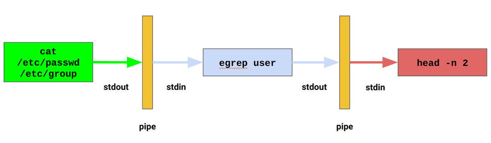

# 07 Обработка текста в Linux
## Типы и расширения файлов в Linux
В Linux расширения файлов не так широко используются, особенно для текстовых файлов или исполняемых файлов, потому что при работе в командной строке нельзя дважды щелкнуть по файлу, чтобы открыть его. Вместо этого вам нужно вручную указать, какая программа должна быть использована для работы с этим файлом, например: `ls -l /etc/passwd`

Но расширения могут использоваться в различных случаях, например, для вашего собственного удобства - если вы создаете эти файлы для дальнейшего использования, а также приняты стандарты расширений:

+ Файлы журналов часто имеют расширение ".log".
+ Настройки приложений часто хранятся в файлах ".conf" или ".cnf". 
+ Если это требуется логикой программы, например, PHP-скрипты для динамического веб-контента должны иметь расширение ".php".
+ Если эти файлы создаются и открываются средствами графического интерфейса, например, ".odt" для OpenOffice.
## Формат текстовых файлов UNIX
+ Строки текстовых файлов UNIX заканчиваются символом `\n` (он не отображается на терминале, но все же существует), который также называется LF, его ASCII-код - 10 (0xA в шестнадцатеричной системе).
+ Строки текстовых файлов Windows заканчиваются символами `\r\n`, символ `\r` также называется CR, его ASCII код - 13 (0xD в шестнадцатеричной системе).
+ `file` - команда, которая определяет формат указанных файлов. Она анализирует содержимое файла и выводит информацию о его типе (текстовый файл, исполняемый файл, архив и т.д.) Команда использует так называемые “магические числа” (специальные сигнатуры в файлах) для определения типа:
  ```console
  feodor@unixdell:/tmp$ file passwd*
  passwd: 	ASCII text
  passwd.win: ASCII text, with CRLF line terminators
  ```
+ `dos2unix` и `unix2dos` - утилиты для преобразования в командной строке Linux формат текстовых файлов соответственно из dos в unix unix в dos
## Обработка текста в Linux
### Команды для работы с текстом, как файлами, так и потоками
Ниже перечислены основные команды для работы с текстом, как файлами, так и потоками. Термин "поток" (stream) в программировании означает поток (последовательность) данных
+ `cat`: в Linux используется для чтения, объединения и записи содержимого файлов. `cat` не работает с директориями
  + `cat file1 file2` - объединяет нескольких файлов и выводит результат в терминал
  + `cat file1.txt file2.txt > combined.txt` - содержимое файлов file1.txt и file2.txt будет объединено и записано в файл combined.txt
  + `cat -n filename.tx`t - выведет содержимое файла с нумерацией строк
  + `cat -v filename.txt` - показывает невидимые символы, такие как табуляции и окончания строк
+ `less`: печатает содержимое файла на терминале с использованием страниц и прокрутки. Также позволяет осуществлять строковый поиск в открытых файлах с помощью горячих клавиш. Полезна для чтения больших файлов (логов)
+ `grep`	-	используется для поиска строк в текстовых файлах или стандартном вводе, которые соответствуют заданному шаблону. Поиск осуществляется либо исходя из Basic Regular Expressions (`grep "pattern" file.txt`) либо Extended Regular Expressions (`grep -E "regex_pattern" file.txt` то же, что и `egrep "regex_pattern" file.txt`). Обычно (без опции `-l` или `-h`) выводит имя файла и строку текста, удовлетворяющего условию поиска:
  + `-i`: сделать поиск нечувствительным к регистру символов
  + `-v`: вывести все строки, не соответствующие шаблону
  + `grep "pattern" filename.txt` -	найдет все строки в файле filename.txt, содержащие подстроку pattern.
  + `grep -E "regex_pattern" filename.txt`	-	выполнит поиск в файле filename.txt, используя расширенные регулярные выражения
  + `grep "pattern" file1.txt file2.txt`	-	выполнит поиск подстроки pattern в файлах file1.txt и file2.txt.
  + `grep -r "pattern" directory/`	-	выполнит рекурсивный поиск подстроки pattern во всех файлах внутри указанной директории `directory` и подкаталогах (без `-r` в подкаталогах искать не будет)
  + `grep "pattern" directory/*`	-	выполнит поиск (нерекурсивный) подстроки pattern во всех файлах внутри указанной директории `directory`
  + `grep -rl "pattern" directory/` - выполнит рекурсивный поиск подстроки pattern во всех файлах внутри указанной директории directory, но из-за опции `-l` выводит только имена найденных файлов
  + `grep -rh "pattern" directory/` - выполнит рекурсивный поиск подстроки pattern во всех файлах внутри указанной директории directory, но из-за опции `-h` выводит только найденные строки без имени файла
+ `head`: выводит на терминал первые N строк из файла (`head -n 5 input_file`)
+ `tail`: 
  + `tail -n 5 input_file` - выводит на терминал последние N строк из файла
  + `tail -f input_file` - позволяет видеть изменения файла в режиме реального времени, когда программа добавляет новые строки в этот файл; 
+ `wc`: подсчитывает количество: 
  + `-l`: Подсчитывает количество строк: `wc -l input_file`
  + `-w`: Подсчитывает количество слов: `wc -w input_file`
  + `-m`: Подсчитывает количество символов: `wc -m input_file`
  + `-c`: Подсчитывает количество байтов: `wc -c input_file`
  + `-L`: Подсчитывает длину самой длинной строки: `wc -L input_file`
+ `sort`: используется для сортировки строк текстовых файлов или стандартного ввода в алфавитном или числовом порядке. Она выводит отсортированные строки на стандартный вывод: `sort /etc/passwd`
  + `ls -l | sort` - отсортирует строки вывода команды `ls -l` (содержимое текущего каталога) в алфавитном порядке (в качестве входных данных используется поток стандартного ввода)
  + `sort -t ":" -k 3 -n /etc/passwd` - выводит на экран содержимое файла `/etc/passwd`, отсортированное по третьему полю  (UID - идентификатор пользователя) в числовом порядке:
    + `-t ":"`: Указывает, что разделителем полей является двоеточие (:). В файле /etc/passwd поля разделены двоеточиями.
    + `-k 3`: Указывает, что сортировка должна производиться по третьему полю. В файле /etc/passwd третье поле — это UID.
    + `-n`: Указывает, что сортировка должна быть числовой.
+ `uniq`: может удалять дублирующиеся строки, печатать только уникальные строки и показывать только дублирующиеся строки. Часто применяется совместно с "pipe". Строки должны быть предварительно отсортированы иначе `uniq` не сможет корректно удалить все повторяющиеся строки:
  + `-c`: Выводит количество повторений каждой строки.
  + `-d`: Выводит только строки, которые повторяются.
  + `-u`: Выводит только уникальные строки, которые не повторяются.
### Перенаправления вывода
#### Стандартные потоки вывода (stdout) и ошибок (stderr)
+ `stdout` - когда программа печатает что-то полезное во время своего выполнения, это направляется в специальный поток вывода под названием `stdout` (стандартный вывод). По умолчанию `stdout` подключен к терминалу, поэтому вы видите результаты на экране. *Можно изменить стандартный поток вывода таким образом, чтобы он всегда выводил, например, в файл, перенаправив стандартный вывод в файл в начале сессии оболочки. Один из способов - добавить команду перенаправления в файл инициализации оболочки, например, добавив в `.bashrc` или `.bash_profile`, в зависимости от используемой оболочки соответствующую строку:*
  + `exec > /path/to/output_file 2>&1` Здесь дополнительно с помощью `2>&1` перенаправляется в файл и стандартный поток ошибок `stderr` 
+ `stderr` - когда что-то идет не так, программа печатает свои ошибки в специальный поток под названием `stderr` (стандартные ошибки). По умолчанию он подключен к тому же терминалу, поэтому эти ошибки отображаются так же, как и `stdout`.
#### stdout
+ `some_program > output_file_rewrite`
+ `some_program >> output_file_append`

В обоих случаях выше `stdout` программы будет записан в указанный файл, а не в терминал но:
+ `>` перезапишет файл
+ `>>` добавит `stdout` программы в конец содержимого существующего файла

Оба метода создают выходной файл, если он не существовал ранее.

**!!! Внимание:** Второй частый случай использования `cat` - объединение файлов. Чтобы "склеить" содержимое файлов, вы можете выполнить следующее: `cat file1 file2 ... fileN > resulting_file`

#### stderr
Чтобы сохранить сообщения об ошибках отдельно от "полезного" вывода:
+ `some_command 2> output_file_rewrite`
+ `some_program 2>> output_file_append`

Важные замечания о перенаправлении `stderr`:
+ Не забудьте указать '2', если вы работаете с stderr
+ Пробелы между '2' и `>` (или `>>`) не допускаются
#### Объединение stdout и stderr
`some_program > output_file 2>&1`, здесь:
+ `stdout` выполнения команды `some_program` записывается в `output_file`
+ `stderr` перенаправляется в `stdout` (который на предыдущем шаге уже был перенаправлен в `output_file`)

`egrep root /etc/passwd /no/such/file> /tmp/new.out 2>/tmp/new.errs`, здесь:
+ файл `/tmp/new.errs` будет содержать 1 строку с текстом ошибки, 
+ файл `/tmp/new.out` будет содержать строки с найденным результатом,
+ в терминале ничего не выводится
#### /dev/null
Если нужно игнорировать ошибки (`stderr`) или `stdout` (показывать только один поток), то используют специальное псевдоустройство `/dev/null`:
+ `some_program 2>/dev/null` - здесь игнорируются ошибки выполнения команды
### Пайпы и стандартный поток ввода (stdin)
#### Пайпы
Пайпы (Pipes) предназначены для перенаправления `stdout` одной программы в `stdin` другой, например:

`cat /etc/passwd /etc/group | egrep user | head -n 2`



#### stdin
Наряду с потоками `stdout` и `stderr`, каждая программа в мире UNIX имеет так называемый поток `stdin`, используемый для получения входных данных как поток, а не как входной файл. При этом программы в большинстве случаев не могут это делать одновременно. В следующем примере команды имеют одинаковый эффект:

+ `egrep user /etc/group`
+ `cat /etc/group | egrep user`
  + здесь `cat` печатает входной файл в `stdout`, который затем с помощью пайпа через `|` передается `egrep` в виде потока `stdin`, в котором `egrep` ищет заданный шаблон.
+ `egrep user < /etc/group`
  + здесь `<` означает "получить данные `stdin` из этого файла", это НЕ то же самое, что "получить это как входной файл", т.е. здесь `egrep` заполняет свой `stdin` из файла, указанного после `<`, и ищет шаблон в потоке входных данных.

*Примечание*: нельзя заполнять `stdin` команды через `pipe` и `<` одновременно. В этом случае на вход будет принят только файл, а `stdout` предыдущей команды будет проигнорирован. Так в примере `cmd1 | cmd2 < /some/file` cmd2 примет данные только от /some/file, проигнорировав `stdout` cmd1.

Пайпы работают только с `stdout`, поэтому если что-либо было выведено на `stderr`, и `stderr` не был обработан отдельно, вы также увидите сообщения `stderr` среди обработанных строк. Схематично это показано на рисунке ниже:


Для работы с `stderr` через пайпы можно использовать конструкцию ```some_command 2>&1 | next_command ``` (она объединяет `stdout` и `stderr` для "next_command"): 


Если нужен только `stderr` (`stdout` полностью игнорируется) то можно использовать конструкцию:

`some_command 2> >(next_command) > /dev/null`, где:

+ `> /dev/null` : перенаправляет `stdout` команды some_command в `/dev/null` (т.е. игнорируется `stdout` команды some_command);
+ `2> >(next_command)`: перенаправляет стандартный поток ошибок (`stderr`) через **временный именованный канал** (конструкция `>(next_command)`) в стандартный ввод (`stdin`) команды next_command .

  ***Примечание***

  1. Когда используется выражение `>(next_command)`, оболочка (`shell`) создаёт временный именованный канал, существующий только на время выполнения команды и не отображаемый в файловой системе как обычный файл в отличие от случая, когда именованный канал создается с помощью команды `mkfifo`:
     1. `mkfifo ~/my_pipe` - создаст именованный канал `my_pipe` и файл `my_pipe` в домашнем каталоге
  2. `rm ~/my_pipe` - удалит именованный канал, созданный с помощью `mkfifo ~/my_pipe`


