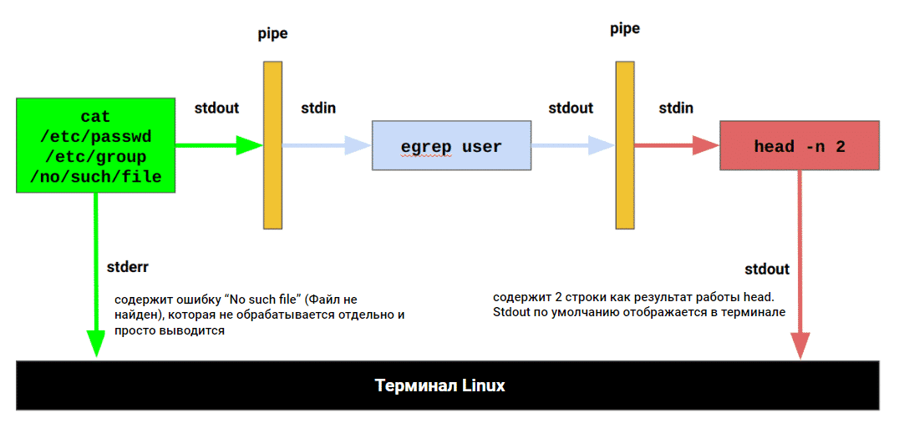

# 07 Обработка текста в Linux
## Типы и расширения файлов в Linux
В Linux расширения файлов не так широко используются, особенно для текстовых файлов или исполняемых файлов, потом что при работе в командной строке нельзя дважды щелкнуть по файлу, чтобы открыть его. Вместо этого вам нужно вручную указать, какая программа должна быть использована для работы с этим файлом, например: ```ls -l /etc/passwd```

Но расширения могут использоваться в различных случаях, например, для вашего собственного удобства - если вы создаете эти файлы для дальнейшего использования, а также приняты стандарты расширений:

+ Файлы журналов часто имеют расширение ".log".
+ Настройки приложений часто хранятся в файлах ".conf" или ".cnf". 
+ Если это требуется логикой программы, например, PHP-скрипты для динамического веб-контента должны иметь расширение ".php".
+ Если эти файлы создаются и открываются средствами графического интерфейса, например, ".odt" для OpenOffice (аналог MS Word).
## Формат текстовых файлов UNIX
+ Строки текстовых файлов UNIX заканчиваются символом ```\n``` (он не отображается на терминале, но все же существует), который также называется LF, его ASCII-код - 10 (0xA в шестнадцатеричной системе).
+ Строки текстовых файлов Windows заканчиваются символами ```\r\n```, символ ```\r``` также называется CR, его ASCII код - 13 (0xD в шестнадцатеричной системе).
+ команда ```file``` определяет формат указанных файлов:
```console
feodor@unixdell:/tmp$ file passwd*
passwd: 	ASCII text
passwd.win: ASCII text, with CRLF line terminators
```
+ Чтобы преобразовать формат текстовых файлов в командной строке Linux, вы можете использовать инструменты ```dos2unix``` и ```unix2dos``` соответственно (если они установлены)
## Обработка текста в Linux
### Команды для работы с текстом, как файлами, так и потоками
Ниже перечислены основные команды для работы с текстом, как файлами, так и потоками. Термин "поток" (stream) здесь (и везде в программировании) означает "поток (последовательность) данных"
+ ```cat```: выводит содержимое файла в терминал. ```cat``` не работает с директориями. Полезно для маленьких файлов ```cat file1 file2```
+ ```less```: печатает содержимое файла на терминале с использованием страниц и прокрутки. Также позволяет осуществлять строковый поиск в открытых файлах с помощью горячих клавиш. Полезна для чтения больших файлов (логов)
+ ```egrep``` (более мощная версия ```grep```): выводит на терминал строки, соответствующие шаблонам egrep ```egrep "something" file1 file2 ... fileN``` для файлов, ```egrep -r какой-то_шаблон /некая/директория``` для директорий
  + ```-i```: сделать поиск нечувствительным к регистру символов
  + ```-v```: вывести все строки, не соответствующие шаблону
  + ```-l```: вывести имена файлов (не строк), в которых найден данный шаблон (если таковые имеются)
  + ```-r```: поиск шаблона во всех файлах в заданном каталоге и вывод найденных совпадений строк
+ ```head```: выводит на терминал первые N строк из файла ```head -n X input_file```
+ ```tail```: печатает последние N строк из файла на терминал. Также позволяет видеть изменения файла в режиме реального времени, когда программа добавляет новые строки в этот файл - полезно для мониторинга работающего приложения: ```tail -f input_file```, ```tail -n 5 input_file```
+ ```wc```: подсчитывает количество символов, слов и (самое полезное) строк во входных файлах: ```wc -l input_file```
+ ```sort```: используется для сортировки строк текстовых файлов или стандартного ввода в алфавитном или числовом порядке. Она выводит отсортированные строки на стандартный вывод: ```sort /etc/passwd```, ```sort -t ":" -k 3 -n /etc/passwd```
+ ```uniq```: может удалять дублирующиеся строки, печатать только уникальные строки и показывать только дублирующиеся строки. Часто применяется после sort с помощью "pipe"
### Перенаправления вывода
+ stdout - когда программа печатает что-то полезное во время своего выполнения, это направляется в специальный поток вывода (поток здесь - это последовательность символов) под названием "stdout" (стандартный вывод). По умолчанию stdout подключен к терминалу, поэтому вы видите результаты на экране
+ stderr - когда что-то идет не так, программа печатает свои ошибки в другой специальный поток под названием "stderr" (стандартные ошибки). По умолчанию он подключен к тому же терминалу, поэтому эти ошибки отображаются так же, как и stdout.
#### Методы перенаправления вывода
##### stdout

```console
some_program > output_file_rewrite
some_program >> output_file_append
```

В обоих случаях выше stdout программы будет записан в указанный файл, а не в терминал но:
+ '>' перезапишет файл
+ '>>' добавит stdout программы к содержимому существующего файла

Оба метода создают выходной файл, если он не существовал ранее.

!!! Внимание: Второй частый случай использования cat - объединение файлов. Чтобы "склеить" содержимое файлов, вы можете выполнить следующее: ```cat file1 file2 ... fileN > resulting_file```

##### stderr
+ чтобы сохранить сообщения об ошибках отдельно от "полезного" вывода:
```console
some_command 2> output_file_rewrite
some_program 2>> output_file_append
```
Важные замечания о перенаправлении stderr:
+ Не забудьте указать '2', если вы работаете с stderr
+ Пробелы между '2' и '>' (или '>>') не допускаются
##### Объединение stdout и stderr
```some_program > output_file 2>&1``` Это работает следующим образом:
+ Stderr перенаправляется в stdout (порядок перенаправления - shell выполняет первым выражение 2>&1 )
+ Stdout записывается в "output_file"

Файл /tmp/new.errs будет содержать 1 строку с текстом ошибки, файл /tmp/new.out будет содержать строки с найденным результатом. В терминале ничего не выводится:
```console
egrep root /etc/passwd /no/such/file> /tmp/new.out 2>/tmp/new.errs
``` 
##### /dev/null
Если нужно игнорировать ошибки или stdout (показывать только один поток), то используют специальное псевдоустройство ```/dev/null``` - вы можете записать на него что угодно, и эта информация исчезнет.```some_program 2>/dev/null``` - полностью игнорирует ошибки во время выполнения команды
### Пайпы и stdin
#### Типичный случай использования
```cat /etc/passwd /etc/group | egrep user | head -n 2```

#### Внутренний механизм
Пайпы (Pipes) предназначены для перенаправления stdout одной программы в stdin другой.
+ stdin - Наряду с потоками stdout и stderr, каждая программа в мире UNIX имеет так называемый поток "stdin", используемый для получения входных данных - как поток, а не как входной файл. Между тем, многие программы могут получать входные данные как из входных файлов, так и из потока stdin (но в большинстве случаев НЕ одновременно), поэтому команды в нашем следующем примере имеют одинаковый эффект:
```console
egrep user /etc/group

cat /etc/group | egrep user

egrep user < /etc/group
```
+ В примере '<' означает "получить данные stdin из этого файла", это НЕ то же самое, что "получить это как входной файл". Здесь "egrep" заполняет свой stdin из файла, указанного после '<', и ищет шаблон в потоке входных данных.
+ в ```cat /etc/group | egrep user "cat"``` просто печатает входной файл в stdout. Затем, с помощью пайпа через '|' между "cat" и "egrep", это содержимое передается в виде потока на stdin egrep. "egrep" читает свой stdin и ищет заданный шаблон.
+ Примечание: не пытайтесь заполнить stdin команды через pipe и '<' одновременно. В этом случае на вход будет принят только файл, а stdout предыдущей команды будет проигнорирован - cmd1 | cmd2 < /some/file - это не правильно, cmd2 примет данные только от /some/file
+ Пайпы могут работать только с stdout, поэтому если что-либо было выведено на stderr, и stderr не был обработан отдельно, вы также увидите сообщения stderr среди обработанных строк. Схематично это показано на рисунке ниже:

+ Если вы хотите работать через пайпы с stderr, можно использовать конструкцию ниже. Она объединяет stdout и stderr для "next_command": ```some_command 2>&1 | next_command ```

+ ```some_command 2>&1 >/dev/null | next_command``` - будет игнорировать stdout команды some_command, перенаправлять ее stderr в stdout и предоставлять его в качестве входных данных для "next_command". Используйте конструкцию, если вы хотите работать только с stderr и полностью игнорировать stdout

