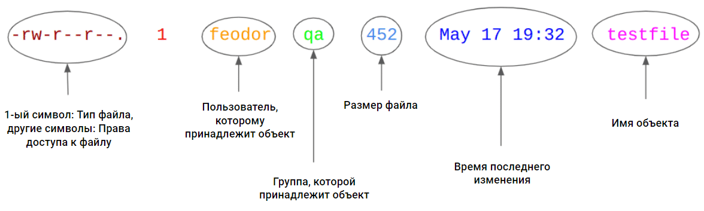
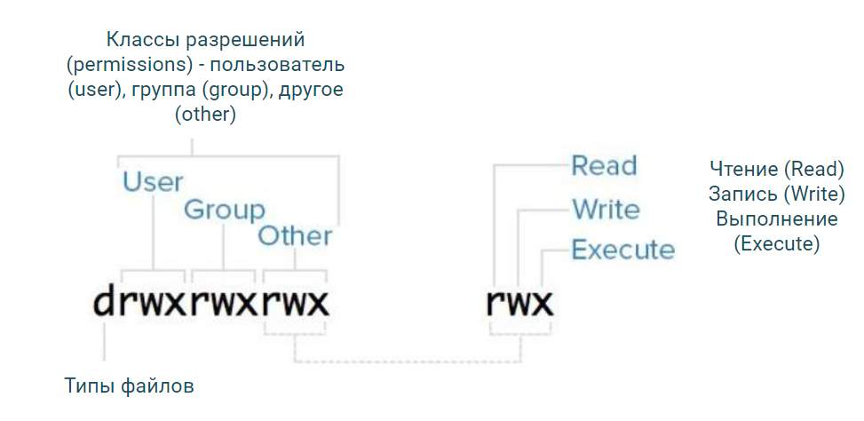

# 08 Linux - пользователи, группы и права доступа к файлам в Linux
## Понятия пользователей и групп Linux
### Учетные записи ОС
+ **Стандартные учетные записи** (создаются для обычных пользователей):
	+  могут входить в систему;
	+  могут выполнять команды;
	+  могут читать некоторые файлы или директории;
	+  не могут изменять любую часть ОС;
	+  не могут изменять любую часть "общесистемных" приложений;
	+  по умолчанию могут изменять данные только в своих домашних директориях и `/tmp`.
+ **Административная учетная запись**: 
  + имя - `root`;
  + `root` - единственный администратор ОС (не может быть двух `root`);
  + редко используется для прямого входа в систему (вместо этого администраторы временно повышают свои привилегии до `root` для обслуживания системы и других важных операций);
  + `root` может входить в систему и делать все с ОС и пользователями без каких-либо ограничений (в отличие от Windows);
  + часто принадлежит к административным группам, таким как `wheel`, `sudo`, или `adm`.
+ **Служебные (системные) учетные записи**
  + автоматически создаются системой для работы внутренних процессов и служб. Например, после установки веб-сервера Apache, который входит в состав стека LAMP, на сервере появляется пользователь `www-data` (на CentOS apache), от имени которого потом работает веб-сервер;
  + используются ОС, службами и приложениями (запускаемые с правами `root` или ограниченными правами). Например, при старте системы (или ручном запуске через команду `sudo systemctl start mysql`) системный менеджер служб ОС (например, `systemd`) запускает службу MySQL от имени **служебной учетной записи** mysql. Это минимизирует возможные последствия в случае сбоя или взлома приложения;
  + не предназначены для использования пользователями;
  + обычно не имеют ни выделенного ни домашнего каталога, ни оболочки, потому что в их жизни никогда не возникает необходимости входить в систему. Общепринятой практикой при создании служебного пользователя является указание "фейковой" оболочки (`/sbin/nologin` или `/bin/false`), которая не позволяет входить в систему. Так команда `sudo useradd -s /sbin/nologin service_user` создаст пользователя service_user, который при попытке входа в систему увидит сообщение о том, что вход запрещен;
  + принадлежат к группам, связанным с конкретными службами или приложениями (`mysql`, `ftp`...).
#### Основные настройки учетной записи
##### `/etc/passwd`
`/etc/passwd` - это основной конфигурационный файл для учетных записей пользователей, который используется, когда:
+ Пользователь входит в систему (по `SSH`, `FTP` и другим средствам/протоколам).
+ ОС или любая программа требует, чтобы имя пользователя было сопоставлено с числовым UID (см. ниже) или наоборот.

*Пример получения информации про свою учетную запись*
`egrep "${USER}" /etc/passwd`, где: 
+ `${}` - специальный синтаксис для обращения к переменным в командной оболочке, позволяющий обращаться к значению переменной по ее имени. Фигурные скобки используются для явного выделения границ имени переменной (это может быть полезно, когда имя переменной непосредственно прилегает к другим символам или тексту, чтобы избежать неоднозначности)
+ `USER` - это имя переменной. В случае переменной `${USER}` это стандартная переменная окружения, которая обычно содержит имя текущего пользователя.

Файл `/etc/passwd` в качестве разделителя полей используется `:` и содержит данные про:
+ имя пользователя (должно быть уникальным)
+ x - поле не используется, поэтому мы имеем здесь 'x' как заглушку
+ идентификатор пользователя, называемый "UID", должен быть уникальным. Стандартные учетные записи в основном имеют UID >= 1000. Административная учетная запись `root` всегда имеет UID 0. Служебные учетные записи имеют UID от 1 до (в основном) 999. Никто, кроме `root`, не должен иметь UID 0 
  + **ВНИМАНИЕ!!!** система Linux технически не препятствует созданию неуникальных UID. Это означает, что администратор или пользователь с достаточными привилегиями может создать несколько учетных записей с одним и тем же UID. Однако это крайне не рекомендуется из-за потенциальных проблем с безопасностью и управляемостью.
+ идентификатор основной группы. Каждый пользователь должен быть членом хотя бы одной группы (не существует пользователей "без групп"). Если пользователей нужно включить в большее количество групп, это настраивается в файле `/etc/group` .
+ описание пользователя. Это поле может быть пустым или содержать что угодно, кроме `:`. Оно не играет никакой роли в ОС и механизмах входа в систему.
+ домашний каталог пользователя, куда он автоматически помещается после успешного входа в систему
+ программа, выполняемая при успешном входе в систему (например, `/bin/bash`). Сервисные учетные записи не предназначены для входа в систему и работы в командной строке, поэтому у них здесь указаны специальные "псевдо" программы, такие как `/bin/false` или `/sbin/nologin`

  ```console
  root:x:0:0:root:/root:/bin/bash
  daemon:x:1:1:daemon:/usr/sbin:/usr/sbin/nologin
  bin:x:2:2:bin:/bin:/usr/sbin/nologin
  sys:x:3:3:sys:/dev:/usr/sbin/nologin
  sync:x:4:65534:sync:/bin:/bin/sync
  games:x:5:60:games:/usr/games:/usr/sbin/nologin
  man:x:6:12:man:/var/cache/man:/usr/sbin/nologin
  lp:x:7:7:lp:/var/spool/lpd:/usr/sbin/nologin
  mail:x:8:8:mail:/var/mail:/usr/sbin/nologin
  news:x:9:9:news:/var/spool/news:/usr/sbin/nologin
  uucp:x:10:10:uucp:/var/spool/uucp:/usr/sbin/nologin
  proxy:x:13:13:proxy:/bin:/usr/sbin/nologin
  www-data:x:33:33:www-data:/var/www:/usr/sbin/nologin
  backup:x:34:34:backup:/var/backups:/usr/sbin/nologin
  list:x:38:38:Mailing List Manager:/var/list:/usr/sbin/nologin
  irc:x:39:39:ircd:/var/run/ircd:/usr/sbin/nologin
  gnats:x:41:41:Gnats Bug-Reporting System (admin):/var/lib/gnats:/usr/sbin/nologin
  nobody:x:65534:65534:nobody:/nonexistent:/usr/sbin/nologin
  systemd-network:x:102:103:systemd Network Management:/run/systemd:/usr/sbin/nologin
  systemd-resolve:x:103:104:systemd Resolver:/run/systemd:/usr/sbin/nologin
  systemd-timesync:x:104:105:systemd Time Synchronization:/run/systemd:/usr/sbin/nologin
  syslog:x:101:106::/home/syslog:/usr/sbin/nologin
  ```

##### `/etc/shadow`
+ Хеши паролей хранятся в файле `/etc/shadow`, доступ к которому имеет только `root`. Эти особые разрешения `/etc/shadow` используются для того, чтобы избежать атак методом перебора.
+ файл `/etc/shadow` также содержит все настройки паролей учетных записей ОС, например, когда пароль должен быть изменен и т.д.
#### Заметки по безопасности/стабильности
+ Только `root` может изменять `/etc/passwd` - иначе хакеры могут повысить привилегии, создав "фальшивого рута" с UID 0. Обычно `/etc/passwd` имеет права 644 (чтение для всех, запись только для `root`)
+ Только `root` имеет доступ к файлу `/etc/shadow`. Обычно `/etc/shadow` имеет права 600 (чтение и запись только для root).
### Группы ОС
+ Группы служат для упрощения управления пользователями и разделения привилегий:
  + кто может читать/писать/исполнять файл
  + кто может войти в систему через SSH
  + кто и как может использовать инструменты `sudo` или `su`
  + кто может читать журналы общесистемных служб с помощью инструмента `journalctl`
  + сколько процессора/памяти/дискового пространства может быть израсходовано
+ Группы включают 0 или более пользователей
+ Каждый пользователь должен быть членом как минимум одной группы (задается в ```/etc/passwd``` и называется "основной")
+ Каждый пользователь может быть включен в 0 или более дополнительных групп (задается в ```/etc/group``` и называется "вторичные группы" (secondary groups)).
+ Нет никакой разницы (в плане привилегий) между членством в первичной и вторичной группах, например: если ваш пользователь входит в группу "qa" и группу "users", вы можете читать файлы, доступные как группам "qa", так и "users".
+ Имена групп чувствительны к регистру.
+ В отличие от Windows, в UNIX нет группы "Администраторы".
+ В большинстве систем членство в группе `root` не дает многих привилегий, в отличие от статуса пользователя `root`.
+ Могут существовать специальные группы с дополнительными привилегиями, это сильно зависит от настроек вашей ОС. Например, группы `sudo` или `wheel` могут иметь (а могут и не иметь) неограниченные права на выполнение любых команд от имени `root` через `sudo`
#### Создание /изменение групп
##### Создание обычной группы:
`sudo groupadd mygroup` - создание группы с именем `mygroup`.
##### Создание группы с заданным GID:
`sudo groupadd -g 1001 mygroup` - создание группы `mygroup` с GID 1001.
##### Создание системной группы:
`sudo groupadd -r mysystemgroup` - системные группы обычно используются для специальных системных операций, таких как резервное копирование, обслуживание или предоставление доступа к оборудованию. Эти группы обычно имеют низкие GID (Group ID) и создаются для управления доступом к определённым системным ресурсам и службам.
##### Изменение имени группы:
`sudo groupmod -n newgroupname oldgroupname` - изменение имени группы с oldgroupname на newgroupname.
##### Изменение GID группы:
`sudo groupmod -g 2000 mygroup` - изменение GID группы mygroup на 2000.
#### Основные настройки групп: ```/etc/group```
```/etc/group``` - основной конфигурационный файл для групп UNIX и используется, когда:
+ ОС или какой-либо программе требуется преобразовать имя группы в числовой GID (см. ниже) или наоборот.
+ Пользователь пытается сделать что-то, что может быть ограничено или разрешено функциями управления группами (например, чтение файла)
+ [опционально, если службы входа настроены таким образом] Пользователь входит в систему (SSH, FTP, другие протоколы) и службы (SSH, FTP...) могут проверять, имеет ли пользователь необходимые права доступа, основываясь на его групповой принадлежности.

Файл `/etc/group` содержит:
+ Название группы,
+ Идентификатор группы, называемый "GID" (должен быть уникальным),
+ Список членов группы, разделенный запятыми (может быть пустым)

Членство в группе вычисляется как совокупность вхождения пользователя в файлах ```/etc/passwd``` и ```/etc/group```
### Получение информацию о пользователе и группе
+ ```whoami```	- покажет имя **эффективного** пользователя, а не реального. Это означает, что если вы используете `sudo` для выполнения команды `whoami`, она отобразит `root`, так как команда выполняется с привилегиями суперпользователя. Она полезна для проверки, под каким пользователем вы в данный момент работаете, особенно если вы переключались между пользователями с помощью `su` или `sudo`
+ ```id```		- [Получить расширенную информацию о реальном (не эффективном) пользователе и его членстве в группах](#mainlinuxfscmd)
+ ```groups```	- получить имена групп текущего пользователя
  + `groups username` - вывод групп конкретного пользователя
### Добавление/изменение учетных записей в группе
+ `useradd` используется для создания новых учетных записей (создает все необходимые файлы и каталоги для нового пользователя, добавляет записи в файлы `/etc/passwd`, `/etc/shadow` и `/etc/group`);
+ `usermod` применяется для изменения уже существующих (изменяет параметры уже существующих учетных записей).
#### `useradd`
`sudo useradd -ОПЦИИ ПАРАМЕТРЫ`, где:
+ `-m` : Создает домашний каталог для нового пользователя. Должен применяться одновременно с `-d` `sudo useradd -m -d /new/dir username`(без `-d`, каталог будет создан по умолчанию в `/home/username`).
+ `-d` : Указывает домашний каталог для нового пользователя (если без опции `-m`, то к этому моменту каталог должен уже существовать).
+ `-s` : Указывает оболочку для нового пользователя.
+ `-g` : Указывает основную группу для нового пользователя (можно задавать как GID, так и имя группы).
+ `-G` : Указывает дополнительные группы для нового пользователя.
+ `-u` : Указывает UID для нового пользователя.
#### `usermod`
```sudo usermod -ОПЦИИ ПАРАМЕТРЫ```, где:
+ `-l` или `--login NEW_LOGIN`: Изменяет имя пользователя `sudo usermod -l newjohn john`.
+ `-d` или `--home HOME_DIR`: Изменяет домашний каталог пользователя `sudo usermod -d /new/home/john -m john`.
+ `-m` или `--move-home`: Перемещает содержимое домашнего каталога в новое место (используется с -d).
+ `-g` или `--gid GROUP`: Изменяет основную группу пользователя `sudo usermod -g developers john`.
+ `-G` или `--groups GROUPS`: Задает дополнительные группы для пользователя `sudo usermod -aG sudo,adm john` (без `-a` заменит старые дополнительные группы на новые).
+ `-a` или `--append`: Добавляет пользователя в дополнительные группы (не используется отдельно от `-G`).
+ `-s` или `--shell SHELL`: Изменяет командную оболочку пользователя `sudo usermod -s /bin/zsh john`.
+ `-u` или `--uid UID`: Изменяет UID пользователя `sudo usermod -u 2001 john`.
+ `-L` или `--lock`: Блокирует учетную запись пользователя `sudo usermod -L john`.
+ `-U` или `--unlock`: Разблокирует учетную запись пользователя.
## Повышение привилегий
### `su`: Переключить пользователя
Команда `su` запускает оболочку от имени целевого пользователя (по умолчанию `root`) после предоставления пароля целевого пользователя. Соответственно, все, что выполняется в этой оболочке, будет выполняться с привилегиями целевого пользователя. Чтобы вернуться к предыдущему пользователю, выполните команду `exit`.

Часто используется системными администраторами, которые входят в систему как обычные пользователи, а затем переключаются на учетную запись `root`. Но помните, что для этого случая требуется знание пароля `root`.
1. `su - sutest` - запустит оболочку от имени пользователя `sutest`. Опция `-` (или `-l`) указывает `su` использовать логин-сессии (здесь - созданную сессию пользователя `sutest`), что означает:
   1. Смену на домашний каталог целевого пользователя и использование его окружения - переключается в домашний каталог целевого пользователя (в примере — `/home/sutest`)
   2. Переменные окружения (`HOME`, `USER`, `LOGNAME`, `SHELL`, `PATH` и другие) устанавливаются так, как если бы вход в систему выполнил целевой пользователь (в примере — `sutest`)
   3. Переменная `PATH` обновляется, чтобы включать пути, специфичные для целевого пользователя (в примере — `sutest`), что обеспечивает доступ ко всем необходимым системным утилитам
   4. Загружаются и выполняются файлы конфигурации оболочки целевого пользователя (в примере — `sutest`), такие как `.profile`, `.bash_profile`, `.bashrc` и другие, если они существуют
2. `su - -c "id -u; whoami"` - выполнение команды (или нескольких, разделенных точкой с запятой команд) от имени root, без запуска полнофункционального сеанса оболочки `root`:
   1. Команда `su` используется для смены пользователя. По умолчанию она переключает на пользователя `root`.
   2. Опция `-` (или `-l`) указывает `su` использовать логин-сессии (здесь - `root`)
   3. Опция `-c` указывает `su` выполнить команду, заключенную в кавычки, вместо запуска интерактивной оболочки (в примере команда `id -u` выводит числовой идентификатор (UID) текущего пользователя, а команда `whoami` выводит имя текущего пользователя.
  
**Примечания**
+ команда `su -` - переключит на `root`
+ Пользователь `root` может переключаться на любого другого без ввода пароля цели.
+ Лучше использовать `su -` вместо `su`, так как ключ `-` загружает все окружение оболочки целевого пользователя.
### `sudo`: Substitute User Do
Инструмент `sudo` используется для запуска команды от имени другого пользователя (по умолчанию `root`) после предоставления собственного пароля пользователя, а не того, от имени которого вызывают команду. `sudo` предназначен для того, чтобы позволить определенным пользователям выполнять определенные команды (и только их, ничего больше!) от имени другого, часто привилегированного, пользователя 
+ `sudo -l` -  Чтобы проверить возможности пользователя, заданные в файле `/etc/sudoers`
+ `sudo [-u username] command args` - чтобы запустить команду
  + `sudo usermod -aG sudo username` - добавляет пользователя `username` в группу `sudo`

**Примечания**
+ Только пользователь `root` может устанавливать или изменять чьи-либо разрешения `sudo` - обычный пользователь может только перечислить свои собственные настройки sudo (`sudo -l`) и выполнять разрешенные команды в соответствии с настройками
+ Некоторые привилегированные пользователи (например, члены групп `wheel` или `sudo`) могут выполнять любые команды от имени `root`. В файле `/etc/sudoers` это может отображаться как `root ALL=(ALL:ALL) ALL` *(пользователь `root` на любом хосте от имени любого пользователя в составе любой группы может выполнять любые команды)* или `%sudo ALL=(ALL) ALL` *(учетные записи из группы `sudo` на любом хосте от имени любого пользователя могут выполнять любые команды, при условии, что учетная запись пользователя входит в группу `sudo` на данных хостах)*
+ Чтобы предоставить пользователю возможность применять `sudo` администратор (`root`) добавляет соответствующие записи в файл `/etc/sudoers`. Для минимизации риска "поломать" файл `/etc/sudoers` лучше делать это с помощью редактора `visudo`, который вызывается: `sudo visudo`
### `sudo` VS `su`: Основные различия
|  | `su` | `sudo` |
|----------|----------|----------|
| Основная функциональность  | Предоставление оболочки входа в систему с привилегиями целевого пользователя, по умолчанию `root` | Выполнение одной команды от имени целевого пользователя, по умолчанию `root` |
| Основная идея | Работа в полнофункциональной оболочке как `root` или любой другой пользователь ОС | Делегирование некоторых административных полномочий обычным пользователям |
| Какой пароль вводить | Пароль целевого пользователя | Ваш собственный пароль |
| Необходимые настройки | Возможно, вас нужно будет включить в специальную группу для запуска `su` (если это установлено вашим системным администратором). | Точные команды и даже их аргументы могут быть разрешены в явном виде в файле `/etc/sudoers`|
| Настройки безопасности по умолчанию | Любой может выполнить команду `su`, требуется только пароль целевого пользователя | Только члены специфической для дистрибутива группы (`wheel` в RHEL-системах, например CentOS, `sudo` в Debian, например Ubuntu) могут использовать `sudo`. |
## Разрешения на доступ к файлам
### Анатомия вывода `ls`

+ Выше результат команды `ls -l testfile`, где:
	+ `-` для типичных файлов
	+ `d` для каталогов
	+ `l` для символических ссылок
	+ 9 следующих символов, (`rw-r--r--`) - это разрешения доступа к файлам UNIX
	+ "Размер файла" имеет смысл только для типичных файлов, ни для каталогов, ни для симлинков.
### Анатомия разрешений на доступ к файлам


Как проверяются и применяются разрешения доступа:
+ Во-первых: является ли пользователь владельцем данного объекта? Если да - проверить, разрешают ли разрешения владельца объекта эту операцию.
+ Если пользователь не является владельцем объекта - является ли он членом группы? Если да - проверить, разрешают ли групповые разрешения объекта эту операцию.
+ Если пользователь не входит в группу - проверить, разрешают ли разрешения других на эту операцию.
### Смысл и формат записи прав доступа
Разрешения доступа к файлам (r, w, x) имеют разные значения для файлов и директорий
| Бит | Значение для файлов | Значение для директорий |
|:-------------|:---------------:|--------------:|
| `r` - read (чтение)       |Файл может быть прочитан, например, с помощью `cat`, `less`, `head`, других инструментов.        | Список содержимого каталога может быть прочитан: `ls имя_каталога` для отображения содержимого каталога, но при этом не будет возможности просматривать содержимое самих файлов или заходить в подкаталоги, если у вас  не установлен бит `x`        |
| `w` - write (запись)       | Содержимое файла может быть изменено. Но сам файл не может быть удален - см. `w` для каталогов.        | Любой элемент этого каталога может быть создан или удален. То есть, даже если вы не являетесь владельцем файла в этом каталоге, вы можете удалить его, установив `w` для каталога. Но без также установленного бита `x` можно будет добавлять новые файлы в каталог, удалять существующие файлы и переименовывать их только если вы уже находитесь в каталоге, т.к. при обращении к файлу система сначала проверяет право `x` у всех директорий, стоящих в пути этого файла, и только затем права на сам файл. Если хотя бы у одной директории право `x` отсутствует, доступ к этой директории и всему ее содержимому для Вас запрещается.       |
| `x` - execute (выполнение)       | Файл может быть выполнен. Фактически исполняемые файлы: двоичные файлы и скрипты        | Доступ к файлам и подкаталогам: с битом `x` можно: переходить в каталог с помощью команды `cd`; просматривать атрибуты файлов (например, права доступа, размер) с помощью команды `ls -l`; открывать, читать, записывать и выполнять файлы в каталоге, если у вас есть соответствующие права на сами файлы|
### Команды для изменения разрешений доступа к файлам
#### `chown`
`chown [OPTIONS] USER[:GROUP] FILE(s)`: для установки нового владельца и/или группы для объекта
+ изменить только владельца объекта - может быть выполнена только пользователем `root`
	+ `chown operator:bin ~/chown.me` - для объекта `~/chown.me` устанавливается собственник `operator`, группа `bin`. Команда выполняется от имени `root`
+ изменить только группу объекта - может быть выполнена обычным пользователем, но этот пользователь должен быть членом новой группы (иначе требуются привилегии `root`)
  + `chown :users ~/chown.me` - для объекта `~/chown.me` устанавливается группа `users`. Команда выполняется от члена группы `users`
+ изменить владельца и группу объекта сразу - только для `root`

`[OPTIONS]`:
+ `-c`, `--changes`: Показывает изменения только в случае их наличия.
+ `-f`, `--silent`, `--quiet`: Подавляет большинство сообщений об ошибках.
+ `-v`, `--verbose`: Выводит диагностическое сообщение для каждого обработанного файла.
+ `-R`, `--recursive`: Рекурсивно изменяет владельца и/или группу для всех файлов и директорий внутри указанной директории.
  + `chown -R :users ~` - используется для изменения группы всех файлов и директорий на `users` в вашем домашнем каталоге рекурсивно
+ `--preserve-root`: Предотвращает рекурсивное изменение владельца и группы для корневого каталога / (полезно для предотвращения случайных изменений в корневом каталоге).
+ `--no-preserve-root`: Позволяет рекурсивно изменять владельца и группу для всех файлов и директорий, включая корневой каталог (по умолчанию, эта опция включена).
+ `--reference=etalone_file`: Использует владельца и группу файла `etalone_file` для изменения владельца и группы целевого файла.
  + `chown --reference=/path/to/reference/file /path/to/target/file` - целевой файл `/path/to/target/file` получит того же владельца и группу, что и эталонный файл `/path/to/reference/file`
+ `--dereference`: Влияет на целевой файл символической ссылки, а не на саму символическую ссылку. То есть, если вы используете `chown` на символическую ссылку, будет изменен владелец целевого файла, на который указывает ссылка (по умолчанию, эта опция включена).
  + `chown --dereference newuser:newgroup /path/to/symlink` - Этот пример изменит владельца целевого файла, на который указывает символическая ссылка `/path/to/symlink`
+ `-h`, `--no-dereference`: Изменяет владельца самой символической ссылки, а не целевого файла. *Это полезно только на системах, которые поддерживают изменение владельца символических ссылок.*
  + `chown -h newuser:newgroup /path/to/symlink` - Этот пример изменит владельца самой символической ссылки `/path/to/symlink`, а не целевого файла
#### `chgrp`
`chgrp [OPTIONS] GROUP FILE..`: для изменения группы объекта (только если вы являетесь членом новой группы)
+ `chgrp users ~/chown.me` - аналогична `chown :users ~/chown.me`
+ `chgrp -R users ~` - поддерживает рекурсивный режим `-R`

Значения `[OPTIONS]` аналогичны приведенным выше для `chown` 
#### `chmod` 
`chmod` позволяет как установить новые точные разрешения сразу на определенный объект - для этого лучше использовать восьмеричную форму, так и добавить или отозвать определенные права доступа к объекту - это удобнее делать в символьном виде
 + символьный вид: `chmod [OPTIONS] [ugoa…][-+=]perms…[,…] FILE...`
   + [OPTIONS] - аналогичны опциям chown, кроме:
     + `-X`: Только для директорий и исполняемых файлов. Устанавливает бит выполнения, если файл уже имеет бит выполнения для кого-либо из пользователей. Это полезно при рекурсивном изменении прав доступа, чтобы не делать исполняемыми все файлы, а только те, которые уже были исполняемыми. Но следует отметить, что параметр `-X` добавляет право выполнения всем категориям пользователей (владельцу, группе и другим), если хотя бы одна из этих категорий уже имеет это право. Он не может быть использован для добавления права выполнения только для конкретной группы пользователей. Но если вам нужно добавить право выполнения только для конкретной группы, например, "user" и только тем файлам, которые уже исполняемые (т.е. для одного из классов: "group" или "other" установлен бит "x"), то использование команды `find` с `chmod` будет наиболее подходящим решением: `find directory -type f -perm -u=x -exec chmod g+x {} \;`
   + Первый набор флагов `([ugoa...])`, флаги пользователей, определяет, для каких классов пользователей изменяются права доступа к файлу.
     + `u` - Владелец файла.
     + `g` - Пользователи, входящие в группу.
     + `o` - Все остальные пользователи.
     + `a` - Все пользователи, идентично `ugo`, например:
       + `chmod u=rwx,g+w,o-r ~/chmod.me.file` - Разрешает владельцу делать что угодно с файлом, добавляет права на запись группе и отбирает права на чтение у прочих (`others`) 
       + `chmod -R go-rwx ~/chmod.me.dir` - отнимаем все права у группы и прочих (`others`) рекурсивно для всей директории
   + Второй набор флагов `([-+=])`, флаги операций, определяет, будут ли разрешения удалены, добавлены или установлены:
     + `-` Удаляет указанные разрешения.
     + `+` Добавляет указанные разрешения.
     + `=` Изменяет текущие разрешения на указанные. Если после символа `=` разрешения не указаны, все разрешения указанного класса пользователей будут удалены.
  + Разрешения `(perms...)` могут быть явно заданы с помощью нуля или одной или нескольких из следующих букв: `r`, `w`, `x`, `X`, `s` и `t`. 
    + При копировании разрешений из одного класса пользователей в другой используйте одну букву из набора `u`, `g` и `o` - `chmod g=u file.txt`. 
    + При установке разрешений для нескольких классов пользователей `([,...])` используйте запятые (без пробелов) для разделения символьных режимов - `chmod u+rwx,g+rx,o+r file.txt`.
+ восьмеричная форма: `chmod [OPTIONS] NUMBER FILE...`, например:
  + `chmod 751 ~/chmod.me.dir` - Устанавливает `rwxr-x--x`, т.е. `751`, на указанную директорию
## Особые случаи: символические ссылки (symbolic links), sticky bit, SUID, SGID
### Символические ссылки
Символические ссылки всегда имеют разрешения `777`, но это ничего не значит, поскольку фактические разрешения доступа такие же, как у целевого объекта:
```console
lrwxrwxrwx. 1 root root 7 янв 1 21:12 /bin -> /usr/bin
dr-xr-xr-x. 2 root root 36864 фев 19 13:31 /usr/bin
```
В примере символическая ссылка `/bin` ссылается на `/usr/bin`:
+ содержимое символической ссылки не может быть изменено, она может быть только пересоздана.
+ для пересоздания символической ссылки требуется наличие прав на запись в директорию, где эта ссылка находится.
+ разрешения доступа к символической ссылке не влияют на разрешения доступа к целевому объекту (в соответствии с  замыслом).
### Sticky bit
Sticky bit может использоваться для директорий наряду с "обычными" битами доступа `rwx`. Если он установлен, только владельцы могут удалять свои объекты, независимо от других разрешений. Sticky bit отображается как `t` в конце "слова" разрешения доступа: `drwxrwxrwt`.

**sticky bit** имеет числовое значение 1

**sticky bit** очень важен для `/tmp`, так как благодаря разрешениям `777` без установленного **sticky bit** каждый мог бы создавать и удалять там что угодно, но **Sticky bit** не позволяя удалять чужие данные

**sticky bit** может быть установлен в символьной или восьмеричной форме:
+ `chmod +t /some/dir`
+ `chmod 1xyz /some/dir`
### Биты `SUID` и `SGID`
Бит `SUID` (Set User ID) может использоваться для исполняемых файлов. Если он установлен, этот файл всегда будет выполняться от имени владельца. Бит `SUID` отображается как `s` вместо `x` в блоке разрешений владельца:
```console
# SUID binaries
[st00@c7-sandbox ~]$ ls -l /bin/passwd /bin/chsh /bin/sudo
-rws--x--x. 1 root root  23880 Feb  2  2021 /bin/chsh
-rwsr-xr-x. 1 root root  27856 Apr  1  2020 /bin/passwd
---s--x--x. 1 root root 151424 Oct 14  2021 /bin/sudo
```
Это полезно, если этот исполняемый файл а) часто используется и б) должен делать что-то с определенными правами пользователя. Например:
+ Исполняемый файл `/bin/passwd` предназначен для того, чтобы позволить пользователям изменять свой пароль. Поэтому он должен модифицировать файл `/etc/shadow`, что требует привилегий `root`.
+ Исполняемый файл `/bin/chsh` предназначен для изменения оболочки входа в систему. Поэтому он модифицирует файл `/etc/passwd`, который также разрешен только для `root`.
+ Исполняемый файл `/bin/sudo` предназначен для повышения привилегий до `root`, поэтому он обязательно должен иметь возможность запускать что-либо от имени `root`.

Бит `SUID` имеет восьмеричное значение 4

```console
# SUID bit
chmod u+s /path/to/file
chmod 4xyz /path/to/file
```
### Бит `SGID` (Set Group ID) 
Бит `SGID` (Set Group ID) также может быть использован для исполняемых файлов. Если он установлен, этот файл всегда будет выполняться от имени группы владельцев. Бит `SGID` отображается как `s` вместо `x` в блоке групповых разрешений, как показано ниже для бинарного файла `wall`. В отличие от `SUID`, бит `SGID` не используется широко:
```console
# SGID binary
[st00@c7-sandbox ~]$ ls -lF /bin/wall
-r-xr-sr-x. 1 root tty 15344 Jun 10  2014 /bin/wall*
```
Бит `SGID` имеет восьмеричное значение 2

```console
# SGID bit
chmod g+s /path/to/file
chmod 2xyz /path/to/file
```

