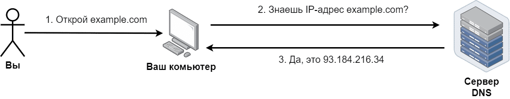
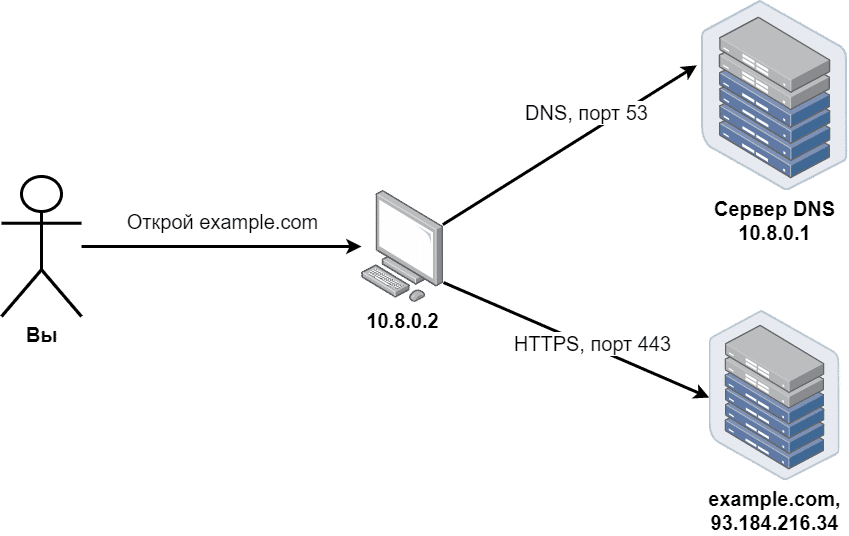
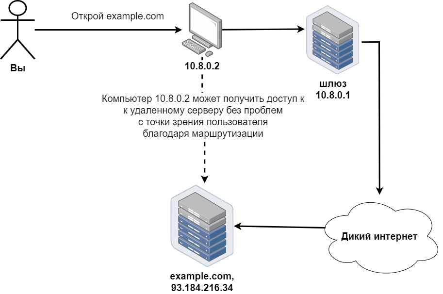
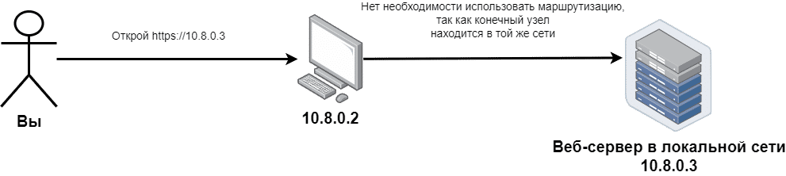
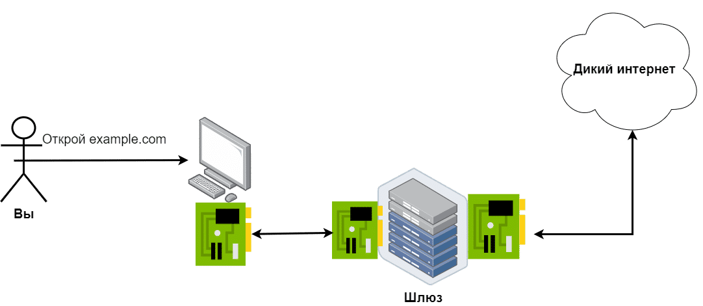

# 11 Как устроены сети
## Основные понятия сетей
### Модель клиент-сервер


Программа, которая хочет получить данные, называемая "клиент", например, веб-браузер. Второй узел — это сервер, программа, обрабатывающая ваш запрос.
### Протоколы
Для общения с кем-либо мы должны разговаривать с собеседником на одном языке. В области сетей такие языки называются протоколами. Они устанавливают правила общения между компьютерами. Например, при подключении по Wi-Fi задействуется протокол 802.11. Также вы используете протоколы HTTP и HTTPS каждый раз, когда открываете веб-сайты.
### Утилиты для работы с сетевыми соединениями
#### UNIX/macOS - [nc](#nc) или netcat
nc, или netcat, это UNIX/macOS-утилита для работы с сетевыми соединениями. Она часто используется для отладки и тестирования сетей, так как поддерживает как TCP, так и UDP протоколы
```console
[user@host]$ nc example.com 80
GET / HTTP/1.1
Host: example.com
[ нажмите Enter ]
[ нажмите Enter ]
```
(нажать Ctrl+C после того, как сервер пришлёт что-нибудь в ответ)
#### Windows
1. Скачать на https://nmap.org/ в разделе "Microsoft Windows binaries" "Latest stable release self-installe
2. Запустите cmd или powershell и вызвать ncat (предварительно записав путь "c:\Program Files (x86)\Nmap" в PATH)
```console
[user@host]$ ncat example.com 80
GET / HTTP/1.1
Host: example.com
[ нажмите Enter ]
[ нажмите Enter ]
```
(нажать Ctrl+C после того, как сервер пришлёт что-нибудь в ответ)

или пользоваться telnet
```console
> telnet
Microsoft Telnet> set localecho //включает режим локального отображения команд
Microsoft Telnet> open example.com 80
GET / HTTP/1.1
Host: example.com
```
## Адреса и маршрутизация
### Cистема доменных имён DNS


#### Разрешение имени ОС Linux, macOS:
1. ОС берет адрес DNS-сервера из своих сетевых настроек (из файла ```/etc/resolv.conf```)
```console
vboxuser@devDebian:~$ cat /etc/resolv.conf 
# Generated by NetworkManager
nameserver 192.168.50.1
```
2. ОС отправляет серверу DNS специальный запрос: «отправь мне IP-адрес, соответствующий имени example.com. Мы это можем выполнить:

```host example.com```, например:
```console
vboxuser@devDebian:~$ host example.com
example.com has address 93.184.215.14
example.com has IPv6 address 2606:2800:21f:cb07:6820:80da:af6b:8b2c
example.com mail is handled by 0
```
#### Разрешение имени ОС Windows:
1. ОС берет адрес DNS-сервера из своих сетевых настроек. Мы это можем выполнить с помощью ```ipconfig /all```
2. ОС отправляет серверу DNS специальный запрос: «отправь мне IP-адрес, соответствующий имени example.com. Мы это можем выполнить с помощью ```nslookup имя.сервера```
### IP-адреса и порты


IP-адреса служат для идентификации узлов, подключённых к сетям

Взаимодействие клиент-сервер с помощью разных протоколов прикладного уровня (DNS и HTTPS) и портов (53 и 443 соответственно):
+ DNS: port 53
+ HTTPS: port 443
#### IP, MAC-адрес(а) вашего компьютера и маска локальной сети вашего компьютера:
+ ОС Linux:
  + ```ip addr list``` == ```ip addr show``` == ```ip a```
  + ```ifconfig``` (иногда)
+ macOS: ```ifconfig```
+ ОС Windows: ```ipconfig /all```
### Маршрутизация


Связь узла с сервером example.com достигается с помощью механизма маршрутизации



Для связи с компьютерами локальней сети маршрутизация не нужна

Получить "таблицу маршрутизации" (routing table):
+ Linux: ```ip route list``` == ```ip r```
+ macOS: ```netstat -rnf inet```
+ Windows: ```route -4 PRINT```

*Пример:*
```console
[user@host]$ ip route list
default via 10.8.0.1 dev eth0 proto dhcp src 10.8.0.2 metric 1024
10.8.0.0/24 dev eth0 proto kernel scope link src 10.8.0.2
192.168.0.0/24 dev eth1 proto kernel scope link src 192.168.0.2
```
Здесь:
+ компьютер подключён к двум локальным сетям, 10.8.0.0/24 и 192.168.0.0/24, и обладает внутри каждой из этих сетей IP-адресами 10.8.0.2 и 192.168.0.2 соответственно.
+ При попытке подключиться к узлу сети 10.8.0.0/24 компьютер будет использовать для этого устройство с именем eth0. 
+ При попытке подключиться к узлу сети 192.168.0.0/24 компьютер использует устройство с именем eth1
+ При попытке подключиться к узлу сети с именем example.com (93.184.216.34 - это IP-адрес ресурса с именем example.com) или любым другим узлом из внешних сетей операционная система будет применять маршрут по умолчанию с адресом 10.8.0.1

Для построения  маршрута от вашего узла до сервера example.com:
+ Linux, macOS: ```traceroute example.com```
+ Windows: ```tracert example.com```
## Физический уровень


Представление с точки зрения аппаратного обеспечения

### Протокол ARP (Address Resolution Protocol — протокол определения адресов).
Протокол ARP применяется  для преобразования адресов только внутри локальной сети, его сообщения не могут передаваться через шлюзы в другие сети
1. Когда данные готовы к передаче, клиентская ОС запрашивает сетевой адаптер отправить специальное широковещательное сообщение: «узел с IP 10.8.0.1, ответь, мне нужен твой MAC-адрес, чтобы пообщаться с тобой»(на данном этапе сетевой адаптер знает только свой MAC-адрес, и что узел example.com находится за пределами вашей сети и поэтому вам нужен шлюз (в данном случае это 10.8.0.1) и, в свою очередь, ничего не знает об IP-адресах, масках подсети, используемом по умолчанию шлюзе).
2. В случае успеха ОС получит следующую информацию: «узел с IP-адресом 10.8.0.1 обладает MAC-адресом 46:09:9f:f5:87:aa», и запишет её в специальную таблицу, где отображаются устройства, с которым ваш узел "общался" в пределах локальной сети.
3. На следующем шаге (**ARP закончил работу**) клиентская ОС запрашивает сетевой адаптер передать сообщение вида "Узел с MAC-адресом  46:09:9f:f5:87:aa, для тебя есть сообщение: [текст сообщения]". Операционная система роутера (внутри этой маленькой коробочки также есть ОС) поместит ваше сообщение в пакет программного уровня, прочтёт IP-адрес узла назначения, выберет нужный интерфейс для дальнейшей пересылки и отправит сообщение через физический уровень этого интерфейса

Получить содержимое ARP-таблицы компьютера:
+ Linux, macOS: arp -a -n
+ Windows: arp /a

### Сетевые адаптеры и IP-адреса
Узлы и сетевые интерфейсы связаны как "один ко многим":
+ Компактный ноутбук может иметь всего 1 встроенный физический сетевой интерфейс, это WiFi-адаптер
+ Ноутбук большего размера как правило имеет 2 и более физических сетевых интерфейса, например один WiFi-адаптер и одну сетевую Ethernet-карту
+ смартфоны имеют как минимум 2 сетевых интерфейса (оба - беспроводные): один для передачи данных по мобильным сетям (4G или 5G), второй - WiFi-адаптер
+ Маршрутизаторы имеют 2 или более сетевых интерфейса для соединения с разными сетями и передачи данных между ними
+ При установке VPN-соединения в системе появляется еще минимум 1 виртуальный сетевой интерфейс для обмена данными внутри VPN-соединения
+ Даже если у компьютера нет ни одного физического сетевого интерфейса, все равно в системе присутствует минимум 1 виртуальный интерфейс, часто называемый loopback-интерфейсом или "интерфейсом обратной петли", необходимый для взаимодействия клиентского и серверного ПО, запущенного на одном и том же узле. 
+ Не бывает случаев, когда один и тот же сетевой интерфейс принадлежит нескольким разным узлам. Даже если на узле запущено несколько виртуальных машин, которые имеют доступ к одному и тому же физическому сетевому интерфейсу, каждая из виртуальных машин имеет свой собственный виртуальный сетевой интерфейс.

Связь между сетевыми интерфейсами и IP-адресами имеет тип "один ко многим":
+ Самый частый случай: 1 сетевой интерфейс имеет 1 IP-адрес, когда вы подключаете узел к локальной сети.
+ Один сетевой интерфейс не имеет ни одного настроенного IP-адреса. Пример: вы включаете ноутбук там, где нет никаких точек доступа WiFi.
+ Один сетевой интерфейс имеет несколько IP-адресов. Такие настройки могут встретиться на сетевых устройствах или серверах в специфических ситуациях.
+ Один и тот же IP-адрес НЕ может быть назначен нескольким сетевым интерфейсам в рамках одной сети.

