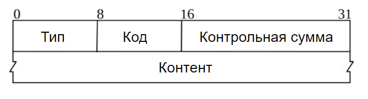

# 14 Поиск сетевых неисправностей
## Проблемы, возможные на сетевом уровне
### ICMP — Internet Control Message Protocol
**ICMP** - протокол транспортного уровня но, с его помощью приложения не передают какие-либо данные. Единственное, для чего он служит, это пересылка сообщений о состоянии узлов и сетевых проблемах от одного узла к другому.
, где:
+ Type (Тип) - поле, определяющее тип сообщения ICMP, например, ошибки в сети, запросы эха (ping) и другие управляющие сообщения.
+ Code (Код) - дополнительное поле, которое дополняет тип сообщения и может уточнять его. Например, для сообщений об ошибке этот код может указывать на конкретный тип ошибки.
+ Checksum (Контрольная сумма): Это поле содержит контрольную сумму заголовка ICMP-сообщения, помогая обнаруживать ошибки в передаче данных.
+ Content (Содержание) - содержимое самого сообщения ICMP, которое может варьироваться в зависимости от его типа и кода. Например, для сообщений об ошибках содержание может включать дополнительную информацию о характере ошибки, а для запросов эха - данные для проверки доступности хоста.

*ICMP не предполагает использование портов.*

Часто используемые типы сообщений протокола ICMP, которые указываются с помощью полей Type и Code заголовка:
+ “Echo Request”(Эхо-запрос) (Type=8) и “Echo Reply” (Type=0). Эти типы используются утилитой ping, а также программой traceroute в режиме ICMP.
+ "Destination Unreachable" (Type=3) - используя этот тип сообщения, шлюзы уведомляют, что они не могут достичь узла назначения текущего IP-пакета. В некоторых случаях удалённый узел может отправить сообщение “Destination port unreachable” (Code=3) в ответ на попытку подключения по протоколу UDP к закрытому порту (так как у самого UDP нет способа реакции на такое событие).
+ Time Exceeded (Type=11). Если на шлюз пришел пакетом с нулевым полем TTL в заголовке IP (Time to live — время существования, то есть количество промежуточных узлов, до исчерпания которого пакет существует в сети, а затем отбрасывается маршрутизатором), то он пошлёт отправителю сообщение «Время истекло». Именно на основе этого принципа работает утилита traceroute. Code обычно используется для указания причины превышения времени. Например, Code=0 для "Time to live exceeded in transi"
### ping
ping [options] <remote_host>: 
	ping example.com
	ping -c 10 example.com
	sudo ping -A -s 65000 192.168.100.1
	ping -t 1 example.com
----------------------------
traceroute
UNIX (Linux, macOS) -> по умолчанию применяет пакеты UDP
Windows (tracert) -> по умолчанию применяет протокол ICMP
traceroute -n yandex.ru
traceroute -nI yandex.ru
traceroute -nT yandex.ru
traceroute -nU yandex.ru = traceroute -n yandex.ru
----------------------------
Проблемы с маршрутизацией и узлами, отключенными от сети
"No route to host" 				- 	нет ни одного правила в вашей таблице маршрутизации, и в 
									ваших настройках не указан 	маршрутизатор, используемый по умолчанию
"Destination host unreachable" 	- 	у маршрутизатора нет маршрута к заданной подсети 
								-	узел назначения не в сети
								-	протокол ICMP отключён на промежуточных межсетевых экранах или узле назначения
									=>	nc -vz mx1.ptsecurity.com 25
----------------------------
Проблемы с системой DNS 
"Name or service not known"	(ping badhostname.com, nc badhostname.com 80)
								-	узел не существует
								-	доменное имя существует, но у него нет IP-адреса
								-	на клиентском узле ошибка в настройке «DNS-резолвера» (/etc/resolv.conf)
								-	не работает «резолвер». => проверить с помощью host badhostname.com 8.8.8.8
									или dig badhostname.com @8.8.8.8
								
								где DNS-резолвер (или DNS-клиент) — в общем это компонент программного или аппаратного обеспечения, отвечающий за выполнение DNS-запросов. Его основная задача — преобразование человекочитаемых доменных имен в соответствующие IP-адреса и наоборот
----------------------------
Потеря пакетов:
перегрузка интерфейса одного из узлов (включая шлюзы), проблемы с физическим каналом.
как проверить:
1. ping удалённый_узел -s 1 (пакеты размером примерно 1 КБ). Если > 5 % потерь => потеря пакетов
2. Создайте файл PCAP с образцом потока пакетов между клиентом и удалёнными узлами, используя tcpdump с фильтрами для узлов и портов. Если есть такая возможность, выполните то же самое на узле назначения. Откройте сохранённый файл в программе Wireshark и поищите красные и (или) чёрные метки.
----------------------------
Проблемы транспортного уровня
Открытые и закрытые порты:
	nc, nmap - удалённая проверка
	netstat, ss - локальная проверка (при наличии непосредственного доступа к интересующему узлу или по протоколу SSH)
	lsof

	1. Порт открыт и доступен.
	2. Порт закрыт, т. е. ни одно из приложений сервера не прослушивает этот порт.
	3. У нас истекло время ожидания, поскольку, например, порт защищен межсетевым экраном, или узел не в сети, или узел недостижим.

	nc:		nc -vz server_address port - Проверить только один порт
			nc -z server_address 1000-2000 - проверить диапазон портов
			time nc -vz server_address port - команда time измеряет время выполнения программы (здесь - nc)
			-	"-v" для получения подробного вывода (т.е. будут показаны и неудачные попытки)
			-	"-z" для проверки доступности порта			
			
			nc должным образом не работает с портами UDP
		
	nmap:	сетевой сканер (самый известный)
		nmap -sT -pA-B адрес_узла 		- с установкой соединения TCP посредством «рукопожатия»
		sudo nmap -sS pA-B адрес_узла	- тоже, но быстрее (посредством отправки пакетов TCP SYN, без установки соединения)
		sudo nmap -sU pA-B адрес_узла	- сканирования портов UDP; операция намного медленнее даже чем режим с опцией -sT
		nmap -sP адрес_сети/маска		- поиск доступных в сети узлов,-sP сканирование ping-ом (хотя в локальных сетях вместо этого применяется протокол ARP)
		nmap -Pn -sT -p22,9099,10000 адрес_узла - сканирование списка портов заданного узла
		
		состояния просканированных портов:
		open - доступен для клиентов, не заблокирован межсетевым экраном, прослушивается неким приложением на серверной стороне;
		closed - доступен для клиентов и не заблокирован межсетевым экраном, не прослушивается ни одним приложением;
		filtered - заблокирован межсетевым экраном, все пакеты, отправленные на этот порт, были отброшены; неизвестно, прослушивается ли этот порт каким-либо приложением.
		
	Connection refused (попытка соединения с закрытым портом ):	
		- остановка сетевого приложения на удаленном сервере, которое должно было прослушивать порт назначения
		- указание неверного порта
		- межсетевой экрана
	Connection timeout (попытка соединиться с недоступным удалённым узлом)
		- отсутствие ответа на ваш пакет SYN
		- блокирование порта назначения со стороны межсетевого экрана
Конфликты портов:
	- Address already in use: nc -l 15672 - попытка запустить nc в режиме сервера, прослушивающего TCP порт (здесь 15672)
	- Permission denied
		- попытка открыть TCP порт < 1024: nc -l 1023
		- попытка открыть UDP порт < 1024:nc -u -l 1023

