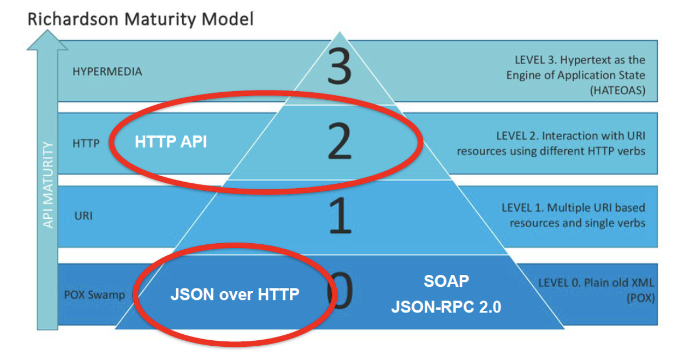

# 16 HTTP, REST, API — инструменты и тестирование
## REST
REST (REpresentational State Transfer) -  это, согласно его автору (Рэю Филдингу) архитектурный стиль взаимодействия компонентов распределённого приложения в сети. Архитектурный стиль – это набор согласованных ограничений и принципов проектирования, позволяющий добиться определённых свойств системы. Этому набору правил/ограничений/рекомендаций необходимо следовать при разработке веб-приложений (в основном веб-сервисов/API).

### Назначение REST в том, чтобы придать проектируемой системе такие свойства как:
Назначение REST в том, чтобы придать проектируемой системе такие свойства как:
+ Производительность,
+ Масштабируемость,
+ Гибкость к изменениям,
+ Отказоустойчивость,
+ Простота поддержки.

### 6 принципов REST
1. Клиент-серверная архитектура
   1. масштабируемость (при необходимости выдерживать большую нагрузку мы можем поставить несколько серверов)
   2. простота поддержки (для изменения логики обработки информации на сервере вносят изменения только на сервере)
2. Stateless
   1. Преимущества:
      1. Масштабируемость сервера (если каждый запрос содержит в себе абсолютно весь контекст, необходимый для обработки, то можно, например, клонировать сервер-обработчик: вместо одного поставить десять таких, и будет абсолютно неважно, в какой из этих клонов придёт запрос и не нужна синхронизация серверов).
      2. Уменьшение времени обработки запроса
      3. Простота поддержки (в логах видно, какое сообщение приходило от клиента, какой ответ он получал и не нужна дополнительная информация о том, какое состояние хранил сервер)
      4. Возможность использовать кэширование
   2. Проблемы:
      1. Усложнение логики клиента (именно на стороне клиента нам нужно хранить всю информацию о состоянии, о допустимых действиях, о недопустимых действиях и подобных вещах).
      2. Увеличение нагрузки на сеть (нужно передавать всю информацию по сети).
3. Кэширование. Согласно этому принципу каждый ответ сервера должен иметь пометку, можно ли его кэшировать
   1. плюсы:
      1. Уменьшение количества сетевых взаимодействий.
      2. Уменьшение нагрузки на системы (не грузим их дополнительными запросами).
   2. минусы
      1. кэшированные данные могут устареть
4. Единообразие интерфейса. Hypermedia as the Engine of Application State (HATEOAS) — одно из ограничений REST, согласно которому сервер возвращает не только ресурс, но и его связи с другими ресурсами и действия, которые можно с ним совершить
   1. плюс этого подхода — клиент становится очень гибким в плане изменений на сервере с точки зрения изменения допустимых действий, изменения модели данных и т.д.
   2. минус - сильное усложнение логики, в первую очередь, клиента но и на сервере тоже, потому что такие ответы нужно правильно формировать. Фактически ответственность за действия, которые совершает клиент, мы передаём на его же сторону, ослабляя контроль валидности совершаемых операций на стороне сервера.
5. Layered system. Между клиентом и сервером могут быть посредники: proxy-сервера, роутеры, балансировщики и пр. Концепция слоистой архитектуры заключается в том, что ни клиент, ни сервер не должны знать о том, как происходит цепочка вызовов дальше своих прямых соседей.
   1. Плюсы - позволяет изменять общую архитектуру без доработок на стороне клиента или сервера.
   2. Минусы:
      1. Увеличение нагрузки на сеть (больше участников и больше вызовов, чем если бы мы шли один раз от клиента до сервера напрямую).
      2. Увеличение времени получения ответа (из-за появления дополнительных участников).
6. Code on demand: сервер передаёт исходный код (на javascript) клиенту, а тот его выполняет. Это вместе с принципом HATEOAS позволяет клиенту стать гибче. Согласно Рэю Филдингу - единственное необязательное ограничение
### Модель зрелости REST-сервисов


#### Уровень 0
К нему относятся любые сервисы, которые в качестве транспорта используют HTTP и какой-то формат представления данных. Например, JSON over HTTP: приложение использует единый путь для отправки команд и один и тот же HTTP-глагол для совершения абсолютно любых действий с любыми объектами
#### Уровень 1
Используются разные ресурсы (разные URL), но при этом всё ещё игнорируем HTTP-глаголы
#### Уровень 2
Правильно с точки зрения спецификации HTTP-протокола используются HTTP-глаголы.

Соответствие приложения второму уровню зрелости не означает, что спроектирована REST-систему/ REST-сервис. Но в очень распространённом понимании соответствие 2-ому уровню часто называют RESTfull сервисом.

**RESTfull**-сервис — это такой сервис, который спроектирован с учётом REST-ограничений. Хотя, в целом, правильнее сервис такого уровня зрелости называть HTTP-сервисом или HTTP-API, нежели REST-API.
#### Уровень 3
Это уровень, в котором начинают использовать концепцию HATEOAS - при передаче информации, ресурсов, потребителям (клиентам) также сообщается о том, какие ещё действия необходимо совершить ресурсу, а также связи с другими ресурсами.

#### Популярные трактовки, что такое REST
На рисунке выше выделены две наиболее популярные трактовки, что такое REST:
+ REST — всё, что передаётся в виде JSON поверх HTTP (Уровень 0).
+ REST — это сервис второго уровня зрелости, то есть HTTP-API, составленное в соответствии со спецификацией HTTP-протокола. Если правильно выделяются ресурсы, правильно используются HTTP-глаголы, а также выполняются некоторые требования HTTP-протокола, то это - REST.

*У каждого свой REST*
### Ресурсы
В REST архитектуре основная концепция — это "ресурс". Ресурс — это любая информация или объект, который можно идентифицировать и к которому можно получить доступ через уникальный URL. В контексте веб-приложений, например, ресурсами могут быть:
+ Профиль пользователя: ресурс с URL /users/{user_id}.
+ Пост пользователя: ресурс с URL /posts/{post_id}.
+ Комментарий пользователя: ресурс с URL /comments/{comment_id}.
#### Операции с ресурсами
В REST архитектуре для взаимодействия с ресурсами используются стандартные HTTP-методы:
+ GET: Получить представление ресурса (например, получить данные профиля пользователя).
+ POST: Создать новый ресурс (например, создать новый пост).
+ PUT: Полностью обновить существующий ресурс (например, обновить информацию о профиле пользователя),  идемпотентный метод (выполнение одного и того же запроса PUT несколько раз приводит к одному и тому же результату)
+ PATCH: Частичное обновление ресурса (не обязательно является идемпотентным методом)
+ DELETE: Удалить ресурс (например, удалить комментарий).
#### Тестирование ресурсов
Подобно тому, как детали автомобиля (двигатель, тормоза, шины и т.д.) проверяются отдельно и в совокупности, чтобы убедиться, что автомобиль работает правильно, ресурсы в RESTful API также должны быть тщательно протестированы:
+ отдельные детали (ресурсы): Каждая деталь проверяется на соответствие ожиданиям и стандартам (например, проверка профиля пользователя, поста или комментария).
+ система в целом: Все детали (ресурсы) работают вместе, корректно взаимодействуют, состояния, переходы, обработка ошибка в системе соответствуют ожиданиям (например, проверка того, что пользователь может создавать посты и комментарии, и они правильно отображаются на его профиле).
#### Примеры тестирования
1. Тестирование отдельных ресурсов: Каждый ресурс нужно тестировать отдельно, чтобы убедиться, что он правильно создается, обновляется, удаляется и возвращает корректные данные:
   1. Тестирование профиля пользователя:
      1. Создание нового профиля.
      2. Получение профиля по ID.
      3. Обновление профиля.
      4. Удаление профиля.
   2. Тестирование постов:
      1. Создание нового поста.
      2. Получение поста по ID.
      3. Обновление поста.
      4. Удаление поста.
   3. Тестирование комментариев:
      1. Создание нового комментария.
      2. Получение комментария по ID.
      3. Обновление комментария.
      4. Удаление комментария.
2. Тестирование системы в целом:
   1. Тестирование взаимодействий: Нужно проверять, как ресурсы взаимодействуют друг с другом. Например, когда создается новый комментарий, он должен быть правильно связан с соответствующим постом:
      1. Создание комментария для поста:
         1. Создать новый пост.
         2. Создать комментарий к этому посту.
         3. Убедиться, что комментарий правильно связан с постом и отображается при запросе комментариев для этого поста.
      2. Получение всех постов пользователя:
         1. Создать пользователя.
         2. Создать несколько постов от имени этого пользователя.
         3. Запросить список всех постов этого пользователя и убедиться, что они все правильно возвращаются.
   2. Тестирование состояния и переходов: Проверка, что ресурсы правильно изменяют свое состояние в ответ на различные операции. Например:
      1. Публикация и архивирование поста:
         1. Создать новый пост.
         2. Изменить статус поста на "опубликован" и убедиться, что он виден в списке опубликованных постов.
         3. Изменить статус поста на "архивирован" и убедиться, что он больше не виден в списке опубликованных постов, но доступен через запрос по ID.
   3. Тестирование ошибок и исключений: Убедиться, что система корректно обрабатывает ошибки, такие как попытка доступа к несуществующему ресурсу или нарушение правил валидации:
      1. Попытка получения несуществующего ресурса:
         1. Запросить профиль пользователя по несуществующему ID и убедиться, что сервер возвращает ошибку 404 (Not Found).
      2. Создание ресурса с некорректными данными:
         1. Попытаться создать нового пользователя без обязательных полей (например, без email) и убедиться, что сервер возвращает ошибку 400 (Bad Request) с соответствующим сообщением об ошибке.
      3. Удаление ресурса, который связан с другими ресурсами:
         1. Создать пост с несколькими комментариями.
         2. Попытаться удалить этот пост и убедиться, что система либо удаляет все связанные комментарии (если такая логика предусмотрена), либо возвращает ошибку, указывая на наличие зависимых ресурсов.
### Форматы данных
RESTful API используют стандартные форматы данных для передачи информации между клиентом и сервером. Наиболее часто используемый формат — JSON, но также могут использоваться и другие форматы, такие как XML, YAML и т. д. Формат данных определяет структуру передаваемой информации, чтобы обе стороны знали, как правильно ее интерпретировать.
#### Тестирование форматов данных
Тестирование форматов данных включает проверку следующих аспектов:
1. Соответствие структуры данных ожидаемому формату:
   1. Убедиться, что данные содержат все необходимые поля.
   2. Убедиться, что поля имеют правильные типы данных (строки, числа, URL и т. д.).
2. Обработка различных форматов данных:
   1. Убедиться, что сервер правильно обрабатывает запросы и ответы в различных форматах данных (например, JSON и XML).
#### Примеры тестов для проверки форматов данных
1. Тестирование структуры данных:
   1. Создание пользователя:
      1. Отправить запрос на создание нового пользователя с корректным JSON-форматом.
      2. Убедиться, что ответ содержит все необходимые поля и правильные типы данных.
		```json
		{
		"name": "Alice",
		"email": "alice@example.com",
		"profile_picture": "https://example.com/profiles/alice.jpg"
		}
		```
      3. Проверить ответ сервера:
		```json
		{
		"id": 124,
		"name": "Alice",
		"email": "alice@example.com",
		"profile_picture": "https://example.com/profiles/alice.jpg"
		}
		```
   2. Получение профиля пользователя:
      1. Отправить запрос на получение профиля пользователя по ID.
      2. Убедиться, что ответ содержит все необходимые поля и правильные типы данных.
		```json
		{
		"id": 123,
		"name": "John Doe",
		"email": "john.doe@example.com",
		"profile_picture": "https://example.com/profiles/johndoe.jpg"
		}
		```
2. Тестирование обработки различных форматов данных:
   1. Отправка запроса в формате JSON:
      1. Отправить запрос на создание нового пользователя в формате JSON.
      2. Убедиться, что сервер правильно обрабатывает запрос и возвращает корректный ответ.
   2. Отправка запроса в формате XML:
      1. Отправить запрос на создание нового пользователя в формате XML.
      2. Убедиться, что сервер правильно обрабатывает запрос и возвращает корректный ответ.
		```json
		<user>
		<name>Alice</name>
		<email>alice@example.com</email>
		<profile_picture>https://example.com/profiles/alice.jpg</profile_picture>
		</user>
		```
      3. Проверить ответ сервера:
		```json
		<user>
		<id>124</id>
		<name>Alice</name>
		<email>alice@example.com</email>
		<profile_picture>https://example.com/profiles/alice.jpg</profile_picture>
		</user>
		```
3. Тестирование ошибок в формате данных:
   1. Отправка некорректного JSON:
      1. Отправить запрос с некорректным JSON (например, отсутствует запятая или кавычка).
      2. Убедиться, что сервер возвращает ошибку 400 (Bad Request) с соответствующим сообщением об ошибке.
		```json
		{
		"name": "Alice"
		"email": "alice@example.com"
		"profile_picture": "https://example.com/profiles/alice.jpg"
		}
		```
   2. Отправка запроса с неправильным типом данных:
      1. Отправить запрос, где поле email содержит число вместо строки.
      2. Убедиться, что сервер возвращает ошибку 400 (Bad Request) с соответствующим сообщением об ошибке.
```json
		{
		"name": "Alice",
		"email": 12345,
		"profile_picture": "https://example.com/profiles/alice.jpg"
		}
```
## Тестирование REST API - POST, PUT, GET, DELETE
### Цель тестирования REST API
Цель тестирования REST API - выявление ошибок неправильной реализации методов API:
1. Нарушенная авторизация или аутентификация
2. Неправильная проверка значений свойств метода API
3. Ошибочные типы данных и, как следствие, некорректное отображение в пользовательском интерфейсе 
4. Неправильные ограничения на уровне API
5. Несоответствие между обработкой значений в API, UI и БД, например, разные типы данных для одного и того же объекта или разные границы для одного и того же значения.

Чтобы убедиться, что все эти случаи учтены, тестировщик должен принять во внимание следующее:
1. Поддерживает ли тестируемый программный интерфейс API все методы HTTP?
2. Структура запросов и ответов: какая структура корректная, какая некорректная, какие запросы и ответы вообще возможны.
3. Обязательные и необязательные параметры URL-адреса и поля тела запроса (перечень конкретных параметров и полей). И что должно прийти в ответ на запрос без обязательных данных.
4. Какие поддерживаются типы данных: символьные строки, числа, даты (значения дата-время обычно не являются источником проблем).
5. Пределы и ограничения: например, ограничение по длине имени пользователя в 121 знак. Что, если в теле запроса будет имя из 122 знаков?
6. Коды ответов: какие коды, приходящие в ответах, может получать клиент.

Первый пункт следует проверить перед началом работы, а следующие 5 пунктов выглядят немного по-разному для разных методов. Рассмотрим их на примере https://petstore.swagger.io/(opens in a new tab), отсортировав по HTTP-методам.
### Проверьте перед началом тестирования: Какие методы поддерживает тестируемый API?
Обычно используются следующие HTTP-методы:
+ POST (используется для создания изображения для питомца с заданным ID, нового питомца, обновления питомца с заданным ID, нового магазина, нового пользователя и т. д.)
+ PUT (используется только для обновления пользователя с заданным ID)
+ GET (используется для получения информации о питомце, магазине, пользователе и т. д.)
+ DELETE (используется для удаления питомца, магазина и пользователя).

Время от времени методы PUT и DELETE не используются из-за ограничений браузера и могут быть пропущены в RESTful-части. Иногда в браузере это выглядит как POST, но на уровне API преобразуется в PUT. Учитывайте эти нюансы.
### Тестирование POST/PUT
Тестирование этих методов очень похоже, разница лишь в том, что в POST мы обычно создаем новый объект, а в PUT только изменяем некоторые параметры. 
1. Протестируем POST https://petstore.swagger.io/v2/pet со следующим телом запроса:
```json
{
    "name": "doggie",
    "photoUrls": [
        "elit cillum exercitation",
        "tempor cupidatat sint aliqua"
    ],
    "id": -36071088,
    "category": {
        "id": 36135777,
        "name": "laborum elit"
    },
    "tags": [
        {
            "id": -58986065,
            "name": "id ut dolore ipsum dol"
        },
        {
            "id": -20316514,
            "name": "adipisicing nostrud"
        }
    ],
    "status": "available"
}
```
2. Структура запроса/ответа
   1. Протестируем POST с пустым JSON в BODY
   2. Протестируем POST с пустым телом.
3. Протестируем, что один и тот же объект можно изменить 2 раза. Этот тест должен корректно работать с PUT, но для POST, скорее всего, он просто создаст двух питомцев
4. Обязательные|опциональные параметры URL или поля тела запроса
   1. Попробуйте удалить некоторые обязательные параметры из тела запроса
   2. Сделать некоторые обязательные параметры пустыми
5. Какие типы данных поддерживаются
   1. В рассмотренном выше сервисе POST /pet типами данных параметров тела являются:
   + id - числовой
   + category - (id - числовое значение, название - строка)
   + name - строка
   + photoUrls - строка в специальном формате
   + tags - (id - числовое значение, имя - строка)
   + status - список предопределенных строк
   2. Попробуйте изменить значение ожидаемого типа на другое (например, дать строку вместо числового и т.д.)
6. Границы и ограничения
   1. Выполняют последовательное тестирование каждого из параметров, для чего необходимо использовать стандартные техники тестирования различных типов данных. 
   2. Для проверки параметра имени нужно создать:
   + Питомца с именем из одной буквы
   + Питомца с именем максимальной длины (если мы ее не знаем, то используем ограничение на тип string).
   + Питомец с пустым именем
   + Питомца со специальными символами в имени.
   3. Для тестирования параметра-список (например, photoUrls) использовать принципы тестирования списков. Создать:
   + Только один элемент списка (<string>)
   + Несколько элементов списка
   + Пустой список
   4. Проверить правильность самого URL и создать объекты, у которых он есть:
   + Правильный формат URL
   + Неправильный формат URL
   + Пустая строка вместо URL
   + URL максимальной длины
   + URL минимальной длины
   + URL, содержащий символы Unicode, например https://mentorpiece.ru/%d0%be%d0%b1%d1%83%d1%87%d0%b5%d0%bd%d0%b8%d0%b5%d1%82%d0%b5%d1%81%d1%82%d0%b8%d1%80%d0%be%d0%b2%d0%b0%d0%bd%d0%b8%d1%8e/
   5. И т.д.
7. Коды ответов
   1. Повторить описанные выше эксперименты, обращая особое внимание на коды ответов:
      1. Объект создан - код ответа 201
      2. Обязательные параметры пусты - это может быть код ответа 400 или 200, а значения назначены по умолчанию

*!!!Внимание JSON должен быть валидным, иначе будет ошибка от валидатора, а не от тестируемой системы.*
### Тестирование GET
Прежде чем приступить к тестированию ```GET https://petstore.swagger.io/v2/pet/:petId```, необходимо подготовить тестовые данные, содержащие нужные нам значения. Для этого требуется либо база данных (если она доступна и разрешена операция INSERT), либо метод POST, создающий соответствующий объект. Таким образом проверяется как корректность метода POST или PUT (если GET не выводит созданный объект, то, очевидно, что-то пошло не так), так и корректность самого метода GET (выведет ли он, например, животное без статуса?).
1. Структура запроса/ответа
   1. На примере GET /pet/{petId}:
   + проверить действительный ли идентификатор питомца (как мы сделали с идентификатором питомца = 1)?
   + проверить несуществующий ID питомца? Попробуйте сделать это с идентификатором питомца = 234343.
   + пропустить идентификатор (GET /pet - без идентификатора).
   + задать вместо ID не число?
   + проверить Id = 0
2. Обязательные|опциональные параметры URL или поля тела запроса
   1. В GET /pet/{petId} параметр Id является обязательным. Попробуйте запустить GET без ID /pet/{petId}.
3. Какие типы данных поддерживаются
   1. Тип данных ID здесь Integer (ожидается числовое значение). Попробуйте вместо этого задать строку. GET /pet/wrwerw
4. Границы и ограничения
   1. Проверить максимальный и минимальный ID
5. Коды ответов
   1. Повторить описанные выше эксперименты, обращая особое внимание на коды ответов.
   + Проверить действительный идентификатор питомца - код ответа 200
   + Проверить несуществующий ID питомца - код ответа 404 (Питомец не найден)
   + Пропустить идентификатор. Код ответа - ?
   + ID выглядит не как число. Код ответа - ?
   + Id был равен 0 - код ответа 404 (Pet not found).
### Тестирование DELETE
1. Проверив, как GET обрабатывает каждый из созданных объектов, можно удалить его с помощью метода ```DELETE https://petstore.swagger.io/v2/pet/:petId.```.
2. Перед тестированием необходимо подготовить тестовые данные, содержащие нужные значения. Для этого требуется либо база данных (если она доступна и разрешена операция INSERT), либо метод POST, создающий соответствующий объект.
3. Структура запроса/ответа
   1. проверить действительный идентификатор питомца
   2. проверить несуществующий ID питомца.
   3. пропустить идентификатор.
   4. задать не число в качестве ID
   5. проверить Id = 0?
4. Обязательные|опциональные параметры URL или поля тела запроса
   1. В DELETE /pet/{petId} параметр Id является обязательным. Попробовать запустить DELETE без параметра: DELETE /pet/.
5. Какие типы данных поддерживаются
   1. Тип данных ID здесь Integer (ожидается числовое значение). Попробовать вместо этого задать строку. DELETE /pet/wrwerw
6. Границы и ограничения
   1. Кроме исследования вокруг конкретного значения, попробовать удалить объект с максимальным и минимальным идентификатором.
   2. Удалите один и тот же объект 2 раза. Во второй раз должна быть получена ошибка.
7. Коды ответов
   1. Повторить описанные выше эксперименты, обращая особое внимание на коды ответов.
      1. проверить действительный идентификатор питомца - код ответа 200
      2. проверить несуществующий ID питомца - код ответа 404 (Питомец не найден)
      3. пропустить идентификатор? (DELETE /pet - без ID)
      4. заменить ID на не число
      5. попробовать Id = 0 - код ответа 404 (Pet not found).
### Вывод
1. В результате должен получиться следующий позитивный сценарий:
   1. POST (создать объект) --> GET (получить информацию о созданном объекте) --> PUT (изменить характеристики объекта) --> GET (убедиться, что характеристики изменились) --> DELETE (удалить объект) --> GET (убедиться, что объект был удален).
2. Негативные сценарии генерируются на основе предложенных выше тестов и их комбинаций.
## Инструменты работы с API
### curl 
[cURL](12%20Сетевые%20уровни%20и%20протокол%20IP.md#curl) можно использовать для тестирования REST-методов.
### [OpenAPI](15%20HTTP,%20URL,%20JSON,%20API.md#openapi) 
### [Swagger](15%20HTTP,%20URL,%20JSON,%20API.md#swagger) 
Главное удобство этого инструмента заключается в том, что разработчик или тестировщик может выполнить любой описанный метод.

Пример: 
+ https://catfact.ninja/
+ https://petstore.swagger.io/
### Boomerang (Chrome)
Плагин позволяет тестировщику применять разные методы HTTP, указывать URL назначения, определять заголовки запросов, содержимое тела и т. д. Также есть возможность импортировать запросы из файла и сохранять запросы для дальнейшего использования

Его аналог в Firefox - RESTED
### Postman
+ Postman — это инструмент для разработки и тестирования API (интерфейсов прикладного программирования). Позволяет создавать, тестировать и документировать API, а также автоматизировать тестирование и мониторинг.
+ Postman предоставляет удобный интерфейс для создания коллекций запросов, добавления тестов, управления окружениями и выполнения запросов к API. 
+ Postman позволяет импортировать спецификации API, такие как OpenAPI, и генерировать коллекции запросов на их основе.
+ Postman поддерживает интеграцию с инструментами CI/CD, такими как Jenkins и Newman.
+ Postman поддерживает как [веб-версия](https://web.postman.co/), так и версия для [десктопов](https://www.postman.com/downloads/).
#### Простые действия Postman
+ отправлять запросы;
+ сохранять запросы для последующего использования;
+ организовывать запросы в коллекции;
+ сохранять ответы в качестве примеров;
+ импортировать/экспортировать запросы или коллекции;
**+ создавать коллекции запросов путем импорта документации в формате OpenAPI (Swagger), RAML, WSDL или других форматов;**
+ использовать различные виды серверной аутентификации;
+ проводить некоторую автоматизацию тестирования.
#### Работа с коллекциями Postman
Основная идея - пакетная (совместная) обработка всех методов:
+ импорт и экспорт их в один файл
+ обмен коллекциями с коллегами
+ документирование API
+ автоматизация работы Postman
+ форк коллекции (т.е. отделение версии).
#### Postman: Переменные
Переменные в коллекциях Postman используются для упрощения и улучшения управления запросами и их параметрами. Они помогают сделать API-запросы более гибкими, повторяемыми и легко изменяемыми. Вот основные назначения и преимущества использования переменных в коллекциях:
##### Назначение переменных
1. Динамическое управление параметрами запросов
Переменные позволяют динамически изменять параметры запросов, такие как URL, заголовки, параметры пути, параметры строки запроса и тело запроса. Это делает запросы более гибкими и уменьшает количество дублирующегося кода. ```GET {{base_url}}/api/v1/pets``` - В данном примере {{base_url}} является переменной, которую можно легко изменить для переключения между разными окружениями (например, разработка, тестирование, продакшн).
2. Управление окружениями
Использование переменных коллекций в сочетании с переменными окружения позволяет легко переключаться между различными окружениями, не изменяя сами запросы. Например, вы можете создать разные окружения для разработки, тестирования и продакшн, каждое из которых имеет свои значения переменных.
3. Безопасное хранение чувствительных данных
Переменные могут использоваться для безопасного хранения и использования конфиденциальной информации, такой как ключи API, токены доступа и пароли. Эти данные можно хранить в переменных окружения, что позволяет избежать их жесткого кодирования в запросах. ```Authorization: Bearer {{api_token}}```
4. Автоматизация тестов
Переменные могут использоваться для хранения значений, полученных из ответов предыдущих запросов, что позволяет создавать сложные сценарии тестирования и автоматизировать их выполнение. ```pm.environment.set("user_id", pm.response.json().id);```
5. Переменные для тела запроса
В теле запросов можно использовать переменные для параметров, значения которых могут изменяться.
```json
{
    "name": "{{pet_name}}",
    "status": "{{pet_status}}"
}
```
##### Типы переменных в Postman
1. Глобальные переменные (Global Variables): Доступны во всех коллекциях и запросах Workspace-а.
2. Переменные окружения (Environment Variables): Доступны только в определенном окружении. Полезны для переключения между различными настройками окружений (например, разработка, тестирование). Для смены окружения программно: ```pm.environment.setName("Production");```
3. Переменные коллекции (Collection Variables): Доступны только в рамках определенной коллекции. Полезны для значений, которые используются во всей коллекции, но не зависят от окружения.
4. Переменные запроса (Local Variables): Доступны только в рамках одного запроса или его тестов. Они временные и существуют только в течение выполнения одного запроса.
##### Приоритизация выбора Postman значений переменных
Postman использует определенный порядок разрешения переменных переменных, когда встречает конструкцию вида ```{{variable_name}}```:
1. Local Variables (Локальные переменные): Локальные переменные задаются и используются внутри одного запроса или его тестов. Они имеют наивысший приоритет и существуют только в течение выполнения одного запроса. ```pm.variables.set("variable_name", "value");```
2. Data Variables (Переменные данных): Переменные данных предоставляются при запуске коллекции с использованием Collection Runner или Newman. Эти переменные задаются в CSV или JSON файлах, используемых для параметризации тестов.
3. Collection Variables (Переменные коллекции): Переменные коллекции доступны во всех запросах, входящих в данную коллекцию. Они используются для значений, которые применяются во всей коллекции. ```pm.collectionVariables.set("variable_name", "value");```
4. Environment Variables (Переменные окружения): Переменные окружения задаются для определенного окружения (например, разработка, тестирование, продакшн). Они позволяют изменять значения переменных в зависимости от выбранного окружения. ```pm.environment.set("variable_name", "value");```
5. Global Variables (Глобальные переменные): Глобальные переменные доступны во всех коллекциях и запросах в Postman. Они имеют наименьший приоритет и используются, если переменная не найдена в других контекстах. ```pm.globals.set("variable_name", "value");```
#### Postman: Автоматизация
В Postman можно настраивать выполняющиеся скрипты и **автоматически проверять ответы методов**. Существуют специальные шаблоны, называемые сниппетами, позволяющие использовать заранее написанный код для часто повторяющихся операций и проверок.
##### Chai
Chai - это библиотека утверждений BDD / TDD для node и браузера, которая может быть прекрасно сопряжена с любым фреймворком тестирования javascript. В контексте Postman Chai можно использовать для написания и выполнения тестовых сценариев в коллекциях запросов. Chai поддерживает три основных стиля утверждений:
1. **expect**: Этот стиль является наиболее современным и перспективным стилем. Он использует конструкцию "ожидания". 
   1. Утверждения в стиле expect выглядят как естественный язык и легко читаются, что делает код тестов более понятным. (```pm.expect()...```)
   2. Его синтаксис поддерживает продвинутые конструкции, такие как асинхронные тесты и сложные проверки.
   3. expect предоставляет мощный и гибкий интерфейс для создания цепочек утверждений, что позволяет писать более сложные и точные проверки.
   4. Стиль expect де-факто стандарт  в сообществе JavaScript-разработчиков благодаря читабельности и выразительности. Широко используется в современной документации и примерах, что облегчает обучение и использование и хорошо сочетается с современными фреймворками и библиотеками для тестирования, такими как Mocha и Jest.
   ```javascript
   // Пример 1: Проверка равенства значений
   pm.test("Value should be 10", function () {
      let value = 10;
      pm.expect(value).to.equal(10);
   });

   // Пример 2: Проверка типа данных
   pm.test("String should be of type string", function () {
      let str = 'Hello, world!';
      pm.expect(str).to.be.a('string');
   });

   // Пример 3: Проверка свойств объекта
   pm.test("Object should have properties name and age", function () {
      let obj = { name: 'John', age: 30 };
      pm.expect(obj).to.have.property('name');
      pm.expect(obj.name).to.be.a('string');
      pm.expect(obj).to.have.property('age');
      pm.expect(obj.age).to.be.a('number');
   });

   // Пример 4: Проверка массивов
   pm.test("Array should include 2 and have length of 3", function () {
      let arr = [1, 2, 3];
      pm.expect(arr).to.include(2);
      pm.expect(arr).to.have.lengthOf(3);
   });
   ```
2. should: Этот стиль предоставляет синтаксис, похожий на естественный язык, с использованием ключевого слова "должно". Стиль should добавляет методы утверждения к объектам JavaScript, что позволяет писать утверждения в стиле "должно быть". Обратите внимание, что необходимо вызвать require('chai').should() в начале теста, чтобы инициализировать стиль should.
   ```javascript
   pm.test("Initialize should style", function () {
      pm.expect(pm.response).to.be.an('object');
      require('chai').should();
   });

   pm.test("Value should be 10", function () {
      let value = 10;
      value.should.equal(10);
   });

   pm.test("String should be of type string", function () {
      let str = 'Hello, world!';
      str.should.be.a('string');
   });

   pm.test("Object should have properties name and age", function () {
      let obj = { name: 'John', age: 30 };
      obj.should.have.property('name');
      obj.name.should.be.a('string');
      obj.should.have.property('age');
      obj.age.should.be.a('number');
   });

   pm.test("Array should include 2 and have length of 3", function () {
      let arr = [1, 2, 3];
      arr.should.include(2);
      arr.should.have.lengthOf(3);
   });
   ```
3. **assert**: Стиль assert предоставляет более традиционный способ написания утверждений с использованием методов assert из библиотеки Chai. Этот стиль подходит для тех, кто предпочитает более явное и часто использование методов утверждения. Он не требует инициализации и может использоваться напрямую.
   ```javascript
   const assert = require('chai').assert;

   pm.test("Value should be 10", function () {
      let value = 10;
      assert.equal(value, 10, "Value is 10");
   });

   pm.test("String should be of type string", function () {
      let str = 'Hello, world!';
      assert.typeOf(str, 'string', "String is of type string");
   });

   pm.test("Object should have properties name and age", function () {
      let obj = { name: 'John', age: 30 };
      assert.property(obj, 'name', "Object has property 'name'");
      assert.typeOf(obj.name, 'string', "Property 'name' is of type string");
      assert.property(obj, 'age', "Object has property 'age'");
      assert.typeOf(obj.age, 'number', "Property 'age' is of type number");
   });

   pm.test("Array should include 2 and have length of 3", function () {
      let arr = [1, 2, 3];
      assert.include(arr, 2, "Array includes 2");
      assert.lengthOf(arr, 3, "Array has length of 3");
   });
   ```
##### Snippets
Snippets (фрагменты кода) в Postman  представляют собой готовые шаблоны кода, которые помогают пользователям быстро писать тесты и скрипты. Эти шаблоны могут быть вставлены в тестовые или предпрограммные (pre-request) сценарии и значительно упрощают создание тестов и автоматизацию взаимодействий с API. Например:
  1. Проверка того, что код (статус) ответа равен 200:
      ```javascript
      pm.test("Status code is 200", function () {
         pm.response.to.have.status(200);
      });
      ```
   2. Вывод в консоль: 
      ```javascript
      console.log("After setting:");
      ```
   3. Получить переменную окружения: 
      ```javascript
      pm.environment.get("variable_key");
      ```
   4. Отправить запрос:
      ```javascript
      pm.sendRequest("https://postman-echo.com/get", function (err, response) {
         console.log(response.json());
      });
      ```
   5. Тело ответа содержит строку:
      ```javascript
      pm.test("Body matches string", function () {
         pm.expect(pm.response.text()).to.include("string_you_want_to_search");
      });
      ```
   6. Тело ответа: JSON содержит значение:
      ```javascript
      pm.test("Your test name", function () {
         var jsonData = pm.response.json();
         pm.expect(jsonData.value).to.eql(100);
      });
      ```
   7. В заголовке ответа есть заголовок "Content-Type"
      ```javascript
      pm.test("Content-Type is present", function () {
         pm.response.to.have.header("Content-Type");
      });
      ```
   8. Время ответа меньше 200 мс
      ```javascript
      pm.test("Response time is less than 200ms", function () {
         pm.expect(pm.response.responseTime).to.be.below(200);
      });
      ```
   9.  Код ответа один из...
         ```javascript
         pm.test("Successful POST request", function () {
            pm.expect(pm.response.code).to.be.oneOf([201, 202]);
         });
         ```
   10. Валидация JSON схемы в Postman. Внимание, предполагается, что нам известна JSON схема, которая описывает ожидаемую структуру и типы данных. В примере - это ```const schema = {...```:
         ```javascript
         const schema = {
            "type": "object",
            "properties": {
               "id": { "type": "integer" },
               "name": { "type": "string" },
               "email": { "type": "string", "format": "email" }
            },
            "required": ["id", "name", "email"]
         };

         pm.test("Validate response against JSON Schema", function() {
            pm.response.to.have.jsonSchema(schema);
         });         
         ```   
   11. Конвертировать xml в JSON:
         ```javascript
         var jsonObject = xml2Json(responseBody);
         ```
   12. Конструкция pm.variables.replaceIn() используется в Postman для замены переменных в строке их значениями. Это особенно полезно, когда вы хотите использовать встроенные функции генерации случайных данных или значения переменных окружения и коллекции.:
         ```javascript
         const randomEmail = `${pm.variables.replaceIn('{{$randomUserName}}')}@example.com`;
         ```
#### Postman: Отчеты/Newman
Newman - это инструмент командной строки для запуска и тестирования коллекций Postman. Он позволяет автоматизировать процесс тестирования API и интегрировать его в CI/CD пайплайн (Jenkins, Travis CI, GitLab CI).
1. Предварительное условие - должен стоять Node.js, - среда выполнения JavaScript, которая позволяет запускать JavaScript код за пределами веб-браузера. Она основана на движке Chrome V8, который является быстрым и эффективным движком JavaScript, разработанным Google для браузера Chrome.
2. Установка newman: набрать в командной строке (выполнять от Администратора): ```npm install -g newman```
3. Формирование отчета newman: набрать в командной строке: ```newman run C:\Users\ISV\Desktop\dummyapi.io.postman_collection.json```
4. Если дополнительно установить newman-reporter-htmlextra — расширения для инструмента командной строки Newman, - то будут предоставлены дополнительные функции и улучшения в сравнении с стандартным HTML-репортером (красиво оформленные интерактивные HTML-отчеты о выполнении коллекций тестов, предоставляется дополнительная информация о запросах и ответах, включая тела запросов и ответов, HTTP-статусы, времена выполнения и прочие метрики): ```newman run C:\Users\ISV\Desktop\dummyapi.io.postman_collection.json --reporters htmlextra --reporter-htmlextra-export "C:\Users\ISV\Documents"```

!!! Внимание, в примерах 1 и 7 
[МИНИ-КУРС POSTMAN (API TESTING) от Alex QA]([https://](https://www.youtube.com/playlist?list=PLfFgJJ14Z4ZGX5ZCTqR75iLehomRfrO2e))