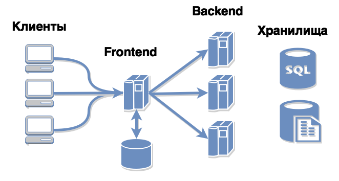

# 17 Веб-интерфейс пользователя
## Типы пользовательского интерфейса
+ GUI (Graphical User Interface — графический интерфейс пользователя).
+ CLI (Command Line Interface — интерфейс командной строки): текстовый интерфейс.
+ Menu Driven (Интерфейс на основе меню) — этот тип предоставляет списки вариантов на выбор. Такой интерфейс используется, например, в банкоматах. 
+ Form based (Интерфейс на основе форм) — с его помощью пользователь может ввести данные, используя ограниченный набор вариантов. С помощью такого интерфейса, например, выполняется настройка профиля.
+ Touch (Сенсорный интерфейс) — во множестве смартфонов и планшетов для работы пользователя с устройством используются прикосновения к экрану.
+ Voice (Голосовой) — смартфоны, дистанционное управление телевизорами и прочее можно усовершенствовать с помощью голосовых технологий.

Веб-интерфейс - GUI, Menu Driven и Form based интерфейсы.
## Как работает веб-страница


Архитектура клиент-сервер. Архитектура веб-страницы может быть разной (автономной, микросервисной, бессерверной и т. д.), но наиболее типичный рабочий процесс выглядит следующим образом:
+ Клиент вводит URL-адрес в браузер. 
+ Браузер отправляет запрос в DNS для определения IP-адреса
+ Затем браузер запрашивает у сервера данные и способ отображения страницы.
+ Сервер посылает запрос к хранилищам данных (к базе данных для получения запрошенных данных и к файловой системе для получения дополнительных файлов, описывающих внешний вид страницы) 
+ Если все в порядке, сервер отвечает браузеру запрошенными данными. 
+ На фронтенде отображаются данные и нужный пользовательский интерфейс.
## Компоненты веб-интерфейса
+ HTML
+ CSS
+ JavaScript (JS)
## Макеты (Мокапы, Mockups)
+ Дизайнеры используют прототипы, созданные в специальных программах, так называемых макетах. Суть у всех программ одна: нарисовать прототип страницы и указать на какие-либо числовые значения, размеры, высоту, длину, цвета (в шестнадцатеричных кодах) и т.д.
  + [Figma](https://www.figma.com/) - онлайн-сервис для разработки интерфейсов и прототипирования с возможностью организации совместной работы в режиме реального времени. Сервис доступен по подписке, предусмотрен бесплатный тарифный план для одного пользователя. Имеются офлайн-версии для Windows, macOS
  + [Nicepage](https://nicepage.com/) — простой в использовании конструктор веб-сайтов с функцией перетаскивания, позволяющий создавать профессиональные веб-сайты с использованием высококачественных шаблонов, которые помогут вам развивать свой бизнес.. 
+ Идея тестирования на основе макетов заключается в том, чтобы сравнить элементы, изображенные на прототипе, с реальными элементами страницы, а значения свойств элементов, которые могут встречаться в прототипах, с реальными значениями. Чтобы быть уверенным в абсолютной корректности страницы, необходимо использовать HTML и CSS.
## Тестирование веб-интерфейса: 
### Основные дефекты HTML/CSS
#### Неработающие ссылки
1. Причина: опечатки, удаление ресурсов (внешняя ссылка вела на файл в Интернете, который был удален или перемещен), удаление или перемещение страниц, смена доменных имен без настройки редиректа. 
2. Как локализовать
   1. Использование онлайн-инструментов. Существуют различные онлайн-сервисы, которые позволяют сканировать ваш сайт или документ на наличие битых ссылок:
      1. [Broken Link Checker](https://ahrefs.com/broken-link-checker).
      2. [Dead Link Checker](https://www.deadlinkchecker.com/).
      3. [W3C Link Checker](https://validator.w3.org/checklink).
   2. Использование расширений для браузеров
      1. Check My Links (для Google Chrome).
      2. LinkChecker (для Firefox).
   3. Использование командной строки
      1. С помощью команды ```wget```:
         1. Преимущества
            1. Простота: ```wget``` предоставляет возможность проверки всех ссылок на странице (и на страницах, на которые они ссылаются) с минимальной настройкой.
            2. Рекурсивность: С помощью параметра ```-r``` можно легко проверять ссылки на нескольких уровнях вложенности.
            3. Лог-файл: ```wget``` может записывать подробные логи, которые можно анализировать с помощью ```grep```.
         2. Недостатки:
            1. Избыточные данные: ```wget``` может собирать больше информации, чем нужно, что может замедлить процесс проверки при большом количестве ссылок.
            2. Меньший контроль над отдельными запросами: С ```wget``` сложнее настраивать параметры для каждого запроса (например, тайм-ауты или специфические заголовки).
         3. Пример:			
			```console
			wget --spider -r -nd -nv -H -l 1 -w 1 -o wget.log http://example.com
			grep -B 2 '404 Not Found' wget.log
			```
      		+ ```--spider```: Инструмент ```wget``` действует как "паук" (spider), проверяя доступность ссылок, но не загружая их содержимое.
      		+ ```-r```: Рекурсивный режим. wget будет следовать ссылкам и проверять их.
      		+ ```-nd```: Не создавать директории.
      		+ ```-nv```: Небольшой вывод (не слишком подробный).
      		+ ```-H```: Следовать ссылкам на другие хосты.
      		+ ```-l 1```: Ограничить глубину рекурсии до одного уровня (проверить только ссылки на данной странице и ссылки с первой страницы).
      		+ ```-w 1```: Ждать одну секунду между запросами.
      		+ ```-o wget.log```: Записать вывод в лог-файл wget.log.
      2. С помощью команды ```curl```:
         1. Преимущества
            1. Гибкость: ```curl``` предоставляет больше контроля над отдельными запросами, включая настройку заголовков, методы HTTP, тайм-ауты и т.д.
            2. Легковесность: ```curl``` позволяет проверять ссылки без лишних данных, что может быть быстрее при обработке большого числа ссылок.
            3. Программируемость: Скрипты с использованием ```curl``` легко интегрируются в более сложные сценарии проверки и анализа.
         2. Недостатки:
            1. Сложность: Требуется больше кода и усилий для рекурсивной проверки всех ссылок на странице.
            2. Нет встроенной рекурсивности: curl не поддерживает рекурсивную проверку ссылок, поэтому вам нужно реализовать её самостоятельно.
         3. Пример:
            1. Шаг 1: Создайте скрипт на ```Bash``` для проверки ссылок
               1. Создайте файл скрипта check_links_in_html.sh:
				```console
				#!/bin/bash

				# Файл с HTML-контентом
				HTML_FILE="page.html"

				# Проверка, существует ли файл с HTML-контентом
				if [[ ! -f "$HTML_FILE" ]]; then
				echo "Файл $HTML_FILE не найден!"
				exit 1
				fi

				# Функция для проверки статуса URL
				check_url() {
				local url=$1
				local status_code=$(curl -o /dev/null -s -w "%{http_code}\n" "$url")

				if [[ "$status_code" -ne 200 ]]; then
					echo "Битая ссылка: $url (Статус: $status_code)"
				else
					echo "Ссылка работает: $url (Статус: $status_code)"
				fi
				}

				# Извлечение URL из HTML и проверка каждой ссылки
				grep -oP '(?<=href=")[^"]*' "$HTML_FILE" | while IFS= read -r url; do
				check_url "$url"
				done
				```
            2. Шаг 2: Сделайте скрипт исполняемым и запустите его
               1. Сохраните скрипт в файл, например check_links_in_html.sh.
               2. Сделайте файл исполняемым: ```chmod +x check_links_in_html.sh```
               3. Запустите скрипт: ```./check_links_in_html.sh```
            3. Ожидаемый результат: Скрипт будет извлекать все URL-адреса, указанные в атрибутах href тэгов ```<a>``` в файле page.html, и проверять их
   4. Использование скриптов на Python
   5. Ручная проверка: Иногда может потребоваться вручную проверить ссылки, особенно если их немного. Просто перейдите по каждой ссылке и убедитесь, что она работает.
   6. Автоматизация в CI/CD: Если вы используете систему непрерывной интеграции (CI/CD), вы можете добавить проверку ссылок в ваш pipeline, используя вышеупомянутые инструменты.
3. Исправление битых ссылок:
   1. Обновить ссылку, если ресурс переместился на новый URL.
   2. Удалить ссылку, если ресурс больше не доступен и нет замены.
   3. Использовать веб-архив, такой как [Wayback Machine](https://wayback-api.archive.org/) (с англ. - «Машина времени» - бесплатный онлайн-архив некоммерческой библиотеки «Архив Интернета». С помощью поисковых роботов Wayback Machine архивирует и делает общедоступной бо́льшую часть «открытого» интернета), чтобы найти копию старого ресурса.
#### Кросс-браузерные проблемы
1. Причина:
   1. Различия в движках рендеринга браузеров (например, Blink в Chrome, Gecko в Firefox, WebKit в Safari) обусловленные их неполной поддержкой стандартов, различными интерпретациями этих стандартов, разные CSS-префиксы (некоторые CSS-свойства могут требовать вендорные префиксы -webkit- для WebKit, -moz- для Mozilla и т.д.) могут приводить к различиям в том, как страница отображается.
   2. Ошибки в реализации браузера: Иногда браузеры могут содержать ошибки в их реализации, что приводит к неправильному отображению или поведению веб-страниц.
2. Как локализовать
   1. Тестирование в разных браузерах и устройствах: Для обнаружения кросс-браузерных проблем важно тестировать свой сайт или приложение на различных браузерах (Chrome, Firefox, Safari, Edge, Opera) и на различных устройствах (настольные ПК, ноутбуки, планшеты, мобильные устройства).
   2. Использование инструментов для проверки совместимости, которые позволяют тестировать веб-сайты на различных браузерах и устройствах без необходимости установки каждого браузера отдельно:
      1. [BrowserStack](https://www.browserstack.com/) - платное
      2. [Sauce Labs](https://saucelabs.com/) - платное.
   3. Анализ отчетов и логов: Если кросс-браузерная проблема возникает только в определенных сценариях или на определенных страницах, полезно анализировать отчеты и логи, чтобы понять, какие именно части кода или стили вызывают проблемы.
#### Проблемы Responsive design (отзывчивого дизайна)
Responsive design - концепция и практика, которая фокусируется на создании веб-сайтов, которые адаптируются к различным размерам экранов (мобильные устройства, планшеты, настольные ПК) без потери функциональности и пользовательского опыта. Решения в этой области часто включают использование медиа-запросов, гибкой сетки и адаптивных изображений для обеспечения оптимального отображения на различных устройствах. Риски здесь связаны с трудностями одновременно добиться удобства использования и навигации на разных устройствах без потери функциональности и эстетики.
1. Причина: 
   1. Проблемы, связанные с различными разрешениями или экранами (если разработчик использует неправильный фреймворк для веб-страницы и не адаптирует видео и изображения к Responsive design, веб-страница будет выглядит некрасиво при определенных параметрах экрана).
   2. Некорректное определение или применение медиа-запросов в CSS (механизм, который позволяет адаптировать стили веб-страницы в зависимости от различных характеристик устройства, таких как ширина экрана, тип устройства, разрешение экрана и другие параметры. Они позволяют создавать адаптивный дизайн, который оптимально отображается на различных устройствах и в различных условиях просмотра) может привести к непредсказуемому отображению на различных устройствах. Пример медиа-запроса:
      1. Пример простого медиа-запроса для стандартного устройства с разрешением до 600px:
         ```css
         @media (max-width: 600px) {
         /* Стили, применяемые только если ширина экрана <= 600px */
         body {
            font-size: 14px;
         }
         }
         ```
      2. Пример условия медиа-запросов с включенными различными характеристиками устройств, такими как width (ширина экрана), height (высота экрана), orientation (ориентация устройства), resolution (разрешение экрана) и другие.
         ```css
         /* Применение стилей для устройств с шириной экрана от 768px до 1024px */
         @media (min-width: 768px) and (max-width: 1024px) { 
         /* Стили */
         }

         /* Применение стилей для печати */
         @media print {
         /* Стили */
         }
         ```
   3. Неоптимизированные изображения, скрипты или стили могут существенно замедлить загрузку страницы на мобильных устройствах.
   4. Игнорирование UX/UI принципов
2. Как локализовать: Принцип тот же, что и при кросс-браузерном тестировании. Проверьте внешний вид веб-страницы при разных разрешениях экрана и на разных типах экранов. Особенно это важно для мобильных приложений, которые должны работать на разных устройствах, мобильных телефонах и планшетах.
### Локализация дефектов с помощью объектов DOM-дерева
#### Document Object Model
DOM (Document Object Model) - это программный интерфейс (API) для HTML и XML документов. DOM предоставляет структурированное представление документа и определяет то, как эта структура может быть доступна из программ, которые могут изменять содержимое, стиль и структуру документа. Представление DOM состоит из структурированной группы узлов и объектов, которые имеют свойства и методы. По существу, DOM соединяет веб-страницу с языками описания сценариев либо языками программирования..


Схема DOM-дерева:
+ Объект окна: Window Object - это объект браузера, который всегда находится на вершине иерархии.  Это API, который используется для установки и доступа ко всем свойствам и методам браузера. Он автоматически создается браузером.
+ Объект документа: Когда HTML-документ загружается в окно, он становится объектом документа. Объект document имеет различные свойства, которые ссылаются на другие объекты, позволяющие получать доступ к содержимому веб-страницы и изменять его. Если необходимо получить доступ к какому-либо элементу HTML-страницы, мы всегда начинаем с обращения к объекту document. Объект document является свойством объекта window.
+ Объект формы: Он представлен тегами формы.
+ Объект ссылки: Он представлен тегами ссылок.
+ Объект Anchor: Он представлен тегами ```<a href>```.
+ Элементы управления формой: Форма может содержать множество элементов управления, таких как текстовые поля, кнопки, радиокнопки, флажки и т.д.
#### DevTools - инструмент для локализации проблем с помощью DOM-дерева
##### Назначение DevTools:
+ Инспекция и редактирование HTML/CSS (панель "Elements")
+ Отладка JavaScript
  + Вкладка "Console" позволяет выполнять JavaScript-код в реальном времени, выводить сообщения для отладки, и анализировать ошибки и предупреждения
  + Вкладка "Sources" позволяет устанавливать точки останова (breakpoints) в коде, чтобы остановить выполнение скриптов на определенной строке
+ Анализ производительности
  + Вкладка "Performance" позволяет анализировать сколько времени занимает загрузка, рендеринг и выполнение скриптов
  + Вкладка "Network" показывает все HTTP-запросы, которые отправляются и получаются браузером (статусы, заголовки и время выполнения запросов).
+ Эмуляция устройств и медиа-запросов
  + В панели DevTools вы можете включить режим эмуляции устройства (иконка мобильного устройства в верхней части панели).
  + В режиме эмуляции устройства вы также можете симулировать различные условия сети (например, медленный 3G), чтобы проверить, как ваша страница работает при различных скоростях интернет-соединения.
+ Аудит и анализ доступности
  + Вкладка "Lighthouse" позволяет проводить аудит вашей страницы на предмет производительности, доступности, SEO и лучших практик
##### Шаги локализации дефектов с помощью DOM-дерева
1. Открытие DevTools и вкладки Elements (Элементы):
   1. Откройте веб-страницу в браузере и запустите DevTools (обычно нажатием F12 или правой кнопкой мыши -> "Inspect" или "Инспектировать").
   2. Перейдите на вкладку "Elements" (или "Элементы"), чтобы увидеть DOM-дерево.
2. Поиск нужного элемента:
   1. Найдите элемент на странице, который вызывает проблемы. Вы можете использовать инструмент выделения (иконка курсора в верхнем левом углу DevTools), чтобы выбрать элемент на странице и автоматически найти его в DOM-дереве.
   2. Это поможет вам быстро локализовать нужный элемент в структуре DOM.
3. Инспекция и анализ:
   1. Посмотрите на структуру и атрибуты выбранного элемента в панели "Elements". Убедитесь, что HTML и CSS корректны и соответствуют ожидаемому поведению.
   2. Проверьте наличие ошибок в разметке, таких как отсутствующие или неправильно вложенные теги, неправильно заданные атрибуты или некорректные CSS-классы.
4. Изменение и тестирование в реальном времени:
   1. Вносите изменения в HTML или CSS прямо в DevTools и наблюдайте за результатами в реальном времени. Например, вы можете изменить стиль элемента, добавить или удалить атрибуты, изменить текстовое содержание и сразу увидеть эффект на странице.
5. Использование консоли для отладки JavaScript:
   1. Если проблема связана с поведением элемента, вы можете использовать вкладку "Console" (Консоль) для выполнения JavaScript-кода в реальном времени.
   2. Вы можете вывести информацию о состоянии элемента, использовать команды для изменения его свойств или вызвать функции, связанные с этим элементом, чтобы понять, как они работают.
6. Просмотр событий и слушателей событий:
   1. В DevTools вы можете увидеть все события, связанные с выбранным элементом, и слушатели событий, которые на него назначены.
   2. Это полезно для отладки проблем с интерактивностью и поведением элемента на странице.
7. Анализ стилей и вычисленных стилей:
   1. На панели "Elements" вы также можете увидеть стили, примененные к элементу, и вычисленные стили, которые показывают итоговые значения всех CSS-свойств.
   2. Это помогает понять, какие стили влияют на элемент и как они комбинируются.
8. Проверка ошибок в консоли:
   1. Проверьте вкладку "Console" на наличие ошибок и предупреждений, которые могут указывать на проблемы с выбранным элементом или его поведением.
   2. Ошибки JavaScript или проблемы с загрузкой ресурсов могут влиять на работу и отображение элементов.
##### Примеры использования DevTools локализации дефектов с помощью DOM-дерева
1. Исправление неверного отображения элемента:
   1. Проблема: Элемент отображается неправильно или не на своем месте.
   2. Действие: Используйте DevTools для инспекции элемента. Проверьте стили (CSS) и измените их, чтобы увидеть, какие из них вызывают проблему. Исправьте HTML или CSS, чтобы элемент отображался корректно
2. Исправление проблем с интерактивностью:
   1. Проблема: Кнопка не работает при нажатии.
   2. Действие: Проверьте, назначены ли на кнопку события. Используйте консоль для выполнения JavaScript-функций, связанных с кнопкой, и проверьте, вызываются ли они. Исправьте ошибки в коде, если функции не работают должным образом.
3. Исправление ошибок в структуре HTML:
   1. Проблема: Неправильная структура HTML, из-за чего элементы отображаются некорректно.
   2. Действие: Используйте DevTools для инспекции DOM-дерева. Найдите неправильно вложенные теги или отсутствующие элементы. Внесите исправления в HTML, чтобы структура была правильной.
### Основные дефекты JS (которые может выявить тестирование методом "черного ящика")
#### Проблемы с валидацией
1. Отсутствие валидации на стороне клиента может привести к серьезным проблемам на уровнях API и БД, когда недействительные некорректные значения сохраняются и передаются на более глубокие уровни программы. Симптомами отсутствия валидации являются отсутствие сообщений об ошибках, отсутствие ограничений на поля ввода и отсутствие четкого понимания поддерживаемых типов ввода. 
2. Локализация проблемы с валидацией:
   1. Наряду с наблюдением за симптомами, нужно проверить JS-скрипты, запускаемые при вводе пользователем значения в поле. Скрипт должен проверить значение, подтвердить его и выдать сообщение.
   2. Если сообщение о проверке отображается, не забудьте проверить, соответствует ли оно документации. Даже если смысл не потерян, сообщение, не соответствующее ожидаемому, может быть расценено как дефект.
#### Проблемы с производительностью
1. Большие файлы, слишком большое количество запросов или неправильная архитектура уровня представления могут вызвать проблемы с производительностью, когда страница загружается слишком долго.
2. Локализация проблемы с производительностью:
   1. Если есть подозрение, что страница загружается слишком долго, проверить, какие ресурсы используются и сколько скриптов запущено. Даже функциональные тестировщики могут зарегистрировать такие дефекты и помочь команде избежать проблем с производительностью.
#### Проблемы безопасности
Проблемы безопасности с JS - это так называемые проблемы XSS (Cross-Site Scripting), и они будут подробно рассмотрены в главе о нефункциональном тестировании.

