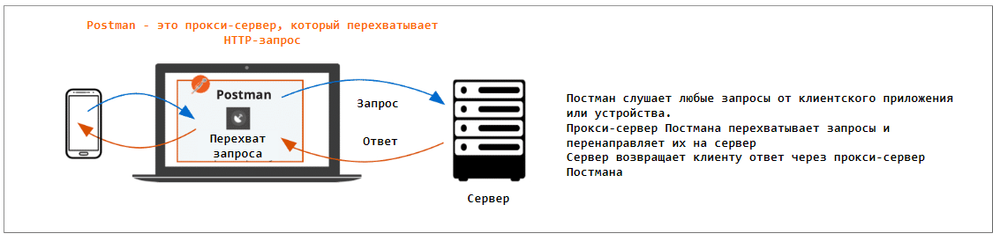

# 18 Веб-интерфейс пользователя — инструменты и тестирование
## Проблемы при тестировании веб-приложений делятся на следующие группы:
+ Элементы интерфейса располагаются в неправильных местах или отображаются некорректно
+ Некорректная работа или полный отказ логики программного клиента
+ Размер и (или) расположение элементов интерфейса сильно зависит от разрешения экрана
+ Приложение работает по-разному в разных веб-браузерах
+ Данные пользователя могут влиять на работу приложения (файлы cookie, локальное веб-хранилище)
+ Проблемы с сетевым соединением могут нарушить работу веб-интерфейса пользователя.
+ Нарушение логики взаимодействия между клиентом и сервером
## Набор инструментов DevTools
### Набор инструментов DevTools
+ Elements (элементы)
+ Console (консоль)
+ Sources (исходные файлы)
+ Network (сеть)
+ Application
+ Lighthouse
#### Elements (элементы)
Время от времени возникает необходимость проверить внешний вид пользовательского интерфейса с другой конфигурацией или с другими элементами, которые уже были добавлены в макеты, но не в тестовую среду. Проверка того, как будут выглядеть эти новые элементы, может помочь оценить правильность гипотезы, предложенной членами вашей команды:
+ на вкладке отображается исходный код HTML страницы в формате DOM
+ на вкладке присутствует указатель для быстрой навигации по дереву.
+ можно редактировать представление DOM: изменять атрибуты элементов, добавлять или удалять элементы и т. д. 
+ на вложенной вкладке Styles можно посмотреть весь применяемый код CSS. Отдельные настройки стиля можно включать, выключать и редактировать
+ можно изменять разрешения экрана, что упрощает такие задачи, как когда нужно выяснить, что произойдёт, если открыть приложение на мобильном устройстве
#### Console (консоль)
1. На вкладке Console есть возможность выполнять код JavaScript.
2. На вкладке Console показаны записи журнала JavaScript (предупреждения, сообщения об ошибках и другие). Записи журнала появляются
   1. если автор кода JavaScript предусмотрел такую возможность (обычно это делается с помощью методов объекта console: console.log(), console.warn(), console.error(), console.info()).
   2. Если во время выполнения кода JavaScript происходит исключение (ошибка), и это исключение не было обработано разработчиком с помощью конструкций try...catch, оно также будет отображено на вкладке Console. В противном случае на вкладке Console сообщения не появятся.
#### Sources (источники данных)
Вкладка Sources похожа на оглавление. В ней отображаются исходные файлы, составляющие веб-страницу. Файлы могут быть следующие: HTML, JavaScript, CSS, изображения и т. д. Есть возможность просматривать исходные файлы и сохранять их для дальнейшего изучения.
#### Network (сеть)
1. На этой вкладке регистрируется сетевая активность (запросы и ответы).
   1. Можно скопировать запрос и самостоятельно повторно отправить его. Например, выполнив Copy -> Copy as cURL и вставив скопированный текст в окно терминала можно выполнить его с помощью cURL. 
   2. На вкладке также показано время выполнения запроса, таким образом, можно обнаружить медленную работу сетевого соединения.
2. На этой вкладке можно изменять скорость связи по сети (дросселирование), чтобы тестировщик мог исследовать работу приложения в условиях «плохого Интернета»
#### Application
##### Cookies (куки) и Cache (кэш)
+ Cookies и Cache нужны для хранения некоторых данных о сайте и пользователе в специальном хранилище на клиенте. 
+ **Кэш** - это специальное хранилище, в котором сайт может сохранять данные (изображения, стили и т. д.), чтобы не загружать их каждый раз. Физически это часть памяти (память быстрого доступа, RAM), куда сайт может обратиться, чтобы получить эти сохраненные ресурсы. 
+ В **cookies** хранится информация о сеансе пользователя (например, сохраненный логин, предпочтения пользователя и т. д.). Сайт отправляет cookie с информацией о пользователе на сервер, а когда пользователь возвращается, сервер отправляет cookie обратно, и у пользователя сохраняется логин, введенный в поле входа, и товар, добавленный в корзину интернет-магазина.
+ Таким образом, основное отличие заключается в том, что в кэше хранятся данные сайта, а в куках - информация о сессии пользователя.
##### Очистка файлов cookie и кэш
Перед проведением большинства тестов полезно очистить куки и кэш (выполнить на вкладке Application -> Storage-> [Clear site data]):
+ Иногда куки и кэш могут вызывать проблемы на сайте. Если была развернута новая версия вашего приложения и изменена информация о сайте, вы не можете увидеть ее в локальном браузере, если сайт читал эти ресурсы из кэша. Таким образом, вы видите неправильную версию, и чтобы исправить это, нужно очистить кэш.
+ То же самое с файлами cookie. Информация о пользователе, сохраненная в cookies, может быть устаревшей (например, пароль был изменен или товар из корзины вашего интернет-магазина больше не существует в БД). Это может привести к проблемам и ложноотрицательным результатам тестирования. 
##### Редактирование локальных данных
На вкладке Application в пункте меню "Storage" пользователь может просматривать и редактировать данные, хранящиеся локально, а также cookies. Например можно изменить региональные настройки на лету или для изменения времени истечения срока файлов cookie, чтобы не пришлось ждать много дней.
## Прокси-серверы
Прокси-сервер (Proxy server) — это инструмент, исполняющий роль шлюза между сервером и клиентом. Все запросы и ответы проходят через прокси-сервер, поэтому можно отслеживать и изменять на лету всё, что отправляется и принимается.

Тестировщику такой «посредник» даёт возможность изучать обмен данными и, например, имитировать недопустимый ответ сервера.

### Примеры прокси-серверов
+ Charles
+ Fiddler
+ Postman

Для веб-приложений много информации можно получить из DevTools, но это сложно, если клиент веб-мобильный, и невозможно, если клиент - нативное мобильное приложение. В этом случае тестировщик не может анализировать трафик без прокси-сервера. 

### Функции прокси-сервера для тестирования веб-приложений
#### Перехват трафика между веб-приложением и Интернетом. 
Необходим для лучшего понимания работы приложения и локализации дефектов, описанных в главе о веб-интерфейсе приложений. 
#### Посмотреть, какие вызовы API идут и есть ли ошибки (как это можно сделать с помощью Network в DevTools).
Необходим для определения того, какой вызов API был отправлен и потенциально мог привести к ошибке на уровне представления. 
#### Поддержка SSL и HTTPS
Используется для перехвата не только HTTP-запросов, но и HTTPS, защищенных SSL-сертификатами. 
#### Может использоваться в качестве симулятора медленного интернет-соединения.
Необходима для тестирования производительности (в данной главе не рассматривается).
### Postman как прокси-сервер
Должна быть установлена десктопная версия Postman (веб-версия не поддерживает функциональность прокси-сервера). 

На рисунке ниже показано, как Postman работает в качестве прокси-сервера:

#### Настройка Postman как прокси-сервера для перехвата HTTP-запросы, исходящие от мобильного приложения
1. Экспорт корневого сертификата Postman
   1. Postman использует встроенный сертификат для перехвата HTTPS-трафика. Чтобы экспорировать и установить этот сертификат, выполните следующие шаги:
      1. Найти корневой сертификат Postman. Postman хранит корневой сертификат по умолчанию в своем каталоге данных. На вашем компьютере, найдите этот файл:
         1. Windows: C:\Users\<ваш_пользователь>\AppData\Roaming\Postman\proxy
         2. macOS: ~/Library/Application Support/Postman/proxy
         3. Linux: ~/.config/Postman/proxy
      2. Файл корневого сертификата будет иметь имя rootCA.pem.
2. Установка корневого сертификата на мобильное устройство
   1. Перенос сертификата:
      1. Перенесите файл rootCA.pem на ваше мобильное устройство с помощью USB, электронной почты или облачного хранилища.
   2. Установка сертификата:
      1. Откройте настройки вашего мобильного устройства.
      2. Найдите раздел "Безопасность" или "Экран блокировки и безопасность" (зависит от устройства).
      3. Выберите "Установить с хранилища" или "Установить сертификат" и найдите файл rootCA.pem.
      4. Следуйте инструкциям для установки сертификата.
3. Установка корневого сертификата в браузере Chrome
   1. Импорт сертификата:
      1. Откройте настройки Chrome.
      2. Прокрутите вниз и нажмите "Дополнительно".
      3. В разделе "Конфиденциальность и безопасность" выберите "Управление сертификатами".
      4. На вкладке "Доверенные корневые центры сертификации" нажмите "Импорт" и выберите rootCA.pem.
      5. Следуйте инструкциям мастера для завершения импорта.
4. Настройка прокси на мобильном устройстве
   1. Настройка Wi-Fi:
      1. Подключите мобильное устройство к той же Wi-Fi сети, что и ваш компьютер.
      2. Откройте настройки Wi-Fi и выберите активную сеть.
      3. В настройках сети выберите "Прокси" и установите его в "Ручной".
      4. Введите IP-адрес вашего компьютера и порт прокси, который вы настроили в Postman (например, 5555).
5. Запуск прокси-сервера в Postman
   1. Включение прокси:
      1. Откройте Postman.
      2. Перейдите в настройки (значок шестеренки) и выберите "Proxy".
      3. Включите опцию "Capture HTTPS traffic" и укажите порт (например, 5555).
6. Перехват запросов
   1. Запуск перехвата:
      1. В Postman откройте вкладку "Capture Requests" и начните захват.
      2. Отправьте запрос с мобильного устройства и проверьте, что запросы отображаются в Postman.
7. Следуя этим шагам, вы сможете настроить перехват HTTPS-запросов с мобильного устройства с использованием Postman.
#### Настройка Postman как прокси-сервера для перехвата HTTP-запросы, исходящие от браузера
Чтобы перехватывать HTTPS-запросы, установите расширение Postman Interceptor Extention для вашего браузера.
### Charles прокси
Charles Web Debugging Proxy - это кроссплатформенное приложение HTTP отладочного прокси-сервера, написанное на Java. Он позволяет пользователю просматривать трафик HTTP, HTTPS, HTTP/2 и разрешенный трафик TCP-портов, передаваемый с локального компьютера, на него или через него. Сюда входят запросы и ответы, включая HTTP-заголовки и метаданные (например, cookies, информация о кэшировании и кодировке), а также функциональность, направленная на помощь разработчикам в анализе соединений и обмена сообщениями.
### Сравнительная характеристика Charles и Postman в части проксирования 
<table>
    <tr>
        <th>Функциональность</th>
        <th>Postman</th>
        <th>Charles</th>
    </tr>
    <tr>
        <td>Проксирование</td>
        <td>Да, базовое</td>
        <td>Да, мощное и гибкое</td>
    </tr>
    <tr>
        <td>Модификация трафика</td>
        <td>Ограниченные возможности</td>
        <td>Широкие возможности модификации "на лету"</td>
    </tr>
    <tr>
        <td>SSL-проксирование</td>
        <td>Да, но требует установки сертификатов</td>
        <td>Да, с глубокой поддержкой и анализом</td>
    </tr>
    <tr>
        <td>Интерфейс</td>
        <td>Интуитивный, удобный</td>
        <td>Более сложный для новичков</td>
    </tr>
    <tr>
        <td>Анализ трафика</td>
        <td>Ограниченный</td>
        <td>Мощные инструменты для детального анализа</td>
    </tr>
    <tr>
        <td>Эмуляция медленных соединений</td>
        <td>Нет</td>
        <td>Да</td>
    </tr>
    <tr>
        <td>Интеграция с API</td>
        <td>Отлично подходит для тестирования и разработки</td>
        <td>Ограниченные возможности</td>
    </tr>
    <tr>
        <td>Совместная работа</td>
        <td>Поддержка совместного использования коллекций</td>
        <td>Нет встроенных возможностей для совместной работы</td>
    </tr>
    <tr>
        <td>Легкость освоения</td>
        <td>Легко освоить</td>
        <td>Может быть сложно для новичков</td>
    </tr>
</table>

## Инструменты для создания снимков экрана
В настоящее время существует множество таких средств, и нет необходимости описывать конкретное из них. Поэтому далее перечислены основные функции, которые должны быть предусмотрены в хорошем инструменте:
1. Создание снимка всего экрана.
2. Создание снимка окна.
3. Создание снимка выбранной области — это одна из наиболее часто используемых функций.
4. Прокрутка веб-страницы при создании снимка экрана. Некоторые страницы очень длинные, поэтому придётся прокручивать их вниз, чтобы добраться до нижней части
5. Добавление текста, заметок, стрелок поверх снимка экрана.

