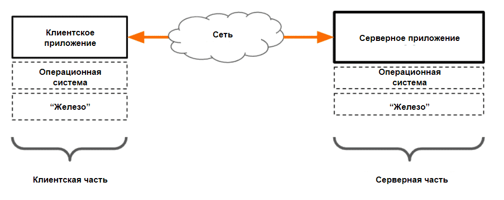
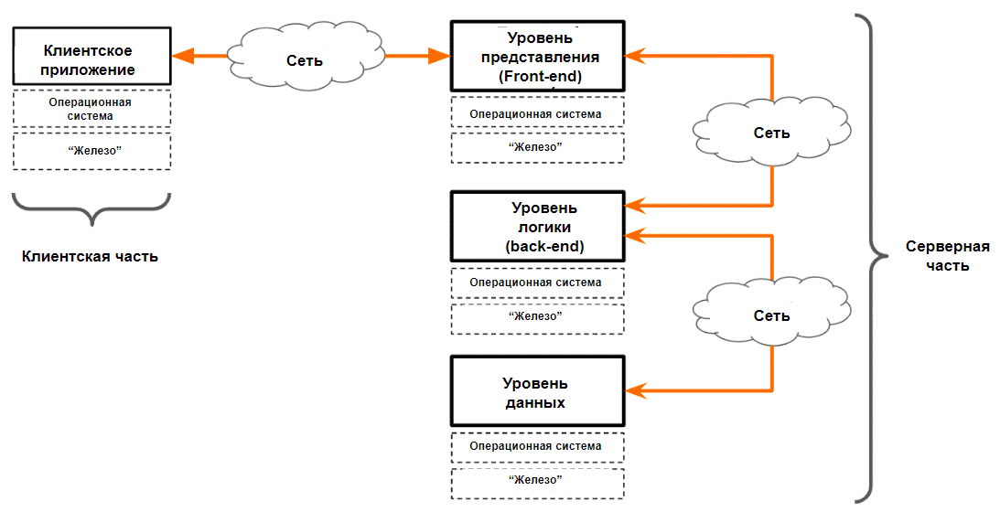
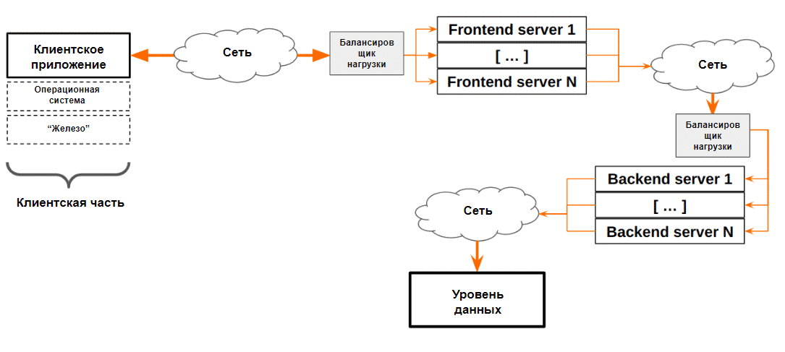
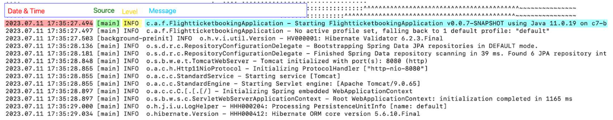
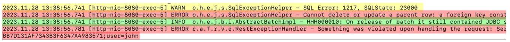

# 19 Архитектура серверного ПО
## 2-звенная архитектура
Большая часть современного ПО поддерживает работу с сетями и может работать как клиент или сервер, а порой выполнять и обе роли.



Серверная часть 2-звенного приложения взаимодействует только с:
+ Клиентами, подключающимися по сети
+ Операционной системой

Если клиентское и серверное приложения установлены на один и тот же хост - общение друг с другом осуществляется через виртуальный интерфейс `loopback` с IP-адресом `127.0.0.1`. Весь трафик, ищущий через этот интерфейс, остается внутри хоста и никогда не выходит во внешние сети.

Вне зависимости от архитектуры серверного приложения (2-х и более звенного) взаимодействие "клиент-сервер" может иметь вид "человек-машина" или "машина-машина". Это зависит от конкретных приложений и даже сценариев использования
### С точки зрения ОС серверные приложения работают со следующими объектами:
1. Файлы: хранение настроек, чтение / запись данных по запросу от пользователей, и т.п.
2. Сокеты: для открытия серверных портов на прослушивание с целью приема запросов от пользователей
3. Процессы: процесс-родитель может запустить дочерние процессы для обработки пользовательских запросов.
### С точки зрения сети, серверные приложения общаются с клиентами с помощью
1. Протоколов прикладного уровня, например HTTP, SMTP, POP3
2. Протоколов транспортного уровня типа TCP или UDP
### С точки зрения пользователя, нужно знать следующее:
1. Адрес сервера, порт и транспортный протокол.
2. Прикладной протокол для общения с сервером.
3. Имя и пароль (или такие учётные данные, как сертификат), если для работы с системой требуется вход и проверка подлинности.
### Примеры 2-звенных серверных приложений:
1. Файловые серверы.
2. FTP-серверы (похожи на файловые, но работают по другому прикладному протоколу).
3. Службы удаленного управления, например SSH и Remote Desktop.
4. Серверы баз данных (можно считать таковыми в простых случаях). Однако в более сложных конфигурациях, например с репликацией с ведущими и ведомыми серверами или распределённым хранилищем, базы данных являются N-звенными серверными приложениями.
### Возможные проблемы 2-звенных серверных приложений
#### На уровне операционной системы
ОС и ее настройки - наиболее частые причины возникновения проблем в 2-звенных серверных приложениях.
1. Отсутствующие объекты файловой системы: файлы, каталоги, символьные ссылки…
   1. Если кто-нибудь переместит или удалит их или отключит файловую систему, содержащую необходимые объекты, то приложение может даже не запуститься.
2. Некорректные настройки прав доступа к файлам, директориям и другим объектам операционной системы или приложения.
   1. Если прав недостаточно, то приложение не сможет получить доступ к этим объектам.
   2. Если же для конфиденциальных файлов (например, содержащих учётные данные) или директорий настроены слишком широкие права, то качественно спроектированное приложение остановит работу, обнаружив такие права при запуске.
3. Некорректно настроенные права пользователя для запуска приложения
   1. Например: некоторые приложения не допускают запуск со стороны администратора (root), другие же, наоборот, для запуска требуют права администратора или участие в определённой группе.
4. Ошибочная настройка самого приложения, например: неверный формат файла настройки, указана неподдерживаемая или конфликтующая опция настройки, и т.п.
5. Конфликты, связанные с портами.
   1. Если нужный порт уже используется другим процессом, то приложение не сможет запуститься.
6. Недостаточное дисковое пространство для размещения временных файлов или файлов, запрошенных пользователем.
7. Нехватка оперативной памяти: в случае перегрузки сервера и исчерпания оперативной памяти операционная система может завершить работу некоторых приложений или по крайней мере отказаться выделить запрошенную приложением память.
8. Новые нестабильные компоненты либо конфликтующие компоненты, появившиеся в окружении (обновления ОС, сторонние программные компоненты).
9. Что-либо иное, например временные файлы, оставшиеся от предыдущего аварийного завершения работы приложения.

**PS** *Высокая загрузка центрального процессора или системы ввода-вывода (диски, сеть) не может в большинстве случаев привести к остановке приложения, но наверняка замедлит его работу.*
#### На уровне сети
На уровне сети доступу пользователя к серверному приложению могут помешать:
1. Проблемы с маршрутизацией, когда сообщения клиента не достигают сервера.
2. Проблемы, связанные с системой DNS, когда пользователь обращается к серверу посредством полного доменного имени.
3. Межсетевой экран, блокирующий прохождение пакетов (может быть настроен на любом узле: клиент, сервер, маршрутизатор между ними).
4. Перегруженные сегменты сети на стороне клиента или сервера.
#### Проблемы на стороне клиента
1. Неподдерживаемый тип или версия клиентского приложения.
   1. Например, веб-сайт, разработанный для Chrome, Firefox и Safari, может некорректно работать с Edge.
2. Неподдерживаемое или некорректное действие пользователя.
3. Некоторое ПО, обеспечивающее безопасность, препятствует работе пользователя с сервером.
4. Какие-либо настройки клиентского ПО мешают работе конкретно с этим сервером.
5. Если на сервере необходимо залогиниться, пользователь может ввести неверное имя учетной записи или пароль.
6. Пользователю запрещено что-либо делать на этом сервере.
## 3-звенные приложения
1. Уровень представления (`Presentation Layer`, `Frontend`) включает пользовательские интерфейсы (UI), такие как веб-страницы, мобильные приложения или десктопные приложения:
   + **Отвечает** за взаимодействие с пользователем.
   + **Выполняет** — отображение данных пользователю и обработка ввода пользователя.
2. Уровень логики приложения или уровень бизнес-логики(`Application Logic Layer`, `Backend`, `Business Logic Layer`) является отдельным приложением, написанным на PHP, Java, Python, Node.js или другом языке:
   + **Отвечает** за обработку бизнес-логики приложения.
   + **Выполняет** обработку данных, вычисления, обработку логики принятия решений, управление транзакциями.
   + **Взаимодействует** как с уровнем представления, так и с уровнем данных, но не напрямую с пользователем.
3. Уровень данных (`Data Layer`) обычно является базой данных (NoSQL и реляционной: MySQL, PostgreSQL, Oracle, MS SQL) или другими системами хранения данных:
   + **Отвечает** за хранение, управление и доступ к данным.
   + **Выполняет** операции с данными, такие как запросы, обновления, удаления и их чтение, и предоставляет данные для уровня логики приложения.



### Различия между 2-х и 3-звенными приложениями:
1. Несколько серверных приложения вместо одного.
2. Эти серверные приложения можно развернуть на отдельных узлах, связанных через сеть.
   1. При необходимости их можно установить на один компьютер — это распространённый вариант для небольших веб-порталов.
3. Каждый уровень рассматривается как отдельное приложение, для которого возможны соответствующие причины отказа [(см. выше)](###возможные-проблемы-2-звенных-серверных-приложений).
4. У баз данных (БД) могут быть свои собственные точки отказа, описанные ниже.
   1. Второе звено (`Application Logic Layer`, `Backend`, `Business Logic Layer`) подключается к СУБД и проходит проверку подлинности, используя своё отдельное имя пользователя и пароль (или сертификат), указанные в файлах конфигурации, — то есть оно действует как клиент БД. Поэтому оно одновременно исполняет роль сервера для `Presentation Layer`, и клиента для БД (`Data Layer`)
   2. Непосредственно БД недоступна для конечного пользователя, поскольку, во-первых, в этом нет необходимости, а во-вторых, в БД могут содержаться конфиденциальные данные других пользователей, и для таких данных нужна максимально возможная защита. По этой причине с БД должно работать только приложение верхнего уровня.
### Примеры 3-звенных приложений:
+ Большинство интернет-форумов и CMS типа WordPress. Для небольших веб-сайтов оба компонента часто устанавливают на одном хосте.
+ Многие онлайн-игры: игровой клиент отвечает за UI-часть, а сервер производит анализ данных, вычисления, защиту от ботов, а также взаимодействует с СУБД.
+ Сложные серверы электронной почты.
### Возможные проблемы 3-звенных приложени
Каждый из трёх компонентов 3-звенных приложений может столкнуться с проблемами, характерными для 2-звенных приложений [(см. выше)](###возможные-проблемы-2-звенных-серверных-приложений). Ниже приведены дополнительные риски, вызванные усложнением архитектуры:
#### Проблемы на сетевом уровне (подключение верхнего звена к нижнему)
1. Связь между любыми двумя компонентами 3-звенных приложений может нарушиться из-за проблем с маршрутизацией, DNS, межсетевыми экранами *(однако чаще всего они устанавливаются на одном узле или находятся в одной локальной сети)*.
2. Связь между вторым звеном (`Application Logic Layer`, `Backend`, `Business Logic Layer`) и БД (`Data Layer`)может также нарушиться из-за неправильной конфигурации приложения, взаимодействующего с СУБД, например: IP-адрес или полное доменное имя сервера БД, некорректные учётные данные для подключения к БД, неверное название БД и т. д.
#### Проблемы на уровне БД (`Data Layer`)
1. Учётные записи СУБД, применяемые вышестоящим уровнем, могут быть заблокированы.
2. Их пароли могут быть изменены без соответствующей перенастройки приложения верхнего уровня.
3. Права пользователей в отношении приложения верхнего уровня могут быть изменены или аннулированы, и необходимые данные тогда станут недоступны для чтения и (или) записи.
4. Согласованность данных может быть нарушена, например, когда соответствующие таблицы или записи изменяются другими средствами (представьте, что администратор БД допустил ошибку).
### Преимущества 3-х звенной архитектуры перед 2-звенной:
+ Поддержка "тонких клиентов", как следствие - проще поддерживать весь спектр клиентских устройств 
+ Более простая поддержка серверных частей приложения. *Когда нужно лишь немного поправить интерфейс пользователя, то это не затрагивает остальные компоненты.*
+ Большая масштабируемость. *По мере роста компании можно добавлять новые серверы на каждом звене, особенно когда применяется балансировка нагрузки.*
+ Большая защищенность (фильтрация данных от пользователя, не пропуская SQL-инъекции и пр)



*Для приложений, работающих с высокой нагрузкой, часто применяются балансировщики нагрузки, которые распределяют входящие запросы между соединёнными серверами, так чтобы каждый новый пользователь направлялся к определённому серверу.*

### Виды клиентского ПО:
#### "Тонкий клиент"
Задача "тонкого клиента" (например, браузера) - отобразить интерфейс, полученный от сервера, и дать пользователю возможность что-то туда ввести: 
1. "Тонкий клиент" чаще всего не умеют работать в оффлайн-режиме.
2. "Тонкие клиенты" гораздо проще в реализации, что дает возможность сравнительно легко поддержать множество видов клиентских устройств и операционных систем.
#### "Толстый клиент"
"Толстый клиент" - приложения с функциональностью гораздо большей, чем может быть реализовано в "тонком клиенте".
1. "Толстый клиент" не является универсальным (как браузер) и умеет работать только с определенной серверной частью, всего по одному или нескольким прикладным протоколам.
2. Классические примеры:  клиенты онлайн-игр, почтовые клиенты (MS Outlook, Mozilla Thunderbird). Что касается последних: доступ к почте можно получить и через браузер (применив "тонкий клиент") или с помощью Outlook / Thunderbird ("толстый клиент").

*Чаще оказывается проще и дешевле создать более сложное 3-звенное серверное приложение с поддержкой множества тонких клиентов, чем иметь 2-звенное серверное приложение и разрабатывать соответствующие "толстые" клиенты для каждого типа клиентских узлов и ОС.*

В зависимости от архитектуры И клиентского, И серверного ПО, термины "Тонкий клиент" и "Толстый клиент" могут иметь различное значение:

1. **Фронтэнд**: приложение, отвечающее за пользовательский интерфейс (UI). "Толстые клиенты" реализуют эту функциональность самостоятельно, однако "тонкие клиенты" требуют наличия серверного Фронтэнд-компонента.
2. **Бэкэнд**: часто этим словом называют ВСЮ серверную часть (независимо от количества звеньев). Однако для 3-звенной архитектуры этот термин имеет специальное более узкое значение, что поясняется ниже.

**Тестирование Фронтэнд-компонентов**: в основном включает в себя только тестирование *UI*, *usability testing*, плюс *регрессионное тестирование* - рутинными задачами, в основном связанными с пошаговым исполнением тест-кейсов.

**Тестирование Бэкэнд-компонентов**:  состоит из задач, связанных с логикой приложения, взаимодействием компонентов и обработкой данных. Часто за тестирование Бэкэнда отвечают только разработчики, что приводит к большому количеству долго живущих и сложно выявляемых багов. Поэтому, тестирование бэкэнда - отличный способ улучшить качество всего продукта.
### Защита данных 
1. Пользователи не должны иметь прямого доступа к СУБД. Хорошая практика - ограничение внешнего доступа к СУБД с помощью межсетевого экрана, разрешив его только с бэкэнд-сервера и рабочих мест администраторов БД.
2. Фронтэнд 3- и N-звенных приложений не должен иметь прямого доступа к СУБД. (Для его задач это просто не нужно).
3. Пользователи не должны иметь прямого доступа к бэкэнд N-звенных приложений (Пользователи должны работать только с компонентом фронтэнда).
## Журналы событий
**Журналирование** ("логирование") - функциональность, позволяющая отслеживать поведение и состояние приложения (как штатные операции, так и возникающие по ходу работы ПО ошибки). Назначение журналирования:
1. Идентификация проблем.
2. Поиск причины неисправности (`Root Cause Analysis`): на основе текста сообщений об ошибках, метки времени (`timestamps`) и прочей информации в журналах.
3. Создание качественных тест-кейсов: при написании тест-кейсов, особенно для серверного ПО, полезно указывать, какие события стоит ожидать в журналах при проведении той или иной операции. Такие подробности также очень сильно облегчают автоматизацию тестирования.
4. Интеграционное тестирование: понимание событий из журналов заметно упрощает интеграционное тестирование системы, состоящей из множества  взаимодействующих компонентов.
5. Мониторинг и тестирование производительности: получение метрик быстродействия производится на основании журналов событий ПО.
6. Совместная работа с техническими специалистами ПО (разработчиками, техподдержкой): повышают эффективность взаимодействия с техническими специалистами, как за счет точного определения причин возникновения багов на основе информации журналов, как и благодаря возможности получения точной информации про успешное устранение проблемы.
7. Тестирование безопасности: зачастую журналы событий ПО содержат крайне ценную информацию о различных событиях безопасности (например, вход пользователя в систему), которая не может быть получена откуда-либо еще.
### Уровни событий (log level / severity)
Ниже приведены уровни событий стандарта системы логирования `Syslog`, используемой в `Unix`-подобных операционных системах *(Уровни событий указаны по убыванию важности)*
#### Emergency (emerg)
Уровень **Emergency** указывает на наиболее критичные события, которые означают, что система или приложение находятся в крайне нерабочем состоянии. Сообщения этого уровня свидетельствуют о фатальных проблемах, которые требуют немедленного вмешательства для восстановления нормального функционирования системы или приложения. В большинстве случаев такие события требуют незамедлительного реагирования, так как они могут привести к полной остановке или серьезному нарушению работы.
##### В операционных системах:
В Unix-подобных системах (например, Linux, BSD), уровень **Emergency** предназначен для записи чрезвычайно критичных событий, которые делают систему непригодной для использования или требуют немедленных действий:
+ Критические сбои ядра операционной системы.
+ Потерю важных системных ресурсов (например, сбой файловой системы).
+ Неустранимые ошибки в системных службах, которые приводят к остановке их работы или всей системы.

В таких случаях сообщения с уровнем Emergency обычно записываются в системные журналы (например, `/var/log/syslog` или `/var/log/messages` в Linux) и могут быть переданы на консоль администратора или даже инициировать автоматические действия (например, перезагрузку системы).
##### В программном обеспечении:
В программном обеспечении уровень **Emergency** используется для указания на критические ситуации, которые требуют немедленного внимания и действий:
+ Серверные приложения: В веб-серверах, базах данных и других критически важных серверных приложениях уровень **Emergency** используется для записи событий, которые могут привести к полному выходу из строя приложения или к непредвиденным сбоям. Например, если сервер теряет доступ к критически важным ресурсам, таким как сеть или база данных, это может быть зарегистрировано как событие **Emergency**.
+ Встроенные системы и системы реального времени (RTOS): В таких системах уровень Emergency может указывать на события, которые требуют немедленной остановки системы для предотвращения повреждения оборудования или безопасности пользователя. Например, в авионике или медицинских устройствах.
+ Бизнес-приложения и фреймворки: В корпоративных приложениях, таких как системы управления предприятием (ERP) или системы обработки транзакций (например, банковские системы), уровень **Emergency** может использоваться для сигнализации о серьезных сбоях в обработке данных или потерях данных, которые могут повлиять на бизнес-операции.
#### Alert
Уровень логирования **Alert** используется для указания на серьезные события, которые требуют немедленного внимания, но не обязательно означают, что система или приложение находятся в нерабочем состоянии. Уровень **Alert** находится чуть ниже **Emergency** и указывает на события, которые могут привести к критическим проблемам, если не будут быстро устранены. Этот уровень используется как в операционных системах, так и в программном обеспечении.
##### В операционных системах:
В операционных системах уровень **Alert** применяется для регистрации событий, которые требуют немедленного вмешательства, но не приводят к немедленному выходу системы из строя:
+ Угрозы безопасности: Например, обнаружение попыток несанкционированного доступа или использования уязвимостей.
+ Неожиданное поведение критических системных процессов: Системные демоны или службы, которые начинают работать нестабильно, но система в целом еще работает.
+ Истощение важных ресурсов: Например, нехватка свободного места на критически важном разделе диска или исчерпание оперативной памяти, что может привести к отказу работы системы, если не будет решено.

*Операционные системы могут автоматически уведомлять администратора или инициировать скрипты или процессы восстановления для устранения ситуации.*
##### В программном обеспечении:
В программном обеспечении уровень **Alert** также используется для сигнализации о событиях, которые требуют немедленного вмешательства, чтобы предотвратить потенциальные сбои или проблемы:
+ Серверные приложения: Например, если веб-сервер не может подключиться к необходимой внешней службе (например, к базе данных), это может быть зарегистрировано как событие уровня **Alert**. Сервер может продолжать работу, но без быстрого восстановления могут возникнуть более серьезные проблемы.
+ Встраиваемые системы и системы реального времени (RTOS): Если один из сенсоров обнаруживает аномальные данные, но система еще работает стабильно, это может быть зафиксировано как **Alert**. Это позволит оператору или системе принять превентивные меры.
+ Бизнес-приложения и фреймворки: Например, в финансовых приложениях событие уровня **Alert** может быть зафиксировано, если обнаружен сбой в процессе обработки платежей, что требует немедленного вмешательства, чтобы избежать нарушений обслуживания.
#### Critical (crit)
Уровень логирования **Critical** предназначен для указания на критические события, которые сильно влияют на функциональность системы или приложения, но не обязательно делают их полностью неработоспособными. Эти события требуют немедленного внимания, так как могут привести к серьезным последствиям, если не будут устранены вовремя.
##### В операционных системах:
В операционных системах уровень **Critical** используется для регистрации событий, которые серьезно нарушают работу системы, но не останавливают её полностью:
+ Серьезные сбои подсистемы: Например, сбой в работе подсистемы ввода-вывода или драйвера, что вызывает нарушение в работе определенного компонента, но не приводит к остановке всей системы.
+ Отказ критически важного сервиса или службы: Например, отказ службы DNS или DHCP, что влияет на сеть, но не полностью останавливает работу сервера.
+ Проблемы с безопасностью: Обнаружение серьезной уязвимости или инцидента безопасности, который требует немедленного исправления, чтобы предотвратить возможные атаки или утечки данных.

*События уровня **Critical** могут быть зарегистрированы в системных журналах (например, `/var/log/syslog` или `/var/log/messages` в Linux) и обычно требуют вмешательства системного администратора для устранения проблемы.*
##### В программном обеспечении:
В программном обеспечении уровень **Critical** используется для указания на события, которые серьезно нарушают работу приложения или сервиса и требуют немедленного вмешательства:
+ Отказ в критических функциях приложения: Например, в веб-приложении отказ основного компонента аутентификации или базы данных, что делает невозможным выполнение важных операций, но само приложение продолжает работать.
+ Серьезные ошибки обработки данных: Например, в приложении для финансовой отчетности ошибка в расчете, которая может привести к неверным данным, что требует немедленного исправления.
+ Нарушение целостности данных: Например, повреждение файлов или базы данных, что угрожает целостности данных и требует немедленных мер для восстановления или предотвращения потерь.
#### Error (err)
Уровень логирования **Error** используется для указания на ошибки или проблемы, которые препятствуют нормальной работе системы или приложения, но не являются фатальными. Ошибки, зарегистрированные на этом уровне, требуют внимания, поскольку они могут повлиять на функциональность, производительность или стабильность системы, но обычно не приводят к немедленному прекращению работы.
##### В операционных системах:
В операционных системах уровень **Error** используется для регистрации событий, которые указывают на сбои или проблемы, требующие внимания администратора, но не приводят к немедленному выходу системы из строя:
+ Отказ или сбой периферийного оборудования: Например, ошибка в работе драйвера принтера или сканера, которая мешает их нормальной работе, но не влияет на основные функции операционной системы.
+ Сбой при выполнении команды или процесса: Например, ошибка при запуске пользовательского процесса, который завершился с ошибкой, или сбой при загрузке модуля ядра.
+ Ошибки в файловой системе: Например, неудачное удаление файла или невозможность монтирования файловой системы, что требует вмешательства для восстановления нормальной работы.

*Эти события обычно записываются в системные журналы (например, `/var/log/syslog` в Linux или Event Viewer в Windows) и требуют вмешательства администратора для устранения проблемы.*
##### В программном обеспечении:
В программном обеспечении уровень **Error** используется для регистрации ошибок, которые препятствуют нормальному функционированию приложения или компонента, но не приводят к его полной неработоспособности:
+ Ошибки при обработке данных: Например, неудачная попытка выполнения транзакции в базе данных или ошибка парсинга данных, которая приводит к неполной обработке, но не останавливает работу всего приложения.
+ Ошибка при подключении к внешнему сервису: Например, ошибка подключения к API или внешнему серверу, что приводит к сбою в выполнении определенной функции, но не останавливает приложение.
+ Невозможность выполнения операции из-за нехватки ресурсов: Например, ошибка при попытке выделения памяти, которая приводит к сбою выполнения конкретной задачи, но не завершает работу программы.
#### Warning (warn)
Уровень логирования **Warning** используется для регистрации предупреждений о потенциальных проблемах или аномалиях, которые не являются непосредственными ошибками, но могут указывать на возможные проблемы в будущем. Сообщения уровня **Warning** сигнализируют о событиях, которые требуют внимания, но не блокируют или не нарушают текущую работу системы или приложения.
##### В операционных системах:
В операционных системах уровень **Warning** используется для регистрации событий, которые могут указывать на потенциальные проблемы, но не приводят к непосредственному сбою или нарушению работы системы:
+ Истощение ресурсов: Например, предупреждение о нехватке свободного места на диске или низком уровне свободной памяти, что может повлиять на производительность, но не вызывает немедленных сбоев.
+ Доступ к устаревшим компонентам: Например, использование устаревших или устаревающих API, что может быть исправлено в будущем обновлении.
+ Проблемы с конфигурацией: Например, предупреждение о неполной или некорректной конфигурации системного параметра, который не мешает текущей работе, но может вызвать проблемы в будущем.

*Эти предупреждения обычно записываются в системные журналы (например, `/var/log/syslog` в Linux или Event Viewer в Windows) и помогают системным администраторам предугадывать и предотвращать потенциальные проблемы.*
##### В программном обеспечении:
В программном обеспечении уровень **Warning** используется для регистрации событий, которые могут указывать на проблемы или нестабильность, но не являются критическими:
+ Предупреждения о неправильных данных: Например, если приложение получает данные в неожиданном формате, это может быть зарегистрировано как предупреждение, чтобы разработчики могли исправить формат данных.
+ Использование устаревших функций: Например, использование функций или методов, которые будут удалены в будущих версиях библиотеки или фреймворка, что сигнализирует о необходимости обновления кода.
+ Проблемы с производительностью: Например, предупреждение о снижении производительности из-за высокой нагрузки или неоптимальных операций, что требует внимания для предотвращения ухудшения производительности.
#### Notice
Уровень логирования **Notice** используется для регистрации событий, которые представляют собой информацию о значимых, но не критичных событиях в системе или приложении. Эти события не указывают на ошибки или проблемы, но могут быть полезны для мониторинга и анализа работы системы.
##### В операционных системах:
В операционных системах уровень **Notice** используется для записи информации о событиях, которые являются значимыми, но не указывают на ошибки или проблемы:
+ Изменения конфигурации: Например, успешное применение новых конфигурационных параметров или обновлений.
+ Запуск или остановка служб: Например, уведомление о запуске новой службы или успешном завершении работы службы.
+ Системные события: Например, информация о регулярных задачах, таких как выполнение плановых резервных копий или обновлений системы.

*Эти уведомления обычно записываются в системные журналы (например, `/var/log/syslog` в Linux) и предоставляют информацию, полезную для администраторов и пользователей.*
##### В программном обеспечении:
В программном обеспечении уровень **Notice** используется для регистрации значимых информационных событий, которые могут быть полезны для мониторинга или отладки, но не указывают на проблему:
+ Обновления и изменения в приложении: Например, успешное обновление или изменение состояния приложения, которое не требует немедленного вмешательства.
+ Информация о выполнении задач: Например, уведомление о завершении длительной операции или обработке данных, которая успешно выполнена.
+ Статус выполнения операций: Например, информация о том, что операция выполнена успешно, но не требует дальнейшего действия или проверки.
#### Informational (info)
Уровень логирования **Informational** используется для записи общих информационных сообщений, которые предоставляют сведения о нормальной работе системы или приложения. Эти сообщения не указывают на проблемы или ошибки, а просто документируют выполнение стандартных операций или предоставляют контекстную информацию, полезную для мониторинга и анализа.
##### В операционных системах:
В операционных системах уровень **Informational** используется для записи событий, которые являются частью нормального функционирования системы:
+ Запуск и завершение задач: Например, успешный запуск или завершение задач планировщика или служб.
+ Статус обновлений: Например, информация о выполнении обновлений системы или установке новых пакетов.
+ Информационные сообщения от системы: Например, информация о системных ресурсах, таких как загрузка процессора или использование памяти, если эти данные предоставляются для мониторинга.

*Эти сообщения обычно записываются в системные журналы (например, `/var/log/syslog` в Linux) и помогают администраторам и пользователям отслеживать обычные операции и состояние системы.*
##### В программном обеспечении:
В программном обеспечении уровень **Informational** используется для регистрации сообщений, которые предоставляют контекстуальную информацию о работе приложения, но не указывают на проблемы:
+ Информация о выполнении операций: Например, сообщение о том, что пользователь успешно вошел в систему или завершил выполнение определенной операции.
+ Статистика и метрики: Например, информация о времени выполнения задачи или объеме обработанных данных.
+ Стандартные уведомления: Например, информация о том, что приложение успешно запустилось или завершило работу без ошибок.
#### Debug
Уровень логирования **Debug** предназначен для записи подробной информации, которая используется в основном для отладки и анализа системы или приложения. Эти сообщения предоставляют детализированные данные о внутреннем состоянии и поведении системы или приложения, что может помочь разработчикам и администраторам в идентификации и устранении проблем.
##### В операционных системах:
В операционных системах уровень **Debug** используется для записи детализированных сообщений, которые могут помочь в диагностике и отладке проблем:
+ Подробные данные о процессах и задачах: Например, информация о внутреннем состоянии процессов, их потоках и ресурсах, которые они используют.
+ Информация о системных вызовах: Например, детализированные записи о системных вызовах и их результатах, что может помочь в отладке взаимодействия между приложениями и ядром операционной системы.
+ Отладочные сообщения от драйверов и модулей: Например, информация от драйверов устройств или системных модулей, которая помогает в выявлении проблем с оборудованием или взаимодействием.

*Эти сообщения часто записываются в системные журналы (например, `/var/log/syslog` в Linux), но могут быть включены только в режиме отладки или для конкретных разработческих целей.*
##### В программном обеспечении:
В программном обеспечении уровень **Debug** используется для записи информации, которая помогает разработчикам и администраторам понять внутренние процессы и поведение приложения:
+ Трассировка выполнения кода: Например, запись о входе и выходе из функций, выполнении циклов и условных операторов.
+ Значения переменных и состояния: Например, информация о значениях переменных в разные моменты времени, что помогает выявить проблемы в логике программы.
+ Пошаговое выполнение: Например, запись о каждом шаге выполнения определенных алгоритмов или операций, что позволяет детально отслеживать их выполнение.

*Примечание:*
1. Почти всегда у современного ПО есть события уровней `DEBUG` и `TRACE` (часто используется в других системах логирования и отладки, таких как `Log4j` или `SLF4J` в `Java`, где он обозначает еще более детализированные сообщения, чем `DEBUG`), которые не сохраняются в журналы при настройках по умолчанию. Их включение на продуктивных высоконагруженных системах  может привести к замедлению работы ПО и гигантским размерам журналов, однако это окажется крайне полезным при установлении причин возникновения бага.
2. `Windows` использует `Event Logs`, которые разделены на несколько категорий: `Application`, `Security, System`, и другие. Каждый из этих журналов хранит соответствующие записи о событиях с различными уровнями серьезности (`Critical`, `Error`, `Warning`, `Information`, `Verbose`).
3. `macOS` использует `Unified Logging System` (Объединенная система журналирования), которая была представлена в `macOS` `Sierra`. Уровни событий в `macOS` `Unified Logging`: `Fault`, `Error`, `Default`, `Info`, `Debug`. macO`S поддерживает логи на разных уровнях детализации, что позволяет системным администраторам и разработчикам более точно контролировать, какие сообщения записываются.
### Формат событий
Формат событий зависит от конкретного приложения, но считается хорошей практикой указывать в событиях следующие ключевые поля:
1. Метку времени (`timestamp`) - когда конкретно произошло это событие.
2. Уровень (`log level` / `severity`) - насколько это событие было важно, см. уровни [`Emergency` ... `Debug` из описания выше](###уровни-событий-(log-level-/-severity)). Помогает найти и отфильтровать нужные события в журналах.
3. Источник события - "как зовут" тот компонент, который отправил это сообщение. В сообщениях `syslog`, относящихся к работе ОС (не прикладного ПО) эту сущность обычно называют `facility` (категория). `facility` используется для классификации сообщений журнала на основе их источников или назначения. Это помогает различать сообщения, поступающие от различных компонентов системы. Вот некоторые примеры фасилити в Syslog:
   1. `kern`: сообщения от ядра
   2. `user`: сообщения от пользовательских приложений
   3. `mail`: сообщения от почтовой системы
   4. `daemon`: сообщения от системных демонов
   5. `auth`: сообщения об аутентификации и безопасности
   6. `syslog`: сообщения, сгенерированные самим демоном syslog
   7. `cron`: сообщения от планировщика задач (cron)
   8. `local0-local7`: локально определенные `facility` для пользовательских нужд
4. Сообщение: текст, описывающий суть события. Должно быть достаточно подробным для понимания теми, кому оно предназначено.
5. События могут включать в себя множество иной информации, например: ID транзакций; идентификаторы процессов ОС; имена пользователей, от лица которых была инициирована соответствующая операция; сведения о системе - как клиента (ОС, версия клиентского ПО, ...), так и сервера; текст HTTP-запросов и их заголовки; коды ответа сервера (если применимо); иные метрики.
### Место хранения журналов событий
Вся логика работы с событиями (какие из них записывать, а какие нет, куда их сохранять), специфична для каждого конкретного приложения:
1. В самом простом случае приложение может писать свои события прямо в терминал. Многие серверные приложения также можно запустить со специальными отладочными опциями командной строки для отображения событий в терминал, однако в продуктивных (НЕ тестовых) средах такое не встречается.
2. В самом часто встречаемом случае события записываются в определенный файл(-ы). Файл, чаще всего, представляет собой простой текст.
3. В более сложных случаях ПО передает свои события "под запись" компонентам операционной системы. Для Linux такими компонентами ОС могут быть:
   1. `syslog` и его разновидности. События чаще всего сохраняются в простые текстовые файлы, хотя бывают и исключения из этого правила.
   2. `journald` - подсистема журналирования сервисов `systemd`. Для получения событий применяется команда `journalctl`. Такой пример приведен ниже.
4. В самых сложных случаях события передаются в централизованное хранилище и хранятся в специальных "местах", например в отдельной базе данных.
### Что еще важно знать о журналах событий:
1. И клиентские, и серверные приложения могут писать журналы событий.
2. Приложения, как правило, позволяют настраивать уровни сообщений, которые пишутся в логи. Так, в продуктивных системах из-за проблем быстродействия и размеров логов чаще всего записываются только важные события, т.е. начиная с уровня `Notice` или даже `Warning`. В тестовых средах не редкость сохранение всех событий, т.е. начиная с `Debug`.
3. Логи подвергаются т.н. "ротации": старые файлы удаляются по прошествии какого-то времени, новые записываются. Предельный размер каждого лог-файла чаще всего можно настроить.
4. Приложение пишет свои логи в том формате, в котором считает нужным. Иногда этот формат можно настроить.
5. Как конкретно настраиваются уровень, ротация и (если возможно) формат событий, зависит от каждого конкретного приложения. Более того, в многозвенном приложении каждый его компонент может писать логи в своем формате, в свои отдельные файлы, с различными параметрами ротации. Информацию о настройках журналирования стоит выяснить у разработчиков / аналитиков / команды DevOps.
### Примеры работы с журналами событий
#### Пример 1. 
Получить ВСЕ про события некоего приложения FTB

`journalctl -u java-ftb.$USER --utc --all`, где:

+ `journalctl`: утилита для просмотра журналов и сообщений, собранных системой `systemd`.
+ `-u `: указывает на конкретный юнит (службу), логи которой вы хотите посмотреть. В данном случае это `java-ftb.$USER`, где `$USER` — переменная, которая заменяется на имя текущего пользователя.
+ `--utc`: выводит время в логах в формате UTC (координированное всемирное время).
+ `--all`: выводит все данные, включая возможные длинные строки, которые могли быть обрезаны.

Пример ответа на запрос:



Часть событий приложения FTB



Более поздние события приложения FTB с ошибками

#### Пример 2.

Далеко не всегда проблему можно установить только по сообщениям уровня WARN, ERROR или CRITICAL.

```console
boat-reskin-1    | 2023-11-29 13:02:24,239 INFO Set uid to user 0 succeeded
boat-reskin-1    | 2023-11-29 13:02:24,241 INFO supervisord started with pid 1017
boat-wtp-1       | The compiled services file has been removed.
boat-reskin-1    | 2023-11-29 13:02:25,249 INFO spawned: 'php' with pid 1019
boat-wtp-1       | 2023-11-29 13:02:25,400 INFO Set uid to user 0 succeeded
boat-wtp-1       | 2023-11-29 13:02:25,405 INFO supervisord started with pid 1049
boat-mysql-1     | 2023-11-29T13:02:25.821375Z 8 [Note] Access denied for user 'boat'@'%' to database 'reskin'
boat-mysql-1     | 2023-11-29T13:02:25.839037Z 9 [Note] Access denied for user 'boat'@'%' to database 'reskin'
```

Здесь нет ни одного сообщения уровня ERROR или выше, однако при внимательном просмотре можно обратить внимание на следующее: `Access denied for user 'boat'@'%' to database 'reskin'`. Такое событие говорит о том, что пользователь "boat" не может войти в базу данных "reskin". Возможно, это ошибка настройки СУБД. При составлении баг-репорта в него необходимо включить это сообщение.
## *Примечание. Software-инженер*
Понимание архитектуры приложений и всех сопутствующих технологий серверного ПО - одно из ключевых отличий между "типичным" тестировщиком и Software-инженером.

**Software-инженеры** хорошо понимают каждый участок разрабатываемого ПО и могут эффективно работать не только с UI. Они могут заметно улучшить существующие тест-кейсы, документацию, и качество продукта в целом.

