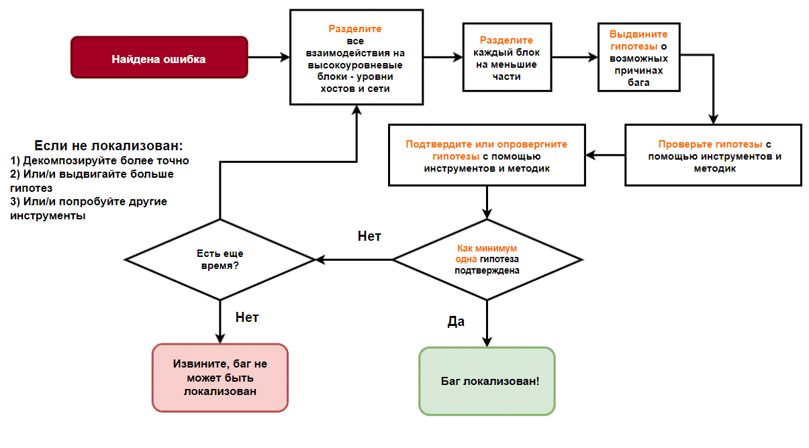

# 20 Принципы локализации дефектов
## Первопричина (Root cause)
**Первопричина** (**Root cause**): точная причина, которая привела к возникновению ошибки. Точное определение первопричины — непростая задача, поскольку она может считаться выполненной, только когда дефект полностью исправлен. Если дефект больше не проявляется, значит, первопричина определена верно. Поэтому в большинстве случаев у тестировщика нет возможности найти первопричину, и вместо этого выполняется локализация дефекта.
## Локализация (Localization)
**Локализация** (**Localization**): процесс поиска возможной первопричины. Верно выполненная локализация кардинально сокращает время, затрачиваемое на устранение дефекта, поскольку: 
+ устранение дефекта поручается именно той команде разработчиков, которая и должна заниматься этим типом дефектов; 
+ команда получает нужную информацию и поэтому знает, что нужно сделать. 
## Поиск неисправностей (Troubleshooting)
**Поиск неисправностей**  (**Troubleshooting**): конкретные методики локализации дефектов.
## Алгоритм локализации дефектов
Выполнять шаги ниже нужно строго в заданной последовательности:
1. Декомпозируйте приложение на части
2. Предложите гипотезы о первопричинах для каждой части
3. Подберите надлежащие инструменты и методики для проверки каждой гипотезы
4. Примените эти инструменты для каждой гипотезы, чтобы отклонить или подтвердить ее. Подтверждённые гипотезы показывают возможные первопричины
### Декомпозиция
Для начала, любое клиент-серверное приложение можно разделить на три крупных компонента:
+ Узел клиента (клиентский хост): ОС (тип, версия), приложение (версия, язык, другие настройки), параметры ОС и системы (сеть, безопасность,...), интернет-провайдер (страна, пропускная способность,...), текущая нагрузка (процессор, память, диски, сеть), дополнительный софт по безопасности;
+ Узел сервера (серверный хост): Серверное приложение (процессы, сервисы, открытые порты, логи), конфигурация ОС (сетевые настройки, межсетевой экран,...), текущая нагрузка (процессор, память, диск, сеть), архитектура приложения (standalone, 2-звенное, 3-звенное), если не standalone - как взаимодействует со следующим компонентом
+ Сеть между ними: доступность (роутинг), межсетевой экран, DNS. Учетные записи пользователей
#### Источник идей для декомпозиции (по убыванию):
+ Документация продукта;
+ лица, хорошо знающим ПО (аналитики, разработчики, DevOps-инженеры, администраторы и др)
+ общий здравый смысл, ваши технические навыки и опыт
### Гипотезы
#### Гипотезы для стороны клиента
Приблизительный список вопросов для выработки гипотез *(курсивом пример гипотезы)*:
1. Какие события зафиксированы в журналах приложения?
2. Что сделал пользователь?:
   1. *Изучить журналы приложения*
   2. *Выполнить сбор сетевого трафика, чтобы изучить запросы и ответы.*
3. Какое клиентское ПО используется? *Оно может быть неподдерживаемым.*
4. Как сконфигурировано клиентское ПО? *Его настройки могут конфликтовать с серверным приложением.*:
   1. *Изучить настройки клиентского приложения и сравните их с настройками сервера (если они доступны)*
   2. *Попытаться выполнить сбор сетевых пакетов и поискать конфликты, связанные с протоколами прикладного уровня*.
5. Какая используется операционная система на стороне клиента? *Она также может оказаться неподдерживаемой.*
6. Какая учётная запись пользователя используется для подключения? *Может быть, что-то не так с этой учётной записью, например пароль с истёкшим сроком действия или недостаточно прав для доступа к этому файлу.*
7. Что насчёт свободного дискового пространства? *Может быть, файл слишком большой для сохранения, и клиентское ПО не может записать его на диск или даже не пытается скачать его.*
8. Может быть, какое-либо системное ПО препятствует этой операции? *Нередко ПО, предназначенное для защиты, например антивирус, блокирует обычные операции.*
#### Гипотезы для сети
Компонент сети также можно разделить на несколько следующих частей:
+ Сегмент на стороне клиента, в т.ч. интернет-провайдер.
+ Сегмент на стороне сервера, в т.ч. каким образом сервер подключён к Интернету.
+ Промежуточный сегмент - сеть между клиентом и сервером

Приблизительный список вопросов для выработки гипотез:
1. Сервер недостижим со стороны клиента, хотя обе стороны подключены к сети.
2. FQDN (доменное имя) сервера некорректно преобразуется в IP-адрес.
3. Серверное приложение скрыто за межсетевым экраном.
4. На стороне узла клиента и (или) узла сервера возникли проблемы с сетевыми интерфейсами (неподсоединённые кабели, слишком слабый сигнал Wi-Fi, неисправные устройства, сбой драйверов).
5. Узел клиента и (или) узел сервера отключены от Интернета из-за неоплаты.
6. Интернет-провайдер клиента, или сервера, или единственный связывающий элемент между ними потеряли соединение из-за обрыва кабеля или другой аварийной ситуации.
#### Гипотезы для стороны сервера
Приблизительный список вопросов для выработки гипотез:
1. Сам сервер как узел целиком (физический, виртуальный - неважно) выключен.
2. Серверное ПО остановлено по какой-либо причине.
3. Серверное ПО попыталось запуститься, но потерпело неудачу из-за проблем с окружением, например следующих:
   1. Конфликты, связанные с портами, когда кто-то другой уже занял нужный порт.
   2. Временные файлы (особенно так называемые файлы блокировки) препятствуют запуску.
   3. Другие проблемы, связанные, возможно, с нештатным завершением работы приложения.
4. Серверное ПО работает нормально, но его настройки не позволяют этому пользователю получить доступ к запрашиваемому файлу.
5. Серверное ПО работает нормально, но не может получить доступ к запрашиваемому файлу из-за некорректно настроенных прав доступа к файлу.
6. Некоторое ПО, обеспечивающее безопасность, которое установлено на сервере, нарушает нормальную работу.
7. Запрашиваемый файл отсутствует, но либо клиентское, либо серверное ПО не может обработать эту ситуацию и не сообщает об этом пользователю.
### Инструменты и методики
1. Перед тем как приступать к запуску каких-либо инструментов, команд или проверкам, необходимо сначала перечислить гипотезы и только после этого применять конкретные инструменты и методики.
2. Если клиентская или серверная части не полностью нами контролируются, то мы будет ограничены в выполнении на них определённых проверок, некоторые инструменты и методики окажутся неприменимы.
#### Инструменты
<table>
	<thead>
		<tr>
			<th>Инструмент / команда</th>
			<th>Описание</th>
		</tr>
	</thead>
	<tbody>
		<tr>
			<td>
			<code>df</code>
			</td>
			<td>свободное дисковое пространство</td>
		</tr>
		<tr>
			<td><code>top</code>, <code>iostat</code></td>
			<td>загрузка системы (процессор, оперативная память, система ввода-вывода)</td>
		</tr>
		<tr>
			<td><code>dig</code>, <code>host</code>, <code>nslookup</code></td>
			<td>преобразование доменного имени в IP-адрес</td>
		</tr>
		<tr>
			<td><code>traceroute -U -p 53  target_ip_or_dns_srv</code>, 
		<code>nmap -sU -p 53 target_ip_or_dns_srv</code></td>
			<td>проверка доступности «резолверы» DNS и возможного присутствия межсетевого экрана</td>
		</tr>
		<tr>
			<td><code>ping</code>, <code>traceroute</code></td>
			<td>проверка доступности узла</td>
		</tr>
		<tr>
			<td><code>nc -vz target_ip port<code>, </code>nmap</code>, <code>traceroute</code></td>
			<td>проверка доступности серверного приложения (использующего TCP)</td>
		</tr>
		<tr>
			<td><code>nmap</code>, <code>traceroute</code></td>
			<td>проверка доступности серверного приложения (использующего UDP)</td>
		</tr>
		<tr>
			<td>VPN</td>
			<td>проверка доступности серверного приложения при блокировке межсетевым экраном на основе страны</td>
		</tr>
		<tr>
			<td><code>ping адрес_шлюза</code></td>
			<td>проверка доступности шлюза на стороне узла клиента и (или) узла сервера</td>
		</tr>
		<tr>
			<td><code>ping 8.8.8.8</code></td>
			<td>проверка оплаты Интернете</td>
		</tr>
		<tr>
			<td><code>traceroute</code>, смена провайдера</td>
			<td>проверка соединения из-за обрыва кабели или другой аварийной ситуации в Интернете</td>
		</tr>
		<tr>
			<td><code>iptraf-ng</code></td>
			<td>проверка уровня использования пропускной способности</td>
		</tr>
		<tr>
			<td><code>ps</code> или <code>systemctl</code></td>
			<td>проверка состояние серверного приложения</td>
		</tr>
		<tr>
			<td>команды <code>uptime</code>, <code>last</code>, <code>dmesg</code>, файлы в <code>/var/log</code></td>
			<td>проверка состояние серверного приложения в файлах журналов операционной системы, где: а)<code>uptime</code> позволяет узнать текущее время работы системы и нагрузку на процессор б)<code>last</code> отображает список последних входов и выходов пользователей в)	<code>dmesg</code> выводит сообщения ядра, включая информацию о железе, ошибки и другие важные события</td>
		</tr>
		<tr>
			<td><code>ss</code> или <code>netstat</code></td>
			<td>проверка состояния портов сервера</td>
		</tr>
		<tr>
			<td><code>curl</code>, <code>wget</code></td>
			<td>проверка взаимодействия между фронтендом и бэкендом</td>
		</tr>
		<tr>
			<td><code>journalctl -f -u имя_службы</code> 
			или <code>journalctl -e -u имя_службы</code></td>
			<td>отслеживания журнала системных сообщений (<code>systemd</code>) для службы имя_службы в режиме live mode(<code>-f</code>), который отображает новые сообщения по мере их появления или в режиме pager-end (<code>-e</code>),вывод	перемещается к концу журнала</td>
		</tr>
		<tr>
			<td><code>iptables -vnL</code></td>
			<td>выводит подробный список всех правил фильтрации пакетов (<code>DROP/REJECT</code>) в текущей таблице	(обычно это таблица <code>filter</code>)</td>
		</tr>
	</tbody>
</table>

## Поиск неисправностей на практике

Алгоритм локализации дефектов

*!!!**Первая подтверждённая гипотеза** не всегда ведёт к первопричине. При некоторых обстоятельствах, например если у вас есть время, или если критичность дефекта очень высокая (и поэтому ему необходимо особое внимание), есть смысл проверить все выявленные гипотезы.*
#### Методы сокращения количества шагов, необходимых, чтобы найти возможную первопричину
Не все шаги и полноценные проверки нужны в каждом случае, так как:
1. Когда подтверждается какое-либо предположение, локализация завершается.
2. Есть несколько методов упрощения и, возможно, ускорения всего процесса.

Ниже приведены способы сокращения количества шагов, необходимых, чтобы найти возможную первопричину

<table style="width:100%;">
	<thead>
		<tr>
			<th style="width:37.2647%;background-color:rgb(255, 99, 30);">Подход</th>
			<th style="width:29.267%;background-color:rgb(255, 99, 30);">Условия применения</th>
			<th style="width:33.3352%;background-color:rgb(255, 99, 30);">Польза </th>
		</tr>
	</thead>
	<tbody>
		<tr>
			<td style="text-align:center;width:37.2647%;"><strong>Сначала самые простые:&nbsp;</strong>Все применимые проверки располагаются от самых простых (например, журналы) до самых сложных (например, анализаторы сетевых пакетов), а затем выполняются в этом порядке </td>
			<td style="text-align:center;width:29.267%;">У вас есть достаточный опыт в применении нужных инструментов и методик, чтобы заранее оценить их сложность </td>
			<td style="text-align:center;width:33.3352%;">Потенциальная экономия времени. &nbsp;Метод может быть полезен, если продвинутые способы проверки или инструменты недоступны. Этот метод проще других объяснить лицам, не связанным с IT </td>
		</tr>
		<tr>
			<td style="text-align:center;width:37.2647%;"><strong>Сначала самые вероятные:&nbsp;</strong>Расположите предположения так, чтобы вначале шли наиболее вероятные предположения, а затем проверьте их в этом&nbsp;порядке </td>
			<td style="text-align:center;width:29.267%;">Вы хорошо знакомы с этим приложением или у вас есть достаточный опыт с аналогичными приложениями</td>
			<td style="text-align:center;width:33.3352%;">Потенциальная экономия большого количества времени; методика также может быть полезна, если некоторые проверки недоступны </td>
		</tr>
		<tr>
			<td style="text-align:center;width:37.2647%;">
<strong>Сверху вниз:</strong>  «Классический» алгоритм, описанный в предыдущем разделе. Все проверки проводятся, начиная со стороны клиента, шаг за шагом продвигаясь по направлению к внутренним элементам сервера 
</td>
			<td style="text-align:center;width:29.267%;">Вы не знакомы ни с приложением, ни с подходящими инструментами проверки </td>
			<td style="text-align:center;width:33.3352%;">
В любом случае это НАМНОГО лучше хаотичного перебора проверок.&nbsp;Кроме того, углублённые проверки (например, для внутренних элементов бэкенда) не всегда доступны, в таком случае их явно стоит отложить. 
</td>
		</tr>
	</tbody>
</table>

