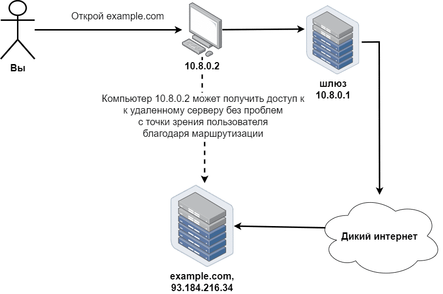
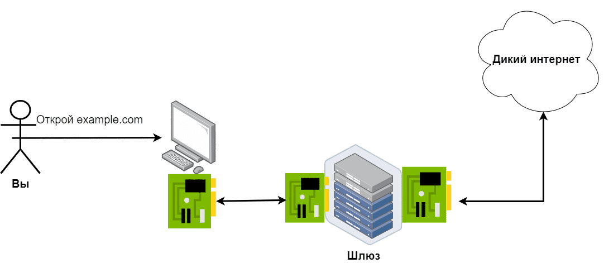

# 06 Команды ОС Linux и файловая система

## Простая команда UNIX с аргументами выглядит следующим образом:
команда [опции] [другие параметры], (Квадратные скобки […] означают, что аргумент необязателен.)


- Каждая конкретная команда предназначена для выполнения только одной операции. Команда egrep служит для поиска указанных последовательностей символов в файлах и директориях, также указанных с помощью аргументов. Другие команды могут, например, показывать сведения об ОС или содержимое директории
- Опции указывают, как именно нужно выполнить эту операцию. В показанном выше примере опция -i означает, что поиск должен быть нечувствительным к регистру букв; опция -r — поиск в директориях (не только в отдельных файлах); опция -l — выводить только названия файлов (без найденных строк файлов).
- "Позиционные аргументы" определяют, какие именно объекты будут затронуты, например, подстроки, входные файлы или директории, и т.д.
- Опции и позиционные аргументы вместе именуются "аргументами", т.е. это все, что следует за названием команды.
- Порядок опций неважен. Например, последовательность -l -a эквивалентна -a -l. Это справедливо и для длинных опций.
- Если вы работаете только с короткими опциями без значений, такими как -l и -a, то можете их соединить, упустив пробелы: -la или -al.
- **название_команды** --help: выводит встроенную справку для команды; эта опция работает почти для всех команд.
- man **название_команды**: выводит соответствующее команде подробное руководство, если оно установлено в системе. Мы будем изучать команду man позже, в рамках практического раздела.
- Не меняйте местами опции и параметры, указывающие месторасположение.
- Пробелы между названием команды, секцией опций и секцией с дальнейшими аргументами обязательны
- В мире UNIX всё является чувствительным к регистру букв. Включая названия файлов, команд, опций и имена пользователей
## Файловая система ОС Linux и объекты
Путь каждого объекта начинается с '/'. Этот элемент называется «корнем» (root), а вся файловая система подобна дереву.
### Стандарт FHS
+ ```/etc```	-	файлы конфигурации для большинства приложений и некоторых частей ОС
+ ```/home```	-	используется для хранения домашних директорий пользователей, например /home/ваше_имя_пользователя
+ ```/root```	-	домашняя директория пользователя root (это единственный пользователь-администратор во всех UNIX-подобных ОС)
+ ```/bin```	-	большинство исполняемых файлов (например, программ) хранится здесь. В современных версиях Linux директория ```/bin``` часто служит так называемой символьной ссылкой на директорию ```/usr/bin```. Любая операция, затрагивающая ```/bin/something``` будет фактически выполняться на ```/usr/bin/something```
+ ```/boot```	-	загрузочные файлы (в том числе файлы загрузчика, ядро, initrd, System.map). Часто выносится на отдельный раздел
+ ```/dev```	-	Основные файлы устройств (```/dev/null```, ```/dev/sd буква``` — жёсткий диск, ```/dev/sd буква номер``` (раздел диска), ```/dev/sr номер``` (CD-ROM), ```/dev/eth номер``` (сетевые интерфейсы Ethernet), ```/dev/wlan номер``` (сетевые интерфейсы) и др)
+ ```/sbin```	-	похож на /bin, но хранит специальные исполняемые файлы, служащие для конфигурации системы и обычно запускаемые только пользователем root
+ ```/tmp```	-	временные файлы ОС и приложений (аналог C:\Temp в ОС Windows)
+ ```/var```	-	содержит различные файлы с кэшем системы, файлы журналов и файлы баз данных (если сервер БД установлен). Директория ```/var/log``` хранит файлы журналов системы и большинства приложений
+ ```/usr``` (```/usr/bin```, ```/usr/lib```)	-	в настоящее время это главное место для приложений (исключая настройки, хранящиеся в ```/etc```). Например: /usr/bin содержит исполняемые файлы, /usr/lib — разделяемые библиотеки и т. д.
### Абсолютный и относительный пути
+ Абсолютный путь начинается с '/' и включает все промежуточные директории, в которых расположен объект
+ Относительный путь к объекту строго зависит от текущей рабочей директории. Более того, он начинается не со знака '/', а с вашей текущей рабочей директории

Работу с объектами файловой системы можно ускорить с помощью полезных конструкций: '..', '.' (одна точка означает текущую директорию) и '~' (означает вашу домашнюю директорию).
### Основные команды для работы с файловой системой
+ ```uname```	-	Выводит название ОС
	```uname -a``` ИЛИ ```/bin/uname -a``` - Выводит данные о текущем ядре операционной системы и некоторых других системных характеристиках
	```uname -r``` -  выводит только версию ядра операционной системы
+ ```date```	-	показывает текущие дату и время.
+ ```mount```
+ ```sleep 1000```
+ ```time command```
+ ```id``` - Выводит сведения о текущем пользователе. Пример результата:
	```uid=0(root) gid=0(root)```
+ ```rm [ПАРАМЕТР]… [ФАЙЛ]…```	-	используется для удаления файлов и директорий. Дополнительные опции:
  + ```-f, --force```: Принудительно удалить файлы без запроса подтверждения.
  +	```-i, --interactive```: Запрашивать подтверждение перед удалением каждого файла.
  +	```-v, --verbose```: Выводить подробную информацию о процессе удаления.
  +	```rm -f -r ФАЙЛ```	-	используется для принудительного и рекурсивного удаления файла или директории 
+ ```cd```	-	сменить текущую рабочую директорию на заданную:
  +	```cd /etc```
+ ```touch ~/chown.me```	-	используется для обновления временных меток файла. Если файл (здесь - chown.me) не существует, touch создает его. Если файл уже существует, touch обновляет его временную метку, но не изменяет его содержимое
+ ```pwd```	-	используется для вывода текущей рабочей директории
+ ```ls```	-	показывает содержимое текущей директории
  +	```ls -l /путь/к/директории```	-	вывод содержимого указанной директории в длинном формате 
  +	```ls -l -d```	-	вывод информации о текущей директории (```ls -l -d .```) или прямо указанных директориях (```ls -l -d dir1 dir2```) в длинном формате, не перечисляя содержимое этих директорий 
  +	```ls -la```	-	вывод информации о содержимом директории в длинном формате, включая скрытые файлы (те, чьи имена начинаются с точки .)
  +	```ls –lih /путь/к/директории```	-	вывод информации о содержимом директории в длинном формате с дополнительной информацией:
	  +	```l```: длинный формат, включающий подробную информацию о каждом файле или директории.
	  +	```i```: отображение номера индекса (inode) каждого файла или директории.
	  +	```h```: форматирование размеров файлов в читаемом виде (человеческий формат), используя такие единицы измерения, как K, M, G и т.д
  + ```ls -lF /путь/к/директории``` -  опция "-F" команды "ls" при выводе результата выделяет исполняемые файлы, добавляя "*"
  + ```ls -lL /путь/к/директории``` -  опция "-L" команды "ls" при выводе результата заставляет ls отображать информацию о файлах или каталогах, на которые указывают символические ссылки, а не самих символических ссылок
+ ```cat```	-	используется для отображения содержимого файлов, объединения файлов и вывода их содержимого на стандартный вывод (обычно это экран).
  + ```cat {one,two,three}/one.txt```	-	используется для отображения содержимого файла one.txt из каждой из трех директорий: one, two и three.
+ ```cp```	-	используется для копирования файлов и директорий
+ ```mv```	-	используется для перемещения файлов и директорий или переименования файлов
  + ```mv folderA/*.log folderB/```	-	перемещает все файлы с расширением .log из директории folderA в директорию folderB.
+ ```stat```	-	используется для вывода информации о файле или файловой системе. Эта команда показывает различные атрибуты файла, такие как права доступа, время последнего доступа, изменения и модификации, а также номер inode и другие метаданные
  + ```stat /tmp```
+ ```grep```	-	используется для поиска строк в текстовых файлах или стандартном вводе, которые соответствуют заданному шаблону. Поиск осуществляется либо имходя из Basic Regular Expressions (```grep "pattern" filename.txt```) либо Extended Regular Expressions (```grep -E "regex_pattern" filename.txt```):
  + ```grep "pattern" filename.txt``` -	найдет все строки в файле filename.txt, содержащие подстроку pattern.
  + ```grep -E "regex_pattern" filename.txt```	-	выполнит поиск в файле filename.txt, используя расширенные регулярные выражения
  + ```grep "pattern" file1.txt file2.txt```	-	выполнит поиск подстроки pattern в файлах file1.txt и file2.txt.
  + ```grep -r "pattern" directory/```	-	выполнит рекурсивный поиск подстроки pattern во всех файлах внутри указанной директории directory
+ ```mkdir```	-	используется для создания новых директорий (папок)
  + ```mkdir directory_name```	-	создаст директорию с указанным именем 
  + ```mkdir -p /path/to/new/directory```	-	создаст директорию /path/to/new/directory, создав все несуществующие родительские директории по пути. Флаг -p используется для создания родительских директорий, если они не существуют.
  + ```mkdir -p /tmp/symlinks/{one,two}```	-	создает две директории в директории /tmp/symlinks: one и two. Флаг -p используется для создания родительских директорий, если они не существуют.
+ ```tree```	-	используется для отображения древовидной структуры файлов и директорий, начиная с указанной директории
## Символические ссылки
+ ```ln опции файл_источник файл_ссылки``` - команда для создания ссылок на файлы: 
  + ```ln -s source softlink```	-	создает символическую ссылку на файл или директорию с именем softlink, указывающую на исходный файл или директорию source.
  + ```-s```: Этот флаг указывает, что нужно создать символическую ссылку (soft link), а не жесткую ссылку (hard link).
  + ```source```: Это исходный файл или директория, на который будет указывать символическая ссылка.
  + ```softlink```: Это имя, которое вы хотите дать вашей символической ссылке.
+ ```ln -srf three/one.txt two/one.txt```	-	создает символическую ссылку на файл one.txt в директории three, и делает эту ссылку вместо уже существующего файла one.txt в директории two, если он существует. Вот что означают использованные опции
  + ```-s```: Создание символической ссылки.
  + ```-r```: Создание символических ссылок с относительными путями, что особенно полезно при перемещении каталогов, чтобы ссылки продолжали указывать на правильные файлы.
  + ```-f```: Принудительное создание символической ссылки, игнорируя ошибки, если файл не существует или ссылка не удалась.

# 07 Обработка текста в Linux
## Типы и расширения файлов в Linux
В Linux расширения файлов не так широко используются, особенно для текстовых файлов или исполняемых файлов, потом что при работе в командной строке нельзя дважды щелкнуть по файлу, чтобы открыть его. Вместо этого вам нужно вручную указать, какая программа должна быть использована для работы с этим файлом, например: ```ls -l /etc/passwd```

Но расширения могут использоваться в различных случаях, например, для вашего собственного удобства - если вы создаете эти файлы для дальнейшего использования, а также приняты стандарты расширений:

+ Файлы журналов часто имеют расширение ".log".
+ Настройки приложений часто хранятся в файлах ".conf" или ".cnf". 
+ Если это требуется логикой программы, например, PHP-скрипты для динамического веб-контента должны иметь расширение ".php".
+ Если эти файлы создаются и открываются средствами графического интерфейса, например, ".odt" для OpenOffice (аналог MS Word).
## Формат текстовых файлов UNIX
+ Строки текстовых файлов UNIX заканчиваются символом ```\n``` (он не отображается на терминале, но все же существует), который также называется LF, его ASCII-код - 10 (0xA в шестнадцатеричной системе).
+ Строки текстовых файлов Windows заканчиваются символами ```\r\n```, символ ```\r``` также называется CR, его ASCII код - 13 (0xD в шестнадцатеричной системе).
+ команда ```file``` определяет формат указанных файлов:
```console
feodor@unixdell:/tmp$ file passwd*
passwd: 	ASCII text
passwd.win: ASCII text, with CRLF line terminators
```
+ Чтобы преобразовать формат текстовых файлов в командной строке Linux, вы можете использовать инструменты ```dos2unix``` и ```unix2dos``` соответственно (если они установлены)
## Обработка текста в Linux
### Команды для работы с текстом, как файлами, так и потоками
Ниже перечислены основные команды для работы с текстом, как файлами, так и потоками. Термин "поток" (stream) здесь (и везде в программировании) означает "поток (последовательность) данных"
+ ```cat```: выводит содержимое файла в терминал. ```cat``` не работает с директориями. Полезно для маленьких файлов ```cat file1 file2```
+ ```less```: печатает содержимое файла на терминале с использованием страниц и прокрутки. Также позволяет осуществлять строковый поиск в открытых файлах с помощью горячих клавиш. Полезна для чтения больших файлов (логов)
+ ```egrep``` (более мощная версия ```grep```): выводит на терминал строки, соответствующие шаблонам egrep ```egrep "something" file1 file2 ... fileN``` для файлов, ```egrep -r какой-то_шаблон /некая/директория``` для директорий
  + ```-i```: сделать поиск нечувствительным к регистру символов
  + ```-v```: вывести все строки, не соответствующие шаблону
  + ```-l```: вывести имена файлов (не строк), в которых найден данный шаблон (если таковые имеются)
  + ```-r```: поиск шаблона во всех файлах в заданном каталоге и вывод найденных совпадений строк
+ ```head```: выводит на терминал первые N строк из файла ```head -n X input_file```
+ ```tail```: печатает последние N строк из файла на терминал. Также позволяет видеть изменения файла в режиме реального времени, когда программа добавляет новые строки в этот файл - полезно для мониторинга работающего приложения: ```tail -f input_file```, ```tail -n 5 input_file```
+ ```wc```: подсчитывает количество символов, слов и (самое полезное) строк во входных файлах: ```wc -l input_file```
+ ```sort```: используется для сортировки строк текстовых файлов или стандартного ввода в алфавитном или числовом порядке. Она выводит отсортированные строки на стандартный вывод: ```sort /etc/passwd```, ```sort -t ":" -k 3 -n /etc/passwd```
+ ```uniq```: может удалять дублирующиеся строки, печатать только уникальные строки и показывать только дублирующиеся строки. Часто применяется после sort с помощью "pipe"
### Перенаправления вывода
+ stdout - когда программа печатает что-то полезное во время своего выполнения, это направляется в специальный поток вывода (поток здесь - это последовательность символов) под названием "stdout" (стандартный вывод). По умолчанию stdout подключен к терминалу, поэтому вы видите результаты на экране
+ stderr - когда что-то идет не так, программа печатает свои ошибки в другой специальный поток под названием "stderr" (стандартные ошибки). По умолчанию он подключен к тому же терминалу, поэтому эти ошибки отображаются так же, как и stdout.
#### Методы перенаправления вывода
##### stdout

```console
some_program > output_file_rewrite
some_program >> output_file_append
```

В обоих случаях выше stdout программы будет записан в указанный файл, а не в терминал но:
+ '>' перезапишет файл
+ '>>' добавит stdout программы к содержимому существующего файла

Оба метода создают выходной файл, если он не существовал ранее.

!!! Внимание: Второй частый случай использования cat - объединение файлов. Чтобы "склеить" содержимое файлов, вы можете выполнить следующее: ```cat file1 file2 ... fileN > resulting_file```

##### stderr
+ чтобы сохранить сообщения об ошибках отдельно от "полезного" вывода:
```console
some_command 2> output_file_rewrite
some_program 2>> output_file_append
```
Важные замечания о перенаправлении stderr:
+ Не забудьте указать '2', если вы работаете с stderr
+ Пробелы между '2' и '>' (или '>>') не допускаются
##### Объединение stdout и stderr
```some_program > output_file 2>&1``` Это работает следующим образом:
+ Stderr перенаправляется в stdout (порядок перенаправления - shell выполняет первым выражение 2>&1 )
+ Stdout записывается в "output_file"

Файл /tmp/new.errs будет содержать 1 строку с тексто ошибки, файл /tmp/new.out будет содержать строки с найденнім результатом. В терминале ничего не выводится:
```console
egrep root /etc/passwd /no/such/file> /tmp/new.out 2>/tmp/new.errs
``` 
##### /dev/null
Если нужно игнорировать ошибки или stdout (показывать только один поток), то используют специальное псевдоустройство ```/dev/null``` - вы можете записать на него что угодно, и эта информация исчезнет.```some_program 2>/dev/null``` - полностью игнорирует ошибки во время выполнения команды
### Пайпы и stdin
#### Типичный случай использования
```cat /etc/passwd /etc/group | egrep user | head -n 2```

#### Внутренний механизм
Пайпы (Pipes) предназначены для перенаправления stdout одной программы в stdin другой.
+ stdin - Наряду с потоками stdout и stderr, каждая программа в мире UNIX имеет так называемый поток "stdin", используемый для получения входных данных - как поток, а не как входной файл. Между тем, многие программы могут получать входные данные как из входных файлов, так и из потока stdin (но в большинстве случаев НЕ одновременно), поэтому команды в нашем следующем примере имеют одинаковый эффект:
```console
egrep user /etc/group

cat /etc/group | egrep user

egrep user < /etc/group
```
+ В примере '<' означает "получить данные stdin из этого файла", это НЕ то же самое, что "получить это как входной файл". Здесь "egrep" заполняет свой stdin из файла, указанного после '<', и ищет шаблон в потоке входных данных.
+ в ```cat /etc/group | egrep user "cat"``` просто печатает входной файл в stdout. Затем, с помощью пайпа через '|' между "cat" и "egrep", это содержимое передается в виде потока на stdin egrep. "egrep" читает свой stdin и ищет заданный шаблон.
+ Примечание: не пытайтесь заполнить stdin команды через pipe и '<' одновременно. В этом случае на вход будет принят только файл, а stdout предыдущей команды будет проигнорирован - cmd1 | cmd2 < /some/file - это не правильно, cmd2 примет данные только от /some/file
+ Пайпы могут работать только с stdout, поэтому если что-либо было выведено на stderr, и stderr не был обработан отдельно, вы также увидите сообщения stderr среди обработанных строк. Схематично это показано на рисунке ниже:

+ Если вы хотите работать через пайпы с stderr, можно использовать конструкцию ниже. Она объединяет stdout и stderr для "next_command": ```some_command 2>&1 | next_command ```

+ ```some_command 2>&1 >/dev/null | next_command``` - будет игнорировать stdout команды some_command, перенаправлять ее stderr в stdout и предоставлять его в качестве входных данных для "next_command". Используйте конструкцию, если вы хотите работать только с stderr и полностью игнорировать stdout

# 08 Linux - пользователи, группы и права доступа к файлам в Linux
+ процессы - это экземпляры программ, выполняющиеся в данный момент;
+ сервисы - это сущности, созданные для упрощения управления системой, они могут делать многое, например, запускать процессы по требованию;
## Понятия пользователей и групп Linux
### Учетные записи ОС
+ Стандартные учетные записи: создаются для обычных пользователей
	+  могут входить в систему
	+  могут выполнять команды
	+  могут читать некоторые файлы или директории
	+  не могут изменять любую часть ОС
	+  не могут изменять любую часть "общесистемных" приложений
	+  по умолчанию могут изменять данные только в своих домашних директориях и /tmp.
+ Административная учетная запись: ее имя - root, и она является единственным администратором ОС (у вас не может быть двух root). Учетная запись root используется для прямого входа в систему очень редко; вместо этого администраторы временно повышают свои привилегии до root для обслуживания системы и других важных операций. Административная учетная запись может:
	+ входить в систему и делать все с ОС и пользователями без каких-либо ограничений (в отличие от Windows)
+ Служебные учетные записи: создаются для служб и других специальных целей; не должны использоваться пользователями. Например, для запуска бэкэнд-приложения (или приложения сервера базы данных) должна использоваться отдельная учетная запись.  Это минимизирует возможные последствия в случае сбоя или взлома приложения. Служебные учетные записи:
	+ не могут входить в систему. ОС, службы и приложения (запускаемые root) используют их для специальных целей, например, для запуска определенных программ, служб и т.д. Например, при старте системы или вручную через команду sudo systemctl start mysql, системный менеджер служб (например, systemd) запускает от имени учетной записи mysql службу MySQL.
### Основные настройки учетной записи
#### ```/etc/passwd``
```/etc/passwd``` - это основной конфигурационный файл для учетных записей пользователей, который используется, когда:
+ Пользователь входит в систему по SSH, FTP и другим средствам/протоколам.
+ ОС или любая программа требует, чтобы имя пользователя было сопоставлено с числовым UID (см. ниже) или наоборот.

```egrep "${USER}" /etc/passwd``` - пример получения информации про свою учетную запись, где: 
+ ```${}``` - специальный синтаксис для обращения к переменным в командной оболочке, позволяющий обращаться к значению переменной по ее имени. Фигурные скобки используются для явного выделения границ имени переменной (это может быть полезно, когда имя переменной непосредственно прилегает к другим символам или тексту, чтобы избежать неоднозначности)
+ ```USER``` - это имя переменной. В случае переменной ```${USER}``` это стандартная переменная окружения, которая обычно содержит имя текущего пользователя.

Файл ```/etc/passwd``` в качестве разделителя полей использует ':' и содержит данные про:
+ имя пользователя (должно быть уникальным)
+ x - поле не используется, поэтому мы имеем здесь 'x' как заглушку
+ идентификатор пользователя, называемый "UID", должен быть уникальным. Пользователи в основном имеют UID >= 1000. Пользователь root всегда имеет UID 0. Учетные записи служб имеют UID от 1 до (в основном) 999. Никто, кроме root, не должен иметь UID 0.
+ идентификатор основной группы. Каждый пользователь должен быть членом хотя бы одной группы (не существует пользователей "без групп"). Если пользователей нужно включить в большее количество групп, это настраивается в ```/etc/group``` .
+ описание пользователя. Это поле может быть пустым или содержать что угодно, кроме ':'. Оно не играет никакой роли в ОС и механизмах входа в систему.
+ домашний каталог пользователя, куда он автоматически помещается после успешного входа в систему
+ программа, выполняемая при успешном входе в систему (например, ```/bin/bash```). Сервисные учетные записи не предназначены для входа в систему и работы в командной строке, поэтому у них здесь указаны специальные "псевдо" программы, такие как ```/bin/false``` или ```/sbin/nologin```
#### ```/etc/shadow```
+ Хеши паролей хранятся в файле ```/etc/shadow```, доступ к которому имеет только root. Эти особые разрешения ```/etc/shadow``` используются для того, чтобы избежать атак методом перебора.
+ файл ```/etc/shadow``` также содержит все настройки паролей учетных записей ОС, например, когда пароль должен быть изменен и т.д.
#### Заметки по безопасности/стабильности
+ Только root может изменять ```/etc/passwd``` - иначе хакеры могут повысить привилегии, создав "фальшивого рута" с UID 0.
+ Любой пользователь или приложение должны иметь доступ на чтение к файлу ```/etc/passwd``` - иначе ОС становится нестабильной.
+ доступ к файлу ```/etc/shadow``` имеет только root.
## Группы ОС
+ Группы включают несколько (0 или более) пользователей для упрощения управления пользователями и разделения привилегий
+ Каждый пользователь должен быть членом как минимум одной группы - она задается в ```/etc/passwd```, такая группа называется "основной" для конкретного пользователя
+ Каждый пользователь может быть включен в 0 или более дополнительных групп, называемых "вторичными группами" (secondary groups). Членство во вторичных группах настраивается в файле ```/etc/group```.
+ Нет никакой разницы (в плане привилегий) между членством в первичной и вторичной группах, например: если ваш пользователь входит в группу "qa" и группу "users", вы можете читать файлы, доступные как группам "qa", так и "users".
+ Группы полезны для назначения разрешений на доступ к файлам и других привилегий или ограничений, например:
	+ кто может читать/писать/исполнять файл
	+ кто может войти в систему через SSH
	+ кто и как может использовать инструменты "sudo" или "su"
	+ кто может читать журналы общесистемных служб с помощью инструмента "journalctl"
	+ сколько процессора/памяти/дискового пространства может быть израсходовано
+ Имена групп чувствительны к регистру.
+ В отличие от Windows, в UNIX нет группы "Администраторы".
+ В большинстве систем членство в группе "root" не дает многих привилегий, в отличие от статуса пользователя "root".
+ Могут существовать специальные группы с дополнительными привилегиями, это сильно зависит от настроек вашей ОС. Например, группы "sudo" или "wheel" могут иметь (а могут и не иметь) неограниченные права на выполнение любых команд от имени root через "sudo"
### Добавление в группу (Linux)
На Debian (и других дистрибутивах Linux) для добавления пользователя в группу обычно используется команда usermod:

```sudo usermod -aG имя_группы имя_пользователя```, где:
+ sudo: Это команда для выполнения следующей команды с правами суперпользователя (если ваш пользователь не имеет достаточных привилегий для выполнения этой операции);
+ usermod: Это команда для изменения параметров пользователя;
+ -aG: Это опция usermod, которая добавляет пользователя в указанную группу, не удаляя его из других групп, к которым он уже может принадлежать. -a означает "добавить", а -G указывает группу;
+ имя_группы: Это имя группы, в которую вы хотите добавить пользователя;
+ имя_пользователя: Это имя пользователя, который будет добавлен в указанную группу.
### Основные настройки групп: ```/etc/group```
```/etc/group``` - основной конфигурационный файл для групп UNIX и используется, когда:
+ ОС или какой-либо программе требуется преобразовать имя группы в числовой GID (см. ниже) или наоборот.
+ Пользователь пытается сделать что-то, что может быть ограничено или разрешено функциями управления группами (например, чтение файла)
+ [опционально, если службы входа настроены таким образом] Пользователь входит в систему (SSH, FTP, другие протоколы).
Файл ```/etc/group``` содержит Название группы, Идентификатор группы, называемый "GID" (должен быть уникальным), Список членов группы, разделенный запятыми (может быть пустым)

Членство в группе вычисляется как совокупность вхождения пользователя в файлах ```/etc/passwd``` и ```/etc/group```
### Как вывести информацию о своем пользователе и группе
+ ```whoami```	- Получить имя текущего пользователя
+ ```id```		- Получить расширенную информацию о текущем пользователя и его членстве в группах
    + ```id -u```	- Показать только UID текущего пользователя и ничего больше
    + ```id -G``` - Показать только GID или только имена групп текущего пользователя
+ ```groups```	- получить имена групп
## Повышение привилегий
### "su": Переключить пользователя
Команда ```su``` используется для запуска оболочки от имени другого пользователя (по умолчанию root) после предоставления пароля пользователя. Соответственно, все, что выполняется в этой оболочке, будет выполняться с привилегиями целевого пользователя. Чтобы вернуться к предыдущему пользователю, выполните команду "exit".

Эта команда часто используется системными администраторами, которые входят в систему как обычные пользователи, а затем переключаются на учетную запись root. Она может использоваться во время развертывания или настройки тестовых сред; но помните, что для этого случая требуется знание пароля root, например:
1. ```su - sutest``` - Запустить оболочку от имени пользователя "sutest"
   + Опция - (или -l) указывает su использовать логин-сессии, что означает:
     + смену на домашний каталог целевого пользователя и использование его окружения - переключается в домашний каталог целевого пользователя. В примере — /home/**sutest**
     + Переменные окружения (HOME, USER, LOGNAME, SHELL, PATH и другие) устанавливаются так, как если бы целевой пользователь выполнил вход в систему
     + Переменная PATH обновляется, чтобы включать пути, специфичные для целевого пользователя, что обеспечивает доступ ко всем необходимым системным утилитам
     + Загружаются и выполняются файлы конфигурации оболочки целевого пользователя, такие как ```.profile```, ```.bash_profile```, ```.bashrc``` и другие, если они существуют
2. ```su - -c "id -u; whoami"``` - выполнение команды (или нескольких команд) от имени root, без запуска полнофункционального сеанса оболочки root:
   + Команда su используется для смены пользователя. По умолчанию она переключает на пользователя root.
   + Опция - (или -l) указывает su использовать логин-сессии (здесь - root)
   + Опция -c указывает su выполнить команду, заключенную в кавычки, вместо запуска интерактивной оболочки. (в примере команда ```id -u``` выводит числовой идентификатор (UID) текущего пользователя, а команда ```whoami``` выводит имя текущего пользователя.
  
**Примечания**
+ Пользователь "root" может переключаться на любого другого без ввода пароля цели.
+ Лучше использовать "su -" вместо "su", так как ключ "-" загружает все окружение оболочки целевого пользователя.
### "sudo": Substitute User Do
Инструмент ```sudo``` используется для запуска команды от имени другого пользователя (по умолчанию root) после предоставления пароля (собственного пароля пользователя, а не того, от имени которого вызывают команду). ```sudo``` предназначен для того, чтобы позволить определенным пользователям выполнять определенные команды (и только их, ничего больше!) от имени другого, часто привилегированного, пользователя

```sudo```: 
+ ```sudo -l``` -  Чтобы проверить возможности пользователя
+ ```sudo [-u username] command args``` - чтобы запустить команду
**Примечания**
+ Только пользователь "root" может устанавливать или изменять чьи-либо разрешения sudo - т.е., будучи обычным пользователем, вы можете только перечислить свои собственные настройки sudo (```sudo -l```) и выполнять разрешенные команды в соответствии с настройками
+ Некоторые привилегированные пользователи (например, члены групп "wheel" или "sudo") могут выполнять любые команды от имени root, в выводе "sudo -l" это отображается как (ALL) ALL
+ чтобы предоставить пользователю возмоможность применять sudo администратор (root) добавляет соответствующие записи в файл ```/etc/sudoers```. Для минимизации риска "поломать" файл ```/etc/sudoers``` лучше делать это с помощью редактора ```visudo```, который вызывается: ```sudo visudo```
### sudo VS su: Основные различия
|  | su | sudo |
|----------|----------|----------|
| Основная функциональность  | Предоставление оболочки входа в систему с привилегиями целевого пользователя, по умолчанию root | Выполнение одной команды от имени целевого пользователя, по умолчанию root |
| Основная идея | Работа в полнофункциональной оболочке как root или любой другой пользователь ОС | Делегирование некоторых административных полномочий обычным пользователям |
| Какой пароль вводить | Пароль целевого пользователя | Ваш собственный пароль |
| Необходимые настройки | Возможно, вас нужно будет включить в специальную группу для запуска "su" (если это установлено вашим системным администратором). | Точные команды и даже их аргументы могут быть разрешены в явном виде |
| Настройки безопасности по умолчанию | Любой может выполнить команду "su", требуется только пароль целевого пользователя | Только члены специфической для дистрибутива группы ("wheel" в RHEL-системах, например CentOS, "sudo" в Debian, например Ubuntu) могут использовать sudo. |
## Разрешения на доступ к файлам
### Анатомия вывода "ls"

+ Выше результат команды ```ls -l testfile```, где:
	+ '-' для типичных файлов
	+ 'd' для каталогов
	+ 'l' для символических ссылок
	+ 9 следующих символов, ("rw-r--r--") - это разрешения доступа к файлам UNIX
	+ "Размер файла" имеет смысл только для типичных файлов, ни для каталогов, ни для симлинков.
### Анатомия разрешений на доступ к файлам


Как проверяются и применяются разрешения доступа:
+ Во-первых: является ли пользователь владельцем данного объекта? Если да - проверить, разрешают ли разрешения владельца объекта эту операцию.
+ Если пользователь не является владельцем объекта - является ли он членом группы? Если да - проверить, разрешают ли групповые разрешения объекта эту операцию.
+ Если пользователь не входит в группу - проверить, разрешают ли разрешения других на эту операцию.
### Смысл и формат записи прав доступа
Разрешения доступа к файлам (r, w, x) имеют разные значения для файлов и директорий
| Бит | Значение для файлов | Значение для директорий |
|:-------------|:---------------:|--------------:|
| r - read (чтение)       |Файл может быть прочитан, например, с помощью cat, less, head, других инструментов.        | Список содержимого каталога может быть прочитан: ```ls имя_каталога``` для отображения содержимого каталога, но при этом не будет возможности просматривать содержимое самих файлов или заходить в подкаталоги, если у вас  не установлен бит x        |
| w - write (запись)       | Содержимое файла может быть изменено. Но сам файл не может быть удален - см. 'w' для каталогов.        | Любой элемент этого каталога может быть создан или удален. То есть, даже если вы не являетесь владельцем файла в этом каталоге, вы можете удалить его, установив 'w' для каталога. Но без также установленного бита "x" можно будет добавлять новые файлы в каталог, удалять существующие файлы и переименовывать их только если вы уже находитесь в каталоге (для добавления - обязательно) или имеете прямой путь к файлу (удаление файлов или подкаталогов и переименование файлов или подкаталогов, т.к. команды rm и mv используют полный путь и не требует перехода внутрь каталога).       |
| x - execute (выполнение)       | Файл может быть выполнен. Фактически исполняемые файлы: двоичные файлы и скрипты        | Самый важный бит для каталогов. Вы можете войти в этот каталог (например, с помощью "cd") и получить доступ (чтение, запись, выполнение) ко всему его содержимому, если это разрешено их правами доступа. Если у вас нет 'x' для каталога, вы НЕ можете переходить в подкаталоги, создавать/удалять объекты (файлы, каталоги), читать информацию об объекте (разрешения, владелец, ...)       |
### Команды для изменения разрешений доступа к файлам
+ ```chown [OPTIONS] USER[:GROUP] FILE(s)```: для установки нового владельца и/или группы для объекта
	+ изменить только владельца объекта - может быть выполнена только пользователем root
	+ изменить только группу объекта - может быть выполнена обычным пользователем, но этот пользователь должен быть членом новой группы (иначе требуются привилегии root)
	+ изменить владельца и группу объекта сразу - только для root
	+ ```chown operator:bin ~/chown.me``` - для объекта ~/chown.me устанавливается собственник operator, группа bin. Команда выполняется от имени root
	+ ```chown :users ~/chown.me``` - для объекта ~/chown.me устанавливается группа users. Команда выполняется от члена группы "users"
	+ ```chown -R :users ~``` - используется для изменения группы всех файлов и директорий на users в вашем домашнем каталоге рекурсивно
+ ```chgrp [OPTIONS] GROUP FILE..```: для изменения группы объекта (только если вы являетесь членом новой группы)
    + ```chgrp users ~/chown.me``` - аналогична ```chown :users ~/chown.me```
    + ```chgrp -R users ~``` - поддерживает рекурсивный режим "-R"
+ ```chmod``` (ИЗМЕНИТЬ РЕЖИМ): позволяет установить новые разрешения доступа к файлу. Она позволяет установить точные разрешения сразу на определенный объект - для этого лучше использовать восьмеричную форму и добавить или отозвать права доступа к определенному объекту - это удобнее делать в символьном виде
  + символьный вид: ```chmod [OPTIONS] [ugoa…][-+=]perms…[,…] FILE...```
    + Первый набор флагов ([ugoa...]), флаги пользователей, определяет, для каких классов пользователей изменяются права доступа к файлу.
      + ```u``` - Владелец файла.
      + ```g``` - Пользователи, входящие в группу.
      + ```o``` - Все остальные пользователи.
      + ```a``` - Все пользователи, идентично ugo, например:
        + ```chmod u=rwx,g+w,o-r ~/chmod.me.file``` - Разрешает владельцу делать что угодно с файлом, добавляет права на запись группе и отбирает права на чтение у прочих (others)
        + ```chmod -R go-rwx ~/chmod.me.dir``` - отнимаем все права у группы и прочих (others) рекурсивно для всей директории
    + Второй набор флагов ([-+=]), флаги операций, определяет, будут ли разрешения удалены, добавлены или установлены:
      + '-' Удаляет указанные разрешения.
      + '+' Добавляет указанные разрешения.
      + '=' Изменяет текущие разрешения на указанные. Если после символа = разрешения не указаны, все разрешения указанного класса пользователей будут удалены.
    + Разрешения (perms...) могут быть явно заданы с помощью нуля или одной или нескольких из следующих букв: r, w, x, X, s и t. При копировании разрешений из одного класса пользователей в другой используйте одну букву из набора u, g и o. При установке разрешений для нескольких классов пользователей ([,...]) используйте запятые (без пробелов) для разделения символьных режимов.
  + восьмеричная форма: ```chmod [OPTIONS] NUMBER FILE...```, например:
    + ```chmod 751 ~/chmod.me.dir``` - Установливает "rwxr-x--x", т.е. 751, на указанную директорию
    
## Особые случаи: символические ссылки (symbolic links), sticky bit, SUID, SGID
### Символические ссылки
Символические ссылки всегда имеют разрешения 777, но это ничего не значит, поскольку фактические разрешения доступа такие же, как у целевого объекта:
```console
lrwxrwxrwx. 1 root root 7 янв 1 21:12 /bin -> /usr/bin
dr-xr-xr-x. 2 root root 36864 фев 19 13:31 /usr/bin
```
В примере символическая ссылка /bin ссылается на /usr/bin:
+ Ее содержимое не может быть изменено, она может быть только пересоздана.
+ Только владелец директории (у нас владелец директории '/' это "root") может пересоздать ее.
+ Разрешения доступа к символической ссылке не влияют на разрешения доступа к целевому объекту (в соответствии с  замыслом).
### Sticky bit
Может использоваться для директорий наряду с "обычными" битами доступа rwx. Если он установлен, только владельцы могут удалять свои объекты, независимо от других разрешений  (например, 777 для ```/tmp```). Sticky bit отображается как 't' в конце "слова" разрешения доступа: "drwxrwxrwt".

**sticky bit** имеет числовое значение 1

**sticky bit** очень важен для ```/tmp```, так как благодаря разрешениям 777 каждый может создавать и удалять там что угодно. **Sticky bit** предотвращает анархию, не позволяя удалять чужие данные

**sticky bit** может быть установлен в символьной или восьмеричной форме:
+ chmod +t /some/dir
+ chmod 1xyz /some/dir
### Биты SUID и SGID
Бит SUID (Set User ID) может использоваться для исполняемых файлов. Если он установлен, этот файл всегда будет выполняться от имени владельца. Бит SUID отображается как 's' вместо 'x' в блоке разрешений владельца:
```console
# SUID binaries
[st00@c7-sandbox ~]$ ls -l /bin/passwd /bin/chsh /bin/sudo
-rws--x--x. 1 root root  23880 Feb  2  2021 /bin/chsh
-rwsr-xr-x. 1 root root  27856 Apr  1  2020 /bin/passwd
---s--x--x. 1 root root 151424 Oct 14  2021 /bin/sudo
```
Это полезно, если этот исполняемый файл а) часто используется и б) должен делать что-то с определенными правами пользователя. Например:
+ Исполняемый файл ```/bin/passwd``` предназначен для того, чтобы позволить пользователям изменять свой пароль. Поэтому он должен модифицировать файл ```/etc/shadow```, что требует привилегий root.
+ Исполняемый файл ```/bin/chsh``` предназначен для изменения оболочки входа в систему. Поэтому он модифицирует файл ```/etc/passwd```, который также разрешен только для root.
+ Исполняемый файл ```/bin/sudo``` предназначен для повышения привилегий до "root", поэтому он обязательно должен иметь возможность запускать что-либо от имени root.

Бит SUID имеет восьмеричное значение 4

```console
# SUID bit
chmod u+s /path/to/file
chmod 4xyz /path/to/file
```
### Бит SGID (Set Group ID) 
Бит SGID (Set Group ID) также может быть использован для исполняемых файлов. Если он установлен, этот файл всегда будет выполняться от имени группы владельцев. Бит SGID отображается как 's' вместо 'x' в блоке групповых разрешений, как показано выше для бинарного файла "wall". В отличие от SUID, бит SGID не используется широко:
```console
# SGID binary
[st00@c7-sandbox ~]$ ls -lF /bin/wall
-r-xr-sr-x. 1 root tty 15344 Jun 10  2014 /bin/wall*
```
Бит SGID имеет восьмеричное значение 2

```console
# SGID bit
chmod g+s /path/to/file
chmod 2xyz /path/to/file
```

# 09 Linux — исполняемые файлы, процессы и службы
## Исполняемые файлы в Linux
### Команды
При выполнении команд в терминале Linux, на самом деле выполняются:

+ Исполняемые файлы - файлы с установленным битом "x":
  + Двоичные исполняемые файлы, например, написанные на C/C++. Примеры: cat, less, grep. Они аналогичны файлам ".exe" в Windows
  + Скрипты, например, скрипты (сценарии) оболочки, Python и т.д. Примеры: egrep, yum (похожи на ".bat" или ".ps" в Windows).
  + Библиотеки - это двоичные файлы, подобные исполняемым файлам, но очень редко запускаемые напрямую.
  + Все вышеперечисленные исполняемые файлы, представленные в виде символических ссылок на "обычные" файлы с установленным битом "x", что широко распространено в UNIX-подобных системах.
+ Псевдонимы (алиасы) - синонимы команды (или другого псевдонима), выполняемой с определенными опциями или без них, например, псевдоним "ll" часто определяет команду "ls -l".
+ Встроенные команды оболочки. Примеры: cd, alias. При их выполнении не вызывается никакая внешняя команда, вместо этого их выполняет сама командная оболочка

Для выполнения команд пользователя и отображения их вывода используются специальные оболочки входа в систему, такие как **bash**, **zsh** и так далее
### Исполняемые файлы
#### PATH
PATH - это переменная оболочки (shell variable), которая содержит список каталогов для поиска исполняемых файлов. Она может быть отображена командой "echo":

```console
localhost:~# echo $PATH
/usr/local/sbin:/usr/local/bin:/usr/sbin:/usr/bin:/sbin:/bin
```
#### Переменные оболочки
Вывод списка переменных оболочки осуществляется командой ```env```
#### which
```which``` - это команда для показа расположения исполняемого файла в каталогах PATH:
```console
localhost:~# which uname
/bin/uname
```
+ Любой исполняемый файл можно запустить, указав путь к нему.
+ Исполняемый файл, если он находится в директории в списке PATH, может быть запущен путем указания имени файла; путь к файлу указывать не нужно.
+ Поиск в директориях, перечисленных в PATH, выполняется последовательно. Таким образом, если файлы с одинаковым именем существуют в нескольких каталогах PATH, для выполнения будет взят файл из первой директории в переменной PATH.
+ Чтобы запустить исполняемый файл, не находящийся ни в одной из директорий в PATH, необходимо вместо имени файла указать его путь - относительный или абсолютный.
#### Управление задачами
##### Запуск процесса в фоновом режиме из командной строки:
Запустить процесс в фоновом режиме можно, добавив символ & в конец команды. Это позволяет вашей командной строке быть доступной для ввода новых команд, пока фоновый процесс выполняется ```команда &```, например:
+ gedit &
##### Приостановка задачи
Когда вы выполняете команду в терминале, она обычно работает в переднем плане (foreground). Если вы хотите временно приостановить выполнение этой команды, вы можете использовать сочетание клавиш Ctrl+Z. Это переместит задачу в состояние приостановки (stopped).
##### Перевод задачи в фоновый режим (bg)
```bg %ID_задачи``` - Возобновляет выполнение приостановленной задачи в фоновом режиме. Если не указать ID задачи, будет использована последняя приостановленная задача
##### Возвращение задачи в передний план (fg)
```fg %ID_задачи``` - Возобновляет выполнение задачи в переднем плане. Если не указать ID задачи, будет использована последняя приостановленная или фоновая задача.
##### Завершение задачи (Ctrl+C)
```Ctrl+C```: Прерывает и завершает текущую задачу в переднем плане
##### Просмотр списка задач (jobs)
```jobs``` - Отображает список всех задач в текущем терминале, их статус и ID
##### "Убийство" задачи (kill)
```kill %ID_задачи``` - Отправляет сигнал SIGTERM для завершения указанной задачи. Если задача не завершится, можно использовать сигнал SIGKILL для принудительного завершения
#### Встроенные команды и псевдонимы оболочки
Некоторые команды не являются исполняемыми файлами; вместо этого они выступают в качестве так называемых "псевдонимов" и "встроенных модулей оболочки":
+ "Алиас" (псевдоним) - это определенное пользователем имя существующей команды (и, возможно, ее опций). Если "b" является псевдонимом для "a --option1 --option2", то когда оболочке входа в систему предлагается выполнить "b --some-options arguments", на самом деле вместо этого будет выполнено "a --option1 --option2 --some-options arguments". Часто система Linux настроена так, что некоторые псевдонимы для всех пользователей доступны сразу же, например, "ll" (ls -l), "la" (ls -a).
+ Встроенная команда - это имя команды, которая поддерживается оболочкой входа в систему (/bin/bash является оболочкой входа в систему в большинстве случаев), но не существует в виде отдельного исполняемого файла. Примеры: ```cd```, ```pwd```, ```test``` - эти команды часто представлены в виде "настоящих" исполняемых файлов, но если это не так, оболочка входа в систему может выполнить соответствующие действия и сама.
##### alias
Команда ```alias``` - это встроенная команда оболочки, которая возвращает просмотр список зарегистрированных в системе псевдонимов (по умолчанию какие-либо псевдонимы могут отсутствовать).

**Создать псевдоним**
+ Определим псевдоним и поместим его в постоянный файл конфигурации оболочки (в файлах ~/.bashrc и(или) ~/.bash_profile)
  + ```localhost:~# echo "alias lf='ls -lF'" >> ~/.bashrc```
+ Чтобы применить обновленную конфигурацию, необходимо запустить новый экземпляр "bash":
  + ```localhost:~# bash```
+ Проверка, что псевдоним добавлен - вызвать команду ```alias```
+ Также псевдонимы можно определять «на ходу». В таком случае они будут действовать до завершения текущего сеанса оболочки
  + ```localhost:~# alias rm='echo You are trying to execute "rm" with the following arguments: '```
  + теперь "оригинальную" команду ```rm``` можно вызвать по абсолютному пути, в таком случае выполнится именно она, а не ее псевдоним: ```/bin/rm -f ~/file.to.remove```
+ после того как псевдоним более не нужен, можно отменить его, вызвав из оболочки встроенную команду unalias (чтобы окончательно удалить псевдоним из файла ~/.bashrc, если он был туда добавлен, то нужно вручную удалить соответствующую строку из файла ~/.bashrc. Если этого не сделать то после новой сессии bash псевдоним будет снова доступен)
  + ```unalias имя_псевдонима```
## Процессы и сигналы
### Процессы и демоны
**Процесс** операционной системы (ОС) — это экземпляр исполняемой программы, выполняемый системой в настоящее время. Если программа заканчивает свою работу, то процесс также прекращает своё существование.

Каждый процесс имеет несколько следующих основных атрибутов:
+ ```PID``` - идентификатор процесса. Уникален для каждого выполняющегося процесса. При повторном запуске той же программы соответствующие создаваемые процессы будут обладать новыми ```PID```.
+ ```PPID``` — родительский идентификатор (```PID```). Процессы не возникают сами по себе, они создаются другими процессами. Таким образом, ```PPID``` - это ```PID``` родительского процесса. «Главный» системный процесс называется **init** или **systemd** и обладает ```PID``` = 1, ```PPID``` = 0. Он создаётся ядром операционной системы при её загрузке.
+ Пользователь и группа, запустившие программу.
+ Название.
+ Аргументы командной строки.
+ Управляющий терминал. Указывается для процессов, взаимодействующих с терминалом и (или) пользователями в диалоговом режиме. Например, командный интерпретатор **bash**, который обычно запускается при входе пользователя в систему, определённо взаимодействует с терминалом и пользователями, и поэтому у него есть управляющий терминал. *Командная оболочка выполняет команды пользователей, поэтому логично предположить, что она (например, bash) является родительским процессом всех процессов, запущенных с помощью командной строки*

**Демоны** — это особый вид процессов, работающих в фоновом режиме и не взаимодействующий с пользователями посредством терминала. Например, процессы сетевых серверных приложений, отвечающие за обработку входящих запросов по сети, обычно являются демонами.
+ «Настоящий» процесс-демон обладает следующими свойствами:
  + PPID = 1
  + Управляющий терминал отсутствует
  + В большинстве случаев текущей рабочей директорией демона является "/".
### Как искать процессы и просматривать их списки
Ниже привдоятся некоторые из инструментов и способов получения информации обо всех или конкретных запущенных процессах:
+ ps — основной инструмент для отображения списка запущенных процессов
+ top - инструмент для отслеживания запущенных процессов в реальном времени, аналог диспетчера задач Windows и мониторинга системы macOS
+ pgrep - инструмент для поиска процессов по их названию или аргументам
+ pstree - инструмент для отображения процессов в виде дерева. Полезен для изучения работы приложений
+ В псевдо-каталоге /proc/PID содержится много подробных сведений о процессе с идентификатором PID. Очень полезен в некоторых случаях
#### Команда ps
Отображает список процессов, работающих в текущий момент времени, а затем завершает свою работу. Самые полезные ее опции следующие:
+ -e для отображения всех процессов всех пользователей. По умолчанию показываются процессы только текущего пользователя.
+ -f для вывода расширенных сведений о каждом процессе. По умолчанию отображается только ограниченный объём информации.
+ -u username для отображения процессов, запущенных пользователем c данным именем (username).
+ -p PID - для вывода сведений об процессе с данным PID
+ -o поле1, поле2,... - для вывода определённых сведений о процессах (см. подробное руководство с помощью команды man ps)
+ --forest служит для отображения процессов в виде дерева (аналогично команде pstree). Отображает родительские процессы и их дочерние процессы, наглядно показывая связи между ними.

```ps -ef``` вернет следующий набор полей:
+ ```UID```: имя пользователя, запустившего процесс
+ ```PID```: идентификатор процесса
+ ```PPID```: идентификатор родительского процесса
+ ```STIME```: время запуска процесса
+ ```TTY``` или ```TT```: управляющий терминал. Знак «?» показывается для процессов, не связанных с терминалом (таких как демоны)
+ ```TIME```: суммарное процессорное время выполнения
+ ```CMD```: команда с аргументами. Может включать полный путь к исполняемому файлу процесса, но это не гарантировано. Если название процесса показано в квадратных скобках, значит, этот процесс является частью ядра ОС.
#### Команда pgrep
Помогает быстро найти процесс (или процессы), используя логику, аналогичную инструменту "egrep". Ниже приведены ее основные параметры:
+ -f: для поиска в полной командной строке (т.е. как имена команд, так и аргументы). По умолчанию проверяются только имена команд
+ -a: для вывода списка всей командной строки, а не только PID
#### Псевдо-директория /proc
+ ```/proc``` - виртуальная файловая система, содержащая множество сведений о работающих процессах. В реальности на диске нет файлов, расположенных в директории ```/proc```. Вместо этого ядро операционной системы отображает информацию в виде файлов и директорий в директории ```/proc```.
+ Все команды, относящиеся к процессам, такие как ps, pstree, pgrep, берут информацию из директории /proc.
+ Можно получить информацию о ваших процессах напрямую из директории /proc

Порой бывает полезно заглянуть в директорию /proc напрямую:
+ Чтобы определить точный путь к исполняемому файлу конкретного процесса, который обычно не отображается в выводе команды ps.
+ Чтобы выяснить текущую рабочую директорию конкретного процесса.

Поскольку /proc представляется как обычная директория, к ней применимы почти все известные команды, предназначенные для работы с директориями. Например, ```ls``` для вывода списка содержимого, ```egrep -r``` для рекурсивного поиска последовательности символов и т.д.
#### Отслеживание процессов и команда top
Команда top выводит в реальном времени сведения о работающих процессах и текущую нагрузку на систему (центральный процессор, память, задачи), а также позволяет отправлять процессам сигналы и завершать их работу (похожа на диспетчер задач Windows)

Команда top полезна для:
+ Поиска процессов, которые больше других потребляют ресурсы процессора и памяти.
+ Определение текущей загрузки системы.
### Сигналы
**Сигнал** — это короткое сообщение, которое можно отправить процессу
+ ```kill [-ЧТО] PID``` - отправляет сигнал ЧТО (например, ```TERM```, ```KILL```, ```STOP``` и т. д.) процессу с идентификатором PID
  + ```kill -KILL PID``` или ```kill -9 PID```
+ ```killall [-ЧТО] [другие опции] название_процесса``` - отправляет один и тот же сигнал нескольким процессам с одинаковым названием, более подробно синтксис функции:
  + ```killall [-Z, --context шаблон] [-e, --exact] [-g, --process-group] [-i, --interactive] [-n, --ns PID] [-o, --older-than ВРЕМЯ] [-q, --quiet] [-r, --regexp] [-s, --signal СИГНАЛ, -СИГНАЛ] [-u, --user пользователь] [-v, --verbose] [-w, --wait] [-y, --younger-than ВРЕМЯ] [-I, --ignore-case] [-V, --version] [--] название_процесса … :```
    + ```-e, --exact``` - Требовать полного совпадения для очень длинных имён. Если имя команды длиннее чем 15 символов, то полное имя может быть недоступно (т. е., часть затёрлась). В этом случае, killall завершит все процессы, совпадающие по первым 15 символам. С параметром -e такие элементы не обрабатываются. killall выводит сообщение для каждого необработанного элемента, если вместе с -e дополнительно указан параметр -v.
    + ```-I, --ignore-case``` - Игнорировать регистр символов в именах процессов.
    + ```-g, --process-group``` - Завершить группу процесса, в которую входит процесс. На всю группу посылается только один сигнал завершения, даже если в группе найдено несколько процессов.
    + ```-i, --interactive``` - Запрашивать подтверждение перед завершением процессов.
    + ```-l, --list``` - Показать все известные имена сигналов.
    + ```-n, --ns``` - Искать процессы в том же пространстве имён PID что и у PID. По умолчанию поиск выполняется по всем пространствам имён.
    + ```-o, --older-than``` - Искать процессы, старее (запущенные до) заданного времени. Время задаётся в виде числа с плавающей точки и идентификатора. Идентификаторами могут быть s,m,h,d,w,M,y (секунды, минуты, часы, дни, недели, месяцы и года, соответственно).
    + ```-q, --quiet``` - Не сообщать, если ни одного процесса не завершено.
    + ```-r, --regexp``` - Рассматривать шаблон имени процесса как расширенное регулярное выражение POSIX согласно regex(3).
    + ```-s, --signal```, -СИГНАЛ - Посылать указанный СИГНАЛ, а не SIGTERM.
    + ```-u, --user``` - Завершить процессы, принадлежащие указанному пользователю. Имена команд необязательны.
    + ```-v, --verbose``` - Уведомлять об успешной отправке сигнала.
    + ```-V, --version``` - Показать информацию о версии.
    + ```-w, --wait``` - Ожидать завершения процессов. killall проверяет раз в секунду существование завершаемых процессов и прекращает работу только если никого не осталось.Заметим, что killall может ждать вечно, если сигнал был проигнорирован, никак не повлиял или если процесс остался в состоянии зомби.
    + ```-y, --younger-than``` - Искать процессы, новее (запущенные после) заданного времени. Время задаётся в виде числа с плавающей точки и идентификатора. Идентификаторами могут быть s,m,h,d,w,M,y (секунды, минуты, часы, дни, недели, месяцы и года, соответственно).
    + ```-Z, --context``` - Задать контекст безопасности: завершать только процессы с контекстом безопасности, который совпадает с заданным шаблоном расширенного регулярного выражения. В командной строке должен указываться раньше остальных параметров. Имена команд необязательны.
 + ```pkill [-ЧТО][другие опции] название_процесса``` - отправляет один и тот же сигнал нескольким процессам, названия которых отвечают некоторым условиям. Похожа на команду ```pgrep```. , более подробно синтксис функции:
   + ```pkill [-signal] [-fvx] [-n|-o] [-P ppid,...] [-g pgrp,...][-s sid,...] [-u euid,...] [-U uid,...] [-G gid,...][-t term,...] [pattern]```
     + ```-f``` - Обычно шаблон сопоставляется только с именем процесса. Если задано значение -f, используется полная командная строка
     + ```-g pgrp,...``` - Искать процессы только в перечисленных идентификаторах групп процессов. Группа процессов 0 переводится в собственную группу процессов pgrep или pkill.
     + ```-G gid,...``` - Искать только те процессы, реальный идентификатор группы которых указан в списке. Может использоваться как числовое, так и символическое значение.
     + ```-n``` - Выберите только самый новый (недавно запущенный) из совпадающих процессов.
     + ```-o``` - Выберите только самый старый (запущенный совсем недавно) из соответствующих процессов.
     + ```-P ppid,...``` - Совпадают только те процессы, идентификатор родительского процесса которых указан в списке.
     + ```-s sid,...``` - Искать только те процессы, идентификатор сеанса которых указан в списке. Идентификатор сеанса 0 транслируется в собственный идентификатор сеанса pgrep или pkill.
     + ```-t term,...``` - Искать только те процессы, управляющий терминал которых указан в списке. Имя терминала должно быть указано без префикса "/dev/".
     + ```-u euid,...``` - Искать только те процессы, чей эффективный идентификатор пользователя указан в списке. Может использоваться как числовое, так и символическое значение.
     + ```-U uid,...``` - Искать только те процессы, в списке которых указан реальный идентификатор пользователя. Может использоваться как числовое, так и символическое значение.
     + ```-v``` - Искать обратное соответствию.
     + ```-x``` - Искать только те процессы, имя которых (или командная строка, если указано -f) точно соответствует шаблону.
     + ```-signal``` - Определяет сигнал, посылаемый каждому сопоставленному процессу. Можно использовать как числовое, так и символическое имя сигнала.
#### Полезные сигналы (используемые на месте ЧТО) с указанием их имен и номеров:
+ ```TERM (15)```, terminate — завершить: отправляется по умолчанию. Означает «мягкое» завершение работы процесса: вначале удаляются все временные файлы, закрываются все открытые файлы и т. д., а затем завершается работа.
+ ```KILL (9)```, ```kill``` — уничтожить: безусловное завершение работы процесса, не может быть проигнорирован процессом
+ ```INT (2)```, ```interrupt``` — прервать посредством терминала: отправляется, когда пользователь нажимает клавиши ```Ctrl+C```. По умолчанию ```SIGINT``` завершает процесс, но процесс может перехватить сигнал и выполнить какую-либо очистку, альтернативное действие перед завершением или проигнорировать
+ ```TSTP (20)```, ```terminal (TTY) stop``` — остановка посредством терминала: отправляется, когда пользователь нажимает клавиши ```Ctrl+Z```. Предназначен для процессов, работающих в интерактивном режиме. Приостанавливает выполнение процесса.
+ ```STOP (19)```, ```stop``` — приостанавливает работу процесса аналогично ```TSTP```, но может использоваться для любых процессов, включая демонов. Так же, как и сигнал ```KILL```, не может быть проигноирован процессом.
+ ```CONT (18)```, continue — продолжить: отправляется, когда пользователь выполняет команду ```fg``` или ```bg``` с целью снова запустить работу процесса. Работу всех процессов, остановленных с помощью сигнала ```STOP```, можно возобновить сигналом ```CONT```.
## Службы (services) Linux
 Не составляет труда запустить какой-либо исполняемый файл вручную. После запуска процесса его также можно приостановить, возобновить и принудительно завершить. Но это неудобно для управления сложными приложениями, требующими выполнения множества файлов, добавления этих приложений в список автозапуска ОС, поиска их запущенных процессов и их остановки.
 
 **Служба Linux** - "обертка" для лучшего управления приложениями. Когда приложение управляется как сервис, а не как список разрозненных процессов, проще запускать, останавливать, перезапускать, получать текущее состояние и настраивать его поведение в зависимости от событий ОС. **Служба Linux**, построенна вокруг программы и отвечает на вопрос "КАК именно следует управлять этой программой":
+ Должна ли она запускаться во время загрузки системы?
+ Как запустить ее вручную при необходимости?
+ Какие опции предоставляются программе при запуске?
+ Как отслеживать ее состояние?
+ Как аккуратно завершить ее работу?
+ Нужно ли перезапускать ее в случае нештатного завершения?
+ Какие другие службы должны быть запущены перед запуском этой конкретной?
### Структура Unit-файла сервиса
```console
[Unit]
Description=Краткое описание сервиса
Documentation=URL-документации
Requires=другие_юниты_требуемые_для_запуска
Wants=другие_юниты_желательные_для_запуска
After=юниты_которые_должны_запуститься_перед_этим
Before=юниты_которые_должны_запуститься_после_этого
Conflicts=юниты_которые_конфликтуют_с_этим
ConditionPathExists=/путь/к/файлу (условие для запуска)

[Service]
Type=simple (или другие типы: forking, oneshot, dbus, notify, idle)
ExecStart=/путь/к/исполняемому_файлу (основная команда для запуска сервиса)
ExecStartPre=/путь/к/исполняемому_файлу_предварительно (команда, выполняемая перед запуском основного процесса)
ExecStartPost=/путь/к/исполняемому_файлу_после (команда, выполняемая после запуска основного процесса)
ExecStop=/путь/к/исполняемому_файлу_для_остановки (команда для остановки сервиса)
ExecReload=/путь/к/исполняемому_файлу_для_перезагрузки (команда для перезагрузки сервиса)
Restart=always (политика перезапуска: no, on-success, on-failure, on-abnormal, on-watchdog, on-abort, или always)
RestartSec=5 (время ожидания перед перезапуском)
User=имя_пользователя (пользователь, от имени которого запускается сервис)
Group=имя_группы (группа, от имени которой запускается сервис)
WorkingDirectory=/путь/к/рабочему_каталогу (рабочий каталог для процесса)

[Install]
WantedBy=multi-user.target (указывает таргеты, в которые включен этот юнит)
RequiredBy= (другие юниты, которые зависят от этого юнита)
Also= (другие юниты, которые должны быть включены вместе с этим)
Alias= (другие имена для этого юнита)
```

### Systemd
+ Systemd — это комплект программного обеспечения (ПО), ответственный за инициализацию системы и управление службами (принята как замена системы инициализации SysV init).
+ Systemd оперирует следующими объектами, называемыми "юнитами":
  + Службы (services) — обычно это серверное ПО, такое как веб-сервер Apache, серверы баз данных, почтовые серверы и т. д.
  + Цели (targets) — группы других юнитов (служб и т. д.), которые необходимо запускать совместно (например, в ходе запуска системы).
  + сокеты, таймеры и др.
### Службы в контексте systemd
+ Службы, добавленные к systemd вместе с их настройками (известными также как **юнит-файлы**), находятся в директории ```/etc/systemd/system``` и ее вложенных директориях. Обычно **юнит-файлы представляют собой символьные ссылки** на «настоящие» файлы, расположенные в директории ```/usr/lib/systemd/system```.
#### Вывод списка активных служб (units) на системе, управляемых systemd
```systemctl list-units --type=service``` показывает только те службы, которые в данный момент активны (запущены или в других состояниях активности)
```console
$ systemctl list-units --type=service
UNIT                                LOAD   ACTIVE SUB     DESCRIPTION
accounts-daemon.service             loaded active running Accounts Service
apparmor.service                    loaded active exited  Load AppArmor profiles
...
```
где 
+ ```UNIT```: Название службы.
+ ```LOAD```: показывает статус загрузки конфигурационного файла сервиса. Возможные значения:
  + ```loaded```: Конфигурационный файл сервиса загружен и разобран успешно.
  + ```not-found```: Конфигурационный файл сервиса не найден.
  + ```error```: Произошла ошибка при загрузке конфигурационного файла.
  + ```masked```: Сервис замаскирован, что предотвращает его случайный запуск
+ ```ACTIVE```: показывает общий статус активности сервиса. Возможные значения:
  + ```active```: Сервис запущен и работает нормально.
  + ```reloading```: Сервис в процессе перезагрузки конфигурации.
  + ```inactive```: Сервис не запущен.
  + ```failed```: Сервис завершился с ошибкой.
  + ```activating```: Сервис находится в процессе запуска.
  + ```deactivating```: Сервис находится в процессе остановки.
+ ```SUB```: показывает более детальную информацию о состоянии сервиса, дополняя статус в столбце ACTIVE. Возможные значения различаются в зависимости от типа сервиса, но некоторые примеры включают:
  + ```running```: Сервис запущен и работает (соответствует active в ACTIVE).
  + ```exited```: Сервис завершил работу (может быть нормальное завершение, соответствует inactive в ACTIVE).
  + ```dead```: Сервис не работает и не запускается (соответствует inactive в ACTIVE).
  + ```auto```-restart: Сервис настроен на автоматический перезапуск (обычно временный статус).
  + ```failed```: Сервис завершился с ошибкой (соответствует failed в ACTIVE).
+ ```DESCRIPTION```: Описание службы.
#### Вывод списка активных служб (units) на системе, которые находятся в состоянии "running"
```console
$ systemctl list-units --type=service --state=running
UNIT                                LOAD   ACTIVE SUB     DESCRIPTION
accounts-daemon.service             loaded active running Accounts Service
avahi-daemon.service                loaded active running Avahi mDNS/DNS-SD Stack
...
```
#### Вывод всех файлов units (сервисов) вместе с их состоянием включения
```systemctl list-unit-files``` отображает все доступные на системе файлы unit (сервисы), вне зависимости от их текущего состояния активности
```console
$ systemctl list-unit-files --type=service
UNIT FILE                                   STATE   
accounts-daemon.service                     enabled 
apparmor.service                            enabled 
apt-daily-upgrade.service                   enabled 
dbus-org.bluez.service                      alias   
dbus.service                                static  
debug-shell.service                         disabled
grub-common.service                         masked  
...
```
##### Состояния служб
+ ```enabled```: Служба настроена на автоматический запуск при загрузке системы.
+ ```disabled```: Служба не настроена на автоматический запуск при загрузке системы.
+ ```static```: в unit-файле службы отсутствует секция [Install], что делает их неспособными к автоматическому запуску. Они могут быть запущены вручную или как зависимости других служб.
+ ```masked```: Служба замаскирована это значит, что она заблокирована для запуска и не может быть запущена ни вручную, ни автоматически, пока не будет размаскирована. Замаскированная служба фактически отключена и недоступна для выполнения. systemctl mask|unmask example.service
+ ```alias```: Служба является псевдонимом другой службы.

Чтобы увидеть только включенные службы, выполните:
```systemctl list-unit-files --type=service --state=enabled``` - вернёт список всех unit-файлов для сервисов (.service), которые включены (enabled) в системе. Включенные сервисы автоматически запускаются при загрузке системы или при активации соответствующего таргета.
#### Проверка текущего состояния службы (по названию)
```systemctl status название_службы```
#### Проверка текущего состояния службы (по процессу)
```systemctl status PID_процесса```
#### Запуск/остановка/перезапуск службы
```console
systemctl start название_службы
systemctl stop название_службы
systemctl restart название_службы
```
Для выполнения необходимы права root
#### Включение и отключение автоматического запуска службы на этапе загрузки ОС
```systemctl enable|disable [--now] название_службы``` - включение и отключение автоматического запуска службы на этапе загрузки ОС. Опция --now используется, чтобы добавить службу в автозагрузку и одновременно запустить её или исключить из автозагрузки и одновременно остановить (в зависимости от состояния службы).

Для выполнения необходимы права root
#### Узнать настройки автоматического запуска конкретной службы
```systemctl is-enabled название_службы```
## Отличие сервисов (служб) от приложений
| | Серверные приложения | Службы systemd |
|-------------|-------------|-------------|
| Основное назначение    | Обработка запросов пользователей и выполнение действий в рамках прикладной логики (например, сервер MySQL сохраняет данные и обрабатывает запросы на языке SQL)    | Упрощение управления приложениями (запуск, останов, перезапуск, проверка состояния и т. д.)    |
| Управление приложениями    | Для каждого серверного приложения (если он запущено само по себе, а не как служба) предусмотрен свой способ управления. Даже простые операции (проверка, запуск, перезапуск, останов) разных приложений имеют свои особенности    |Приложения, "обернутые" в сервис, управляются одним и тем же способом — посредством команды systemctl и её опций.    |
| Конфигурация | Хранится в файле конфигурации, специфичном для приложения (например, /etc/my.cnf). Содержит главные параметры приложения, такие как прослушиваемые порты, степень подробности журналирования, настройки проверки подлинности пользователей и многие другие | Хранится в юнит-файлах с общим форматом (например, /usr/lib/systemd/system/mysqld.service). Содержит условия запуска, требуемые права пользователя, внешние зависимости от других служб, действия при запуске и останове, путь к исполняемому файлу и аргументы. Не описывает конфигурацию самого приложения! |
| Журналирование (логирование)    | Полностью зависит от конкретного приложения. Настройки журналирования (например, степень подробности и формат) очень гибкие и задаются в файле(ах) конфигурации приложений. Журналы чаще всего представляют собой текстовые файлы (например, /var/log/mysqld.log)    | Файлы журналов служб systemd: обычно содержат меньше информации по сравнению с файлами журналов приложений (записываются только основные события); хранятся в едином двоичном формате; доступ к ним можно получить с помощью команды journalctl    |
## Юнит-файлы сервисов по сравнению с файлами конфигурации приложений
|  | Файл конфигурации приложения java-auth | Юнит-файл сервиса java-auth.st00 |
|-------------|-------------|-------------|
| Местоположение файлов конфигурации    | Полностью зависит от самого приложения. В нашем примере далее показан файл /apps/java/auth/st00/application.properties. Конфигурации основных серверных приложений (например, SSH server) часто содержатся в директории/etc    | Обычно где-то в директории /usr/lib/systemd/system (сами конфигурации) и (или) /etc/systemd/system (обычно символьные ссылки на файлы конфигурации). Показанный далее юнит-файл взят из /etc/systemd/system/multi-user.target.wants/java-auth.st00.service    |
| Основное назначение    | Содержит специфичные для приложения настройки, такие как используемые сервером порты, адрес и тип базы данных для подключения, учётная запись и пароль базы данных. Формат файла и набор параметров полностью зависит от каждого приложения. В нашем примере используется очень простое учебное приложение. Реальное серверное приложение может предусматривать огромные файлы конфигурации с тысячами строк.    | Содержит стартовые условия запуска, требуемые права пользователя (см. переменные User и Group далее), внешние зависимости от других служб (см. After), действия при запуске и останове (см. ExecStop), путь к исполняемому файлу (см. ExecStart) и аргументы. Не описывает конфигурацию самого приложения! Формат един для всех служб системы.    |
| Содержимое файла    | server.port=7000<br> debug=false<br> spring.jpa.hibernate.ddl-auto=updates<br> spring.datasource. url=jdbc:mysql://192.168.40.150:3306/auth_st00<br> spring.datasource.username=dbst00<br> spring.datasource.password=your_password_here    | [Unit]<br>Description=Java auth service for Roles app, per user<br> After=network.target<br><br>[Service]<br>SuccessExitStatus=143<br> User=st00<br> Group=qa<br> Type=simple<br> ExecStart=/apps/java/auth/st00/java-start-auth.sh<br> ExecStop=/bin/kill -15 $MAINPID<br> TimeoutSec=60<br><br>[Install]<br> WantedBy=multi-user.target    |
## Journalctl: вывод журналов служб systemd
```journalctl``` — это инструмент для управления журналами служб systemd. 

Для выполнения этой команды необходимы права ```root``` или включение в группу ```systemd-journal```.

### Просмотр всех записанных в журнал событий для службы (по имени)
```journalctl -u service_name``` (```journalctl  -e -u service_name``` - то же, но с переходом к последним строкам журнала)
### Отслеживание событий службы в реальном времени и вывод их на терминал
```journalctl -f -u service_name``` - наподобие команды ```tail -f``` 
### Просмотр событий от нескольких служб одновременно
```journalctl -u service_name_1 -u service_name_2 ...``` - Эту функцию можно сочетать с другими опциями, например -f

# 10 Linux - окружение, архивы, файловые системы
## Информация о системе. Что и как собирать
При создании отчёта о дефекте важно предоставить информацию об окружении, в котором дефект был найден. Наиболее востребованная и запрашиваемая информация следующая:
+ Версия ядра операционной системы (ОС).
+ Название и версия дистрибутива Linux.
+ Имя компьютера, IP-адрес(а) и другие настройки сети (об этом поговорим в секциях, посвящённых сетям).
+ (В некоторых случаях.) Запущенные процессы и службы — это мы подробно обсудили в предыдущей секции.
+ (В некоторых случаях.) Сведения об аппаратном обеспечении: центральном процессоре (ЦП), памяти и жёстких дисках.
+ (В некоторых случаях.) Подключённые файловые системы, их полный и свободный объём.
### Операционная система и дистрибутив Linux
#### Ядро (Linux Kernel):
##### Определение
Ядро — это центральный компонент операционной системы, который управляет аппаратными ресурсами компьютера и предоставляет основные услуги для других частей системы.
##### Функция
Ядро управляет процессами, памятью, файловыми системами, аппаратными устройствами (через драйверы) и обеспечивает коммуникацию между программным обеспечением и аппаратным обеспечением.
##### Примеры версий ядра
5.4.0, 4.19.0, 3.10.0.
##### Состав
Содержит модули для управления памятью, процессами, файловыми системами, сетевыми стеками, драйверами устройств и прочими низкоуровневыми функциями.
#### Архитектура (Hardware Architecture):
##### Определение
Архитектура — это дизайн и структура аппаратного обеспечения, на котором работает операционная система.
##### Примеры
x86 (32-битная архитектура), x86_64 (64-битная архитектура, также известная как AMD64), ARM, ARM64.
##### Функция
Определяет, каким образом процессор и другие компоненты компьютера взаимодействуют и обрабатывают инструкции.
##### Состав
Описывает процессорные регистры, команды, размер адресного пространства, способ взаимодействия с памятью и периферийными устройствами.
#### Дистрибутив (дистрибутивная версия):
##### Определение
Дистрибутив Linux — это комплект программного обеспечения, основанный на ядре Linux и включающий в себя различные дополнительные компоненты, такие как системные библиотеки, приложения, утилиты и средства управления пакетами.
##### Примеры
Ubuntu, Fedora, Debian, Arch Linux.
##### Функция
Дистрибутивы обеспечивают удобную установку и использование операционной системы, предоставляют предварительно настроенные и готовые к использованию системы, а также регулярно выпускают обновления и исправления.
##### Состав
Включает ядро Linux, системные утилиты, графические интерфейсы, менеджеры пакетов (например, apt для Debian/Ubuntu, dnf для Fedora), и другие приложения.
#### Методы получить информацию про дистрибутив и ядро
+ ```uname``` - Узнать название ОС
+ ```uname -r``` - Узнать версию ядра ОС
+ ```uname -a``` - Узнать больше сведений о компьютере, включая имя узла
+ ```cat /etc/os-release``` - Узнать версию дистрибутива Linux
+ ```hostnamectl``` -  Узнать информацию о системе, включая операционную систему, ядро и архитектуру (используется в системах, работающих с systemd):
```console
$ hostnamectl
   Static hostname: myhostname
         Icon name: computer-laptop
           Chassis: laptop
  Operating System: Ubuntu 20.04.2 LTS
            Kernel: Linux 5.4.0-73-generic
      Architecture: x86-64
```
### Сведения об аппаратном обеспечении и производительности
#### CPU (процессоры)
+ ```lscpu```. Предоставляет следующую информацию:
  + **Architecture (архитектура)**: в большинстве современных устройств это x86_64, но могут встречаться и другие. Например: процессор с архитектурой ARM не может выполнять программы, написанные для x86_64.
  + CPU(s) (процессор): суммарное количество потоков = количество ЦП × кол-во ядер на разъём × кол-во потоков на ядро.
  + **On-line CPU(s) list** (список процессоров, отображаемый в реальном времени): какие ядра доступны в текущий момент; в большинстве случаев доступны все ядра. Номера процессоров начинаются с 0.
  + **Thread(s) per core**: (потоков на ядро): как говорилось выше, существуют однопоточные и многопоточные процессоры. Эти сведения указываются в этом поле.
  + **Core(s) per socket**: (ядер на разъём): количество ядер у каждого процессора.
  + **Socket(s)**: (разъёмы): количество процессоров (не ядер), установленных на компьютере. Для бытовых устройств, таких как настольные персональные компьютеры, ноутбуки и т. д., этот параметр почти всегда равен 1. Для мощных серверов этот параметр, как правило, превышает 1.
  + **Vendor ID, Model name** (идентификатор производителя, название модели): описывает модель процессора.
  + **CPU MHz**: (частота процессора в МГц): частота, которая может динамически варьироваться, как видно на снимке экрана, показанного выше
+ ```cat /proc/cpuinfo``` - выводит ту же информацию, но сведения для каждого ядра ЦП приводятся отдельно. Поэтому объём данных в этом файле намного больше, они представлены в менее ясной форме и не содержат ничего нового по сравнению с выводом команды lscpu.

Один физический процессор, который содержит четыре ядра с двумя потоками в каждом, будет виден операционной системе как восемь отдельных процессоров, способных одновременно обрабатывать восемь вычислительных задач

**Ядро** — это по большей части независимый вычислительный блок внутри процессора, способный выполнять программы самостоятельно, без взаимодействия с другими ядрами. Поэтому каждое ядро операционная система воспринимает как отдельный процессор

**Потоки**: для многопоточных ядер возможно одновременное выполнение более одного процесса на ядро. Это не означает, что одно многопоточное ядро имеет такую же производительность, как два однопоточных; на самом деле, этот показатель можно приблизительно оценить как 1,5

**Тактовая частота процессора**: чем больше значение частоты в МГц, тем быстрее выполняются инструкции процессора, что приводит к повышению производительности

##### Команда top в Linux
Команда top в Linux предоставляет информацию о текущих процессах и использовании системных ресурсов в реальном времени. 

Поля ```us```, ```sy```, ```ni``` в верхней части вывода команды top отображают процентное использование процессора различными типами задач:
+ ```us (user)```: Описание: Процент времени, в течение которого процессор занят выполнением задач в пользовательском пространстве (user space). Это время включает выполнение приложений и команд, запущенных пользователем, за исключением задач с изменённым приоритетом.
+ ```sy (system)```: Описание: Процент времени, в течение которого процессор занят выполнением задач в системном пространстве (kernel space). Это время включает выполнение системных вызовов, работы с драйверами и другими задачами ядра.
+ ```ni (nice)```: Описание: Процент времени, в течение которого процессор занят выполнением задач с изменённым приоритетом (nice value). Это пользовательские процессы, которым было присвоено определённое значение приоритета (nice value), влияющее на их приоритет выполнения.

Постоянно высокие значения полей ``us``, ```sy```, ```ni``` означают, что компьютер находится под высокой нагрузкой

Поле ```wa (wait)``` в выводе команды top отображает процент времени, в течение которого процессор ожидает завершения операций ввода-вывода (I/O wait). Это время, в течение которого процессор не выполняет никаких задач, так как он ждет, пока операции ввода-вывода (например, ожидание данных от жесткого диска, сетевых устройств и других периферийных устройств) будут завершены

Пример вывода команды top:

```%Cpu(s):  2.3 us,  1.5 sy,  0.0 ni, 95.7 id,  0.3 wa,  0.0 hi,  0.2 si,  0.0 st```

Для сохранения вывода команды top, включая значения ```%Cpu(s)```, в файл, можно использовать перенаправление вывода команды в файл: 

```top -b -n 1 | grep -E '^%Cpu' > cpu_usage.txt```, где
+ ```top -b -n 1```: Запускает команду ```top``` в пакетном режиме (```-b```), который выводит результаты в текстовом формате, а также останавливает команду после выполнения одного цикла. Параметр ```-n 1``` указывает, что ```top``` должен выполнить только один цикл и завершиться.
+ ```grep -E '^%Cpu'```: Фильтрует вывод ```top```, оставляя только строки, начинающиеся с ```%Cpu```. Параметр ```-E``` позволяет использовать расширенные регулярные выражения.
+ ```> cpu_usage.txt```: Перенаправляет вывод отфильтрованной команды в файл cpu_usage.txt.
#### Оперативная память
В современных операционных системах используется два типа памяти:
+ RAM (ОЗУ, оперативное запоминающее устройство): это «настоящая» память.
+ Swap (память подкачки): память на диске, обычно используемая для выгрузки на диск неактивных приложений, когда ОЗУ заполнено. Она намного медленнее по сравнению с ОЗУ, поэтому если память подкачки активно используется, то работа компьютера будет также значительно замедленна.
+ ```free``` - используется для вывода информации о использовании оперативной памяти (RAM) и области подкачки (swap). Она предоставляет общее количество доступной, используемой, свободной памяти и размер подкачки. Поля вывода ```free```:
  + ```total```: Общее количество памяти в системе.
  + ```used```: Количество использованной памяти.
  + ```free```: Количество доступной свободной памяти для новых процессов.
  + ```shared```: Количество памяти, которая используется для совместного использования между процессами.
  + ```buff/cache```: Количество памяти, используемой в качестве кэша и буферов.
  + ```available```: Оценка доступной памяти для новых процессов, учитывая кэш и буферы (которые можно очистить).

```free -m``` - Объём памяти показывается командой free в МБ (по умолчанию - в килобайтах)
#### Другие параметры: lsblk, lsusb, lspci 
##### lsblk
Используется для вывода информации о блочных устройствах, таких как жесткие диски и разделы, на вашей системе. Она предоставляет структурированный список блочных устройств, их разделов и связанных с ними меток

Пример вывода ```lsblk```:

```console
NAME        MAJ:MIN RM   SIZE RO TYPE MOUNTPOINT
sda           8:0    0 931.5G  0 disk 
├─sda1        8:1    0   512M  0 part /boot/efi
├─sda2        8:2    0   244M  0 part /boot
└─sda3        8:3    0 930.8G  0 part 
  └─ubuntu--vg-root
            252:0    0 917.8G  0 lvm  /
sr0          11:0    1  1024M  0 rom  
```
*Поля вывода lsblk*:
+ NAME: Имя устройства.
+ MAJ:MIN: Мажорный и минорный номера устройства.
+ RM: Съемное устройство (1) или нет (0).
+ SIZE: Общий размер устройства.
+ RO: Флаг "только для чтения" (1) или нет (0).
+ TYPE: Тип устройства (disk, part, rom и т. д.).
+ MOUNTPOINT: Точка монтирования для раздела или устройства. !!! Эту информацию можно также получить с помощью команд mount и df

*Какие устройства отображаются lsblk*:
+ ```sda```, ``sdb``, ...: Жесткие диски.
+ ```sda1```, ```sda2```, ...: Разделы на жестком диске.
+ ```sr0```, ```sr1```, ...: CD/DVD-ROM устройства.
+ ```mmcblk0```, ```nvme0n1```, ...: Другие блочные устройства:
  + ```mmcblkX```: MMC/SD устройства: Например, SD-карты или eMMC-накопители, обозначаемые как mmcblkX.
  + ```nvme0nX```: NVMe устройства: SSD, подключенные через интерфейс NVMe

*Полезные флаги команды lsblk:*
+ ```-f```: Выводит подробную информацию о файловой системе.
+ ```-m```: Отображает информацию в мегабайтах, гигабайтах и т. д.
+ ```-p```: Показывает устройства в виде полных путей к устройствам.
+ ```-o```: Позволяет выбрать, какие поля должны быть отображены в выводе.
##### lsusb
Используется для вывода списка всех периферийных устройств, обычно подключаемых к порту USB компьютера, и информации о них.

Пример вывода ```lsusb```:

```console
Bus 002 Device 001: ID 1d6b:0003 Linux Foundation 3.0 root hub
Bus 001 Device 004: ID 046d:c534 Logitech, Inc. Unifying Receiver
Bus 001 Device 003: ID 045e:07fd Microsoft Corp. Nano Transceiver 1.1
Bus 001 Device 002: ID 2109:0813 VIA Labs, Inc. USB2.0 Hub
Bus 001 Device 001: ID 1d6b:0002 Linux Foundation 2.0 root hub
```
##### lspci
Используется для вывода списка всех устройств, подключенных к шине PCI (Peripheral Component Interconnect) в вашем компьютере, и информации о них (сетевые интерфейсы, контроллеры Wi-Fi, видеокарты и т.д.)

Пример вывода ```lspci```

```console
00:00.0 Host bridge: Intel Corporation Xeon E3-1200 v6/7th Gen Core Processor Host Bridge/DRAM Registers (rev 02)
00:01.0 PCI bridge: Intel Corporation Xeon E3-1200 v5/E3-1500 v5/6th Gen Core Processor PCIe Controller (x16) (rev 02)
00:02.0 VGA compatible controller: Intel Corporation HD Graphics 630 (rev 04)
00:04.0 Signal processing controller: Intel Corporation Xeon E3-1200 v5/E3-1500 v5/6th Gen Core Processor Thermal Subsystem (rev 02)
```
##### interfaces
Файл ```/etc/network/interfaces``` обычно используется для настройки сетевых интерфейсов в системах на базе Debian и Ubuntu Linux, а также в других дистрибутивах, использующих инструменты настройки сети, основанные на ifupdown
+ ```sudo nano /etc/network/interfaces```
## Файловые системы
+ Каждая файловая система ОС Linux подключена к определённому месту главного «дерева» иерархии файлов и директорий.
+ Действие по подключению файловой системы к надлежащему месту дерева называется монтированием (mounting)
+ Специальное место называется точкой монтирования (точкой подключения, mounting point)
### mount
С помощью команды ```mount``` можно посмотреть, как физические (и виртуальные) устройства подключены к своим точкам монтирования (каждая точка монтирования — это существующая директория):
```console
[st00@c7-sandbox ~]$ mount | egrep -v tmpfs | egrep /dev 
devpts on /dev/pts type devpts (rw,nosuid,noexec,relatime,seclabel,gid=5,mode=620,ptmxmode=000)
cgroup on /sys/fs/cgroup/devices type cgroup (rw,nosuid,nodev,noexec,relatime,seclabel,devices)
/dev/mapper/rootvg-rootlv on / type ext4 (rw,relatime,seclabel,data=ordered)
mqueue on /dev/mqueue type mqueue (rw,relatime,seclabel)
hugetlbfs on /dev/hugepages type hugetlbfs (rw,relatime,seclabel)
/dev/sda1 on /boot type ext4 (rw,relatime,seclabel,data=ordered)
/dev/mapper/rootvg-tmplv on /tmp type ext2 (rw,relatime,seclabel)
/dev/mapper/rootvg-homelv on /home type ext4 (rw,relatime,seclabel,quota,usrquota,grpquota,data=ordered)
```
**Третье «слово»** каждой строки содержит соответствующую точку подключения, например /, /boot, /tmp, /home. !!! Информацию про точку монтирования можно также получить с помощью команд lsblk и df

#### Пример подготовки и монтирования логического тома
1. **Создание нового раздела `sda4`**:
   - Вам нужно создать новый раздел на диске `sda` с помощью инструментов, таких как `fdisk`, `parted` или `gparted`. Этот новый раздел будет использовать оставшееся свободное пространство на диске или пространство, выделенное для этого раздела.
2. **Инициализация физического тома (PV) для `sda4`**:
   - После создания раздела `sda4` его нужно инициализировать как физический том:
     ```bash
     pvcreate /dev/sda4
     ```
3. **Создание группы томов**:
   ```bash
   vgcreate ubuntu-vg /dev/sda4 /dev/sdb1
   ```

или

3. **Добавление нового PV в существующую группу томов (VG)**:
   - Добавьте новый физический том (`/dev/sda4`) в существующую группу томов (`ubuntu-vg`):
     ```bash
     vgextend ubuntu-vg /dev/sda4
     ```
4. **Объединение логических томов**:
   - Логический том (`root`) теперь будет использовать пространство, предоставляемое обоими физическими томами (`/dev/sda3` и `/dev/sda4`). LVM автоматически управляет пространством внутри группы томов.
5. **Создание логического тома**:
   ```bash
   lvcreate -L 20G -n homelv rootvg
   ```
   Эта команда создает логический том `homelv` размером 20 ГБ в группе томов `rootvg`.
6. **Форматирование логического тома**:
   После создания логического тома его нужно отформатировать в файловую систему, например, `ext4`:
   ```bash
   mkfs.ext4 /dev/rootvg/homelv
   ```
   Это создаст файловую систему `ext4` на логическом томе.
7. **Создание точки монтирования**:
   Создайте директорию, куда вы хотите монтировать логический том. Например:
   ```bash
   mkdir /mnt/homelv
   ```
8. **Монтирование логического тома**:
   Теперь можно монтировать логический том в созданную директорию:
   ```bash
   mount /dev/rootvg/homelv /mnt/homelv
   ```
9. **Настройка автоматического монтирования логического тома при загрузке системы**
Чтобы логический том автоматически монтировался при загрузке системы, добавьте запись в файл `/etc/fstab`. Откройте `/etc/fstab` в текстовом редакторе и добавьте строку:
	```bash
	/dev/rootvg/homelv /mnt/homelv ext4 defaults 0 2
	```
### df
Если в вашей системе закончилось свободное дисковое пространство и получено сообщение «No space left on device», то нужно запустить команду ```df -h [fileName]```. Без ```fileName``` - для всей системы, а с ```fileName``` - для отображения информации о файловой системе, в которой находится указанный файл или директория:
```console
[st00@c7-sandbox ~]$ df -m | egrep -v tmpfs
Filesystem                1M-blocks  Used Available Use% Mounted on
/dev/mapper/rootvg-rootlv     22047  9515     11493  46% /
/dev/sda1                       488   246       207  55% /boot
/dev/mapper/rootvg-tmplv       4032    58      3770   2% /tmp
/dev/mapper/rootvg-homelv     25071  4409     19535  19% /home
```
опции:
+ ```-m``` - для использования мегабайтов (по умолчанию - kB)
+ ```-h``` (для удобного для человека формата вывода)

!!! Информацию про точку монтирования можно также получить с помощью команд lsblk и df
#### inode
Сообщение об ошибке «No space left on device» может быть показано, даже когда в файловой системе ещё много свободного места:
```console
[st00@c7-backend shared]$ touch /mnt/testfs/shared/new.empty.file
touch: cannot touch '/mnt/testfs/shared/new.empty.file': No space left on device

[st00@c7-backend shared]$ df -h /mnt/testfs/shared
Filesystem      Size  Used Avail Use% Mounted on
/dev/loop0       93M  2.5M   84M   3% /mnt/testfs
```
Здесь причина в **inode** (index node) - отдельный дексриптор для каждого файла и директории в файловой системе, в котором хранятся настройки прав доступа, указан владелец-пользователь и группа-владелец и другая служебная информация, называемая метаданными и метаинформацией. Для каждого дескриптора требуется немного дискового пространства, поэтому в файловой системе может быть только ограниченное количество дескрипторов, устанавливаемое в момент создания файловой системы. Когда индексные дескрипторы заканчиваются, в файловой системе уже больше нельзя создавать новые объекты, и поэтому выводится сообщение об ошибке «No space left on device».

```df -i [fileName]``` - отображает дескрипторы inode, вместо дискового пространства. Без ```fileName``` - для всей системы, а с ```fileName``` - для отображения информации о файловой системе, в которой находится указанный файл или директория:
```console
[st00@c7-backend shared]$ df -i /mnt/testfs
Filesystem     Inodes IUsed IFree IUse% Mounted on
/dev/loop0      25688 25688     0  100% /mnt/testfs
```
### du
+ ```du -s -m|-h``` - подсчитывает размер текущей директори
+ ``` du -s dir1 dir2 dirN``` - подсчитывает размер директорий dir1 dir2 dirN

**!!!** Этот инструмент может посчитать размер только тех каталогов, для которых у вас есть права на чтение и выполнение, остальные будут проигнорированы с выводом сообщения об ошибке «Permission denied»
## Архивы и сжатие
### gzip и bzip2
+ ```gzip``` устанавливается везде, ```bzip2``` является опциональным и может отсутствовать.
+ Они могут сжимать и распаковывать ТОЛЬКО отдельные файлы (НЕ каталоги).
+ Они могут читать ввод из ```stdin```, т.е. действовать по принципу ```что-то ... | gzip -9c > /some/where```.
+ Входные файлы удаляются по умолчанию, если не указана опция ```-c```.
+ ```bzip2``` сжимает лучше, чем ```gzip```, но работает дольше.
+ Оба инструмента однопоточны, т.е. могут использовать только одно ядро процессора, а не все сразу.

Наиболее полезные опции gzip и bzip2:
+ -1...-9: степень сжатия от 1 до 9, где 1 - минимальная, 9 - максимальная.
+ ```-d```: распаковать файл. Коэффициент сжатия здесь не требуется.
+ ``-с``: вывести результат на stdout. Входные файлы не удаляются при использовании ```-с```.

Примеры использования gzip и bzip2:
+ ```gzip -9 некий_файл``` -  Сжатие одного файла: ```некий_файл``` удаляется и создаётся файл ```некий_файл.gz```
+ ```gzip -9 *.txt``` - Сжатие всех файлов ```*.txt``` в текущей директории: все входные файлы удаляются, вместо них создаются новые файлы ```*.txt.gz```
+ ```bzip2 -9c некий_файл > некий_файл.bz2``` - Сжатие файла “некий_файл” и вывод результата в stdout. При работе с stdout входные файлы сохраняются
+ ```bzip2 -d некий_файл.bz2``` - Распаковка файла. ```некий_файл.bz2``` удаляется, вместо него создается ```некий_файл```
+ ```gzip -dc некий_файл.gz > некий_файл``` - Распаковка с сохранением исходного файла: входной файл ```некий_файлe.gz``` сохраняется, так как указано ```-c```
+ ```cat *.log | bzip2 -5c > /tmp/compressed-logs.bz2``` - Сжатие данных, поступающих из stdout другой команды: при чтении входных данных из stdin через пайп необходимо указать опцию ```-c``` и перенаправить их вывод в какой-либо файл; в противном случае он будет выведен в терминал (что нежелательно в большинстве ситуаций).
### tar
```tar``` - основной инструмент создания архивов из нескольких файлов: 
+ имея на входе каталог, ``tar`` конкатенирует его содержимое в один файл.
+ ```tar``` может создавать сжатые архивы за один раз, подобно инструменту Windows zip.

Архив UNIX:
+ это "склеенная" пара входных файлов и каталогов, не обязательно сжатая
+ может быть сжат как во время, так и после его создания.
  
Для сжатия архивов могут использоваться внешние инструменты, такие как gzip и bzip2.

Наиболее полезные опции ```tar```
+ ```-с```: создать архив
+ ```-x```: извлечь все объекты
+ ```-t```: вывести список его содержимого
+ ```-f /path/to/file.tar```: имя входного или выходного файла. Опция ```-f``` в команде tar используется для указания имени файла архива. Она указывает tar, где именно находится архив, который нужно создать, распаковать или просмотреть. Если опция ```-f``` используется с ключом ```-c``` (создание архива), то ```/path/to/file.tar``` указывает, куда сохранить созданный архив. Если опция ```-f``` используется с ключом ```-t``` (просмотр содержимого архива) или ```-x``` (извлечение архива), то ```/path/to/file.tar``` указывает путь к файлу архива, который нужно просмотреть или извлечь.
+ ```-z```: сжать архив с помощью ```gzip``` во время создания
+ ```-j```: сжать архив с помощью ```bzip2``` (если установлен) во время создания

Примеры использования tar:
+ ```tar -c -f /путь/к/архиву.tar /некая/директория``` - Создать архив директории ```/некая/директория```
+ ```tar -t -f /путь/к/архиву.tar``` - Отобразить содержимое архива, то есть вывести имена файлов и директорий в стандартный поток вывода stdout
+ ```tar -xf /путь/к/архиву.tar.gz``` - Извлечь содержимое архива в текущую директорию
+ ```tar -xf /путь/к/архиву.tar -C /новое/место``` - Извлечь содержимое архива и поместить в другое место, НЕ в текущую директорию. Содержимое архива будет распаковано и помещено в /новое/место. Это место должно существовать перед выполнением “tar -xf” 
+ ```tar -czf /путь/к/архиву.tar.gz некая_директория``` - Архивировать каталог с помощью gzip
+ ```tar -cjf /путь/к/архиву.tar.bz2 некая_директория``` - Архивировать каталог некий_каталог с помощью bzip2
+ ```tar -cf - /path/to/dir | gzip -9c > my-archive.tar.gz``` - Архивирование директории с помощью gzip с использованием пайпов
+ ```gzip -dc my-archive.tar.gz | tar -xf``` - Распаховка существующего архива с использованием пайпов (или ```tar -xf my-archive.tar.gz -O | gzip -dc > my-archive.tar```)
+ ```tar cf - /path/to/dir | 7z a -si /path/to/file.tar.7z``` - упаковка tar + инструмент сжатия, не поддерживаемый tar внутренне (например, 7z)
## Передача файлов между компьютерами с помощью протокола SCP
Для передачи файлов с (или на) Linux-машин по сети следует использовать протокол SCP (Secure CoPy, или SSH CoPy). Соответствующий инструмент командной строки под названием "scp" поставляется с Linux, macOS и современными версиями Windows (для предыдущих версий Windows необходимо отдельно установить программу WinSCP, а также PuTTY для SSH-соединений), а также многими сетевыми устройствами, такими как Cisco

Полезные факты о SCP:
+ Он работает "поверх" SSH. Чтобы работать с удаленными машинами, необходимо иметь соответствующие учетные данные для входа в систему SSH. Логины и пароли такие же, как и для входа в SSH. (На удаленном хосте должен быть установлен и запущен SSH сервер)
+ SCP позволяет отправлять и получать как файлы, так и директории.

Примеры работы с scp:
+ ```scp некий_файл someone@host:/путь``` - Отправка файла на компьютер с именем ```host``` (можно указать как в виде IP-адреса, так и в виде доменного имени) от имени учётной записи ```someone```
+ ```scp некий_файл someone@host:/путь/другой_файл``` - Отправка файла на компьютер с именем ```host``` от имени ```someone```. Если файл ```/путь/другой_файл``` уже существует, он будет  перезаписан содержимым файла некий_файл. !!!При перезаписи файлов никаких предупреждений не выводится. Для SCP нельзя задать поведение, аналогичное "cp -i"
+ ```scp -r someone@host:/path/to/target_dir ~/``` - копирование всей директории со всем содержимым. Это пример скачивания с использованием SCP. В результате вы получите директорию ```target_dir```, созданную в вашей домашней директории.

# 11 Как устроены сети
## Основные понятия сетей
### Модель клиент-сервер


Программа, которая хочет получить данные, называемая "клиент", например, веб-браузер. Второй узел — это сервер, программа, обрабатывающая ваш запрос.
### Протоколы
Для общения с кем-либо мы должны разговаривать с собеседником на одном языке. В области сетей такие языки называются протоколами. Они устанавливают правила общения между компьютерами. Например, при подключении по Wi-Fi задействуется протокол 802.11. Также вы используете протоколы HTTP и HTTPS каждый раз, когда открываете веб-сайты.
### Утилиты для работы с сетевыми соединениями
#### UNIX/macOS - nc или netcat
nc, или netcat, это UNIX/macOS-утилита для работы с сетевыми соединениями. Она часто используется для отладки и тестирования сетей, так как поддерживает как TCP, так и UDP протоколы
```console
[user@host]$ nc example.com 80
GET / HTTP/1.1
Host: example.com
[ нажмите Enter ]
[ нажмите Enter ]
```
(нажать Ctrl+C после того, как сервер пришлёт что-нибудь в ответ)
#### Windows
1. Скачать на https://nmap.org/ в разделе "Microsoft Windows binaries" "Latest stable release self-installe
2. Запустите cmd или powershell и вызвать ncat (предварительно записав путь "c:\Program Files (x86)\Nmap" в PATH)
```console
[user@host]$ ncat example.com 80
GET / HTTP/1.1
Host: example.com
[ нажмите Enter ]
[ нажмите Enter ]
```
(нажать Ctrl+C после того, как сервер пришлёт что-нибудь в ответ)

или пользоваться telnet
```console
> telnet
Microsoft Telnet> set localecho //включает режим локального отображения команд
Microsoft Telnet> open example.com 80
GET / HTTP/1.1
Host: example.com
```
## Адреса и маршрутизация
### Cистема доменных имён DNS


#### Разрешение имени ОС Linux, macOS:
1. ОС берет адрес DNS-сервера из своих сетевых настроек (из файла ```/etc/resolv.conf```)
```console
vboxuser@devDebian:~$ cat /etc/resolv.conf 
# Generated by NetworkManager
nameserver 192.168.50.1
```
2. ОС отправляет серверу DNS специальный запрос: «отправь мне IP-адрес, соответствующий имени example.com. Мы это можем выполнить:

```host example.com```, например:
```console
vboxuser@devDebian:~$ host example.com
example.com has address 93.184.215.14
example.com has IPv6 address 2606:2800:21f:cb07:6820:80da:af6b:8b2c
example.com mail is handled by 0
```
#### Разрешение имени ОС Windows:
1. ОС берет адрес DNS-сервера из своих сетевых настроек. Мы это можем выполнить с помощью ```ipconfig /all```
2. ОС отправляет серверу DNS специальный запрос: «отправь мне IP-адрес, соответствующий имени example.com. Мы это можем выполнить с помощью ```nslookup имя.сервера```
### IP-адреса и порты


IP-адреса служат для идентификации узлов, подключённых к сетям

Взаимодействие клиент-сервер с помощью разных протоколов прикладного уровня (DNS и HTTPS) и портов (53 и 443 соответственно):
+ DNS: port 53
+ HTTPS: port 443
#### IP, MAC-адрес(а) вашего компьютера и маска локальной сети вашего компьютера:
+ ОС Linux:
  + ```ip addr list``` == ```ip addr show``` == ```ip a```
  + ```ifconfig``` (иногда)
+ macOS: ```ifconfig```
+ ОС Windows: ```ipconfig /all```
### Маршрутизация


Связь узла с сервером example.com достигается с помощью механизма маршрутизации


Для связи с компьютерами локальней сети маршрутизация не нужна

Получить "таблицу маршрутизации" (routing table):
+ Linux: ```ip route list``` == ```ip r```
+ macOS: ```netstat -rnf inet```
+ Windows: ```route -4 PRINT```

*Пример:*
```console
[user@host]$ ip route list
default via 10.8.0.1 dev eth0 proto dhcp src 10.8.0.2 metric 1024
10.8.0.0/24 dev eth0 proto kernel scope link src 10.8.0.2
192.168.0.0/24 dev eth1 proto kernel scope link src 192.168.0.2
```
Здесь:
+ компьютер подключён к двум локальным сетям, 10.8.0.0/24 и 192.168.0.0/24, и обладает внутри каждой из этих сетей IP-адресами 10.8.0.2 и 192.168.0.2 соответственно.
+ При попытке подключиться к узлу сети 10.8.0.0/24 компьютер будет использовать для этого устройство с именем eth0. 
+ При попытке подключиться к узлу сети 192.168.0.0/24 компьютер использует устройство с именем eth1
+ При попытке подключиться к узлу сети с именем example.com (93.184.216.34 - это IP-адрес ресурса с именем example.com) или любым другим узлом из внешних сетей операционная система будет применять маршрут по умолчанию с адресом 10.8.0.1

Для построения  маршрута от вашего узла до сервера example.com:
+ Linux, macOS: ```traceroute example.com```
+ Windows: ```tracert example.com```
## Физический уровень


Представление с точки зрения аппаратного обеспечения

### Протокол ARP (Address Resolution Protocol — протокол определения адресов).
Протокол ARP применяется  для преобразования адресов только внутри локальной сети, его сообщения не могут передаваться через шлюзы в другие сети
1. Когда данные готовы к передаче, клиентская ОС запрашивает сетевой адаптер отправить специальное широковещательное сообщение: «узел с IP 10.8.0.1, ответь, мне нужен твой MAC-адрес, чтобы пообщаться с тобой»(на данном этапе сетевой адаптер знает только свой MAC-адрес, и что узел example.com находится за пределами вашей сети и поэтому вам нужен шлюз (в данном случае это 10.8.0.1) и, в свою очередь, ничего не знает об IP-адресах, масках подсети, используемом по умолчанию шлюзе).
2. В случае успеха ОС получит следующую информацию: «узел с IP-адресом 10.8.0.1 обладает MAC-адресом 46:09:9f:f5:87:aa», и запишет её в специальную таблицу, где отображаются устройства, с которым ваш узел "общался" в пределах локальной сети.
3. На следующем шаге (**ARP закончил работу**) клиентская ОС запрашивает сетевой адаптер передать сообщение вида "Узел с MAC-адресом  46:09:9f:f5:87:aa, для тебя есть сообщение: [текст сообщения]". Операционная система роутера (внутри этой маленькой коробочки также есть ОС) поместит ваше сообщение в пакет программного уровня, прочтёт IP-адрес узла назначения, выберет нужный интерфейс для дальнейшей пересылки и отправит сообщение через физический уровень этого интерфейса

Получить содержимое ARP-таблицы компьютера:
+ Linux, macOS: arp -a -n
+ Windows: arp /a

### Сетевые адаптеры и IP-адреса
Узлы и сетевые интерфейсы связаны как "один ко многим":
+ Компактный ноутбук может иметь всего 1 встроенный физический сетевой интерфейс, это WiFi-адаптер
+ Ноутбук большего размера как правило имеет 2 и более физических сетевых интерфейса, например один WiFi-адаптер и одну сетевую Ethernet-карту
+ смартфоны имеют как минимум 2 сетевых интерфейса (оба - беспроводные): один для передачи данных по мобильным сетям (4G или 5G), второй - WiFi-адаптер
+ Маршрутизаторы имеют 2 или более сетевых интерфейса для соединения с разными сетями и передачи данных между ними
+ При установке VPN-соединения в системе появляется еще минимум 1 виртуальный сетевой интерфейс для обмена данными внутри VPN-соединения
+ Даже если у компьютера нет ни одного физического сетевого интерфейса, все равно в системе присутствует минимум 1 виртуальный интерфейс, часто называемый loopback-интерфейсом или "интерфейсом обратной петли", необходимый для взаимодействия клиентского и серверного ПО, запущенного на одном и том же узле. 
+ Не бывает случаев, когда один и тот же сетевой интерфейс принадлежит нескольким разным узлам. Даже если на узле запущено несколько виртуальных машин, которые имеют доступ к одному и тому же физическому сетевому интерфейсу, каждая из виртуальных машин имеет свой собственный виртуальный сетевой интерфейс.

Связь между сетевыми интерфейсами и IP-адресами имеет тип "один ко многим":
+ Самый частый случай: 1 сетевой интерфейс имеет 1 IP-адрес, когда вы подключаете узел к локальной сети.
+ Один сетевой интерфейс не имеет ни одного настроенного IP-адреса. Пример: вы включаете ноутбук там, где нет никаких точек доступа WiFi.
+ Один сетевой интерфейс имеет несколько IP-адресов. Такие настройки могут встретиться на сетевых устройствах или серверах в специфических ситуациях.
+ Один и тот же IP-адрес НЕ может быть назначен нескольким сетевым интерфейсам в рамках одной сети.

# 12 Сетевые уровни и протокол IP
## Введение в стек TCP/IP
### Уровни


Что представляет собой стек TCP/IP

### Application Layer (Прикладной уровень). 
Большая часть протоколов, работающих в рамках модели клиент-сервер, относится к прикладному уровню (DICT, FILE, FTP, FTPS, GOPHER, GOPHERS, HTTP, HTTPS, IMAP, IMAPS, LDAP, LDAPS, MQTT, POP3, POP3S, RTMP, RTMPS, RTSP, SCP, SFTP, SMB, SMBS, SMTP, SMTPS, TELNET, TFTP, WS and WSS. curl supports TLS certificates, HTTP POST, HTTP PUT, FTP uploading, HTTP form based upload, proxies (SOCKS4, SOCKS5, HTTP and HTTPS), HTTP/2, HTTP/3, cookies, user+password authentication (Basic, Plain, Digest, CRAM-MD5, SCRAM-SHA, NTLM, Negotiate, Kerberos, Bearer tokens and AWS Sigv4), file transfer resume, proxy tunneling, HSTS, Alt-Svc, unix domain sockets, HTTP compression (gzip, brotli and zstd), etags, parallel transfers, DNS-over-HTTPS). На этом уровне задаётся вопрос “ЧТО должно быть отправлено и получено”.
### Transport Layer (Транспортный уровень). 
Самые распространённые протоколы транспортного уровня это TCP, UDP. Протоколы транспортного уровня описывают КАК ИМЕННО запросы и ответы должны отправляться и приниматься: какой порт использовать, нужно ли проверять целостность данных и очерёдность пакетов, нужно ли повторно отправлять потерянные пакеты и т. д.
### Network Layer (Сетевой уровень).
Предназначен для адресации и поиска узла назначения, а также для маршрутизации. В модели TCP/IP сетевой уровень представлен протоколом IP (Internet Protocol — межсетевой протокол).
### Datalink Layer / Interface Layer (Уровень сетевого интерфейса, он же "канальный уровень", либо "уровень сетевого доступа").
Уровень служит интерфейсом между программным обеспечением (ПО) и физическими устройствами, например адаптерами для Ethernet, Wi-Fi, Bluetooth или модемами DSL.  Этот уровень также применяется для соединения устройств, находящихся в одной локальной сети, где используются аппаратные адреса без обращения к IP-адресам.
### Физический уровень (Physical Layer).
Он располагается после уровня сетевого интерфейса и используется для передачи данных по физической среде, например медному проводу, оптическому волокну или воздуху. На этом уровне нет программных протоколов, только физические сигналы.

*В идеальном случае ПО каждого уровня можно легко заменить, не затрагивая другие уровни*
### Инкапсуляция
Уровни модели TCP/IP связаны друг с другом посредством инкапсуляции, то есть помещения простых объектов в более сложные.
### cURL
```curl [options...] [url]```

cURL означает Client for URL (программный клиент для URL). 

+ cURL поддерживает протоколы: DICT, FILE, FTP, FTPS, GOPHER, GOPHERS, HTTP, HTTPS, IMAP, IMAPS, LDAP, LDAPS, MQTT, POP3, POP3S, RTMP, RTMPS, RTSP, SCP, SFTP, SMB, SMBS, SMTP, SMTPS, TELNET, TFTP, WS and WSS. curl supports TLS certificates, HTTP POST, HTTP PUT, FTP uploading, HTTP form based upload, proxies (SOCKS4, SOCKS5, HTTP and HTTPS), HTTP/2, HTTP/3, cookies, user+password authentication (Basic, Plain, Digest, CRAM-MD5, SCRAM-SHA, NTLM, Negotiate, Kerberos, Bearer tokens and AWS Sigv4), file transfer resume, proxy tunneling, HSTS, Alt-Svc, unix domain sockets, HTTP compression (gzip, brotli and zstd), etags, parallel transfers, DNS-over-HTTPS). 
+ есть возможность скачивать и загружать файлы и использовать cookie. Этот инструмент поддерживает конвейерную обработку HTTP (pipelining) и прокси-серверы с проверкой подлинности (протоколы HTTP и Socks)

+ ```curl http://example.com```
+ ```curl -X POST -d "username=testuser&password=testpassword" http://example.com/login```
+ ```curl -o myfile.txt http://example.com/file.txt```
### Прохождение данных через стек TCP/IP
#### 1. Application Layer. 
На этом  уровне приложения генерируют данные, которые необходимо передать по сети. Эти данные передаются на транспортный уровень.
#### 2. Transport Layer. 
После Application Layer (например, после выполнения команды curl 192.168.100.5) операционная система передаст на Transport Layer, на котором ОС поместит ваши данные в пакет TCP (или UDP).


Пакет TCP содержит множество полей, в т.ч. порт назначения (Destination Port у нас - 80), порт источник (Source Port), контрольная сумма (Checksum), данные (Payload - ваш запрос HTTP).
#### 3. Network Layer. 
Transport Layer не занимается адресацией. Эта обязанность лежит на нижележащем уровне, использующем протокол IP.


На этом уровне ОС поместит в поле:
+ Protocol (протокол) специальное число, говорящее получателю, что в поле Data лежит пакет TCP
+ Source address (адрес источника, отправителя) IP-адрес вашего компьютера
+ Destination address (адрес назначения, получателя) помещает IP-адрес удалённого узла
+ Data весь пакет TCP
+ TTL (Time to live — время существования) максимальное количество шлюзов, через которое может пройти пакет. Значение по умолчанию: 64 для Linux и macOS, 128 для современных версий Windows
#### 4. Datalink Layer / Interface Layer. 
На этом уровне:
+ все предыдущие данные приложения и пакеты протоколов IP и TCP/UDP будут упакованы в поле Data кадра Ethernet (если используется именно Ethernet).
+ Поле DA будет заполнено MAC-адресом узла назначения (или MAC-адресом шлюза, если таковой применяется), полученным с помощью протокола ARP. 
+ Аппаратный адрес вашего сетевого адаптера будет расположен в поле Source address (SA).
+ В поле CRC будет помещена контрольная сумма, необходимая для проверки того, что у отправителя и у получателя одинаковые копии данных


## Основы IP-сетей
### IP адресация
1. IP-адрес - xxx.yyy.zzz.qqq
2. Маска подсети - число между 0 и 32 или формат IP-адреса. Маска подсети должна состоять из непрерывного блока единиц, за которым следуют непрерывные нули. Например, маски подсети "24" и "255.255.255.0" эквивалентны. Маска подсети "/24" означает, что 24 бита из 32 используются для обозначения сети, а остальные 8 бит для обозначения узлов.
3. С помощью побитовой операции между IP-адресом и маской компьютер вычисляет диапазон адресов подсети. Например, узел с IP-адресом 192.168.0.1 и маской подсети 24 является частью подсети 192.168.0.0/24, включающей 256 адресов от 192.168.0.0 до 192.168.0.255. Расчёты проводятся с помощью простой двоичной арифметики: 2 ^ (32 - 24) = 2 ^ 8 = 256.

```ipcalc xxx.yyy.zzz.qqq[/ss]``` - утилита командной строки, которая предоставляет информацию о сетевых параметрах для заданного IP-адреса и маски подсети, например:
```console
vboxuser@devDebian:~$ ipcalc 192.168.33.62
Address:   192.168.33.62        11000000.10101000.00100001. 00111110
Netmask:   255.255.255.0 = 24   11111111.11111111.11111111. 00000000
Wildcard:  0.0.0.255            00000000.00000000.00000000. 11111111
=>
Network:   192.168.33.0/24      11000000.10101000.00100001. 00000000
HostMin:   192.168.33.1         11000000.10101000.00100001. 00000001
HostMax:   192.168.33.254       11000000.10101000.00100001. 11111110
Broadcast: 192.168.33.255       11000000.10101000.00100001. 11111111
Hosts/Net: 254                   Class C, Private Internet
```
### Маршрутизация
+ Идея IP-сетей - разделить адресное пространство на подсети, поместить узлы внутрь подсетей, а затем, при необходимости, обеспечить установку соединения между подсетями. 
+ Маршрутизация - механизм взаимодействия между сетями.

Для отображения таблицы маршрутизации на вашем компьютере (Linux) используется команда ```ip route list```:
```console
[user@linux]$ ip route list
default via 192.168.0.1 dev eth0 proto dhcp src 192.168.0.134 metric 1024
10.8.0.0/24 dev tap0 proto kernel scope link src 10.8.0.1
192.168.0.0/24 dev eth0 proto kernel scope link src 192.168.0.134
```

Каждая строка таблицы маршрутизации содержит три основных объекта:
1. Первая строка (с default):
+ ```default```: Этот маршрут является маршрутом по умолчанию. Все пакеты, которые не соответствуют другим маршрутам изтаблицы маршрутизации, будут отправляться по этому маршруту.
+ ```via 192.168.0.1```: Этот маршрут направляет пакеты через шлюз с IP-адресом 192.168.0.1.
+ ```dev eth0```: Этот маршрут использует интерфейс eth0 для отправки пакетов.
+ ```proto dhcp```: Маршрут получен через DHCP
+ ```src 192.168.0.134```: IP-адрес источника для отправляемых пакетов, когда они отправляются через этот маршрут.
+ ```metric 1024```: Метрика этого маршрута. Метрика используется для определения приоритета маршрута; меньшее значение метрики указывает на более предпочтительный маршрут.
1. Вторая строка (остальные варианты, без default). Третья строка - аналогична:
+ ```10.8.0.0/24```: Этот маршрут указывает на сеть с адресом 10.8.0.0 и маской подсети /24
+ ```dev tap0```: Этот маршрут использует интерфейс tap0 для отправки пакетов.
+ ```proto kernel```: Маршрут был добавлен ядром.
+ ```scope link```: Маршрут ограничен текущим интерфейсом.
+ ```src 10.8.0.1```: IP-адрес источника для отправляемых пакетов, когда они отправляются через этот маршрут.

#### Системные инструменты для прослеживания маршрута от вашего компьютера к удалённому узлу
+ ```ip route get xxx.yyy.zzz.qqq``` - вернет соответствующее правило для узла назначения (xxx.yyy.zzz.qqq) из таблицы маршрутизации  
+ ```traceroute xxx.yyy.zzz.qqq``` (ОС Linux, macOS) или ```tracert``` (ОС Windows) - сетевая утилита, возращающая список транзитных узлов между вами и удалённым узлом (xxx.yyy.zzz.qqq). Эта команда отправляет узлу назначения специальные пакеты IP со значением поля TTL, начинающимся с 1 (увеличивая значение с каждым шагом на 1 до момента получения ответа от узла назначения). Благодаря такому значению промежуточные шлюзы отправляют обратно другой специальный пакет (об исчерпании поля TTL), таким образом обнаруживая себя (если это не отключено в настройках шлюза).
### Откуда берутся IP-адреса
Пространство IP-адресов:
+ частные
+ глобальные
#### Частные области
Частные области - зарезервированы в документации межсетевого протокола (Internet Protocol — IP) как подсети для создания локальных сетей. Эти сети не участвуют в глобальной маршрутизации

Список зарезервированных для этого подсетей: 10.0.0.0/8, 172.16.0.0/12, 192.0.0.0/24 и 192.168.0.0/16

Два подхода назначения IP-адресов в локальных сетях:
+ использование протокола DHCP (Dynamic Host Configuration Protocol — протокол динамического конфигурирования узлов) для автоматического назначения IP-адресов, адресов подсетей, маршрутов и адресов серверов DNS (применяется большинством современных маршрутизаторов);
+ использование статической конфигурации, полученную от вашего интернет-провайдера или системного администратора, задавая адреса вручную и используя одну из частных подсетей.
#### Глобальные (публичными) области
Публичный адрес выдает интернет-провайдер, а те - у специальных компаний, называемых брокерами IP-адресов, или у региональных интернет-регистраторов
### NAT: преобразование сетевых адресов


Принцип работы NAT, если у компьютера нет глобального IP-адреса

#### Пояснение на примере работы NAT
Дано:
+ у нас есть адрес 10.0.0.2 в локальной сети 10.0.0.0/24.
+ у нашего маршрутизатора есть два интерфейса с адресами 10.0.0.1 и 1.2.3.4. 
+ Мы хотим отправить запрос публичному серверу DNS с адресом 8.8.8.8.
Тогда:
+ наш компьютер на сетевом уровне упаковывает запрос в пакет IP с адресом назначения 8.8.8.8, ищет в таблице маршрутизации маршрут для адреса 8.8.8.8 и даёт понять, что пакет должен отправляться на маршрутизатор посредством его MAC-адреса. 
+ маршрутизатор получает пакет. Анализируя пакет IP, понимает, что он не конечный получатель. В этот момент в игру и вступает **механизм NAT (Network Address Translation — преобразование сетевых адресов)**.
  1. Маршрутизатор ищет в своей таблице маршрутизации маршрут к узлу назначения. В нашем случае он выберет интерфейс с публичным адресом 1.2.3.4
  2. Маршрутизатор сохраняет у себя информацию, что он теперь является промежуточным узлом между 10.0.0.2 и 8.8.8.8
  3. Маршрутизатор изменяет адрес источника в вашем пакете IP: с 10.0.0.2 на публичный адрес 1.2.3.4
  4. Маршрутизатор уменьшает значение поля TTL в вашем пакете IP на единицу. Это поле не позволяет пакету бесконечно блуждать по сети в случае образования маршрутной петли (контура). Каждый последующий маршрутизатор выполнит те же действия. Пакет с обнулившимся полем TTL будет отброшен
  5. Удалённый сервер DNS с адресом 8.8.8.8 обработает запрос и отправит ответ в новом пакете IP маршрутизатору с адресом 1.2.3.4, так как он думает, что узел с адресом 1.2.3.4 и есть автор запроса
  6. Маршрутизатор получает пакет с ответом от узла с адресом 8.8.8.8, проверяет свой список соединений и определяет, что этот пакет предназначен узлу с адресом 10.0.0.2
  7. Маршрутизатор изменяет в пакете адрес назначения с 1.2.3.4 на 10.0.0.2 и отправляет пакет клиенту.
### Localhost
Localhost - важная частная подсеть — ```127.0.0.0/8```

Используется:
+ когда вашему компьютеру нужно установить соединение с какой-либо сетевой службой, работающей локально (например, тестирование серверного ПО)
+ В современных дистрибутивах Linux, где DNS-сервер устанавливается локально (простое ПО для кэширования запросов и ускорения работы). Поэтому ваша операционная система устанавливает соединение с адресом 127.0.0.1 и портом 53 каждый раз, когда нужно преобразовать какое-либо имя в IP-адрес

**Как это работает:**
1. Есть виртуальный сетевой интерфейс, реализующий механизм «обратной петли», обычно с именем ```lo``` (на ОС Linux) с назначенным адресом ```127.0.0.1``` и маской подсети ```255.0.0.0```. *Хитрость интерфейса с обратной петлей в том, что он всегда ответит, на какой бы адрес этой подсети вы не отправили сообщение*. Поэтому если вы попытаетесь подключиться к любому адресу из подсети 127.0.0.0/8, то результат всегда будет одинаков.
2. Есть специальное имя ```localhost``` (локальный узел), служащее псевдонимом для узла с адресом ```127.0.0.1```. Его можно использовать вместо IP-адреса, если вам так удобнее.
3. Когда вы пытаетесь подключиться к ```127.0.0.1```, операционная система видит, что этот адрес относится к маршруту, связывающему подсеть ```127.0.0.0/8``` с интерфейсом ```lo```. Затем ваши данные будут отправлены виртуальному интерфейсу с обратной петлёй, а операционная система получит входящее сообщение, обработает его и самостоятельно ответит.
## DNS: Система доменных имён (Domain Name System)
Система доменных имён (Domain Name System) предназначена для преобразования доменных имён в IP-адреса
### Общий порядок преобразования имени в IP-адрес
1. ОС начинает поиск соответствия IP-адреса указанному доменному имени узла с файла ```/etc/hosts```, где локально хранятся пары «имя узла — IP-адрес»
2. В случае неудачи ОС возьмёт адрес DNS сервера из файла ```/etc/resolv.conf``` и инициирует отправку запроса ему:
   1. в ```/etc/resolv.conf``` часто указано, что основной DNS-сервер расположен локально на 127.0.0.1
### Преобразование имени в IP-адрес посредством утилит командной строки
#### host
1. Преобразование доменного имени в IP-адрес 
```console
vboxuser@devDebian:~$ host example.com
example.com has address 93.184.215.14
example.com has IPv6 address 2606:2800:21f:cb07:6820:80da:af6b:8b2c
example.com mail is handled by 0
```
2. Преобразование IP-адреса в доменное имя
```console
vboxuser@devDebian:~$ host 8.8.8.8
8.8.8.8.in-addr.arpa domain name pointer dns.google.
```
3. Получение информации о почтовых серверах (MX-записи) для домена
```console
vboxuser@devDebian:~$ host -t mx example.com
example.com mail is handled by 0 .
```
4. Получение информации о сервере имен (NS-записи) для домена
```console
vboxuser@devDebian:~$ host -t ns example.com
example.com name server a.iana-servers.net.
example.com name server b.iana-servers.net.
```
5. Запрос определенного типа записи, например, текстовой записи (TXT)
```console
vboxuser@devDebian:~$ host -t txt example.com
example.com descriptive text "v=spf1 -all"
example.com descriptive text "wgyf8z8cgvm2qmxpnbnldrcltvk4xqfn"
```
6. Использование определенного DNS-сервера для запроса
```console
vboxuser@devDebian:~$ host example.com 8.8.8.8
Using domain server:
Name: 8.8.8.8
Address: 8.8.8.8#53
Aliases: 

example.com has address 93.184.215.14
example.com has IPv6 address 2606:2800:21f:cb07:6820:80da:af6b:8b2c
example.com mail is handled by 0 .
```
#### dig
dig - мощный инструмент для преобразования имён В UNIX-подобных системах. Выводит большой объём информации
1. Запрос A-записи (IP-адрес) для домена
```console
$ dig example.com

; <<>> DiG 9.16.1-Ubuntu <<>> example.com
;; global options: +cmd
;; Got answer:
;; ->>HEADER<<- opcode: QUERY, status: NOERROR, id: 12345
;; flags: qr rd ra; QUERY: 1, ANSWER: 1, AUTHORITY: 0, ADDITIONAL: 1

;; QUESTION SECTION:
;example.com.                   IN      A

;; ANSWER SECTION:
example.com.            3600    IN      A       93.184.216.34

;; Query time: 29 msec
;; SERVER: 8.8.8.8#53(8.8.8.8)
;; WHEN: Mon Jun 07 10:24:56 UTC 2021
;; MSG SIZE  rcvd: 65
```
2. Запрос MX-записей (почтовых серверов) для домена
```console
$ dig example.com MX

; <<>> DiG 9.16.1-Ubuntu <<>> example.com MX
;; global options: +cmd
;; Got answer:
;; ->>HEADER<<- opcode: QUERY, status: NOERROR, id: 67890
;; flags: qr rd ra; QUERY: 1, ANSWER: 2, AUTHORITY: 0, ADDITIONAL: 2

;; QUESTION SECTION:
;example.com.                   IN      MX

;; ANSWER SECTION:
example.com.            3600    IN      MX      10 mail1.example.com.
example.com.            3600    IN      MX      20 mail2.example.com.

;; Query time: 30 msec
;; SERVER: 8.8.8.8#53(8.8.8.8)
;; WHEN: Mon Jun 07 10:26:34 UTC 2021
;; MSG SIZE  rcvd: 95
```
3. Запрос NS-записей (серверов имен) для домена
```console
$ dig example.com NS

; <<>> DiG 9.16.1-Ubuntu <<>> example.com NS
;; global options: +cmd
;; Got answer:
;; ->>HEADER<<- opcode: QUERY, status: NOERROR, id: 13579
;; flags: qr rd ra; QUERY: 1, ANSWER: 2, AUTHORITY: 0, ADDITIONAL: 3

;; QUESTION SECTION:
;example.com.                   IN      NS

;; ANSWER SECTION:
example.com.            3600    IN      NS      ns1.example.com.
example.com.            3600    IN      NS      ns2.example.com.

;; ADDITIONAL SECTION:
ns1.example.com.        3600    IN      A       192.0.2.1
ns2.example.com.        3600    IN      A       192.0.2.2

;; Query time: 31 msec
;; SERVER: 8.8.8.8#53(8.8.8.8)
;; WHEN: Mon Jun 07 10:27:45 UTC 2021
;; MSG SIZE  rcvd: 116
```
4. Запрос TXT-записей для домена
```console
$ dig example.com TXT

; <<>> DiG 9.16.1-Ubuntu <<>> example.com TXT
;; global options: +cmd
;; Got answer:
;; ->>HEADER<<- opcode: QUERY, status: NOERROR, id: 24680
;; flags: qr rd ra; QUERY: 1, ANSWER: 1, AUTHORITY: 0, ADDITIONAL: 1

;; QUESTION SECTION:
;example.com.                   IN      TXT

;; ANSWER SECTION:
example.com.            3600    IN      TXT     "v=spf1 include:_spf.example.com ~all"

;; Query time: 32 msec
;; SERVER: 8.8.8.8#53(8.8.8.8)
;; WHEN: Mon Jun 07 10:28:56 UTC 2021
;; MSG SIZE  rcvd: 90
```
5. Запрос с указанием конкретного DNS-сервера
```console
$ dig @8.8.8.8 example.com

; <<>> DiG 9.16.1-Ubuntu <<>> @8.8.8.8 example.com
; (1 server found)
;; global options: +cmd
;; Got answer:
;; ->>HEADER<<- opcode: QUERY, status: NOERROR, id: 11223
;; flags: qr rd ra; QUERY: 1, ANSWER: 1, AUTHORITY: 0, ADDITIONAL: 1

;; QUESTION SECTION:
;example.com.                   IN      A

;; ANSWER SECTION:
example.com.            3600    IN      A       93.184.216.34

;; Query time: 28 msec
;; SERVER: 8.8.8.8#53(8.8.8.8)
;; WHEN: Mon Jun 07 10:30:12 UTC 2021
;; MSG SIZE  rcvd: 65
```
6. Запрос PTR-записей для обратного DNS-запроса (преобразование IP-адреса в доменное имя)
```console
$ dig -x 8.8.8.8

; <<>> DiG 9.16.1-Ubuntu <<>> -x 8.8.8.8
;; global options: +cmd
;; Got answer:
;; ->>HEADER<<- opcode: QUERY, status: NOERROR, id: 98765
;; flags: qr rd ra; QUERY: 1, ANSWER: 1, AUTHORITY: 0, ADDITIONAL: 1

;; QUESTION SECTION:
;8.8.8.8.in-addr.arpa.          IN      PTR

;; ANSWER SECTION:
8.8.8.8.in-addr.arpa.   86400   IN      PTR     dns.google.

;; Query time: 27 msec
;; SERVER: 8.8.8.8#53(8.8.8.8)
;; WHEN: Mon Jun 07 10:31:23 UTC 2021
;; MSG SIZE  rcvd: 85
```
#### nslookup 
Используется для выполнения DNS-запросов и получения информации о DNS-записях. Она проще в использовании, чем dig, но менее гибкая
1. Запрос A-записи (IP-адрес) для домена
```console
$ nslookup example.com

Server:         8.8.8.8
Address:        8.8.8.8#53

Non-authoritative answer:
Name:   example.com
Address: 93.184.216.34
```
2. Запрос MX-записей (почтовых серверов) для домена
```console
$ nslookup -query=mx example.com

Server:         8.8.8.8
Address:        8.8.8.8#53

Non-authoritative answer:
example.com     mail exchanger = 10 mail1.example.com.
example.com     mail exchanger = 20 mail2.example.com.
```
3. Запрос NS-записей (серверов имен) для домена
```console
$ nslookup -query=ns example.com

Server:         8.8.8.8
Address:        8.8.8.8#53

Non-authoritative answer:
example.com     nameserver = ns1.example.com.
example.com     nameserver = ns2.example.com.
```
4. Запрос TXT-записей для домена
```console
$ nslookup -query=txt example.com

Server:         8.8.8.8
Address:        8.8.8.8#53

Non-authoritative answer:
example.com     text = "v=spf1 include:_spf.example.com ~all"
```
5. Использование конкретного DNS-сервера для запроса
```console
$ nslookup example.com 8.8.8.8

Server:         8.8.8.8
Address:        8.8.8.8#53

Non-authoritative answer:
Name:   example.com
Address: 93.184.216.34
```
6. Обратный DNS-запрос (преобразование IP-адреса в доменное имя)
```console
$ nslookup 8.8.8.8

Server:         8.8.8.8
Address:        8.8.8.8#53

Non-authoritative answer:
8.8.8.8.in-addr.arpa   name = dns.google.
```
#### FQDN (Fully Qualified Domain Name — полностью определённое имя домена)
+ На самом деле нужно преобразовывать имя с точкой на конце — www.example.com., чтобы быть уверенными, что это полное имя, известное также как FQDN
+ каждое доменное имя может быть разделено точками на зоны (www, example и com)
+ Если зона существует, то должен быть по крайней мере один сервер DNS, располагающий полной информацией об этой зоне. Такие серверы называются **полномочными (authoritative) серверами DNS**


Иерархическая структура системы доменных имён DNS

+ Группа корневых серверов (зелёного цвета на схеме), хранит информацию о зонах первого уровня (жёлтого цвета) и об их полномочных серверах. 
+ серверы зон первого уровня располагают информацией о зонах второго уровня (красный цвет)
+ серверы зон второго уровня и следующих работают в рекурсивном режиме (т.е. отвечают на все запросы про нижестоящие доменные имена), поэтому можно запрашивать у серверов второго уровня информацию о доменах нижних уровней
#### Виды DNS-серверов
##### Авторитативный сервер
1. Функция: Хранит и предоставляет точные данные о доменах.
2. Кэширование: Хранит официальные записи и не зависит от кэширования для предоставления данных
3. Ответы: Предоставляет окончательный и достоверный ответ для доменов, за которые он ответственен
##### Рекурсивный сервер
1. Функция: Обрабатывает запросы клиентов и ищет необходимую информацию, обращаясь к другим серверам.
2. Кэширование: Может кэшировать ответы на запросы для ускорения последующих запросов, но не хранит официальные записи
3. Ответы: Может предоставлять ответы, которые он закэшировал, или будет делать запросы к другим серверам для получения ответа
##### Пример взаимодействия:
1. Клиент делает запрос на преобразование доменного имени в IP-адрес.
2. Запрос идет к рекурсивному серверу (резолверу).
3. Если рекурсивный сервер не имеет закэшированного ответа, он делает последовательные запросы к другим серверам, начиная с корневых серверов, затем к серверам верхнего уровня (TLD) и, наконец, к авторитативному серверу, который хранит запрашиваемую информацию.
4. Авторитативный сервер возвращает точную информацию.
5. Рекурсивный сервер передает эту информацию клиенту и может закэшировать её для ускорения будущих запросов.

*Примечание:*
+ В большинстве случаев полномочные (Авторитативные) серверы не настроены на работу в качестве преобразователей для «чужих» зон. То есть сервер DNS, ответственный за доменную зону google.com, не ответит на запрос, касающийся зоны wikipedia.org.
#### Записи системы DNS (самые распространённые )
##### Запись "A"
+ используется для преобразования имени домена в IP-адрес
+ у домена может быть несколько записей "A", содержащих несколько IP-адресов, назначенных этому домену. В таком случае ОС выберет адрес из списка случайным образом. Этот механизм называют каруселью, циклическим перебором, алгоритмом кругового обслуживания (round robin). У каждого популярного веб-сайта, например yahoo.com или yandex.ru, одному доменному имени может соответствовать множество IP-адресов, служащих для балансировки нагрузки "каруселью"
+ количество доменных имён, связываемых с одним IP-адресом, не ограничено. Для небольших веб-сайтов обычно множество доменов связано с одним и тем же IP-адресом. Такая конфигурация часто используется для вариантов веб-хостинга, когда на одном веб-сервере может располагаться и работать сотни сайтов с доменными именами наподобие сайт_петра.рф, сайт_ивана.рф или johns-site.com, marys-site.com и т.д.
#### Запись PTR (pointer — указатель)
Выполняет обратную функцию, преобразуя IP-адреса в доменные имена. В большинстве случаев значения записей "A" и PTR не синхронизированы между собой, например A-запись для some-site.com может ссылаться на IP-адрес a.b.c.d, но PTR-запись для IP-адреса a.b.c.d будет ссылаться например на node52.some-webhosting.com. Поэтому обычно лучше опираться на запись "A".
Примечание: в случае с записями PTR только одно (или ни одного) имя FQDN может быть связано с конкретным IP-адресом.
#### CNAME (canonical name — каноническое имя)
Это псевдоним. Например, если у вашего веб-сайта несколько доменных имён, то вы можете привязать одно к другому, указав это имя как псевдоним к имени, содержащемуся в записи "A". Пример: А-запись my-site.com ссылается на IP-адрес a.b.c.d, а доменное имя www.my-site.com с помощью CNAME ссылается на my-site.com.
#### MX (mail exchanger — почтовый обменник)
Это запись, указывающая, какой почтовый сервер  обрабатывает электронную почту этого домена. Для одного домена может быть настроено несколько почтовых серверов.
#### Записи NS (Authoritative Name Server — полномочный сервер имён) и SOA (Start-of-authority — начальная запись зоны)
Содержат сведения о полномочных (Авторитативных) серверах зоны. С помощью этих записей «резолверы» получают информацию о следующем сервере DNS, которому следует оправить запрос. Для одной зоны может быть настроено несколько NS-серверов.
#### Записи SRV (Server selection — выбор сервера) и TXT (Text String — текстовая строка)
Можно использовать для хранения любой текстовой информации. SRV (Server selection — выбор сервера) и TXT (Text String — текстовая строка)

# 13 Транспортный уровень и анализаторы трафика
## Транспортный уровень модели TCP/IP
Суть транспортного уровня - в определении как именно данные будут передаваться

Транспортный уровень модели TCP/IP представлен в большинстве случаев протоколами TCP (Transmission Control Protocol — протокол управления передачей) и UDP (User Datagram Protocol — протокол пользовательских датаграмм).
### Основные принципы и понятия
#### Сетевые пакеты
+ нельзя передать большой файл за раз одной порцией - он разделяется на пакеты, которые принимающая сторона собирает в файл и передает приложению
+ максимальный размер пакета зависит от настроек канального уровня (Datalink Layer / Interface Layer). В современных сетях MTU (Maximum Transmission Unit) для Ethernet (максимально допустимый размер полезной нагрузки (payload) пакета на уровне канала передачи данных (Layer 2 OSI)) составляет 1500 байт. Это означает, что полезная нагрузка пакета не может превышать 1500 байтов. Включая заголовки и трейлеры, полный размер Ethernet-кадра будет чуть больше 1500 байт, поэтому:
  + когда вы запрашиваете файл или веб-страницу, обычно ваш запрос помещается в один пакет, а ответ сервера обычно превышает размер пакета и поэтому разделяется на части, которые доставляются приложению вашего клиента.
  + когда клиент загружает что-либо, отправляет электронное письмо и т.д. - размер запроса превышает размер одного пакета, потому запрос разделяется на несколько частей и отправляется серверу в виде нескольких пакетов.
#### Сетевые порты
*Сетевой порт* - это логический конструктивный элемент, используемый для идентификации конкретного процесса или сетевой службы на узле в сетевой архитектуре, при отправке данных к нужным процессам, обеспечивая, таким образом, надлежащую доставку информации в системах связи (используются как TCP, так и UDP протоколами)
##### Как это работает
+ Сетевое серверное приложение (например, веб-сервер) при запуске  открывает порт и начинает прослушивать его (веб-сервер прослушивает порт 80, а приложение сервера электронной почты слушает порт 25 для принятия входящих запросов)
+ Когда клиент хочет получить веб-страницу, то он должен отправить запрос на порт 80, но если он хочет отправить электронное письмо, то он должен направить его на порт 25.
+ Когда клиент обменивается данными с сервером, порт также открыт и на стороне клиента. Этот порт используется приложением клиента, для взаимодействия с удалённым сервером:
  + Каждое соединение представлено уникальным кортежем значений: {transport_protocol, client_IP, client_port, server_IP, server_port}. Это позволяет ОС клиента различать соединения разных программ, обменивающихся данными с разными удалёнными серверами.
  + Узел клиента может работать с несколькими серверами одновременно.
  + Более того, один и тот же узел клиента может работать с одним и тем же приложением сервера (например, 1.2.3.4:80), используя одновременно несколько приложений (например, запрашивая страницы одного и того же веб-сайта с помощью браузеров Firefox, Safari, Chrome, Opera, — для каждого соединения будет использоваться свой порт клиента, поэтому потоки данных не перепутаются).

Для каждого протокола, TCP и UDP, доступно по 65 536 портов
### TCP — протокол управления передачей
+ управляет очерёдностью данных. На стороне получателя пакеты собираются воедино в том же порядке, в котором они были отправлены.
+ повторная отправка потерянных пакетов. Если получение пакета не подтверждено любой из сторон, этот пакет запрашивается снова.
+ Управление потоком. Если одна конечная точка отправляет данные быстрее, чем вторая способна обрабатывать, то более медленная сторона может запросить снижение скорости отправки.

Обеспечения выше указанных функций приводит к дополнительным накладным расходам:
+ к каждой порции данных пакета, не превышающей 64 килобайт (это максимально допустимый размер IP-пакета для IPv4), добавляется заголовок TCP размером от 20 и 40 байтами; 
+ процессор должен выполнить намного больше работы, чтобы заполнить все поля заголовка. 

*Примечание: Эти накладные расходы особенно обременительны, если вы используете протокол TCP для передачи небольших пакетов данных. Например, протокол SSH отправляет каждый введённый вами с помощью клавиатуры символ как отдельный пакет. Таким образом, на один байт (на самом деле больше — из-за шифрования) «полезных данных» придется 20–40 байт заголовка TCP, поэтому протокол TCP обычно используется как основа для обмена данными между сетевыми приложениями, которым необходим строгий порядок отправки и получения данных и гарантия доставки. Примеры таких приложений:*
+ Электронная почта
+ Торговля через Интернет и банковские приложения;
+ Базы данных
+ Веб-сервисы 


Поля TCP-пакета
1. Sequence number (порядковый номер) - Протокол TCP сохраняет порядок следования пакетов. Sequence number используется для нумерации пакетов. У каждого пакета есть свой номер.
2. Acknowledgment number (номер подтверждения) - В протоколе TCP предусмотрен механизм подтверждения, поэтому узел должен отправлять подтверждение для каждого полученного пакета.
3. Window (окно)  - с помощью этого поля Window получатель может ограничивать объём входящих данных от отправителя, управляя скоростью передачи данных.
4. Flags (флаги) - используется для добавления в пакет специальных меток.
5. Source Port (порт источника) - результат работы ОС на обращение приложения с просьбой установить соединение TCP с узлом x.y.w.v, порт abc. Порядок применения поля следующий:
   1. приложения с просит ОС установить TCP-соединение с узлом x.y.w.v, порт abc
   2. ОС резервирует локальный порт со случайным номером, связанным с IP-адресом, который будет использоваться для установки соединения
   3. ОС создаёт специальный программный интерфейс [сокет](#socket-position), представленный и идентифицирующийся в ОС с помощью уникального **кортежа** {transport_protocol, client_IP, client_port, server_IP, server_port}, который ассоциирует адрес памяти вашего компьютера с ссылкой на этот порт
   4. Далее, когда приложение хочет отправить некоторые данные этому удалённому узлу и порту, оно просто использует сокет, не заботясь о процессе передачи данных

*Пример на Python программного создания/применения TCP-сокета (SOCK_STREAM - оначает TCP-сокет) для сервера:*
```python
# Создание TCP сокета
sock = socket.socket(socket.AF_INET, socket.SOCK_STREAM)

# Привязка сокета к порту и прослушивание
server_address = ('localhost', 10000)
sock.bind(server_address)
sock.listen(1)

print('TCP сервер готов принимать соединения...')

while True:
    connection, client_address = sock.accept()
    try:
        print(f'Подключено к {client_address}')
        
        while True:
            data = connection.recv(4096)
            if data:
                print(f'Получено: {data}')
                connection.sendall(data)
            else:
                break
    finally:
        connection.close()
```
*Пример на Python программного создания/применения TCP-сокета (SOCK_STREAM - оначает TCP-сокет) для клиента:*
```python
# Создание TCP сокета
sock = socket.socket(socket.AF_INET, socket.SOCK_STREAM)

server_address = ('localhost', 10000)
sock.connect(server_address)

try:
    message = b'Hello, Server'
    print(f'Отправка {message}')
    sock.sendall(message)

    data = sock.recv(4096)
    print(f'Получено {data}')
finally:
    sock.close()
```
#### Процедура установки соединения - «рукопожатие TCP» (TCP handshake)


По протоколу TCP данные можно отправлять только после установки соединения между клиентом и сервером. Алгоритм следующий:
1. В самом начале у нас есть клиент без каких-либо соединений и связанных с ними состояний, и сервер в состоянии LISTEN (прослушивание), которое означает, что сервер ждёт запроса на установку соединение. Если клиент попытается соединиться с портом, который никто не прослушивает, то он получит пакет с флагом RST (reset — сброс).
2. Клиент генерирует случайный номер (X) и в поле Sequence Number отправляет его серверу в  TCP пакете с меткой SYN, помещённой в поле флагов. SYN означает «синхронизация». Теперь соединение находится в состоянии SYN-SENT (SYN отправлен).
3. Сервер получает от клиента пакет SYN и формирует пакет с подтверждением устанавливая флаг ACK и копируя в поле Acknowledgment Number значение X + 1. Также сервер устанавливает в своём пакете флаг SYN и записывает свой случайный номер (Y) в поле Sequence Number, а затем отправляет TCP-пакет клиенту. Теперь соединение находится в состоянии SYN-RECEIVED (SYN получен).
4. Клиент получает от сервера пакет SYN+ACK и отправляет обратно пакет с флагом ACK и номером Y + 1 в поле Acknowledgment Number. Теперь у нас есть соединение в состоянии ESTABLISHED (установлено).
5. Теперь обе стороны знают, что между ними установлена связь, и могут отправлять полезные данные 

Обмен данными происходит тем же образом (но без пакетов SYN): при отправке пакетов узлы просто увеличивают на единицу свои порядковые номера и отправляют подтверждения для полученных пакетов.
#### Процедура завершением соединения (TCP teardown)


1. Первый способ закрыть соединение TCP — это просто перестать отвечать. Удалённый узел выждет определённый период (время ожидания, настроенное в операционной системе) и удалит информацию об этом соединении из памяти. Это произойдёт, например, в случае перезагрузки одного из узлов.
2. Второй способ:
   1. Вначале узел отправляет пакет с флагом FIN.
   2. Второй узел отправляет первому подтверждение.
   3. Второй узел отправляет свой пакет с флагом FIN.
   4. Первый узел отправляет последний пакет с флагом ACK.
#### Список состояний TCP-соединения
  + LISTEN: Сервер ждет входящих соединений от клиентов. Это состояние ожидает, когда кто-то инициирует соединение.
  + SYN-SENT: Клиент отправил запрос на установление соединения (SYN) и ждет подтверждения от сервера. Это состояние устанавливается после отправки SYN-пакета.
  + SYN-RECEIVED: Сервер получил запрос на установление соединения (SYN) и отправил подтверждение (SYN-ACK). Это состояние устанавливается после отправки SYN-ACK, но до получения ACK от клиента.
  + ESTABLISHED: Соединение установлено, и данные могут передаваться в обоих направлениях. Это основное состояние для активного соединения.
  + FIN-WAIT-1: Активная сторона (которая инициировала завершение соединения) отправила запрос на завершение соединения (FIN) и ждет подтверждения (ACK) от другой стороны.
  + FIN-WAIT-2: Активная сторона получила подтверждение (ACK) на свой запрос на завершение соединения (FIN) и ждет запроса на завершение (FIN) от другой стороны.
  + CLOSE-WAIT: Пассивная сторона (которая не инициировала завершение) получила запрос на завершение соединения (FIN) и отправила подтверждение (ACK). Теперь она ждет, когда приложение закроет соединение.
  + CLOSING: Обе стороны одновременно отправили запрос на завершение соединения (FIN). Это редкое состояние, когда каждая сторона ждет подтверждения от другой.
  + LAST-ACK: Пассивная сторона отправила запрос на завершение соединения (FIN) после получения запроса на завершение (FIN) от активной стороны и теперь ждет подтверждения (ACK).
  + TIME-WAIT: Активная сторона завершила соединение и ждет, чтобы убедиться, что другая сторона получила подтверждение (ACK) на ее запрос на завершение (FIN). Это состояние длится в течение времени, называемого TIME-WAIT (обычно 2 * MSL, максимальная длительность жизни сегмента).
  + CLOSED: Соединение закрыто, и никаких дальнейших данных не передается. Это состояние представляет завершенное соединение.
#### Диаграмма переходов между состояниями TCP в зависимости от полученных и отправленных пакетов (RFC 793):
1. LISTEN:
   + Получение SYN → SYN-RECEIVED
   + Отправка SYN → SYN-SENT
2. SYN-SENT:
   + Получение SYN-ACK → ESTABLISHED
   + Получение SYN → SYN-RECEIVED
   + Получение RST → CLOSED
3. SYN-RECEIVED:
   + Получение ACK → ESTABLISHED
   + Получение SYN-ACK → SYN-RECEIVED (если устанавливается симметричное соединение)
4. ESTABLISHED:
   + Получение FIN → CLOSE-WAIT
   + Отправка FIN → FIN-WAIT-1
5. FIN-WAIT-1:
   + Получение ACK → FIN-WAIT-2
   + Получение FIN → CLOSING
6. FIN-WAIT-2:
   + Получение FIN → TIME-WAIT
7. CLOSE-WAIT:
   + Отправка FIN → LAST-ACK
8. CLOSING:
   + Получение ACK → TIME-WAIT
9. LAST-ACK:
   + Получение ACK → CLOSED
10. TIME-WAIT:
    + По истечении времени → CLOSED
11. CLOSED:
    + Конечное состояние, никаких переходов не происходит.

#### Пример процесса установки и завершения соединения:
1. Установка соединения:
   1. Клиент в состоянии CLOSED отправляет SYN и переходит в состояние SYN-SENT.
   2. Сервер в состоянии LISTEN получает SYN, отправляет SYN+ACK и переходит в состояние SYN-RECEIVED.
   3. Клиент в состоянии SYN-SENT получает SYN+ACK, отправляет ACK и переходит в состояние ESTABLISHED.
   4. Сервер в состоянии SYN-RECEIVED получает ACK и переходит в состояние ESTABLISHED.
2. Обмен данными:
   1. Оба участника находятся в состоянии ESTABLISHED и обмениваются данными.
3. Завершение соединения:
   1. Клиент в состоянии ESTABLISHED отправляет FIN и переходит в состояние FIN-WAIT-1.
   2. Сервер в состоянии ESTABLISHED получает FIN, отправляет ACK и переходит в состояние CLOSE-WAIT.
   3. Клиент в состоянии FIN-WAIT-1 получает ACK и переходит в состояние FIN-WAIT-2.
   4. Сервер в состоянии CLOSE-WAIT отправляет FIN и переходит в состояние LAST-ACK.
   5. Клиент в состоянии FIN-WAIT-2 получает FIN, отправляет ACK и переходит в состояние TIME-WAIT.
   6. Сервер в состоянии LAST-ACK получает ACK и переходит в состояние CLOSED.
   7. Клиент в состоянии TIME-WAIT ждет определенное время и переходит в состояние CLOSED.
### UDP — протокол пользовательских датаграмм
В отличие от TCP, UDP обеспечивает ненадежную и неупорядоченную передачу данных, что делает его более быстрым и легковесным, но менее надежным (нет упорядочивания пакетов, подтверждения получения данных и управления скоростью потока, UDP не использует соединение: нет ни «рукопожатия», ни вежливого «прощания», только передача данных от одной точки к другой)


Структура заголовка UDP (поле Data (данные) содержит данные приложения, инкапсулируемые в пакете). 

Протокол UDP применяют в случае когда нет времени на повторную отправку повреждённых данных т.к. моменту повторной отправки эти данные уже утратят актуальность:
+ потоковой передачи мультимедиа
+ голосовой связи (VoIP)
+ преобразования доменных имён в системе DNS и онлайн-игр

Как и в TCP, в протоколе UDP предусмотрено следующее:
+ Порты как для клиента, так и сервера.
+ Работа с сокетами - основным механизмом для передачи данных между устройствами в сети.
### Quick
Протокол QUIC (Quick UDP Internet Connections) представляет собой современный транспортный протокол, разработанный Google, который работает поверх UDP

Ключевые особенности QUIC:
+ Быстрое установление соединения: QUIC использует меньший накладной трафик для установления соединений по сравнению с TCP, что сокращает задержки.
+ Интегрированное шифрование: QUIC встроенно поддерживает шифрование, что делает соединения более безопасными.
+ Мультиплексирование потоков: QUIC позволяет передавать несколько потоков данных одновременно по одному соединению, что улучшает производительность и надежность.
+ Устойчивость к потере пакетов: QUIC более эффективно обрабатывает потерю пакетов по сравнению с TCP, что улучшает стабильность соединения.

Примеры протоколов прикладного уровня, которые взаимодействуют с QUIC, включают HTTP/3, DNS over QUIC, gRPC over QUIC, SMB over QUIC, WebRTC over QUIC и FTP over QUIC.
### Средства командной строки для работы с портами
#### Мониторинг прослушиваемых портов TCP и UDP:
Это порты, на которых сервер ожидает входящих соединений от клиентов:
+ ОС Linux: ```netstat -vpntul``` или ```ss -pntul```
+ macOS: ```netstat -anf inet | egrep -v 'EST|WAIT' | sort | uniq```
+ Windows: ```netstat```
#### Мониторинг активных портов TCP и UDP (ESTABLISHED):
Это порты, на которых сетевое соединение активно передает данные:
+ ОС Linux: ```netstat -vpntu```
+ macOS: ```netstat -anf inet | egrep EST```
+ Windows: ```netstat -a```
#### Cоотнесение портов с сетевыми приложениями
+ (только для Linux) с помощью сведений в правом столбце: ```netstat -vpntul``` (за соотнесение портов с сетевыми приложениями отвечает параметр -p).
+ (только для  Linux и macOS) в файле ```/etc/services```:
  ```http            80/tcp          www     # WorldWideWeb HTTP```
#### netstat подробно
netstat — самая известная (но немного устаревшая) из инструментов анализа сетевых соединений. Часто используемые опции следующие:
+ ```-n```: отображение портов и адресов узлов в виде чисел и IP-адресов соответственно. Рекомендуется ее применять. Если эту опцию упустить, то вместо чисел будут показываться имена служб (из файла ```/etc/services```) и имена узлов, что очень неудобно, поэтому если вам нужны номера портов, то используйте опцию ```-n```.
+ ```-t``` отображение портов TCP.
+ ```-u```: отображение портов UDP; может сочетаться с ```-t```.
+ ```-l```: отображение только прослушиваемых портов. Если эту опцию упустить, то будут отображаться только активные соединения (а не прослушиваемые порты).
+ ```-a```: отображение как прослушиваемых портов, так и активных соединений.
+ ```-p```: отобразить процессы, открывшие эти порты и соединения; показывается ограниченный объём информации, если вы не являетесь пользователем root.
<a id="socket-position"></a>
## Заголовок или текст, на который вы хотите сослаться
### Сокеты и сетевые порты
#### Как сокеты соотносятся с портами и процессами
Сокеты представлены и идентифицируются в ОС с помощью уникального **кортежа** 
+ {transport_protocol, client_IP, client_port, server_IP, server_port}

Значение **кортежа** в виде значений колонок ```Proto```, ```LocalAddress``` и ```Foreign Address``` образует вывод команды ```netstat```:
```console
$ netstat -pnt
Не все процессы могут быть идентифицированы, информация о не принадлежащих процессах не будет показана, вам придется стать root, чтобы увидеть все это.)
Активные интернет-соединения (w/o servers)
Proto Recv-Q Send-Q Local Address           Foreign Address         State       PID/Program name    
tcp       25      0 192.168.31.18:52024     170.114.52.3:443        CLOSE_WAIT  61649/zoom          
tcp        0      0 192.168.31.18:59570     52.149.21.60:443        ESTABLISHED 6802/skypeforlinux  
tcp       25      0 192.168.31.18:52034     170.114.52.3:443        CLOSE_WAIT  61649/zoom          
tcp        0      0 192.168.31.18:51420     3.68.61.181:443         ESTABLISHED 9223/Slack --standa
[ ...  и ниже еще больше строк ... ]
```
*Примечание: Строки 1 и 3 относятся к двум процессам zoom, которые закрывают соединения с удалённым сервером 170.114.52.3. ОС клиента их различает по разным сокетам, так как клиентские порты разные.*
#### Серверные (т.е. прослушиваемые) порты
Порты серверов (т.е. прослушиваемые порты) показываются тоже как сокеты, но у них ненастоящие адреса в поле ```Foreign Address``` (внешний адрес), так как никто ещё не подключён.
```
$ netstat -ntul
Активные интернет-соединения (только сервера)
Proto Recv-Q Send-Q Local Address           Foreign Address         State      
tcp        0      0 0.0.0.0:22              0.0.0.0:*               LISTEN     
tcp        0      0 127.0.0.1:25            0.0.0.0:*               LISTEN     
tcp        0      0 127.0.0.53:53           0.0.0.0:*               LISTEN     
tcp6       0      0 :::22                   :::*                    LISTEN     
tcp6       0      0 :::7031                 :::*                    LISTEN     
tcp6       0      0 ::1:25                  :::*                    LISTEN     
tcp6       0      0 :::33060                :::*                    LISTEN     
tcp6       0      0 :::9031                 :::*                    LISTEN     
tcp6       0      0 :::3306                 :::*                    LISTEN  
udp        0      0 127.0.0.53:53           0.0.0.0:*             
```
*!!! На примере выше:*
+ Для прослушиваемых портов внешние адреса показываются как 0.0.0.0:* или :::* (для tcp6)
+ Локальные адреса, наподобие 1.2.3.4:5000, показывают, на каком IP-адресе доступен этот порт
  + 0.0.0.0 означает, что этот порт доступен на всех IP-адресах этого сервера. Например, если у сервера IP-адреса 1.2.3.4 и 5.6.7.8, то клиенты для доступа к этому порту (и соответствующему приложению, прослушивающему этот порт) могут указать любой из этих адресов
  + 127.0.0.1 означает, что этот порт доступен только на этом IP-адресе, то есть, чтобы получить доступ к этому порту (например, 25), клиент должен использовать IP-адрес 127.0.0.1. (IP-адрес 127.0.0.1 говорит, согласно сказанному ранее в этом модуле, что такое возможно, только если клиентское приложение и сервер работают на одном компьютере).
+ ":::7031" вместе с меткой "tcp6" означают, что порт TCP 7031 доступен посредством протокола TCP, при использовании как IPv4, так и IPv6, на любом IP-адресе компьютера. Символы “::” в версии IPv6 являются аналогом 0.0.0.0 в версии IPv4, обозначающим все IP-адреса.
+ "::1:25" означает то же, что и 127.0.0.1:25, но для IPv6. Поэтому "::1" в версии IPv6  это аналог адреса 127.0.0.1 версии IPv4.
+ Для портов UDP состояние LISTEN не показывается, но в действительности они являются прослушиваемыми портами.
+ порт 53 не используется дважды как кажется, а дважды открыт для двух разных протоколов: TCP и UDP.

*Примечание:*
+ У одного процесса может быть много сокетов. Каждый сокет может быть связан с одним и только одним локальным IP-адресом и одним локальным портом (и с одним внешним IP-адресом и внешним портом, если говорить об активных соединениях). Поэтому взаимосвязи между ними следующие:
  + процесс и сокеты: один-ко-многим
  + сокеты и кортежи {transport_protocol, local_IP, local_port, remote_IP, remote_port}: один-к-одному.
+ Если приложение хочет создать прослушиваемый порт (например, 22) с использованием определённого протокола (например, TCP), этот порт должен быть свободен. В противном случае, ОС отправит сообщение об ошибке и прервёт эту попытку.
+ Если порт сервера не прослушивается ни одним процессом, то он называется закрытым портом (то есть он свободен). Такие порты не показаны в выводе программы netstat из примера выше.
+ Если клиентское приложение попытается соединиться с закрытым портом, то ответ сервера будет зависеть от протокола:
  + TCP: сервер отправит пакет с установленным флагом RST, означающим, что это соединение было сброшено из-за сбоя.
  + UDP: для этого протокола флаги наподобие RST не предусмотрены. Вместо пакета с таким флагом сервер может отправить сообщение ICMP Destination Unreachable (порт недоступен), говорящее клиенту, что этот порт никто не прослушивает. Отправка такого сообщения ICMP является желательным поведением согласно стандартам, но не обязательным. Сервер может быть настроен на игнорирование таких запросов по разным причинам, например, для обеспечения безопасности.
+ Когда клиентское приложение соединяется с сервером, серверное приложение (прослушивающее соответствующий порт) открывает активный сокет для обработки запроса. В то же время прослушиваемый сокет не затрагивается и остаётся готовым для новых соединений с другими клиентами.


Схематическое представление клиентских и серверных сокетов
## Анализаторы сетевого трафика «снифферы»
Самые популярные анализаторы — **tcpdump** и **Wireshark**. Они могут значительно помочь в поиске и устранении сложных неисправностей, связанных с сетью, например:
+ Сервер работает, но не отвечает
+ Сервер работает, но его ответы выглядят некорректно.
+ Состояние сервера неизвестно, удалённый доступ (например, посредством сессии SSH) запрещён, поэтому нам нужно посмотреть, что происходит с сетевым трафиком
### tcpdump
**tcpdump** — это анализатор пакетов с интерфейсом командной строки, совместимый с большинством современных ОС

```tcpdump <options> <expression>```, где опции (options) определяют, что и как будет собираться, а (expression) - фильтры
#### Опции для сбора пакетов:
Опции определяют, что и как будет собираться:
+ ```-c <N>``` (например, ```-c 20```): собрать первые N пакетов и выйти. По умолчанию, "tcpdump" работает до остановки нажатием Ctrl+C;
+ ```-i <interface_name>``` (название интерфейса): задают сетевой интерфейс, например ```lo``` или ```eth0```; по умолчанию берётся первый интерфейс, не являющийся ```lo```. Для сбора пакетов со всех интерфейсов нужно указать следующее: ```-i any```, например, ```tcpdump -i eth0,eth1```;
+ ```-s <N>```: установка захватываемой длины пакета. ```-s 0``` — для сбора полных пакетов; ```-s60``` — для сбора только первых 60 байт каждого пакета;
+ ```-w <file>``` (файл): вместо вывода на терминал сохранять поток собранных данных в файле формата PCAP (формат файлов для хранения необработанных сетевых данных);
+ ```-r <file>``` (файл): считывать пакеты из файла PCAP, а не из сетевых интерфейсов. Опция полезна для глубокого исследования сетевого потока.
#### Опции для отображения:
Эти опции определяют, как  данные пакетов будут отображаться программой tcpdump, и не влияют на параметры сбора. Поэтому их можно применить как для вышеупомянутых файлов PCAP (если используется опция -r), так и для сбора пакетов в реальном времени (опция -i):
+ ```-n```: не преобразовывать IP-адреса в имена узлов;
+ ```-nn```: показывать адреса узлов в виде IP-адресов, а порты в виде номеров. Эту опцию рекомендуется использовать в большинстве случаев;
+ ```-X```: вывод необработанного содержимого пакетов, представленного как шестнадцатеричной формой, так и форматом, удобным для человека (символы ASCII). Очень полезна для более тщательного анализа содержимого пакетов при изучении неисправностей;
+ ```-A```: вывод необработанного содержимого пакетов в компактном формате без шестнадцатеричной части. Если не указаны -X, и -A, то в формате, удобном для человека, отображаются только заголовки;
+ ```-ttt```: вместо полной временной метки выводить прирост времени с момента предыдущего элемента;
+ ```-v``` / ```-vv``` / ```-vvv```: три степени подробности.
#### Выражения (фильтры):
С помощью выражений (также называемых фильтрами) определяются элементы, которыми необходимо ограничить сбор данных. Элементы можно сочетать с помощью ключевых слов or (или), and (и), not (не), а также с помощью скобок. Если логические операторы не указаны, то tcpdump интерпретирует их по умолчанию как логическое "И".  Если применяются скобки, то выражение необходимо заключать в кавычки, например: "(tcp or icmp)", а не (tcp or icmp). Можно применять как двойные, так и одинарные кавычки.

| Синтаксис  | Значения  | Примеры выражений (фильтров)  | Пояснение  |
|-----------|-----------|-----------|-----------|
| host X | Только трафик, исходящий от узла X или предназначающийся ему. Это двунаправленное условие, поэтому собираются как запросы клиентов, так и ответы серверов | host example.com<br><br>host 8.8.8.8 | Весь поток пакетов между данным узлом (на котором установлена программа tcpdump) и удалённым узлом example.com. То же для узла 8.8.8.8 |
| net X/Y | Подобно host, но собирается поток данных для всех узлов этой сети. X — адрес сети, Y — маска подсети. Например, tcpdump может быть запущен на узле, который видит весь трафик этой сети. Это может быть маршрутизатор, коммутатор с настроенным SPAN-портом или сервер, через который проходит весь трафик сети. | net 8.8.0.0/16 | Весь поток пакетов, проходящий между данным узлом и любым узлом сети 8.8.0.0/16 |
| tcp / udp / icmp | Название протокола, поток которого будет собираться | tcp and port 8080<br><br>udp and not port 53<br><br>icmp | Пакеты TCP, исходящие из порта 8080 или предназначающиеся ему.<br>Пакеты UDP, исходящие из любого порта или предназначающиеся любому порту кроме 53.<br>Все пакеты протокола ICMP |
| port X | Номер порта протокола TCP или UDP. Не применимо к ICMP, так как в рамках этого протокола порты не используются | "tcp and (port 22 or port 3389)"<br><br>port 53 | Пакеты TCP, исходящие из порта 22 или 3389 или предназначающиеся им.<br><br>Пакеты TCP и UDP, исходящие из порта 53 или предназначающиеся ему |
| src | Применимо к ключевым словам host, net, port, portrange. Означает поток данных, исходящий  от этого источника: узла, сети, порта или диапазона портов (portrange) | tcp and src host 192.168.40.150 and src port 22<br><br>udp and dst host 8.8.8.8 and dst port 53 | Пакеты TCP, исходящие от узла 192.168.40.150 и с портом источника 22.Это входящий поток данных протокола SSH от узла 192.168.40.150, этот узел выполняет роль сервера SSH.<br><br>Запросы клиента «резолверу» DNS с IP-адресом 8.8.8.8 (ответы сервера не будут собираться). |
| dst | Подобно src, но означает поток данных, идущий к указанному узлу, сети, порту, диапазону портов | tcp and src host 192.168.40.150 and src port 22<br><br>udp and dst host 8.8.8.8 and dst port 53 | Пакеты TCP, исходящие от узла 192.168.40.150 и с портом источника 22.Это входящий поток данных протокола SSH от узла 192.168.40.150, этот узел выполняет роль сервера SSH.<br><br>Запросы клиента «резолверу» DNS с IP-адресом 8.8.8.8 (ответы сервера не будут собираться). |
| portrange X-Y | Сбор только пакетов протокола TCP или UDP с любым номером порта (исходящего и входящего) в диапазоне от X до Y | tcp and src portrange 1-1023 | Все пакеты TCP, исходящие от портов с номерами от 1 до 1023 |

*Пример 1. Собрать все пакеты TCP с портами 80 или 443, идущие между данным узлом и узлом example.com*
```console
$ sudo tcpdump 'tcp and host example.com and (port 80 or port 443)'
tcpdump: verbose output suppressed, use -v or -vv for full protocol decode
listening on eth0, link-type EN10MB (Ethernet), capture size 262144 bytes

14:53:25.123456 IP your_machine.local.12345 > example.com.http: Flags [S], seq 123456789, win 65535, options [mss 1460,sackOK,TS val 123456789 ecr 0,nop,wscale 6], length 0
14:53:25.123789 IP example.com.http > your_machine.local.12345: Flags [S.], seq 987654321, ack 123456790, win 65535, options [mss 1460,sackOK,TS val 987654321 ecr 123456789,nop,wscale 6], length 0
14:53:25.124012 IP your_machine.local.12345 > example.com.http: Flags [.], ack 987654322, win 65535, options [TS val 123456790 ecr 987654321], length 0
14:53:25.124345 IP your_machine.local.12345 > example.com.http: Flags [P.], seq 123456790:123456850, ack 987654322, win 65535, options [TS val 123456790 ecr 987654321], length 60: HTTP: GET / HTTP/1.1
14:53:25.124678 IP example.com.http > your_machine.local.12345: Flags [.], ack 123456850, win 65535, options [TS val 987654322 ecr 123456790], length 0
14:53:25.125001 IP example.com.http > your_machine.local.12345: Flags [P.], seq 987654322:987654382, ack 123456850, win 65535, options [TS val 987654322 ecr 123456790], length 60: HTTP: HTTP/1.1 200 OK

14:54:00.234567 IP your_machine.local.54321 > example.com.https: Flags [S], seq 234567890, win 65535, options [mss 1460,sackOK,TS val 234567890 ecr 0,nop,wscale 6], length 0
14:54:00.234890 IP example.com.https > your_machine.local.54321: Flags [S.], seq 987654321, ack 234567891, win 65535, options [mss 1460,sackOK,TS val 987654321 ecr 234567890,nop,wscale 6], length 0
14:54:00.235012 IP your_machine.local.54321 > example.com.https: Flags [.], ack 987654322, win 65535, options [TS val 234567891 ecr 987654321], length 0
14:54:00.235345 IP your_machine.local.54321 > example.com.https: Flags [P.], seq 234567891:234567951, ack 987654322, win 65535, options [TS val 234567891 ecr 987654321], length 60: HTTPS
14:54:00.235678 IP example.com.https > your_machine.local.54321: Flags [.], ack 234567951, win 65535, options [TS val 987654322 ecr 234567891], length 0
14:54:00.236001 IP example.com.https > your_machine.local.54321: Flags [P.], seq 987654322:987654382, ack 234567951, win 65535, options [TS val 987654322 ecr 234567891], length 60: HTTPS
```
Таким образом, по флагам в поле Flags можно определить тип каждого пакета и понять последовательность установления соединения и передачи данных:
+ Флаг [S] обозначает SYN пакет, отправленный от клиента к серверу.
+ Флаг [S.] обозначает SYN-ACK пакет, отправленный от сервера к клиенту.
+ Флаг [.] обозначает ACK пакет, отправленный от клиента к серверу.
+ Флаг [P.] обозначает пакет с данными (PSH и ACK флаги). Здесь клиент отправляет HTTP-запрос (для сервера то же самое).

*Пример 2. Изучить обмен данными по протоколу UDP, проанализировав процесс преобразования доменного имени example.com общедоступным сервером DNS (т. е. «резолвером») с адресом 8.8.8.8:*
```console
[user@host]$ sudo tcpdump -nn -ttt 'udp and host 8.8.8.8 and port 53'
tcpdump: data link type PKTAP
tcpdump: verbose output suppressed, use -v or -vv for full protocol decode
listening on pktap, link-type PKTAP (Apple DLT_PKTAP), capture size 262144 bytes
 00:00:00.000000 IP 192.168.0.6.49292 > 8.8.8.8.53: 24940+ [1au] A? example.com. (40)
 00:00:00.028381 IP 8.8.8.8.53 > 192.168.0.6.49292: 24940$ 1/0/1 A 93.184.216.34 (56)
```
*Примечание: обмен данными в примее 2 намного короче, чем в примере 1, так как нет «рукопожатия», используемого в протоколе TCP. В выводе мы видим только передачу данных.*
### Wireshark
Wireshark — анализатор сетевых данных, созданный на основе той же библиотеки, что и tcpdump, но с графическим интерфейсом пользователя
+ В отличие от ```tcpdump``` Wireshark кроме отображения пакетов TCP и UDP может автоматически определять сообщения протоколов прикладного уровня (например, HTTP)
+ Wireshark схожа с ```tcpdump``` и наличием фильтра пакетов. Логика составления выражений во многом та же, но синтаксис несколько отличается:
  + [Wireshark — подробное руководство по началу использования](https://habr.com/ru/articles/735866/),
  + [Wireshark фильтр по IP, по порту, по протоколу, по MAC](https://networkguru.ru/wireshark-filtr-po-ip-portu-protokolu-mac/),
  + [Как настроить фильтры для захвата трафика в WireShark? Примеры!](https://networkguru.ru/kak_nastroit_filtru_dlya_zahvata_trafika/)
#### Особенности захвата и анализа трафика QUIC с использованием TCPdump + Wireshark
Захват и анализ трафика QUIC с использованием TCPdump имеет свои особенности и ограничения. Вот ключевые моменты:
1. Захват трафика QUIC с помощью TCPdump:
```console
sudo tcpdump -i eth0 udp port 443 -w quic_traffic.pcap
```
2. Анализ трафика в Wireshark:
+ Откройте файл quic_traffic.pcap в Wireshark.
+ Если доступны ключи шифрования, импортируйте их в Wireshark для расшифровки трафика:
  + В меню Wireshark выберите Edit > Preferences.
  + Перейдите в раздел Protocols > TLS.
  + В поле (Pre)-Master-Secret log filename укажите путь к файлу с ключами.

# 14 Поиск сетевых неисправностей
## Проблемы на сетевом уровне
### ICMP — Internet Control Message Protocol
**ICMP** - протокол транспортного уровня. Служит для пересылка сообщений о состоянии узлов и сетевых проблемах от одного узла к другому (не для передачи данных).

, где:

+ Type (Тип) - поле, определяющее тип сообщения ICMP, например, ошибки в сети, запросы эха (ping) и другие управляющие сообщения.
  + "Echo Request"(Эхо-запрос) (Type=8) и “Echo Reply” (Type=0). Эти типы используются утилитой ping, а также программой traceroute в режиме ICMP
  + "Destination Unreachable" (Type=3) - используя этот тип сообщения, шлюзы уведомляют, что они не могут достичь узла назначения текущего IP-пакета.
  + "Time Exceeded" (Type=11). Если на шлюз пришел пакетом с нулевым полем TTL в заголовке IP (Time to live — время существования, то есть количество промежуточных узлов, до исчерпания которого пакет существует в сети, а затем отбрасывается маршрутизатором), то он пошлёт отправителю сообщение «Время истекло». Именно на основе этого принципа работает утилита traceroute
+ Code (Код) - дополнительное поле, которое дополняет тип сообщения и может уточнять его. Например, для сообщений об ошибке этот код может указывать на конкретный тип ошибки.
  + "Destination port unreachable" (Code=3) добавляется в некоторых случаях удалённым узел в ответ на попытку подключения по протоколу UDP к закрытому порту в дополнение к "Destination Unreachable" (Type=3) (так как у самого UDP нет способа реакции на такое событие)
  + "Time to live exceeded in transit" (Code=0) при Time Exceeded (Type=11) обычно используется для указания причины превышения времени
+ Checksum (Контрольная сумма): Это поле содержит контрольную сумму заголовка ICMP-сообщения, помогая обнаруживать ошибки в передаче данных.
+ Content (Содержание) - содержимое самого сообщения ICMP, которое может варьироваться в зависимости от его типа и кода. Например, для сообщений об ошибках содержание может включать дополнительную информацию о характере ошибки, а для запросов эха - данные для проверки доступности хоста.

*ICMP не предполагает использование портов.*
### ping
ping -  сетевая утилита, используемая для диагностики сетевых подключений.
#### Функции 
+ Проверка достижимости удалённого узла.
+ Измерение суммарного времени, потраченного на передачу и подтверждение пакета (параметр RTT, round-trip time). Высокие значения RTT указывают на высокую задержку, что может повлиять на производительность сетевых приложений. *Постоянно высокие или резко изменяющиеся значения RTT могут свидетельствовать о проблемах со стабильностью сети, таких как нестабильные маршруты или перегруженные сетевые устройства*
#### Принцип работы
1. Удалённому узлу отправляется эхо-запрос протокола ICMP;
2. Если удалённый узел настроен надлежащим образом, то он отправит пакет с “Echo Reply” (Type=0) протокола ICMP
#### Полезные опции ping для ОС Linux и macOS
```ping [options] <remote_host>```
+ ```-c <N>```: остановиться после N пакетов
+ ```-s <N>```: отправлять пакеты размером N байт. Отправка очень больших пакетов (например, 65000 байт) может использоваться для тестирования, но также может вызвать проблемы, такие как фрагментация пакетов, нагрузка на сеть или на целевой узел, что может привести к потерям пакетов или другим проблемам. Многие сети и устройства могут блокировать или ограничивать размер пакетов, чтобы предотвратить атаки и перегрузки. Такие большие пакеты могут быть отброшены или ограничены
+ ```-t <N>```: установить значение поля TTL IP-пакета в N. Установив -t 1 можно получить IP-адрес шлюза, используемого по умолчанию, т.к. при значении TTL = 1 пакет будет отброшен ближайшим промежуточным узлом (то есть вашим шлюзом, используемым по умолчанию) с отправкой сообщения «Время истекло»
+ ```-A```: включает адаптивный режим, который автоматически завершает команду ping, если ответы становятся стабильными. Это может помочь предотвратить бесконечный пинг, если узел стабильно отвечает на запросы.

#### Примеры
+ ```ping example.com```
+ ```ping -c 10 example.com``` (по умолчанию ```ping``` работает до нажатия клавиш Ctrl+C)
+ ```sudo ping -A -s 65000 192.168.100.1```
+ ```ping -t 1 example.com```

*вывод ping:*
```console
[user@host]$ ping -c 3 example.com
PING example.com (93.184.216.34): 56 data bytes
64 bytes from 93.184.216.34: icmp_seq=0 ttl=50 time=129.329 ms
64 bytes from 93.184.216.34: icmp_seq=1 ttl=50 time=128.532 ms
64 bytes from 93.184.216.34: icmp_seq=2 ttl=50 time=128.729 ms


--- example.com ping statistics ---
3 packets transmitted, 3 packets received, 0.0% packet loss
round-trip min/avg/max/stddev = 128.532/128.863/129.329/0.339 ms
```
#### ВАЖНО
1. ```ping``` **не измеряет пропускную способность соединения (bandwitch)**. Могут быть соединения с низкой задержкой (т. е. параметром RTT) и одновременно с низкой пропускной способностью («скоростью»), а также с высоким RTT и высокой пропускной способностью.
2. ```ping``` **нельзя использовать для проверки доступности удалённого ПОРТА**. Это распространённая ошибка новичков: на вопрос «как вы будете проверять, открыт удалённый порт или нет?», некоторые отвечают «я буду использовать ping». В протоколе ICMP нет портов, и он не относится к протоколам TCP и UDP, поэтому его нельзя применить для такой проверки. Вместо этого используйте программы nc или nmap (о них поговорим позже).
3. **Протокол ICMP может быть заблокирован в настройках межсетевых экранов или серверов**. По этой причине не будет эхо-ответа даже от доступных корректно работающих узлов. Отсутствие эхо-ответа от удалённого узла может означать всего лишь работу межсетевого экрана.

*Примечание: Значения TTL в выводе ping — работающий способ приблизительно определить тип ОС удалённого узла*
### traceroute
**traceroute** — это сетевая утилита, показывающая маршрут, по которому пакеты проходят от исходного хоста до целевого узла в IP-сети, позволяя выявить узкие места, задержки или точки отказа в сети.

```traceroute [options] destination```
#### Алгоритм работы 
Программа отправляет пакеты с TTL = 1, TTL = 2…, пока не достигнет удалённого узла и не получит ожидаемый ответ. Все промежуточные узлы отклоняют пакеты, когда параметр TTL достигает нуля, а в каждом ответе этих узлов содержится их IP-адрес.
#### Функции
+ показывает все промежуточные узлы (маршрутизаторы), через которые проходят пакеты до достижения целевого хоста.
+ показывает время обратного хода (RTT) для каждого хопа, что позволяет оценить задержку на каждом этапе маршрута
+ помогает определить, на каком участке сети возникают задержки или потери пакетов
#### Опции
1. ```-U``` - в UNIX (Linux, macOS) ```traceroute``` по умолчанию применяет пакеты UDP (```traceroute -n yandex.ru``` = ```traceroute -n -U yandex.ru```), отправляемыми вовне на случайные порты серверов. Поэтому он часто блокируется межсетевыми экранами, и ```traceroute``` в таком случае не покажет некоторые промежуточные узлы, расположенные между вами и удалёнными узлами (```traceroute -n -U yandex.ru```).
2. ```-T``` - ```traceroute``` поддерживает протокол TCP. В Этом случае будут отправляться пакеты с флагом SYN
3. ```-I``` - использовать ICMP пакеты вместо UDP;
4. ```-p``` - указать порт вместо порта по умолчанию;
5. ```-g``` - передавать пакет через указанный шлюз;
6. ```-i``` - передавать пакет через указанный интерфейс;
7. ```-P``` - протокол, доступны такие значения: raw, dccp, udplite, udp, tcpconn, tcp, icmp
8. ```-n``` - указывает traceroute не преобразовывать IP-адреса в имена хостов. Это ускоряет выполнение команды, так как не требуется обратное разрешение DNS для каждого узла.
9. ```-m``` - задает максимальное количество переходов пакета до пункта назначения. По умолчанию максимальное значение TTL установлено на 30.

*Алгоритм работы ```traceroute``` не зависит от используемого протокола*

*```tracert``` (аналог ```traceroute``` в Windows) по умолчанию применяет протокол ICMP*
#### Примеры
+ ```traceroute -n yandex.ru```
+ ```traceroute -nI yandex.ru```
+ ```traceroute -nT yandex.ru```
+ ```traceroute -nU yandex.ru``` = ```traceroute -n yandex.ru```

*Пример вывода*
```console
traceroute to example.com (93.184.216.34), 30 hops max, 60 byte packets
 1  192.168.1.1 (192.168.1.1)  1.098 ms  1.045 ms  1.014 ms
 2  10.0.0.1 (10.0.0.1)  2.123 ms  2.096 ms  2.071 ms
 3  172.16.0.1 (172.16.0.1)  3.245 ms  3.221 ms  3.201 ms
 4  192.0.2.1 (192.0.2.1)  4.367 ms  4.344 ms  4.321 ms
 5  203.0.113.1 (203.0.113.1)  5.493 ms  5.470 ms  5.447 ms
 6  198.51.100.1 (198.51.100.1)  6.613 ms  6.589 ms  6.567 ms
 7  93.184.216.34 (93.184.216.34)  7.789 ms  7.766 ms  7.744 ms
```
### Проблемы с маршрутизацией и узлами, отключенными от сети
<!-- HTML для объединения ячеек -->
<table>
  <thead>
    <tr>
      <th>Текст ICMP-сообщения</th>
      <th>Причины</th>
    </tr>
  </thead>
  <tbody>
    <tr>
	  <td rowspan="3">"No route to host"</td>
	  <td>Это сообщение генерируется ОС узла-отправителя (в т.ч. маршрутизатора), когда в его таблице маршрутизации отсутствует соответствующий маршрут для доставки пакета к указанному IP-адресу. Причины:</td>
    </tr>
     <tr>
      <td>- нет ни одного правила в вашей таблице маршрутизации</td>
    </tr>
    <tr>
      <td>- в настройках узла не указан маршрутизатор, используемый по умолчанию</td>
    </tr>
    <tr>
      <td rowspan="4">"Destination host unreachable"</td>
      <td>Это сообщение генерируется маршрутизатором или шлюзом, когда они не могут доставить пакет до целевого узла (устройство достигло хоста назначения, но не может установить с ним соединение). Причины:</td>
    <tr>
      <td>- сетевые проблемы, такие как перегрузка сети, сбои оборудования или проблемы с кабелем</td>
    </tr>
    </tr>
    <tr>
      <td>- узел назначения не в сети (выключен, не подключен к сети или фильтруется межсетевым экраном)</td>
    </tr>
    <tr>
      <td>- протокол ICMP отключён на промежуточных межсетевых экранах или узле назначения</td>
    </tr>
  </tbody>
</table>

При необходимости проверить доступность узла при отключенном на промежуточных межсетевых экранах или на самом узле назначения протокола ICMP  (```ping``` возвращает «Destination host unreachable») достаточно удалённо проверить TCP или UDP порты узла с помощью:
+ ```nc -vz адрес_узла №_порта``` или
+ ```traceroute -U -p 25 mx1.ptsecurity.com``` (однако, важно понимать, что ```traceroute``` и ```nc``` (```netcat```) имеют разные цели. nc проверяет доступность конкретного порта на целевом узле, пытаясь установить соединение, в то время как traceroute показывает маршрут пакетов и может использоваться для диагностики проблем с сетевой связью на каждом шаге маршрута)
### Проблемы с системой DNS
<table>
	<thead>
		<tr>
			<th>Текст ICMP-сообщения</th>
			<th>Причины</th>
		</tr>
	</thead>
	<tbody>
		<tr>
			<td rowspan="5">"Name or service not known"</td>
			<td>Это сообщение обычно генерируется утилитами, которые пытаются разрешить имя хоста в IP-адрес, когда DNS (Domain Name System) не может найти указанный домен. Причины:</td>
		</tr>
		<tr>
			<td>- узел не существует</td>
		</tr>
		<tr>
			<td>- доменное имя существует, но у него нет IP-адреса (доменное имя зарегистрировали, но при не настроили доменную зону). Чтобы определить существование доменного имени можно использовать инструмент командной строки <code>whois</code> в ОС Linux /</td>
		</tr>
		<tr>
			<td>- на клиентском узле ошибка в настройке «DNS-резолвера» (следует проверить /etc/resolv.conf)</td>
		</tr>
		<tr>
			<td>- не работает «резолвер» (проверить можно с помощью публичных «резолверов»: <code>host badhostname.com 8.8.8.8</code> или <code>dig badhostname.com @8.8.8.8</code>)</td>
		</tr>
	</tbody>
</table>

*DNS-резолвер (или DNS-клиент) — это компонент программного или аппаратного обеспечения, отвечающий за выполнение DNS-запросов. Его основная задача — преобразование человекочитаемых доменных имен в соответствующие IP-адреса и наоборот*
### Потеря пакетов
#### Признаки
+ слишком медленное соединение;
+ передача данных застопорилась;
+ имеют место неожиданные сбросы соединения TCP.
#### Причина
Перегрузка интерфейса одного из узлов (включая шлюзы) или проблемы с физическим каналом. 
#### Диагностика
1. Выполните проверку связи с удалённым узлом с помощью пакетов размером примерно 1 КБ и опции "-s" (Использование маленького размера пакета (1 байт) может быть полезным для минимизации влияния самой команды ping на сеть, что иногда важно для высоконагруженных сетей или для получения более точных измерений времени задержки без учета дополнительной нагрузки) и посмотрите статистику. Если доля потерянных пакетов (packet loss при выводе с помощью ping) > 5 %, то дело может быть в потере пакетов: ```ping -s 1 example.com```
2. Создайте файл PCAP с образцом потока пакетов между клиентом и удалёнными узлами, используя программу ```tcpdump``` с фильтрами для узлов и портов. Если есть такая возможность, выполните то же самое на узле назначения. Откройте сохранённый файл в программе Wireshark и поищите красные и (или) чёрные метки. *Красный цвет обычно обозначает критические ошибки или сбои. Это могут быть пакеты с ошибками, такие как неправильные контрольные суммы, повреждённые данные или др.*. Чёрный цвет часто указывает на менее критичные проблемы или предупреждения. Эти сообщения могут быть полезными для диагностики, но они не обязательно указывают на серьёзные сбои, например, сообщения о проблемах с производительностью "Slow Acknowledgment"
## Проблемы на транспортном уровне
+ Для удалённой проверки (при отсутствии доступа к интересующему узлу по протоколу ```SSH```) использовать утилиты: ```nc``` и ``nmap``
+ Для локальной проверки открытых портов (при наличии доступа к интересующему узлу посредством протокола ```SSH```) использовать программы [netstat](13%20Транспортный%20уровень%20и%20анализаторы%20трафика.md#netstat-подробно) или ```ss```. Продвинутые пользователи ОС Linux могут также использовать программу lsof (если она установлена).
### nc
nc - инструмент для чтения и записи данных через сетевые соединения с использованием протоколов TCP или UDP. Он часто применяется в сетевом администрировании и тестировании, в т.ч. для диагностики на транспортном и прикладном уровне стека TCP/IP *(т.к. при поиске неисправностей некоторые реализации ```nc``` не очень хорошо работают с UDP, поэтому в этом случае рекомендуют применять ```nmap```). 

+ проверить только один порт: ```nc -vz server_address port```
+ проверить диапазон портов: ```nc -z server_address 1000-2000```, здесь:
  + ```-v``` для получения подробного вывода (т.е. будут показаны и неудачные попытки)
  + ```-z``` для проверки доступности порта	

Результатом команды nc может быть следующим: 
1. Порт открыт и доступен.
```console
[st00@c7-backend ~]$ nc -vz 127.0.0.1 22
Connection to 127.0.0.1 22 port [tcp/ssh] succeeded!
```
2. Порт закрыт, т. е. ни одно из приложений сервера не прослушивает этот порт.
```console
[st00@c7-backend ~]$ nc -vz 127.0.0.1 23
nc: connect to 127.0.0.1 port 23 (tcp) failed: Connection refused
```
3. Время ожидания истекло, поскольку узел не в сети (физически или логически отключен от сети) или недостижим (узел физически подключен к сети, но нет маршрута к узлу из-за проблем в маршрутизации; пакеты заблокированы межсетевыми экранами или системами предотвращения вторжений (IPS) для конкретного источника или типа трафика; проблемы в сети - обрывы кабелей, проблемы на маршрутизаторах и т.д., - которые делают узел недостижимым). 
```console
[st00@c7-backend ~]$ time nc -vz 87.250.250.242 22
nc: connect to 87.250.250.242 port 22 (tcp) failed: Connection timed out

real    2m7.336s
user    0m0.003s
sys     0m0.005s
```
*Примечание к п.3*
1. Команда ```time``` добавляет только информацию о времени выполнения команды, но не изменяет её поведение. Сообщение Connection timed out появилось бы в любом случае, если соединение не удалось установить из-за тайм-аута
2. В фоновом режиме могут также происходить дополнительные обмены, такие как отправка ICMP сообщений "Destination Unreachable" от промежуточных узлов или целевого узла, если они не могут доставить пакет (можно перехватить сниффером tcpdump, Wireshark и др.,если только ICMP сообщения не отключены/заблокированы
### nmap		
nmap - сетевой сканер. Его задача:
+ находить сетевые узлы;
+ сканировать открытые порты с целью сбора информации о сети (это часто делается непосредственно перед атакой);
+ определять работающие на этих портах службы.

1. Сканирование портов TCP в диапазоне от A до B на определённом узле, аналогично программе nc (т.е. с установкой соединения TCP посредством «рукопожатия»). Опция -sT означает режим сканирования — «рукопожатие TCP»		
```console
nmap -sT -pA-B адрес_узла
```
2. То же самое, но намного быстрее (посредством отправки только пакетов TCP SYN, без установки соединения); требуются права пользователя root. -sS означает режим сканирования — SYN:
```console
sudo nmap -sS -pA-B адрес_узла
```
3. Для сканирования портов UDP; эта операция по сути своей намного медленнее, даже чем режим с опцией -sT. -sU означает режим сканирования — UDP. Также нужны права root:
```console
sudo nmap -sU -pA-B адрес_узла
```
4. Для поиска доступных в сети узлов,-sP означает режим сканирования — ping (хотя, на самое деле, сам ping для сканирования используется не всегда, в локальных сетях вместо этого применяется протокол ARP):
```console
nmap -sP адрес_сети/маска
```
5. Для сканирование списка портов заданного узла:
```console
nmap -Pn -sT -p22,9099,10000 адрес_узла 
```
```-Pn``` (No Ping) - отключает этап пинга перед сканированием портов. Nmap по умолчанию пытается определить, активен ли целевой узел, отправляя пинг (ICMP echo request) и другие типы запросов. Если узел не отвечает на пинг, Nmap предполагает, что он недоступен, и завершает сканирование. Параметр -Pn указывает Nmap не выполнять этот предварительный шаг и продолжать сканирование портов, даже если узел не отвечает на пинг. Полезно, если целевой хост блокирует ICMP или другие пакеты обнаружения

*Пример вывода:*
```console
[st00@c7-sandbox ~]$ nmap -sT -p9000-9100 192.168.40.150
Starting Nmap 6.40 ( http://nmap.org ) at 2022-08-01 00:42 MSK
Nmap scan report for 192.168.40.150
Host is up (0.029s latency).
Not shown: 86 closed ports
PORT STATE SERVICE
9000/tcp open cslistener
9011/tcp open unknown
...
9031/tcp open unknown
Nmap done: 1 IP address (1 host up) scanned in 0.14 seconds
```

```nmap``` выводит: номер порта (PORT), его состояние (STATE) и службу, его слушающую (SERVICE)

#### Список состояний просканированных Nmap портов:
+ open - доступен для клиентов, не заблокирован межсетевым экраном, прослушивается неким приложением на серверной стороне;
+ closed - доступен для клиентов и не заблокирован межсетевым экраном, не прослушивается ни одним приложением;
+ filtered - заблокирован межсетевым экраном, все пакеты, отправленные на этот порт, были отброшены. Неизвестно, прослушивается ли этот порт каким-либо приложением;
+ unfiltered (нефильтрован) - Порт доступен, но Nmap не может определить, открыт он или закрыт. Этот статус может возникнуть при некоторых типах сканирования, таких как ACK scan - в отличие от других типов сканирования, таких как SYN scan, ACK scan не определяет, открыт ли порт, а выявляет, какие порты фильтруются фаерволом. Этот метод используется для обхода некоторых типов фильтров и получения информации о настройках сети;
+ open|filtered (открыт или фильтрован) - Nmap не может определить, открыт порт или фильтрован. Это может случиться, если пакет не возвращает явного ответа. Такое состояние часто возникает при UDP сканировании;
+ closed|filtered (закрыт или фильтрован) - Nmap не может определить, закрыт порт или фильтрован. Такое состояние может появиться при сканировании IP ID
### Connection refused
Ошибка “Connection refused” ("в подключении отказано") обычно возникает при попытке соединения с закрытым портом и формируется на уровне TCP/IP стека операционной системы (вне зависимости от того, какая команда используется - nc, telnet, curl, ssh и т. д.). Причины:	
+ остановка сетевого приложения на удаленном сервере, которое должно было прослушивать порт назначения
+ указание неверного порта
+ работа межсетевого экрана

*Протокол TCP:* Если настроить сниффер во время выполнения команды ```sudo nmap -sS -pA-B адрес_узла``` или ```nmap -sT -pA-B адрес_узла```, то при ошибке "Connection refused" в сетевом потоке также будет пакет RST

*Протокол UDP:* Сообщение "Connection refused" выдается только для TCP сканирования и указывает на то, что на целевом порте нет приложения, которое слушает соединения. Это сообщение не используется в контексте UDP сканирования, поскольку UDP — это протокол без установки соединения, и закрытие порта обычно определяется через ICMP сообщения, а не через отказ в соединении. Если настроить сниффер во время выполнения команды ```sudo nmap -sU -pA-B адрес_узла```, то хотя при протоколе UDP механизм сообщения о закрытых портах не предусмотрен (пакет с установленным флагом RST, как для TCP-запроса, в ответ не шлется), но, как сказано в стандарте протокола ICMP может (но обязательно) от удалённой ОС быть получено сообщение ICMP "Destination Unreachable" с кодом "Port Unreachable" и в этом случае это указывает на то, что порт закрыт и не прослушивается ни одним приложением.
### Connection timeout
Хотя сообщения "Connection timeout" чаще ассоциируется с TCP, таймауты также могут возникать и при UDP сканировании. Nmap интерпретирует отсутствие ответа (таймаут) для обоих протоколов (TCP и UDP) и использует это для определения состояния порта, выводя соответствующие состояния, такие как "filtered" или "open|filtered" для UDP и "filtered" для TCP.

Ошибка "Connection timeout" как и "Connection refused" является стандартным сообщением, которое выводят различные команды при неудачной попытке установить соединение с удаленным сервером. Независимо от того, какая команда используется (nc, telnet, curl, ssh и т. д.), если удаленный сервер не отвечает в течение определенного времени (тайм-аут), вы получите сообщение "Connection timed out":
+ при попытке соединиться с недоступным удалённым узлом;
+ при блокировании порта назначения со стороны межсетевого экрана (в т.ч. при отсутствии ответа на пакет SYN для TCP-протокола).

Чтобы уточнить причину нужно:
1. Определить, находится ли этот удалённый узел в сети с помощью других способов, например следующих:
   1. ```ping``` / ```traceroute``` с использованием протокола ICMP.
   2. ```nc -z``` с использованием других (возможно, открытых) портов.
   3. ```nmap``` со сканированием диапазона портов (только если у вас есть на это разрешение).
2. Если узел обнаружен в сети, но не отвечает на определённые запросы и вы получаете сообщения об ошибке «Connection timeout», значит, этот порт и (или) протокол блокируются межсетевым экраном.
### Конфликты портов
#### Address already in use
При запуске приложения, работающего с портом X, который уже используется другим приложением, вы получите ошибку «Address already in use» (адрес уже используется). При обнаружении этой ошибки (в журнале приложения или в выводе команды) список открытых портов необходимо проверить с помощью программы ```netstat``` или ```ss``` локально. Пример:
```console
[st00@c7-sandbox ~]$ nc -l 15672
nc: Address already in use

[st00@c7-sandbox ~]$ netstat -ntl | egrep :15672
tcp        0      0 0.0.0.0:15672           0.0.0.0:*               LISTEN
```

*Примечание 1: При наличии прав администратора root выполнить ```netstat -nptl``` (добавили опцию -p) для получения информации про процесс, использующий в текущий момент этот порт.*

*Примечание 2: ```nc -l №_порта``` - запуск программы ```nc``` в режиме сервера, прослушивающего TCP-порт, а ```nc -u -l №_порта``` - в режиме сервера, прослушивающего UDP-порт*

#### Permission denied
В UNIX открытие портов TCP и UDP с номерами меньше 1024 разрешено только пользователю root. Если процесс, запущенный от имени простого пользователя, попытается открыть один из таких портов, то получит ошибку «Permission denied»
## Проблемы прикладного уровня
Здесь речь не о логических дефектах, а о том, что у похожих программных продуктов могут быть отличающиеся реализации протоколов прикладного уровня (HTTP в том числе). 

*Например, в официальном описании протокола HTTP говорится следующее:*
+ *Каждая строка в запросе клиента должна заканчиваться символами CRLF.*
+ *Но лучше, если серверное приложение также сможет работать и с одним символом LF на конце строки.*
## Основы работы межсетевых экранов
Межсетевой экран — это программное обеспечение или сетевое устройство, блокирующее или пропускающее определённые сетевые пакеты согласно настроенным правилам.
### Состояния и правила межсетевых экранов
+ **Отключён**. Часто встречается на клиентских компьютерах. Например, на узлах, работающих на ОС Windows, могут присутствовать отключённые межсетевые экраны.
+ **"Allow All" ("Allow by Default")**. Включён с правилами по умолчанию, означающими разрешение всего трафика и блокировку только явно указанного. Такую конфигурацию часто можно встретить на клиентских узлах, серверах и сетевом оборудовании во внутренних сетях компаний.
+ **"Deny All" ("Deny by Default")**. Включён с правилами по умолчанию, означающими блокировку всего трафика и разрешение только явно указанных пакетов. Такая конфигурация типична для корпоративного окружения, которому характерны высокие требования к безопасности, и для серверов, доступных из глобальной сети Интернет, которым нужна защита от атак злоумышленников.


Варианты межсетевых экранов, сконфигурированных на клиентских компьютерах, серверах и сетевых устройствах

### Элементы типичного правила межсетевого экрана
+ Описание пакетов, в которое могут входить следующие сведения:
  + IP-адрес(а) назначения и (или) источника.
  + протокол транспортного уровня.
  + номер(а) порта(ов) назначения и (или) источника.
  + сетевой интерфейс, используемый в ходе этого сетевого взаимодействия.
+ Действия для этих пакетов, например, следующие:
  + Блокировать (**block**) (также могут использоваться термины: отбросить (**drop**), запретить (**deny**) и т. п.). Соответствующие пакеты молча отбрасываются так, что ни клиент, ни сервер не узнают о блокировке.
    + Когда межсетевой экран применяет правило "block" к определенному трафику, он просто отбрасывает этот трафик, не предоставляя ответа отправителю.
    + Для отправителя это может выглядеть так, как если целевой хост не отвечает на запрос или как недостижимость хоста. Он не получит подтверждения доставки пакета.
    + В случае TCP/UDP-соединения это может привести к тому, что отправитель будет ждать ответа (Connection timeout) и попытается повторно отправить пакеты или завершить соединение.
  + Разрешить (**allow**) (также могут использоваться термины: принимать (**accept**), пропустить (**pass**) и т. п.).
  + В некоторых случаях: выполнить ещё что-либо, согласно функциям межсетевого экрана. Например, в межсетевом экране ОС Linux предусмотрено также действие **REJECT** (отклонить), означающее отбрасывание входящих пакетов и имитацию закрытого порта назначения.
    + Когда применяется правило "reject", межсетевой экран отправляет ICMP сообщение о недоступности порта или хоста обратно к отправителю.
    + Для отправителя это выглядит как явное сообщение о том, что порт или хост недоступен, и отправитель получит это сообщение в качестве ответа на свой запрос.
    + В случае TCP/UDP-соединений, это сообщение может содержать информацию, указывающую на то, что порт закрыт (ICMP сообщение типа 3, код 3 - Port Unreachable).


Расшифровка примера. Каждая строка расшифровки соответствует строке на рисунке с соответствующим номером в колонке num:
1. Разрешено всё приходящее на интерфейс lo (вспомните предыдущие главы — lo означает loopback, т е. механизм «обратной петли», с адресом 127.0.0.1). Это необходимо некоторым управляющим приложениям, которые работают на этом сервере.
2. Разрешены пакеты, идущие на порт TCP 22 от любых отправителей и получателей.
3. Разрешены пакеты с а) состоянием RELATED (связанный), т. е. это ответы SYN-ACK от удалённых серверов - это "почти что" установленное соединение, или б) состоянием ESTABLISHED (установлено), т. е. это пакеты установленного соединения.
4. Разрешены пакеты, идущие на порты TCP с номерами между 9000 и 9100.
5. Разрешены все пакеты из сети 192.168.40.0/24.
6. Разрешены пакеты протокола ICMP от любых отправителей и получателей.
7. Пакеты TCP на порты 111, 4369, 15672, 25672 разрешены, если IP-адрес получателя — 192.168.40.14.

Все остальные пакеты блокируются, как указано в первой строке вывода: «policy DROP» (запрещающая политика). *Конфигурация межсетевого экрана, показанная в этом примере, характерна для корпоративных серверов и серверов Интернета.*
### Другие способы обнаружения межсетевого экрана (кроме Nmap)
Если недоступен Nmap, то существуют альтернативные способы обнаружения сетевого экрана:
+ [nc](#nc)
+ tcpdump. Если в вашем рабочем окружении нет возможности использовать nc или nmap, то могут помочь анализаторы сетевых пакетов, наподобие tcpdump. В примере ниже мы видим серию пакетов TCP SYN (отмеченных буквой «S», означающей флаг SYN), отправленных на удалённый сервер от клиента 192.168.40.100 во время показанного выше запуска программы nc, но ответов сервера не наблюдается. Это может означать, что этот порт скрыт за межсетевым экраном (но предварительно надо убедиться с помощью ping или nc, например, что узел доступен).
```console
[st00@c7-backend ~]$ tcpdump -vnn -ttt -i eth0 tcp and port 22
tcpdump: listening on eth0, link-type EN10MB (Ethernet), capture size 262144 bytes
 00:00:00.000000 IP (tos 0x0, ttl 64, id 60589, offset 0, flags [DF], proto TCP (6), length 60)
    192.168.40.100.42332 > 5.255.255.242.22: Flags [S], cksum 0xef2c (incorrect -> 0xd6ea), seq 2357514415, win 29200, options [mss 1460,sackOK,TS val 3297328130 ecr 0,nop,wscale 7], length 0
 00:00:01.001736 IP (tos 0x0, ttl 64, id 60590, offset 0, flags [DF], proto TCP (6), length 60)
    192.168.40.100.42332 > 5.255.255.242.22: Flags [S], cksum 0xef2c (incorrect -> 0xd300), seq 2357514415, win 29200, options [mss 1460,sackOK,TS val 3297329132 ecr 0,nop,wscale 7], length 0
 00:00:02.003947 IP (tos 0x0, ttl 64, id 60591, offset 0, flags [DF], proto TCP (6), length 60)
    192.168.40.100.42332 > 5.255.255.242.22: Flags [S], cksum 0xef2c (incorrect -> 0xcb2c), seq 2357514415, win 29200, options [mss 1460,sackOK,TS val 3297331136 ecr 0,nop,wscale 7], length 0
 00:00:06.084977 IP (tos 0x0, ttl 64, id 48874, offset 0, flags [DF], proto TCP (6), length 60)
    192.168.40.100.42340 > 5.255.255.242.22: Flags [S], cksum 0xef2c (incorrect -> 0xa0dc), seq 2387075439, win 29200, options [mss 1460,sackOK,TS val 3297337221 ecr 0,nop,wscale 7], length 0
 00:00:01.003010 IP (tos 0x0, ttl 64, id 48875, offset 0, flags [DF], proto TCP (6), length 60)
[ ... more similar packets below ... ]
```
+ traceroute можно использовать для определения возможного адреса межсетевого экрана, блокирующего сетевой поток:
1. Сначала нужно определить маршрут между узлами клиента и сервера, используя любой протокол (ICMP, TCP,UDP), принимаемый сервером и не блокируемый межсетевым экраном
```console
[st00@c7-backend ~]$ traceroute -nI 5.255.255.242
traceroute to 5.255.255.242 (5.255.255.242), 30 hops max, 60 byte packets
 1  192.168.40.2  0.213 ms  0.203 ms  0.196 ms
 2  5.200.37.73  0.300 ms  0.315 ms  0.313 ms
 3  81.27.241.116  0.676 ms  0.738 ms  0.736 ms
 4  * * *
 5  81.27.254.74  12.071 ms  12.079 ms  12.078 ms
 6  * * *
 7  5.255.255.242  12.215 ms  12.194 ms  12.169 ms
```
2. Теперь нужно определить маршрут, используя именно те протокол и порт, которые нас интересуют (например, TCP и 22).
```console
[st00@c7-backend ~]$ traceroute -n -T -p 22 5.255.255.242
traceroute to 5.255.255.242 (5.255.255.242), 30 hops max, 60 byte packets
 1  192.168.40.2  0.155 ms  0.108 ms  0.060 ms
 2  5.200.37.73  0.367 ms  0.323 ms  0.288 ms
 3  81.27.241.116  0.775 ms  0.741 ms  0.711 ms
 4  * * *
 5  81.27.254.74  9.475 ms  8.185 ms  8.152 ms
 6  93.158.172.23  18.989 ms 93.158.160.113  28.479 ms 93.158.160.151  26.504 ms
 7  * * *
 8  * * *
[ ... all lines below are * * * ... ]
```
+ сравним два варианта и поразмыслим логически:
1. Пакеты для порта TCP 22 передаются успешно на шагах от 1 до 6.
2. Согласно маршрута, построенного с помощью ICMP, сервером назначения должен быть 7-й узел.
3. Если программа traceroute непрерывно показывает символы «* * *» до остановки своей работы, значит, пакеты где-то блокируются межсетевым экраном.
4. Во время второй ничего не видно, начиная с 7-го промежуточного узла.
5. Поэтому наиболее вероятно, что ограничительные правила межсетевого экрана установлены на узле № 7 (узел назначения 5.255.255.242).